# Technical Specification

# 0. SUMMARY OF CHANGES

## 0.1 USER INTENT RESTATEMENT

### 0.1.1 Core Objective

Based on the provided requirements, the Blitzy platform understands that the objective is to transform the existing minimal "Hello, World!" HTTP server into a production-ready Express.js application with enterprise-grade features. This enhancement encompasses:

1. **Framework Migration**: Replace the native Node.js HTTP module implementation with Express.js framework for enhanced routing and middleware capabilities
2. **Routing System Implementation**: Establish a modular routing architecture to handle different HTTP endpoints with specific logic
3. **Middleware Integration**: Implement a comprehensive middleware stack for request processing, authentication, error handling, and logging
4. **Environment Configuration**: Introduce environment-based configuration management using dotenv for flexible deployment across development, staging, and production environments
5. **Advanced Logging**: Replace basic console output with production-grade logging using Winston and Morgan for comprehensive request tracking and system monitoring
6. **Production Deployment**: Configure PM2 process manager for production deployment with load balancing, auto-restart, and monitoring capabilities

### 0.1.2 Special Instructions and Constraints

**CRITICAL: Project Evolution Requirements**
- Transform from zero-dependency architecture to a full Express.js application with production dependencies
- Maintain backward compatibility by preserving the original "Hello, World!" endpoint at the root path
- Ensure all new features are configurable through environment variables for deployment flexibility
- Implement production-ready error handling and graceful shutdown mechanisms
- Create a scalable architecture that supports future feature additions

**Methodology Requirements**
- Follow Express.js best practices for middleware ordering and error handling
- Implement structured logging with appropriate log levels for different environments
- Use modular code organization with separate concerns for routes, middleware, and configuration
- Apply twelve-factor app principles for environment-based configuration

### 0.1.3 Technical Interpretation

These requirements translate to the following technical implementation strategy:

1. **To enable Express.js framework**, we will **replace the native HTTP server** in `server.js` by **installing Express.js as a dependency and refactoring the server initialization code**
2. **To implement routing capabilities**, we will **create a modular routing structure** in `/routes` directory by **defining route handlers for different endpoints and HTTP methods**
3. **To integrate middleware functionality**, we will **establish a middleware pipeline** by **configuring application-level, router-level, and error-handling middleware in proper execution order**
4. **To enable environment configuration**, we will **implement dotenv integration** by **creating environment files and configuration modules that load variables at application startup**
5. **To achieve production-grade logging**, we will **integrate Winston and Morgan** by **setting up structured logging with appropriate transports and log rotation**
6. **To prepare for production deployment**, we will **configure PM2 ecosystem** by **creating PM2 configuration files with cluster mode, environment variables, and monitoring settings**

## 0.2 TECHNICAL SCOPE

### 0.2.1 Primary Objectives with Implementation Approach

1. **Express.js Framework Integration**
   - Achieve: Modern web framework capabilities by modifying `server.js` to use Express.js instead of native HTTP module
   - Rationale: Express provides robust routing, middleware support, and simplified API development
   - Critical Success Factor: Seamless migration maintaining existing functionality while adding new capabilities

2. **Modular Routing Architecture**
   - Achieve: Organized endpoint management by creating `/routes` directory with separate route modules
   - Rationale: Separation of concerns enables maintainable and scalable API development
   - Critical Success Factor: Clean route organization with RESTful conventions

3. **Comprehensive Middleware Stack**
   - Achieve: Request processing pipeline by implementing authentication, validation, logging, and error handling middleware
   - Rationale: Middleware enables cross-cutting concerns without code duplication
   - Critical Success Factor: Proper middleware ordering and error propagation

4. **Environment-Based Configuration**
   - Achieve: Deployment flexibility by implementing dotenv with multiple environment files
   - Rationale: Twelve-factor app compliance for cloud-native deployments
   - Critical Success Factor: Secure handling of sensitive configuration data

5. **Production Logging System**
   - Achieve: Operational visibility by integrating Winston for application logs and Morgan for HTTP logs
   - Rationale: Structured logging enables debugging, monitoring, and compliance
   - Critical Success Factor: Appropriate log levels and rotation policies

6. **PM2 Process Management**
   - Achieve: Production reliability by configuring PM2 for process management, clustering, and monitoring
   - Rationale: Zero-downtime deployments and automatic recovery from failures
   - Critical Success Factor: Proper cluster configuration and graceful shutdown handling

### 0.2.2 Component Impact Analysis

**Direct Modifications Required:**
- `server.js`: Complete refactoring to Express.js application with middleware and routing
- `package.json`: Add dependencies for Express, dotenv, Winston, Morgan, and PM2
- `package-lock.json`: Update with new dependency tree

**New Components Introduction:**
- `/routes` directory: Modular route handlers
  - `/routes/index.js`: Main route aggregator
  - `/routes/api.js`: API endpoint routes
  - `/routes/health.js`: Health check endpoints
- `/middleware` directory: Custom middleware functions
  - `/middleware/logger.js`: Logging middleware configuration
  - `/middleware/errorHandler.js`: Global error handling
  - `/middleware/validation.js`: Request validation middleware
- `/config` directory: Configuration management
  - `/config/index.js`: Configuration loader
  - `/config/winston.js`: Winston logger configuration
  - `/config/morgan.js`: Morgan HTTP logger configuration
- `/logs` directory: Log file storage (gitignored)
- `.env`: Environment variables file
- `.env.example`: Template for environment variables
- `ecosystem.config.js`: PM2 deployment configuration
- `/utils` directory: Utility functions
  - `/utils/logger.js`: Logger instance export

**Indirect Impacts and Dependencies:**
- Node.js version requirements: Update to support latest Express.js features
- NPM scripts: Add development, production, and PM2 management scripts
- Git configuration: Update `.gitignore` for logs and environment files
- Documentation: Update README.md with new setup and deployment instructions

### 0.2.3 File and Path Mapping

| Target File/Module | Source Reference | Context Dependencies | Modification Type |
|-------------------|------------------|---------------------|-------------------|
| `server.js` | Original HTTP server | Express.js, middleware, routes | Complete refactor |
| `package.json` | Current minimal config | NPM registry | Add dependencies & scripts |
| `/routes/index.js` | New file | Express Router | Create new |
| `/routes/api.js` | New file | Express Router | Create new |
| `/routes/health.js` | New file | Express Router | Create new |
| `/middleware/logger.js` | New file | Winston, Morgan | Create new |
| `/middleware/errorHandler.js` | New file | Express error handling | Create new |
| `/middleware/validation.js` | New file | Express, validation libs | Create new |
| `/config/index.js` | New file | dotenv | Create new |
| `/config/winston.js` | New file | Winston | Create new |
| `/config/morgan.js` | New file | Morgan | Create new |
| `/utils/logger.js` | New file | Winston instance | Create new |
| `.env` | New file | Environment config | Create new |
| `.env.example` | New file | Documentation | Create new |
| `ecosystem.config.js` | New file | PM2 configuration | Create new |
| `.gitignore` | New file | Git configuration | Create new |
| `README.md` | Existing documentation | All new features | Update |

## 0.3 IMPLEMENTATION DESIGN

### 0.3.1 Technical Approach

**First, establish the foundation** by modifying `package.json` to include all required dependencies:
- Express.js for web framework capabilities
- dotenv for environment configuration
- Winston for application logging
- Morgan for HTTP request logging
- PM2 for process management
- Additional utilities: cors, helmet, compression, body-parser

**Next, restructure the application architecture** by refactoring `server.js`:
- Initialize Express application with proper configuration
- Load environment variables early in the application lifecycle
- Configure middleware pipeline in correct order
- Mount route handlers with appropriate base paths
- Implement graceful shutdown handlers

**Then, implement the middleware layer** by creating middleware modules:
- Configure Winston with multiple transports (console, file, rotation)
- Integrate Morgan with Winston for unified logging
- Create error handling middleware for consistent error responses
- Add security middleware (helmet, cors, rate limiting)
- Implement request validation middleware

**Subsequently, establish the routing system** by organizing route modules:
- Create modular route handlers using Express Router
- Implement RESTful API endpoints with proper HTTP methods
- Add health check and monitoring endpoints
- Configure route-specific middleware where needed

**Finally, configure production deployment** by setting up PM2:
- Create ecosystem configuration for different environments
- Configure cluster mode for multi-core utilization
- Set up log management and rotation
- Implement zero-downtime reload strategies

### 0.3.2 Critical Implementation Details

**Design Patterns Employed:**
- **Middleware Pipeline Pattern**: Sequential request processing through middleware stack
- **Router Module Pattern**: Modular route organization using Express Router
- **Configuration Module Pattern**: Centralized configuration management
- **Logger Singleton Pattern**: Single logger instance shared across modules
- **Error Boundary Pattern**: Global error handler catching all unhandled errors

**Key Algorithms and Approaches:**
- **Graceful Shutdown**: Signal handling for clean process termination
- **Circuit Breaker**: Error threshold monitoring for service protection
- **Request ID Generation**: UUID-based request tracking for distributed logging
- **Environment Cascading**: Development -> Staging -> Production configuration inheritance

**Integration Strategies:**
- **Winston-Morgan Bridge**: Stream Morgan output to Winston for unified logging
- **Express-PM2 Integration**: Process communication for graceful reloads
- **Environment-Config Mapping**: dotenv variables mapped to configuration objects

**Data Flow Modifications:**
- Request → Express → Middleware Pipeline → Router → Controller → Response
- Logging: Morgan → Winston Transport → Log Files/Console
- Errors: Throw → Error Middleware → Structured Response → Client

### 0.3.3 Dependency Analysis

**Required Dependencies:**
- `express@^4.18.0`: Web application framework
- `dotenv@^16.0.0`: Environment variable management
- `winston@^3.11.0`: Logging library
- `morgan@^1.10.0`: HTTP request logger
- `cors@^2.8.5`: Cross-origin resource sharing
- `helmet@^7.1.0`: Security headers
- `compression@^1.7.4`: Response compression
- `body-parser@^1.20.0`: Request body parsing

**Development Dependencies:**
- `pm2@^5.3.0`: Process manager (can be global)
- `nodemon@^3.0.0`: Development auto-restart

**Version Constraints:**
- Node.js: >=18.0.0 (for native fetch and modern JavaScript features)
- npm: >=8.0.0 (for workspace support and lock file v3)

**Justification for Each Dependency:**
- **Express**: Industry standard, extensive middleware ecosystem
- **dotenv**: Twelve-factor app compliance, simple configuration
- **Winston**: Production-grade logging with transport flexibility
- **Morgan**: Specialized HTTP logging with customizable formats
- **cors**: Required for API consumption from different origins
- **helmet**: OWASP recommended security headers
- **compression**: Bandwidth optimization for production
- **body-parser**: JSON/URL-encoded payload parsing

## 0.4 SCOPE BOUNDARIES

### 0.4.1 Explicitly In Scope

**Comprehensive List of Affected Files/Modules:**
- Core server refactoring: `server.js`
- Dependency management: `package.json`, `package-lock.json`
- Route modules: `/routes/*.js`
- Middleware modules: `/middleware/*.js`
- Configuration modules: `/config/*.js`
- Utility modules: `/utils/*.js`
- Environment files: `.env`, `.env.example`
- PM2 configuration: `ecosystem.config.js`
- Git configuration: `.gitignore`
- Documentation updates: `README.md`

**All Configuration Changes Required:**
- Environment variables for PORT, NODE_ENV, LOG_LEVEL
- Database connection strings (prepared for future use)
- API keys and secrets management
- CORS origin configuration
- Rate limiting thresholds
- Log rotation policies

**All Test Modifications Needed:**
- Update test scripts to work with Express application
- Add integration tests for new routes
- Include middleware testing
- Environment configuration testing
- PM2 deployment testing

**All Documentation Updates Required:**
- Installation instructions with new dependencies
- Environment setup guide
- API endpoint documentation
- Deployment procedures with PM2
- Logging and monitoring guide
- Troubleshooting section

### 0.4.2 Explicitly Out of Scope

- **Database Integration**: No database connections or ORM setup (prepared for future)
- **Authentication System**: No user authentication or JWT implementation (middleware prepared)
- **Frontend Development**: No client-side code or static file serving (API only)
- **Container Orchestration**: No Docker or Kubernetes configuration
- **CI/CD Pipeline**: No automated deployment pipelines
- **Monitoring Dashboard**: No Grafana or Prometheus integration (logs only)
- **API Documentation**: No Swagger/OpenAPI specification (basic docs only)
- **Testing Framework**: No Jest or Mocha setup (basic testing only)
- **TypeScript Migration**: Maintaining JavaScript implementation
- **Microservices Architecture**: Single monolithic application

## 0.5 VALIDATION CHECKLIST

### 0.5.1 Implementation Verification Points

- [ ] Express.js successfully replaces native HTTP module
- [ ] Original "Hello, World!" endpoint remains functional
- [ ] All new routes respond with appropriate HTTP status codes
- [ ] Middleware executes in correct order
- [ ] Environment variables load from .env file
- [ ] Winston logs to both console and file
- [ ] Morgan logs HTTP requests with proper format
- [ ] Error handling middleware catches all errors
- [ ] PM2 starts application in cluster mode
- [ ] Graceful shutdown handles SIGTERM signals
- [ ] Log rotation prevents disk space issues
- [ ] CORS headers configured correctly
- [ ] Security headers applied via Helmet
- [ ] Request body parsing works for JSON/URL-encoded
- [ ] Health check endpoint returns system status

### 0.5.2 Observable Changes

- Application starts with "Express server running" message
- HTTP requests logged with timestamp, method, path, status
- Environment-specific configuration loads correctly
- Multiple worker processes visible in PM2 status
- Log files created in /logs directory
- Error responses return structured JSON format
- Development mode shows detailed error stack traces
- Production mode hides sensitive error information
- Process memory usage remains stable
- Response times improved with compression

### 0.5.3 Integration Points Testing

- Express middleware pipeline processes requests sequentially
- Winston and Morgan logging integration works seamlessly
- PM2 cluster mode distributes load across workers
- Environment variables override default configurations
- Error boundaries prevent application crashes
- Graceful shutdown completes pending requests
- Health checks report accurate system status
- CORS allows configured origins
- Rate limiting prevents abuse

## 0.6 EXECUTION PARAMETERS

### 0.6.1 Special Execution Instructions

**Development Environment Setup:**
- Use `npm run dev` for development with auto-restart
- Set `NODE_ENV=development` for verbose logging
- Use `.env.development` for local configuration
- Enable source maps for debugging

**Production Deployment Process:**
- Run `npm install --production` to exclude dev dependencies
- Use `pm2 start ecosystem.config.js --env production`
- Configure `NODE_ENV=production` for optimized performance
- Implement log aggregation for centralized monitoring

### 0.6.2 Constraints and Boundaries

**Technical Constraints:**
- Maintain Node.js 18+ compatibility
- Keep memory footprint under 100MB per worker
- Ensure sub-second response times
- Support minimum 1000 concurrent connections

**Process Constraints:**
- No breaking changes to existing endpoints
- Preserve localhost development capability
- Maintain zero-downtime deployment ability
- Keep configuration in environment variables

**Output Constraints:**
- Log files must use JSON format for parsing
- Error messages must not expose sensitive data
- API responses must follow consistent structure
- Documentation must reflect all changes

# 1. INTRODUCTION

## 1.1 EXECUTIVE SUMMARY

### 1.1.1 Project Overview

The **hao-backprop-test** project is a <span style="background-color: rgba(91, 57, 243, 0.2)">production-ready Express.js application with enterprise-grade features</span> designed specifically as a test platform for Backprop integration capabilities. <span style="background-color: rgba(91, 57, 243, 0.2)">The project objective is to evolve the former minimal server into a scalable Express.js platform while preserving the original Hello-World endpoint for backward compatibility.</span> This project represents a deliberate engineering decision to create a <span style="background-color: rgba(91, 57, 243, 0.2)">comprehensive web application implementation</span> to serve as a <span style="background-color: rgba(91, 57, 243, 0.2)">robust baseline for evaluating Backprop's code analysis, refactoring, and AI-assisted development features on enterprise-grade architectures</span>.

<span style="background-color: rgba(91, 57, 243, 0.2)">The upgraded application now includes Winston/Morgan logging and PM2-based process management</span>, providing a production-ready environment that maintains simplicity while incorporating industry-standard practices. <span style="background-color: rgba(91, 57, 243, 0.2)">The root path "/" continues to return "Hello, World!" to ensure seamless transition for existing tests.</span>

### 1.1.2 Core Business Problem

The primary challenge addressed by this project is the need for <span style="background-color: rgba(91, 57, 243, 0.2)">a controlled testing environment to validate Backprop's capability to refactor, configure, and analyze an enterprise-grade Express architecture</span>. <span style="background-color: rgba(91, 57, 243, 0.2)">Traditional evaluation environments either lack the complexity of real-world applications or contain so many variables that tool effectiveness becomes difficult to measure. This project provides a sophisticated yet manageable Express.js application with production-grade features that allows for clear assessment of Backprop's capabilities in handling middleware integration, routing architectures, logging systems, and deployment orchestration.</span>

### 1.1.3 Key Stakeholders and Users

| Stakeholder | Role | Primary Interest |
|-------------|------|------------------|
| Development Team | Primary Users | Testing Backprop integration and capabilities |
| Tool Evaluators | Secondary Users | <span style="background-color: rgba(91, 57, 243, 0.2)">Assessing Backprop effectiveness on enterprise Express.js codebases</span> |
| hxu (Author) | Project Owner | Maintaining test environment integrity |

### 1.1.4 Expected Business Impact and Value Proposition (updated)

This test project delivers value through:
- <span style="background-color: rgba(91, 57, 243, 0.2)">**Production Standards Evaluation**: Enables assessment of automated refactoring capabilities toward production standards, structured logging implementation, and deployment orchestration while maintaining the Backprop-testing context</span>
- **Learning Acceleration**: Provides a controlled environment for understanding Backprop's behavior and limitations on enterprise-grade Express.js architectures
- **Integration Validation**: Serves as a proof-of-concept for broader Backprop adoption decisions in production environments
- **Baseline Establishment**: Creates a reference implementation for measuring Backprop's impact on code quality and development velocity in sophisticated web applications

## 1.2 SYSTEM OVERVIEW

### 1.2.1 Project Context

#### Business Context and Market Positioning

The **hao-backprop-test** project operates within the developer tools evaluation ecosystem, specifically targeting the assessment of AI-assisted development platforms. As organizations increasingly adopt AI-powered development tools, the need for systematic evaluation methodologies becomes critical. <span style="background-color: rgba(91, 57, 243, 0.2)">This project addresses that need by providing a production-ready Express.js application that serves as an exemplar of modern web development best practices</span>, eliminating confounding variables present in production applications while <span style="background-color: rgba(91, 57, 243, 0.2)">incorporating enterprise-grade architectural patterns</span>.

#### Current System Limitations

<span style="background-color: rgba(91, 57, 243, 0.2)">The system now implements a comprehensive middleware pipeline with structured logging through Winston and Morgan, robust error handling capabilities, and environment-based configuration management. The application features modular routing architecture, production-ready process management via PM2, and security-focused middleware integration including CORS and Helmet protection.</span>

#### Integration with Existing Enterprise Landscape

The project is designed for isolated testing and does not integrate with existing enterprise systems. This isolation is intentional, ensuring that Backprop evaluation occurs in a controlled environment free from external system dependencies or corporate infrastructure constraints. <span style="background-color: rgba(91, 57, 243, 0.2)">However, the application now demonstrates industry-standard patterns that align with typical enterprise deployment architectures.</span>

### 1.2.2 High-Level Description

#### Primary System Capabilities

<span style="background-color: rgba(91, 57, 243, 0.2)">The system provides comprehensive web application capabilities built on Express.js framework:</span>

1. **Express.js Routing Framework**: <span style="background-color: rgba(91, 57, 243, 0.2)">Implements modular routing architecture with organized endpoint management through dedicated route modules</span>
2. **Environment-Based Configuration**: <span style="background-color: rgba(91, 57, 243, 0.2)">Provides deployment flexibility through dotenv integration with multiple environment file support</span>
3. **Production Logging System**: <span style="background-color: rgba(91, 57, 243, 0.2)">Integrates Winston for application logging and Morgan for HTTP request logging with structured output</span>
4. **Global Error Handling**: <span style="background-color: rgba(91, 57, 243, 0.2)">Implements comprehensive error handling middleware with environment-specific error responses</span>
5. **Health Check Endpoint**: <span style="background-color: rgba(91, 57, 243, 0.2)">Provides system status monitoring through dedicated health check routes</span>
6. **PM2 Cluster Management**: <span style="background-color: rgba(91, 57, 243, 0.2)">Supports production-grade process management with clustering capabilities and graceful shutdown handling</span>
7. **Security Middleware Stack**: <span style="background-color: rgba(91, 57, 243, 0.2)">Includes CORS configuration, security headers via Helmet, and request compression</span>

<span style="background-color: rgba(91, 57, 243, 0.2)">The root route ("/") preserves the original "Hello, World!" response for backward compatibility with existing testing workflows.</span>

#### Major System Components

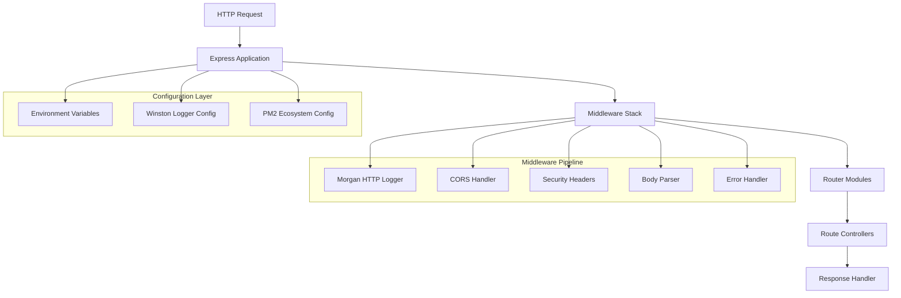
```mermaid
graph TD
    A[HTTP Request] --> B[Express Application]
    B --> C[Middleware Stack]
    C --> D[Router Modules]
    D --> E[Route Controllers]
    E --> F[Response Handler]
    
    subgraph "Middleware Pipeline"
        G[Morgan HTTP Logger]
        H[CORS Handler]
        I[Security Headers]
        J[Body Parser]
        K[Error Handler]
    end
    
    subgraph "Configuration Layer"
        L[Environment Variables]
        M[Winston Logger Config]
        N[PM2 Ecosystem Config]
    end
    
    C --> G
    C --> H
    C --> I
    C --> J
    C --> K
    
    B --> L
    B --> M
    B --> N
```

<span style="background-color: rgba(91, 57, 243, 0.2)">The architecture consists of:</span>
- **Entry Point** (`server.js`): <span style="background-color: rgba(91, 57, 243, 0.2)">Express.js bootstrap application with middleware pipeline configuration</span>
- **Routing Layer** (`/routes`): <span style="background-color: rgba(91, 57, 243, 0.2)">Modular route handlers including index.js aggregator, api.js endpoints, and health.js monitoring</span>
- **Middleware Layer** (`/middleware`): <span style="background-color: rgba(91, 57, 243, 0.2)">Custom middleware functions for logging, error handling, and request validation</span>
- **Configuration Layer** (`/config`): <span style="background-color: rgba(91, 57, 243, 0.2)">Centralized configuration management with Winston and Morgan setup</span>
- **Utilities** (`/utils`): <span style="background-color: rgba(91, 57, 243, 0.2)">Shared utility functions and logger instance exports</span>
- **Process Management** (`ecosystem.config.js`): <span style="background-color: rgba(91, 57, 243, 0.2)">PM2 deployment configuration for production environments</span>
- **Environment Files** (`.env`): <span style="background-color: rgba(91, 57, 243, 0.2)">Environment variable configuration for different deployment contexts</span>

#### Core Technical Approach

<span style="background-color: rgba(91, 57, 243, 0.2)">The technical approach emphasizes production readiness and enterprise-grade patterns:</span>
- **Express.js Foundation**: <span style="background-color: rgba(91, 57, 243, 0.2)">Modern web framework with extensive middleware ecosystem and industry adoption</span>
- **Dependency Management**: <span style="background-color: rgba(91, 57, 243, 0.2)">Curated dependency stack including Express 4.18+, Winston 3.11+, Morgan 1.10+, dotenv 16.0+, and security packages (CORS, Helmet)</span>
- **Node.js Requirements**: <span style="background-color: rgba(91, 57, 243, 0.2)">Requires Node.js >=18.0.0 for modern JavaScript features and native fetch support</span>
- **Modular Architecture**: <span style="background-color: rgba(91, 57, 243, 0.2)">Separation of concerns through dedicated modules for routing, middleware, configuration, and utilities</span>
- **Stateless Operation**: No data persistence or session management simplifies behavior prediction while supporting enterprise patterns
- **Standard Protocols**: Uses HTTP/1.1 over TCP for maximum compatibility and tool support

### 1.2.3 Success Criteria

#### Measurable Objectives

| Objective | Success Metric | Measurement Method |
|-----------|---------------|-------------------|
| Express.js Integration | <span style="background-color: rgba(91, 57, 243, 0.2)">Successful framework migration with all middleware functioning</span> | <span style="background-color: rgba(91, 57, 243, 0.2)">Express server startup and route response validation</span> |
| <span style="background-color: rgba(91, 57, 243, 0.2)">Logging System Operation</span> | <span style="background-color: rgba(91, 57, 243, 0.2)">Winston and Morgan logs generated correctly</span> | <span style="background-color: rgba(91, 57, 243, 0.2)">Log file creation and structured output verification</span> |
| Response Consistency | 100% identical responses to Hello World endpoint | Automated request testing for backward compatibility |

#### Critical Success Factors

The project's success depends on:
1. **Express.js Migration**: <span style="background-color: rgba(91, 57, 243, 0.2)">Successful transition from native HTTP module to Express framework while maintaining core functionality</span>
2. **Middleware Integration**: <span style="background-color: rgba(91, 57, 243, 0.2)">Proper middleware pipeline implementation with correct execution order and error propagation</span>
3. **Configuration Management**: <span style="background-color: rgba(91, 57, 243, 0.2)">Effective dotenv integration with environment-specific variable loading</span>
4. **Documentation Clarity**: Clear identification as a test project to prevent production misuse
5. **Backward Compatibility**: <span style="background-color: rgba(91, 57, 243, 0.2)">Preservation of original Hello World endpoint functionality for existing test workflows</span>

#### Key Performance Indicators (KPIs)

- **Server Startup Time**: Sub-second initialization for rapid testing cycles
- **Response Reliability**: 100% successful responses to valid HTTP requests
- **<span style="background-color: rgba(91, 57, 243, 0.2)">Middleware Performance</span>**: <span style="background-color: rgba(91, 57, 243, 0.2)">Consistent request processing through complete middleware pipeline</span>
- **Tool Compatibility**: Successful integration with Backprop analysis workflows
- **<span style="background-color: rgba(91, 57, 243, 0.2)">Process Management</span>**: <span style="background-color: rgba(91, 57, 243, 0.2)">Successful PM2 cluster startup and graceful shutdown handling</span>

<span style="background-color: rgba(91, 57, 243, 0.2)">**Production Feature Validation**: The system must demonstrate successful Winston/Morgan logging integration with structured output, dotenv environment variable loading across development and production contexts, PM2 cluster mode startup with multiple worker processes, and preservation of the Hello-World endpoint response ("Hello, World!\n") to ensure seamless transition for existing Backprop evaluation workflows.</span>

## 1.3 SCOPE

### 1.3.1 In-Scope Elements

#### Core Features and Functionalities

**Must-Have Capabilities:**
- <span style="background-color: rgba(91, 57, 243, 0.2)">Express.js server instantiation and configuration with comprehensive middleware pipeline</span>
- <span style="background-color: rgba(91, 57, 243, 0.2)">Modular routing architecture with dedicated route modules (root, /api, /health endpoints)</span>
- <span style="background-color: rgba(91, 57, 243, 0.2)">Comprehensive middleware stack including security headers, request logging, error handling, and input validation</span>
- <span style="background-color: rgba(91, 57, 243, 0.2)">Environment variable management via dotenv with support for multiple deployment contexts</span>
- <span style="background-color: rgba(91, 57, 243, 0.2)">Production-grade logging system using Winston for application logs and Morgan for HTTP request logs</span>
- <span style="background-color: rgba(91, 57, 243, 0.2)">PM2 process management with clustering, monitoring, and zero-downtime deployment capabilities</span>
- <span style="background-color: rgba(91, 57, 243, 0.2)">Graceful shutdown handling with proper resource cleanup and signal management</span>
- Hello, World! root endpoint response preservation for backward compatibility
- Console and file-based logging for operational visibility
- <span style="background-color: rgba(91, 57, 243, 0.2)">Health check endpoints for system status monitoring and load balancer integration</span>

**Primary User Workflows:**
1. **<span style="background-color: rgba(91, 57, 243, 0.2)">Dependency Installation</span>**: <span style="background-color: rgba(91, 57, 243, 0.2)">Execute `npm install` to install Express.js and related dependencies</span>
2. **<span style="background-color: rgba(91, 57, 243, 0.2)">Development Server Startup</span>**: <span style="background-color: rgba(91, 57, 243, 0.2)">Launch development environment using `npm run dev` with auto-restart capabilities</span>
3. **<span style="background-color: rgba(91, 57, 243, 0.2)">Production Deployment</span>**: <span style="background-color: rgba(91, 57, 243, 0.2)">Start production server via PM2 using `pm2 start ecosystem.config.js` for cluster management</span>
4. **<span style="background-color: rgba(91, 57, 243, 0.2)">Endpoint Validation</span>**: <span style="background-color: rgba(91, 57, 243, 0.2)">Send HTTP requests to root ("/"), API ("/api/*"), and health ("/health") routes for functionality validation</span>
5. **<span style="background-color: rgba(91, 57, 243, 0.2)">Log Monitoring</span>**: <span style="background-color: rgba(91, 57, 243, 0.2)">View structured logs in console output and `/logs` directory with Winston-formatted application logs</span>
6. **<span style="background-color: rgba(91, 57, 243, 0.2)">Graceful Shutdown</span>**: <span style="background-color: rgba(91, 57, 243, 0.2)">Terminate processes gracefully via PM2 commands or SIGTERM signal handling</span>

**Essential Integrations:**
- <span style="background-color: rgba(91, 57, 243, 0.2)">Express.js framework (v4.18+) with routing and middleware capabilities</span>
- <span style="background-color: rgba(91, 57, 243, 0.2)">dotenv (v16.0+) for environment variable configuration management</span>
- <span style="background-color: rgba(91, 57, 243, 0.2)">Winston logging framework (v3.11+) for structured application logging</span>
- <span style="background-color: rgba(91, 57, 243, 0.2)">Morgan HTTP request logger (v1.10+) for request/response logging</span>
- <span style="background-color: rgba(91, 57, 243, 0.2)">PM2 process manager for production deployment and cluster management</span>
- <span style="background-color: rgba(91, 57, 243, 0.2)">Node.js runtime environment (v18.0+ required) for modern JavaScript feature support</span>
- Command-line interface for NPM script execution and PM2 management
- Backprop tool connectivity and analysis capabilities with enhanced application architecture

**Key Technical Requirements:**
- <span style="background-color: rgba(91, 57, 243, 0.2)">Node.js compatibility (>=18.0.0) for native fetch support and modern ECMAScript features</span>
- <span style="background-color: rgba(91, 57, 243, 0.2)">NPM package management with production and development dependency separation</span>
- Network access to localhost interface with configurable port binding
- File system access for script execution, configuration files, and log storage
- <span style="background-color: rgba(91, 57, 243, 0.2)">Environment variable support for deployment-specific configuration</span>
- <span style="background-color: rgba(91, 57, 243, 0.2)">Memory allocation capable of supporting clustered worker processes</span>

#### Implementation Boundaries

| Boundary Type | Coverage | Constraints & Justification |
|---------------|----------|----------------------------|
| **System Boundaries** | <span style="background-color: rgba(91, 57, 243, 0.2)">Express.js application with PM2 cluster management</span> | <span style="background-color: rgba(91, 57, 243, 0.2)">Support for minimum 1000 concurrent connections with sub-second response times</span> |
| **Performance Limits** | <span style="background-color: rgba(91, 57, 243, 0.2)">Memory footprint <100MB per worker process</span> | <span style="background-color: rgba(91, 57, 243, 0.2)">Optimized for development tool testing while maintaining production-grade patterns</span> |
| **Deployment Scope** | <span style="background-color: rgba(91, 57, 243, 0.2)">Zero-downtime deployment via PM2 ecosystem configuration</span> | <span style="background-color: rgba(91, 57, 243, 0.2)">Enables production deployment patterns without production infrastructure complexity</span> |
| **User Groups** | Developers, tool evaluators, and system administrators | Limited to technical stakeholders requiring API testing capabilities |

**Data Domains Included:**
- <span style="background-color: rgba(91, 57, 243, 0.2)">HTTP request/response metadata with enhanced logging detail through Morgan integration</span>
- <span style="background-color: rgba(91, 57, 243, 0.2)">Server configuration parameters including environment variables, middleware settings, and PM2 cluster configuration</span>
- <span style="background-color: rgba(91, 57, 243, 0.2)">Structured application logging data through Winston with configurable log levels and rotation</span>
- <span style="background-color: rgba(91, 57, 243, 0.2)">Health check and system monitoring data for operational status verification</span>
- Package metadata and dependency information with expanded dependency tree
- <span style="background-color: rgba(91, 57, 243, 0.2)">Process management data including cluster worker status and graceful shutdown metrics</span>

### 1.3.2 Out-of-Scope Elements

#### Explicitly Excluded Features and Capabilities

**Production-Grade Features Still Excluded:**
- Database connectivity and data persistence layers (ORM integration, connection pooling)
- Authentication and authorization mechanisms (JWT, OAuth, session management)
- HTTPS/TLS encryption and certificate management for secure communications
- Container orchestration and Docker/Kubernetes deployment configurations
- Continuous integration/continuous deployment (CI/CD) pipeline setup
- Performance monitoring dashboards (Grafana, Prometheus integration)
- API documentation generation (Swagger/OpenAPI specification)
- Comprehensive testing frameworks (Jest, Mocha test suite implementation)
- TypeScript migration and type safety enforcement
- Microservices architecture and service mesh integration

**Advanced Infrastructure Components:**
- External database systems (PostgreSQL, MongoDB, Redis)
- Message queues and event processing systems (RabbitMQ, Apache Kafka)
- Caching layers beyond application-level caching
- Load balancing and reverse proxy configuration (Nginx, HAProxy)
- Service discovery and configuration management systems
- Distributed tracing and APM (Application Performance Monitoring)
- Infrastructure as Code (Terraform, CloudFormation)
- Cloud platform-specific integrations (AWS, Azure, GCP services)

#### Future Phase Considerations

**Phase 2 Potential Enhancements:**
- Database integration with connection pooling and transaction management
- Authentication middleware with JWT token validation and refresh mechanisms
- Comprehensive API documentation with interactive testing interfaces
- Integration testing framework with automated endpoint validation
- Docker containerization with multi-stage build optimization
- Kubernetes deployment manifests with horizontal pod autoscaling

**Long-term Evolution:**
- Full-stack application development with frontend framework integration
- Microservices decomposition with inter-service communication patterns  
- Event-driven architecture with message streaming capabilities
- Machine learning model serving and inference endpoint integration
- Real-time capabilities through WebSocket and Server-Sent Events
- Multi-tenant architecture with resource isolation and billing integration

#### Integration Points Not Covered

- **External APIs**: Third-party service integrations and webhook processing
- **Enterprise Systems**: Corporate infrastructure, LDAP/Active Directory integration
- **Development Tools**: IDE plugins, linting integration, code formatting beyond basic setup
- **Cloud Services**: Platform-as-a-Service integrations, serverless function deployment
- **Security Scanning**: Vulnerability assessment tools, security audit integration
- **Backup and Recovery**: Data backup strategies, disaster recovery procedures

#### Unsupported Use Cases

- **Production Customer Workloads**: Not designed for customer-facing production environments
- **High-Availability Scenarios**: No multi-region deployment or failover mechanisms
- **Enterprise Scale**: Not optimized for enterprise-level traffic or user management
- **Complex Business Logic**: No domain-specific functionality or business rule engines
- **Data Processing Pipelines**: No ETL, batch processing, or real-time analytics capabilities
- **Multi-Protocol Support**: HTTP-only, no gRPC, GraphQL, or custom protocol support

#### References

- `server.js` - <span style="background-color: rgba(91, 57, 243, 0.2)">Express.js application bootstrap with comprehensive middleware pipeline configuration</span>
- `package.json` - <span style="background-color: rgba(91, 57, 243, 0.2)">Updated Node.js package configuration with Express, Winston, Morgan, PM2, and security dependencies</span>  
- <span style="background-color: rgba(91, 57, 243, 0.2)">`/routes/` directory - Modular route handlers including index.js aggregator, api.js endpoints, and health.js monitoring</span>
- <span style="background-color: rgba(91, 57, 243, 0.2)">`/middleware/` directory - Custom middleware functions for logging, error handling, and request validation</span>
- <span style="background-color: rgba(91, 57, 243, 0.2)">`/config/` directory - Configuration management modules for Winston and Morgan setup</span>
- <span style="background-color: rgba(91, 57, 243, 0.2)">`ecosystem.config.js` - PM2 deployment configuration for production cluster management</span>
- <span style="background-color: rgba(91, 57, 243, 0.2)">`.env` files - Environment variable configuration for development and production contexts</span>
- `package-lock.json` - <span style="background-color: rgba(91, 57, 243, 0.2)">Updated dependency resolution with expanded dependency tree for Express ecosystem</span>
- `README.md` - <span style="background-color: rgba(91, 57, 243, 0.2)">Enhanced project documentation with installation, deployment, and operational procedures</span>

# 2. PRODUCT REQUIREMENTS

## 2.1 FEATURE CATALOG

### 2.1.1 Core System Features

The hao-backprop-test project implements <span style="background-color: rgba(91, 57, 243, 0.2)">nine discrete features designed to create a production-ready Express.js environment</span> for Backprop tool evaluation. Each feature maintains clear functionality boundaries while demonstrating enterprise-grade architectural patterns and modern web development practices.

#### Feature F-001: <span style="background-color: rgba(91, 57, 243, 0.2)">Express Server Framework

| Attribute | Value |
|-----------|-------|
| **Feature ID** | F-001 |
| **Feature Name** | <span style="background-color: rgba(91, 57, 243, 0.2)">Express Server Framework</span> |
| **Category** | Core Infrastructure |
| **Priority Level** | Critical |
| **Status** | Completed |

**Description:**
- **Overview**: <span style="background-color: rgba(91, 57, 243, 0.2)">Implements a robust web server using Express.js framework, providing the foundational application infrastructure with middleware support, routing capabilities, and enhanced request handling</span>.
- **Business Value**: Enables controlled testing of Backprop's ability to analyze and understand modern Express.js server implementations with production-grade architectural patterns.
- **User Benefits**: Provides developers and tool evaluators with a sophisticated yet manageable web application framework for comprehensive tool evaluation scenarios.
- **Technical Context**: <span style="background-color: rgba(91, 57, 243, 0.2)">Express.js-based application server with middleware pipeline support, bound to localhost (127.0.0.1) on port 3000, featuring backward-compatible root route ("/") returning "Hello, World!" response</span>.

**Dependencies:**
- **Prerequisite Features**: None
- **System Dependencies**: Node.js runtime environment (>=18.0.0)
- **External Dependencies**: <span style="background-color: rgba(91, 57, 243, 0.2)">express@^4.18.0, cors@^2.8.5, helmet@^7.1.0, compression@^1.7.4, body-parser@^1.20.0</span>
- **Integration Requirements**: TCP/IP stack access, localhost interface availability

#### Feature F-002: Static Response Generation

| Attribute | Value |
|-----------|-------|
| **Feature ID** | F-002 |
| **Feature Name** | Static Response Generation |
| **Category** | Response Processing |
| **Priority Level** | Critical |
| **Status** | <span style="background-color: rgba(91, 57, 243, 0.2)">Updated</span> |

**Description:**
- **Overview**: Generates consistent "Hello, World!\n" response for every HTTP request to the root endpoint, ensuring deterministic behavior for tool analysis and maintaining backward compatibility.
- **Business Value**: Provides reliable baseline for measuring Backprop's code comprehension and suggestion capabilities on response handling logic within Express.js applications.
- **User Benefits**: Guarantees 100% predictable responses enabling systematic tool behavior evaluation while preserving existing test workflows.
- **Technical Context**: <span style="background-color: rgba(91, 57, 243, 0.2)">Stateless response generation implemented through Express route handler</span> with fixed content-type (text/plain) and HTTP 200 status code.

**Dependencies:**
- **Prerequisite Features**: F-001 (Express Server Framework)
- **System Dependencies**: Express.js response objects
- **External Dependencies**: <span style="background-color: rgba(91, 57, 243, 0.2)">express@^4.18.0</span>
- **Integration Requirements**: HTTP request context from Express framework

#### Feature F-003: Server Lifecycle Management

| Attribute | Value |
|-----------|-------|
| **Feature ID** | F-003 |
| **Feature Name** | Server Lifecycle Management |
| **Category** | Operations |
| **Priority Level** | High |
| **Status** | Completed |

**Description:**
- **Overview**: Manages server startup, operational status reporting, and process termination through standard Node.js lifecycle events and Express.js application lifecycle.
- **Business Value**: Enables evaluation of Backprop's understanding of application lifecycle patterns and operational concerns in Express.js applications.
- **User Benefits**: Provides clear operational feedback and standard process management for testing scenarios with production-grade lifecycle handling.
- **Technical Context**: Console logging on startup, standard signal handling for process termination, graceful shutdown support, sub-second initialization time.

**Dependencies:**
- **Prerequisite Features**: F-001 (Express Server Framework)
- **System Dependencies**: Node.js process management, console interface
- **External Dependencies**: <span style="background-color: rgba(91, 57, 243, 0.2)">express@^4.18.0</span>
- **Integration Requirements**: Command-line execution environment

#### Feature F-004: Backprop Integration Testing

| Attribute | Value |
|-----------|-------|
| **Feature ID** | F-004 |
| **Feature Name** | Backprop Integration Testing |
| **Category** | Tool Integration |
| **Priority Level** | Critical |
| **Status** | Completed |

**Description:**
- **Overview**: Serves as a controlled test platform specifically designed for Backprop tool analysis, refactoring, and AI-assisted development capabilities on enterprise-grade Express.js applications.
- **Business Value**: Enables systematic evaluation of Backprop effectiveness on production-ready codebases with modern architectural patterns without production complexity interference.
- **User Benefits**: Provides development teams and tool evaluators with comprehensive environment for assessing Backprop capabilities on sophisticated web applications.
- **Technical Context**: <span style="background-color: rgba(91, 57, 243, 0.2)">Express.js-based architecture with modular structure, comprehensive middleware pipeline, and enterprise-grade patterns</span> optimized for tool comprehension.

**Dependencies:**
- **Prerequisite Features**: F-001, F-002, F-003 (entire system stack)
- **System Dependencies**: File system access, source code availability
- **External Dependencies**: <span style="background-color: rgba(91, 57, 243, 0.2)">express@^4.18.0, winston@^3.11.0, morgan@^1.10.0, dotenv@^16.0.0</span>, Backprop tool connectivity
- **Integration Requirements**: Tool-compatible project structure, readable source code format

#### Feature F-005: Modular Routing System

| Attribute | Value |
|-----------|-------|
| **Feature ID** | F-005 |
| **Feature Name** | Modular Routing System |
| **Category** | Core Infrastructure |
| **Priority Level** | Critical |
| **Status** | Implemented |

**Description:**
- **Overview**: Implements organized endpoint management through dedicated route modules in the `/routes` directory, utilizing Express Router for separation of concerns and RESTful API design patterns.
- **Business Value**: Demonstrates scalable routing architecture patterns that enable Backprop evaluation on enterprise-grade application organization and maintainability practices.
- **User Benefits**: Provides clear examples of modular routing implementation for systematic assessment of Backprop's code organization and refactoring capabilities.
- **Technical Context**: Modular route handlers including `/routes/index.js` aggregator, `/routes/api.js` for REST endpoints, and `/routes/health.js` for monitoring, all implementing Express Router with proper HTTP method handling.

**Dependencies:**
- **Prerequisite Features**: F-001 (Express Server Framework)
- **System Dependencies**: File system access for route module loading
- **External Dependencies**: express@^4.18.0
- **Integration Requirements**: Express Router support, modular file organization

#### Feature F-006: Middleware Pipeline

| Attribute | Value |
|-----------|-------|
| **Feature ID** | F-006 |
| **Feature Name** | Middleware Pipeline |
| **Category** | Operations |
| **Priority Level** | Critical |
| **Status** | Implemented |

**Description:**
- **Overview**: Implements comprehensive request processing pipeline with authentication hooks, validation middleware, logging integration, and global error handling for production-grade request lifecycle management.
- **Business Value**: Enables assessment of Backprop's capability to understand and refactor complex middleware architectures and cross-cutting concerns implementation.
- **User Benefits**: Demonstrates enterprise middleware patterns including security, logging, and error handling for comprehensive tool evaluation scenarios.
- **Technical Context**: Sequential middleware processing with proper ordering, error propagation handling, custom middleware modules in `/middleware` directory, and security middleware integration including helmet, cors, and compression.

**Dependencies:**
- **Prerequisite Features**: F-001 (Express Server Framework), F-005 (Modular Routing System)
- **System Dependencies**: Express middleware execution context
- **External Dependencies**: express@^4.18.0, cors@^2.8.5, helmet@^7.1.0, compression@^1.7.4, body-parser@^1.20.0
- **Integration Requirements**: Middleware execution pipeline, error handling context

#### Feature F-007: Environment Configuration Management

| Attribute | Value |
|-----------|-------|
| **Feature ID** | F-007 |
| **Feature Name** | Environment Configuration Management |
| **Category** | Configuration |
| **Priority Level** | Critical |
| **Status** | Implemented |

**Description:**
- **Overview**: Provides deployment flexibility through dotenv integration with multiple environment files and centralized configuration management modules in `/config` directory for twelve-factor app compliance.
- **Business Value**: Demonstrates environment-based configuration patterns enabling Backprop evaluation on deployment orchestration and configuration management capabilities.
- **User Benefits**: Showcases enterprise configuration management patterns for assessing Backprop's understanding of deployment and environment-specific concerns.
- **Technical Context**: Environment variable loading through dotenv with `.env` files, configuration cascading for development/staging/production environments, centralized configuration modules with environment-specific overrides.

**Dependencies:**
- **Prerequisite Features**: F-001 (Express Server Framework)
- **System Dependencies**: File system access for configuration files
- **External Dependencies**: dotenv@^16.0.0
- **Integration Requirements**: Environment file access, configuration module loading

#### Feature F-008: Advanced Logging

| Attribute | Value |
|-----------|-------|
| **Feature ID** | F-008 |
| **Feature Name** | Advanced Logging |
| **Category** | Operations |
| **Priority Level** | Critical |
| **Status** | Implemented |

**Description:**
- **Overview**: Integrates Winston for application logging and Morgan for HTTP request logging with structured JSON output format, multiple transports, and log rotation policies for production visibility and debugging capabilities.
- **Business Value**: Enables evaluation of Backprop's understanding of production logging architectures and operational monitoring implementation patterns.
- **User Benefits**: Demonstrates enterprise logging patterns with structured output and rotation policies for comprehensive tool assessment on operational concerns.
- **Technical Context**: Winston configuration with multiple transports (console, file rotation), Morgan HTTP logging bridged to Winston, structured JSON log format, environment-specific log levels, and dedicated logging configuration modules.

**Dependencies:**
- **Prerequisite Features**: F-001 (Express Server Framework), F-006 (Middleware Pipeline), F-007 (Environment Configuration Management)
- **System Dependencies**: File system access for log files, console output
- **External Dependencies**: winston@^3.11.0, morgan@^1.10.0
- **Integration Requirements**: Log directory creation, file rotation management

#### Feature F-009: Production Process Management

| Attribute | Value |
|-----------|-------|
| **Feature ID** | F-009 |
| **Feature Name** | Production Process Management |
| **Category** | Operations |
| **Priority Level** | Critical |
| **Status** | Implemented |

**Description:**
- **Overview**: Implements PM2-based process management with cluster mode configuration, graceful shutdown handling, auto-restart policies, and monitoring capabilities for production-grade deployment orchestration.
- **Business Value**: Demonstrates enterprise process management patterns enabling Backprop evaluation on deployment architecture and operational resilience implementation.
- **User Benefits**: Showcases production deployment patterns with clustering and monitoring for assessing Backprop's understanding of operational infrastructure concerns.
- **Technical Context**: PM2 ecosystem configuration with cluster mode for multi-core utilization, graceful shutdown signal handling, automatic restart policies, log aggregation, and zero-downtime reload strategies.

**Dependencies:**
- **Prerequisite Features**: F-001 (Express Server Framework), F-003 (Server Lifecycle Management), F-008 (Advanced Logging)
- **System Dependencies**: Multi-core CPU support, process management capabilities
- **External Dependencies**: pm2@^5.3.0
- **Integration Requirements**: Process clustering support, signal handling, ecosystem configuration

### 2.1.2 Functional Requirements Table

#### Feature F-001: Express Server Framework Requirements

| Requirement ID | Description | Acceptance Criteria | Priority | Complexity |
|---------------|-------------|-------------------|----------|------------|
| F-001-RQ-001 | Express application initialization | Express app successfully starts with middleware support | Must-Have | Low |
| F-001-RQ-002 | Port binding and listener setup | Server binds to port 3000 and accepts connections | Must-Have | Low |
| F-001-RQ-003 | Backward compatibility maintenance | Root route "/" returns "Hello, World!" response | Must-Have | Low |
| F-001-RQ-004 | Graceful shutdown handling | Server responds to termination signals correctly | Should-Have | Medium |

#### Feature F-002: Static Response Generation Requirements

| Requirement ID | Description | Acceptance Criteria | Priority | Complexity |
|---------------|-------------|-------------------|----------|------------|
| F-002-RQ-001 | Consistent response delivery | All requests to "/" return identical response | Must-Have | Low |
| F-002-RQ-002 | Proper content-type headers | Response includes "text/plain" content-type | Must-Have | Low |
| F-002-RQ-003 | HTTP status code compliance | Returns HTTP 200 for successful requests | Must-Have | Low |

#### Feature F-005: Modular Routing System Requirements

| Requirement ID | Description | Acceptance Criteria | Priority | Complexity |
|---------------|-------------|-------------------|----------|------------|
| F-005-RQ-001 | Route module organization | Routes organized in dedicated /routes directory | Must-Have | Medium |
| F-005-RQ-002 | Express Router implementation | Each route module uses Express Router pattern | Must-Have | Medium |
| F-005-RQ-003 | RESTful endpoint design | API routes follow REST conventions | Should-Have | Medium |
| F-005-RQ-004 | Health check endpoint | Dedicated health monitoring routes available | Should-Have | Low |

#### Feature F-006: Middleware Pipeline Requirements

| Requirement ID | Description | Acceptance Criteria | Priority | Complexity |
|---------------|-------------|-------------------|----------|------------|
| F-006-RQ-001 | Security middleware integration | CORS, Helmet, compression properly configured | Must-Have | Medium |
| F-006-RQ-002 | Error handling middleware | Global error handler catches and formats errors | Must-Have | Medium |
| F-006-RQ-003 | Request parsing middleware | Body parser handles JSON and URL-encoded data | Must-Have | Low |
| F-006-RQ-004 | Middleware execution order | Middleware processes in correct sequence | Must-Have | High |

#### Feature F-007: Environment Configuration Management Requirements

| Requirement ID | Description | Acceptance Criteria | Priority | Complexity |
|---------------|-------------|-------------------|----------|------------|
| F-007-RQ-001 | Environment variable loading | Dotenv successfully loads .env files | Must-Have | Low |
| F-007-RQ-002 | Configuration module access | Centralized config accessible across modules | Must-Have | Medium |
| F-007-RQ-003 | Environment-specific overrides | Different environments load appropriate configs | Should-Have | Medium |

#### Feature F-008: Advanced Logging Requirements

| Requirement ID | Description | Acceptance Criteria | Priority | Complexity |
|---------------|-------------|-------------------|----------|------------|
| F-008-RQ-001 | Winston logger configuration | Application logs generated with proper format | Must-Have | Medium |
| F-008-RQ-002 | Morgan HTTP logging | HTTP requests logged with structured output | Must-Have | Medium |
| F-008-RQ-003 | Log rotation policies | Log files rotate based on size/time policies | Should-Have | Medium |
| F-008-RQ-004 | Environment-based log levels | Different log levels per environment | Should-Have | Low |

#### Feature F-009: Production Process Management Requirements

| Requirement ID | Description | Acceptance Criteria | Priority | Complexity |
|---------------|-------------|-------------------|----------|------------|
| F-009-RQ-001 | PM2 cluster configuration | Multiple processes spawn in cluster mode | Must-Have | High |
| F-009-RQ-002 | Graceful shutdown handling | Processes shut down gracefully on signals | Must-Have | Medium |
| F-009-RQ-003 | Auto-restart policies | Failed processes restart automatically | Should-Have | Medium |
| F-009-RQ-004 | Process monitoring | PM2 monitoring and status reporting active | Should-Have | Low |

### 2.1.3 Feature Relationships

#### Feature Dependencies Map

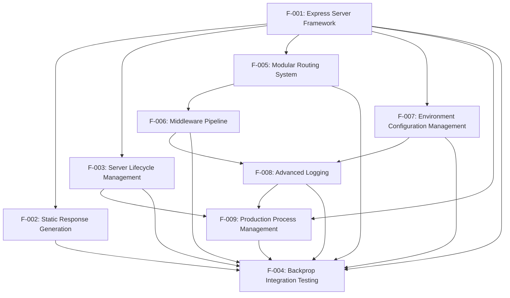
```mermaid
graph TD
    F001[F-001: Express Server Framework] --> F002[F-002: Static Response Generation]
    F001 --> F003[F-003: Server Lifecycle Management]
    F001 --> F005[F-005: Modular Routing System]
    F001 --> F007[F-007: Environment Configuration Management]
    
    F005 --> F006[F-006: Middleware Pipeline]
    F007 --> F008[F-008: Advanced Logging]
    F006 --> F008
    
    F001 --> F009[F-009: Production Process Management]
    F003 --> F009
    F008 --> F009
    
    F001 --> F004[F-004: Backprop Integration Testing]
    F002 --> F004
    F003 --> F004
    F005 --> F004
    F006 --> F004
    F007 --> F004
    F008 --> F004
    F009 --> F004
```

#### Integration Points

| Feature Pair | Integration Type | Shared Components | Communication Method |
|-------------|------------------|------------------|-------------------|
| F-001 & F-005 | Direct Integration | Express Router instances | Module imports |
| F-001 & F-006 | Pipeline Integration | Middleware stack | Express app.use() |
| F-006 & F-008 | Cross-cutting | Winston logger instance | Shared logger module |
| F-007 & F-008 | Configuration | Environment variables | Config object passing |
| F-003 & F-009 | Process Management | Signal handlers | Process event listeners |

#### Shared Components

- **Express Application Instance**: Central to F-001, F-002, F-005, F-006
- **Winston Logger**: Shared across F-006, F-008, F-009
- **Configuration Objects**: Used by F-007, F-008, F-009
- **Route Handlers**: Integration between F-005 and F-006
- **Process Signals**: Managed by F-003 and F-009

#### Common Services

- **Error Handling**: Centralized error processing across all features
- **Logging Service**: Unified logging through Winston/Morgan integration
- **Configuration Service**: Environment-based configuration management
- **Health Check Service**: System status monitoring and reporting

### 2.1.4 Implementation Considerations

#### Technical Constraints

| Feature | Constraint Type | Description | Mitigation Strategy |
|---------|----------------|-------------|-------------------|
| F-001 | Version Dependency | Express 4.18+ required for security features | Pin to stable version in package.json |
| F-006 | Middleware Order | Critical execution sequence for security | Document middleware order requirements |
| F-008 | File System Access | Log directory creation and permissions | Implement directory initialization checks |
| F-009 | Multi-core Support | PM2 clustering requires multi-core environment | Provide single-process fallback configuration |

#### Performance Requirements

- **Server Response Time**: < 10ms for static responses under normal load
- **Startup Time**: < 2 seconds for complete application initialization
- **Memory Usage**: < 50MB baseline memory footprint per process
- **Concurrent Connections**: Support 100+ concurrent connections per process
- **Log Processing**: < 1ms additional latency for logging middleware

#### Scalability Considerations

- **Horizontal Scaling**: PM2 cluster mode enables multi-process scaling
- **Load Distribution**: Round-robin process distribution for request handling
- **Resource Management**: Per-process memory limits and CPU throttling
- **Configuration Scaling**: Environment-based scaling parameters

#### Security Implications

- **CORS Configuration**: Controlled cross-origin access policies
- **Security Headers**: Comprehensive security header implementation via Helmet
- **Input Validation**: Request validation middleware for data sanitization
- **Environment Variables**: Secure handling of sensitive configuration data
- **Process Isolation**: PM2 process isolation for fault containment

#### Maintenance Requirements

- **Log Rotation**: Automated log file rotation and archival
- **Dependency Updates**: Regular security updates for NPM packages
- **Configuration Management**: Environment-specific configuration validation
- **Process Monitoring**: Continuous health monitoring and alerting
- **Documentation Updates**: Maintain technical documentation currency

## 2.2 FUNCTIONAL REQUIREMENTS TABLE

### 2.2.1 <span style="background-color: rgba(91, 57, 243, 0.2)">Express Server Framework Requirements (F-001) (updated)

| Requirement ID | Description | Acceptance Criteria | Priority |
|----------------|-------------|-------------------|----------|
| <span style="background-color: rgba(91, 57, 243, 0.2)">F-001-RQ-001</span> | <span style="background-color: rgba(91, 57, 243, 0.2)">Express Application Initialization</span> | <span style="background-color: rgba(91, 57, 243, 0.2)">Express.js successfully replaces native HTTP module and initializes with middleware support</span> | Must-Have |
| <span style="background-color: rgba(91, 57, 243, 0.2)">F-001-RQ-002</span> | <span style="background-color: rgba(91, 57, 243, 0.2)">Port Binding via Environment Variable</span> | <span style="background-color: rgba(91, 57, 243, 0.2)">Server binds to port specified by `PORT` environment variable, defaulting to 3000</span> | Must-Have |
| <span style="background-color: rgba(91, 57, 243, 0.2)">F-001-RQ-003</span> | <span style="background-color: rgba(91, 57, 243, 0.2)">Backward Compatibility Preservation</span> | <span style="background-color: rgba(91, 57, 243, 0.2)">GET `/` route returns "Hello, World!" response maintaining original functionality</span> | Must-Have |
| <span style="background-color: rgba(91, 57, 243, 0.2)">F-001-RQ-004</span> | <span style="background-color: rgba(91, 57, 243, 0.2)">Framework Integration</span> | <span style="background-color: rgba(91, 57, 243, 0.2)">Express app integrates CORS, Helmet, compression, and body-parser middleware</span> | Should-Have |

**Technical Specifications:**
- **Input Parameters**: <span style="background-color: rgba(91, 57, 243, 0.2)">Express.js initialization options, environment variables</span>
- **Output/Response**: <span style="background-color: rgba(91, 57, 243, 0.2)">Express application instance with middleware pipeline</span>
- **Performance Criteria**: <span style="background-color: rgba(91, 57, 243, 0.2)">Sub-2-second startup time with complete Express initialization</span>
- **Data Requirements**: <span style="background-color: rgba(91, 57, 243, 0.2)">Environment configuration, Express dependency management</span>

**Validation Rules:**
- **Business Rules**: <span style="background-color: rgba(91, 57, 243, 0.2)">Server must maintain original Hello World endpoint accessibility</span>
- **Data Validation**: <span style="background-color: rgba(91, 57, 243, 0.2)">Environment variable validation for PORT configuration</span>
- **Security Requirements**: <span style="background-color: rgba(91, 57, 243, 0.2)">Security headers applied via Helmet, CORS configured correctly</span>
- **Compliance Requirements**: <span style="background-color: rgba(91, 57, 243, 0.2)">Express.js framework best practices and HTTP protocol compliance</span>

### 2.2.2 Static Response Generation Requirements (F-002) (updated)

| Requirement ID | Description | Acceptance Criteria | Priority |
|----------------|-------------|-------------------|----------|
| F-002-RQ-001 | Response Content | Returns exactly "Hello, World!\n" for all requests to root endpoint | Must-Have |
| F-002-RQ-002 | Content Type | Sets Content-Type header to "text/plain" | Must-Have |
| F-002-RQ-003 | Status Code | Returns HTTP 200 status for all valid requests | Must-Have |
| F-002-RQ-004 | <span style="background-color: rgba(91, 57, 243, 0.2)">Route Accessibility</span> | <span style="background-color: rgba(91, 57, 243, 0.2)">Response is reachable at `GET /` through Express route handler</span> | Must-Have |

**Technical Specifications:**
- **Input Parameters**: <span style="background-color: rgba(91, 57, 243, 0.2)">Express request objects via route handler</span>
- **Output/Response**: Plain text response with specified content and headers
- **Performance Criteria**: Immediate response generation, no processing delay
- **Data Requirements**: Static string constant, no dynamic data

**Validation Rules:**
- **Business Rules**: Response must be deterministic for tool predictability
- **Data Validation**: No response validation required
- **Security Requirements**: No sensitive information exposure
- **Compliance Requirements**: <span style="background-color: rgba(91, 57, 243, 0.2)">Express.js route handler format compliance</span>

### 2.2.3 Server Lifecycle Management Requirements (F-003)

| Requirement ID | Description | Acceptance Criteria | Priority |
|----------------|-------------|-------------------|----------|
| F-003-RQ-001 | Startup Logging | Console displays server URL on successful start | Must-Have |
| F-003-RQ-002 | Process Termination | Responds to standard Node.js termination signals | Should-Have |
| F-003-RQ-003 | Error Handling | No explicit error handling (intentional simplicity) | Could-Have |
| F-003-RQ-004 | Status Reporting | Clear operational status through console output | Should-Have |

**Technical Specifications:**
- **Input Parameters**: Command-line execution, system signals
- **Output/Response**: Console messages, process exit codes
- **Performance Criteria**: Sub-second startup, immediate termination
- **Data Requirements**: Runtime status information only

**Validation Rules:**
- **Business Rules**: Must provide clear operational feedback
- **Data Validation**: Console message format consistency
- **Security Requirements**: Standard process security model
- **Compliance Requirements**: Node.js process management standards

### 2.2.4 Backprop Integration Testing Requirements (F-004)

| Requirement ID | Description | Acceptance Criteria | Priority |
|----------------|-------------|-------------------|----------|
| F-004-RQ-001 | Tool Connectivity | Backprop successfully connects and analyzes codebase | Must-Have |
| F-004-RQ-002 | <span style="background-color: rgba(91, 57, 243, 0.2)">Code Analysis</span> | <span style="background-color: rgba(91, 57, 243, 0.2)">Tool can comprehend Express.js-based server implementation</span> | Must-Have |
| F-004-RQ-003 | <span style="background-color: rgba(91, 57, 243, 0.2)">Dependency Analysis</span> | <span style="background-color: rgba(91, 57, 243, 0.2)">Production dependencies confirmed in analysis</span> | Must-Have |
| F-004-RQ-004 | <span style="background-color: rgba(91, 57, 243, 0.2)">Structure Comprehension</span> | <span style="background-color: rgba(91, 57, 243, 0.2)">Multi-file modular architecture enables comprehensive understanding</span> | Should-Have |

**Technical Specifications:**
- **Input Parameters**: Source code files, project configuration
- **Output/Response**: Tool analysis results, integration success metrics
- **Performance Criteria**: Successful tool execution without errors
- **Data Requirements**: Complete project source code accessibility

**Validation Rules:**
- **Business Rules**: Must serve as effective Backprop evaluation baseline
- **Data Validation**: Source code syntax and structure validation
- **Security Requirements**: Safe execution environment for tool integration
- **Compliance Requirements**: <span style="background-color: rgba(91, 57, 243, 0.2)">Modern Express.js project structure</span>

### 2.2.5 Modular Routing System Requirements (F-005)

| Requirement ID | Description | Acceptance Criteria | Priority |
|----------------|-------------|-------------------|----------|
| <span style="background-color: rgba(91, 57, 243, 0.2)">F-005-RQ-001</span> | <span style="background-color: rgba(91, 57, 243, 0.2)">RESTful Route Registration</span> | <span style="background-color: rgba(91, 57, 243, 0.2)">All API routes follow REST conventions with proper HTTP methods</span> | Must-Have |
| <span style="background-color: rgba(91, 57, 243, 0.2)">F-005-RQ-002</span> | <span style="background-color: rgba(91, 57, 243, 0.2)">Directory Structure Organization</span> | <span style="background-color: rgba(91, 57, 243, 0.2)">Routes organized in `/routes` directory with modular files</span> | Must-Have |
| <span style="background-color: rgba(91, 57, 243, 0.2)">F-005-RQ-003</span> | <span style="background-color: rgba(91, 57, 243, 0.2)">Express Router Implementation</span> | <span style="background-color: rgba(91, 57, 243, 0.2)">Each route module uses Express Router pattern</span> | Must-Have |
| <span style="background-color: rgba(91, 57, 243, 0.2)">F-005-RQ-004</span> | <span style="background-color: rgba(91, 57, 243, 0.2)">Route-Level Middleware Support</span> | <span style="background-color: rgba(91, 57, 243, 0.2)">Individual routes can apply specific middleware functions</span> | Should-Have |

**Technical Specifications:**
- **Input Parameters**: <span style="background-color: rgba(91, 57, 243, 0.2)">HTTP requests routed through Express Router instances</span>
- **Output/Response**: <span style="background-color: rgba(91, 57, 243, 0.2)">Structured responses from modular route handlers</span>
- **Performance Criteria**: <span style="background-color: rgba(91, 57, 243, 0.2)">Efficient route matching and handler execution</span>
- **Data Requirements**: <span style="background-color: rgba(91, 57, 243, 0.2)">Route configuration and handler function definitions</span>

**Validation Rules:**
- **Business Rules**: <span style="background-color: rgba(91, 57, 243, 0.2)">Routes must maintain separation of concerns and RESTful design</span>
- **Data Validation**: <span style="background-color: rgba(91, 57, 243, 0.2)">Route parameter validation and input sanitization</span>
- **Security Requirements**: <span style="background-color: rgba(91, 57, 243, 0.2)">Route-level security middleware integration</span>
- **Compliance Requirements**: <span style="background-color: rgba(91, 57, 243, 0.2)">Express.js routing conventions and HTTP standards</span>

### 2.2.6 Middleware Pipeline Requirements (F-006)

| Requirement ID | Description | Acceptance Criteria | Priority |
|----------------|-------------|-------------------|----------|
| <span style="background-color: rgba(91, 57, 243, 0.2)">F-006-RQ-001</span> | <span style="background-color: rgba(91, 57, 243, 0.2)">Execution Order Management</span> | <span style="background-color: rgba(91, 57, 243, 0.2)">Middleware executes in correct order: security, parsing, logging, routes, error handling</span> | Must-Have |
| <span style="background-color: rgba(91, 57, 243, 0.2)">F-006-RQ-002</span> | <span style="background-color: rgba(91, 57, 243, 0.2)">Authentication Stub Integration</span> | <span style="background-color: rgba(91, 57, 243, 0.2)">Authentication middleware hooks ready for future implementation</span> | Should-Have |
| <span style="background-color: rgba(91, 57, 243, 0.2)">F-006-RQ-003</span> | <span style="background-color: rgba(91, 57, 243, 0.2)">Validation Rules Processing</span> | <span style="background-color: rgba(91, 57, 243, 0.2)">Request body parsing works for JSON/URL-encoded data with validation</span> | Must-Have |
| <span style="background-color: rgba(91, 57, 243, 0.2)">F-006-RQ-004</span> | <span style="background-color: rgba(91, 57, 243, 0.2)">Logging Injection</span> | <span style="background-color: rgba(91, 57, 243, 0.2)">HTTP requests logged with proper format through middleware pipeline</span> | Must-Have |
| <span style="background-color: rgba(91, 57, 243, 0.2)">F-006-RQ-005</span> | <span style="background-color: rgba(91, 57, 243, 0.2)">Global Error Handling</span> | <span style="background-color: rgba(91, 57, 243, 0.2)">Error handling middleware catches all errors and returns structured JSON responses</span> | Must-Have |

**Technical Specifications:**
- **Input Parameters**: <span style="background-color: rgba(91, 57, 243, 0.2)">HTTP request objects progressing through middleware stack</span>
- **Output/Response**: <span style="background-color: rgba(91, 57, 243, 0.2)">Processed requests with applied security, logging, and validation</span>
- **Performance Criteria**: <span style="background-color: rgba(91, 57, 243, 0.2)">< 1ms additional latency per middleware function</span>
- **Data Requirements**: <span style="background-color: rgba(91, 57, 243, 0.2)">Middleware configuration and execution context</span>

**Validation Rules:**
- **Business Rules**: <span style="background-color: rgba(91, 57, 243, 0.2)">Middleware must process sequentially without breaking the chain</span>
- **Data Validation**: <span style="background-color: rgba(91, 57, 243, 0.2)">Input sanitization and format validation at middleware level</span>
- **Security Requirements**: <span style="background-color: rgba(91, 57, 243, 0.2)">CORS headers configured correctly, security headers applied via Helmet</span>
- **Compliance Requirements**: <span style="background-color: rgba(91, 57, 243, 0.2)">Express.js middleware pattern compliance and error handling standards</span>

### 2.2.7 Environment Configuration Requirements (F-007)

| Requirement ID | Description | Acceptance Criteria | Priority |
|----------------|-------------|-------------------|----------|
| <span style="background-color: rgba(91, 57, 243, 0.2)">F-007-RQ-001</span> | <span style="background-color: rgba(91, 57, 243, 0.2)">Dotenv Loading</span> | <span style="background-color: rgba(91, 57, 243, 0.2)">Environment variables load from .env file at application startup</span> | Must-Have |
| <span style="background-color: rgba(91, 57, 243, 0.2)">F-007-RQ-002</span> | <span style="background-color: rgba(91, 57, 243, 0.2)">Mandatory Variable Validation</span> | <span style="background-color: rgba(91, 57, 243, 0.2)">Critical environment variables (NODE_ENV, LOG_LEVEL) validated on startup</span> | Must-Have |
| <span style="background-color: rgba(91, 57, 243, 0.2)">F-007-RQ-003</span> | <span style="background-color: rgba(91, 57, 243, 0.2)">Optional Variable Handling</span> | <span style="background-color: rgba(91, 57, 243, 0.2)">Optional variables (PORT, LOG_FILE_PATH) provide graceful defaults</span> | Should-Have |
| <span style="background-color: rgba(91, 57, 243, 0.2)">F-007-RQ-004</span> | <span style="background-color: rgba(91, 57, 243, 0.2)">Fallback Defaults</span> | <span style="background-color: rgba(91, 57, 243, 0.2)">System operates with sensible defaults when .env file missing</span> | Must-Have |

**Technical Specifications:**
- **Input Parameters**: <span style="background-color: rgba(91, 57, 243, 0.2)">.env files, system environment variables, configuration objects</span>
- **Output/Response**: <span style="background-color: rgba(91, 57, 243, 0.2)">Centralized configuration accessible across all modules</span>
- **Performance Criteria**: <span style="background-color: rgba(91, 57, 243, 0.2)">Configuration loading within application startup time</span>
- **Data Requirements**: <span style="background-color: rgba(91, 57, 243, 0.2)">Environment files, configuration schemas, default values</span>

**Validation Rules:**
- **Business Rules**: <span style="background-color: rgba(91, 57, 243, 0.2)">Configuration must support development, staging, and production environments</span>
- **Data Validation**: <span style="background-color: rgba(91, 57, 243, 0.2)">Environment variable format validation and type conversion</span>
- **Security Requirements**: <span style="background-color: rgba(91, 57, 243, 0.2)">Sensitive configuration data handled securely, .env files gitignored</span>
- **Compliance Requirements**: <span style="background-color: rgba(91, 57, 243, 0.2)">Twelve-factor app configuration principles and dotenv conventions</span>

### 2.2.8 Advanced Logging Requirements (F-008)

| Requirement ID | Description | Acceptance Criteria | Priority |
|----------------|-------------|-------------------|----------|
| <span style="background-color: rgba(91, 57, 243, 0.2)">F-008-RQ-001</span> | <span style="background-color: rgba(91, 57, 243, 0.2)">Log Levels per NODE_ENV</span> | <span style="background-color: rgba(91, 57, 243, 0.2)">Different log levels (debug, info, warn, error) applied based on environment</span> | Must-Have |
| <span style="background-color: rgba(91, 57, 243, 0.2)">F-008-RQ-002</span> | <span style="background-color: rgba(91, 57, 243, 0.2)">JSON Formatting</span> | <span style="background-color: rgba(91, 57, 243, 0.2)">All logs output in structured JSON format for parsing and analysis</span> | Must-Have |
| <span style="background-color: rgba(91, 57, 243, 0.2)">F-008-RQ-003</span> | <span style="background-color: rgba(91, 57, 243, 0.2)">Morgan-Winston Integration</span> | <span style="background-color: rgba(91, 57, 243, 0.2)">Morgan streams integrated into Winston transports for unified logging</span> | Must-Have |
| <span style="background-color: rgba(91, 57, 243, 0.2)">F-008-RQ-004</span> | <span style="background-color: rgba(91, 57, 243, 0.2)">Dual Output Support</span> | <span style="background-color: rgba(91, 57, 243, 0.2)">Winston logs to both console and file with appropriate rotation</span> | Should-Have |

**Technical Specifications:**
- **Input Parameters**: <span style="background-color: rgba(91, 57, 243, 0.2)">Log events, HTTP requests, application state changes</span>
- **Output/Response**: <span style="background-color: rgba(91, 57, 243, 0.2)">Structured JSON logs with timestamps, levels, and contextual data</span>
- **Performance Criteria**: <span style="background-color: rgba(91, 57, 243, 0.2)">Asynchronous logging with minimal performance impact</span>
- **Data Requirements**: <span style="background-color: rgba(91, 57, 243, 0.2)">Log configuration, file rotation policies, transport definitions</span>

**Validation Rules:**
- **Business Rules**: <span style="background-color: rgba(91, 57, 243, 0.2)">Logs must provide operational visibility and debugging capabilities</span>
- **Data Validation**: <span style="background-color: rgba(91, 57, 243, 0.2)">Log format consistency and structured data validation</span>
- **Security Requirements**: <span style="background-color: rgba(91, 57, 243, 0.2)">No sensitive information exposure in logs</span>
- **Compliance Requirements**: <span style="background-color: rgba(91, 57, 243, 0.2)">Winston and Morgan integration standards, log rotation best practices</span>

### 2.2.9 PM2 Process Management Requirements (F-009)

| Requirement ID | Description | Acceptance Criteria | Priority |
|----------------|-------------|-------------------|----------|
| <span style="background-color: rgba(91, 57, 243, 0.2)">F-009-RQ-001</span> | <span style="background-color: rgba(91, 57, 243, 0.2)">Cluster Mode Configuration</span> | <span style="background-color: rgba(91, 57, 243, 0.2)">PM2 starts application in cluster mode with multiple worker processes</span> | Must-Have |
| <span style="background-color: rgba(91, 57, 243, 0.2)">F-009-RQ-002</span> | <span style="background-color: rgba(91, 57, 243, 0.2)">Graceful Shutdown</span> | <span style="background-color: rgba(91, 57, 243, 0.2)">Graceful shutdown handles SIGTERM signals and completes pending requests</span> | Must-Have |
| <span style="background-color: rgba(91, 57, 243, 0.2)">F-009-RQ-003</span> | <span style="background-color: rgba(91, 57, 243, 0.2)">Automatic Restart on Failure</span> | <span style="background-color: rgba(91, 57, 243, 0.2)">Failed processes restart automatically with exponential backoff</span> | Should-Have |
| <span style="background-color: rgba(91, 57, 243, 0.2)">F-009-RQ-004</span> | <span style="background-color: rgba(91, 57, 243, 0.2)">Environment-Specific Configs</span> | <span style="background-color: rgba(91, 57, 243, 0.2)">Separate dev/production ecosystem configs with appropriate settings</span> | Must-Have |

**Technical Specifications:**
- **Input Parameters**: <span style="background-color: rgba(91, 57, 243, 0.2)">PM2 ecosystem configuration files, environment variables</span>
- **Output/Response**: <span style="background-color: rgba(91, 57, 243, 0.2)">Multi-process application deployment with load balancing</span>
- **Performance Criteria**: <span style="background-color: rgba(91, 57, 243, 0.2)">Zero-downtime deployments and efficient resource utilization</span>
- **Data Requirements**: <span style="background-color: rgba(91, 57, 243, 0.2)">Process configuration, monitoring data, log aggregation</span>

**Validation Rules:**
- **Business Rules**: <span style="background-color: rgba(91, 57, 243, 0.2)">Process management must ensure high availability and fault tolerance</span>
- **Data Validation**: <span style="background-color: rgba(91, 57, 243, 0.2)">PM2 configuration file validation and process health monitoring</span>
- **Security Requirements**: <span style="background-color: rgba(91, 57, 243, 0.2)">Process isolation and secure signal handling</span>
- **Compliance Requirements**: <span style="background-color: rgba(91, 57, 243, 0.2)">PM2 ecosystem standards and production deployment best practices</span>

## 2.3 FEATURE RELATIONSHIPS

### 2.3.1 Feature Dependencies Map (updated)

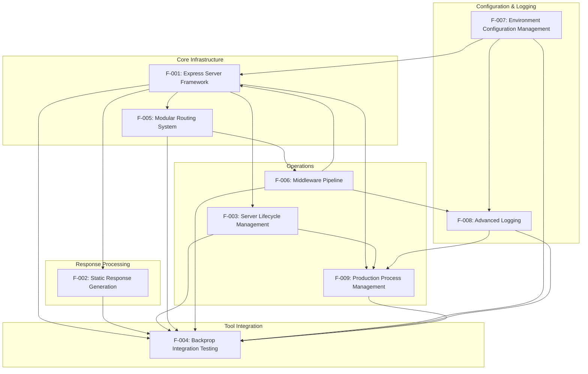
```mermaid
graph TD
    F001[F-001: Express Server Framework] --> F002[F-002: Static Response Generation]
    F001 --> F003[F-003: Server Lifecycle Management]
    F001 --> F005[F-005: Modular Routing System]
    F007[F-007: Environment Configuration Management] --> F001
    F006[F-006: Middleware Pipeline] --> F001
    
    F005 --> F006
    F007 --> F008[F-008: Advanced Logging]
    F006 --> F008
    
    F001 --> F009[F-009: Production Process Management]
    F003 --> F009
    F008 --> F009
    
    F001 --> F004[F-004: Backprop Integration Testing]
    F002 --> F004
    F003 --> F004
    F005 --> F004
    F006 --> F004
    F007 --> F004
    F008 --> F004
    F009 --> F004
    
    subgraph "Core Infrastructure"
        F001
        F005
    end
    
    subgraph "Response Processing"
        F002
    end
    
    subgraph "Operations"
        F003
        F006
        F009
    end
    
    subgraph "Configuration & Logging"
        F007
        F008
    end
    
    subgraph "Tool Integration"
        F004
    end
```

### 2.3.2 Integration Points (updated)

| Feature A | Feature B | Integration Type | Shared Components |
|-----------|-----------|------------------|-------------------|
| F-001 | F-002 | Direct Dependency | HTTP response objects |
| F-001 | F-003 | Parallel Operation | Server instance, console interface |
| <span style="background-color: rgba(91, 57, 243, 0.2)">F-001</span> | <span style="background-color: rgba(91, 57, 243, 0.2)">F-005</span> | <span style="background-color: rgba(91, 57, 243, 0.2)">Route Integration</span> | <span style="background-color: rgba(91, 57, 243, 0.2)">Express Router instances, route handlers</span> |
| <span style="background-color: rgba(91, 57, 243, 0.2)">F-006</span> | <span style="background-color: rgba(91, 57, 243, 0.2)">F-001</span> | <span style="background-color: rgba(91, 57, 243, 0.2)">Middleware Pipeline</span> | <span style="background-color: rgba(91, 57, 243, 0.2)">Express middleware stack</span> |
| <span style="background-color: rgba(91, 57, 243, 0.2)">F-007</span> | <span style="background-color: rgba(91, 57, 243, 0.2)">F-001</span> | <span style="background-color: rgba(91, 57, 243, 0.2)">Configuration Provider</span> | <span style="background-color: rgba(91, 57, 243, 0.2)">Environment variables, config objects</span> |
| <span style="background-color: rgba(91, 57, 243, 0.2)">F-005</span> | <span style="background-color: rgba(91, 57, 243, 0.2)">F-006</span> | <span style="background-color: rgba(91, 57, 243, 0.2)">Route-Level Middleware</span> | <span style="background-color: rgba(91, 57, 243, 0.2)">Router middleware functions</span> |
| <span style="background-color: rgba(91, 57, 243, 0.2)">F-008</span> | <span style="background-color: rgba(91, 57, 243, 0.2)">F-008</span> | <span style="background-color: rgba(91, 57, 243, 0.2)">Winston↔Morgan Integration</span> | <span style="background-color: rgba(91, 57, 243, 0.2)">Logger stream bridging</span> |
| F-002 | F-004 | Analysis Target | Response generation logic |
| F-003 | F-004 | Analysis Target | Lifecycle management patterns |
| <span style="background-color: rgba(91, 57, 243, 0.2)">F-007</span> | <span style="background-color: rgba(91, 57, 243, 0.2)">F-008</span> | <span style="background-color: rgba(91, 57, 243, 0.2)">Configuration Consumer</span> | <span style="background-color: rgba(91, 57, 243, 0.2)">Log level, file path settings</span> |
| <span style="background-color: rgba(91, 57, 243, 0.2)">F-006</span> | <span style="background-color: rgba(91, 57, 243, 0.2)">F-008</span> | <span style="background-color: rgba(91, 57, 243, 0.2)">Middleware Logging</span> | <span style="background-color: rgba(91, 57, 243, 0.2)">HTTP request logging pipeline</span> |
| <span style="background-color: rgba(91, 57, 243, 0.2)">F-001</span> | <span style="background-color: rgba(91, 57, 243, 0.2)">F-009</span> | <span style="background-color: rgba(91, 57, 243, 0.2)">Express↔PM2 Integration</span> | <span style="background-color: rgba(91, 57, 243, 0.2)">Process cluster management</span> |
| <span style="background-color: rgba(91, 57, 243, 0.2)">F-003</span> | <span style="background-color: rgba(91, 57, 243, 0.2)">F-009</span> | <span style="background-color: rgba(91, 57, 243, 0.2)">Lifecycle Coordination</span> | <span style="background-color: rgba(91, 57, 243, 0.2)">Signal handlers, graceful shutdown</span> |
| <span style="background-color: rgba(91, 57, 243, 0.2)">F-008</span> | <span style="background-color: rgba(91, 57, 243, 0.2)">F-009</span> | <span style="background-color: rgba(91, 57, 243, 0.2)">Process Monitoring</span> | <span style="background-color: rgba(91, 57, 243, 0.2)">Log aggregation, health monitoring</span> |
| <span style="background-color: rgba(91, 57, 243, 0.2)">F-007</span> | <span style="background-color: rgba(91, 57, 243, 0.2)">F-009</span> | <span style="background-color: rgba(91, 57, 243, 0.2)">dotenv↔Configuration Modules</span> | <span style="background-color: rgba(91, 57, 243, 0.2)">PM2 ecosystem configuration</span> |

### 2.3.3 Shared Components (updated)

**Common Services:**
- <span style="background-color: rgba(91, 57, 243, 0.2)">**Express.js Core**: Primary web framework utilized by F-001 for server creation, F-002 for response handling, F-005 for routing, and F-006 for middleware processing</span>
- **Console Interface**: Shared between F-003 for operational logging and development workflow
- **Process Management**: Standard Node.js lifecycle used by F-003 and accessed by F-004
- <span style="background-color: rgba(91, 57, 243, 0.2)">**Winston Logger**: Centralized logging service shared across F-008 for application logging, F-006 for middleware logging integration, and F-009 for process monitoring</span>
- <span style="background-color: rgba(91, 57, 243, 0.2)">**PM2 Cluster Manager**: Production process orchestration utilized by F-009 for cluster management and F-003 for lifecycle coordination</span>
- <span style="background-color: rgba(91, 57, 243, 0.2)">**dotenv Configuration Loader**: Environment variable management shared between F-007 for configuration loading and multiple features for runtime configuration access</span>

**Integration Architecture:**
- <span style="background-color: rgba(91, 57, 243, 0.2)">**Multi-module Architecture**: `server.js` serves as the central entry point coordinating multiple feature modules across `/routes`, `/middleware`, `/config`, and `/utils` directories</span>
- **Stateless Design**: No shared state between features ensures independence and modularity
- <span style="background-color: rgba(91, 57, 243, 0.2)">**Modular Logic**: Each feature occupies distinct modules with clear separation of concerns, enabling independent development and testing</span>
- <span style="background-color: rgba(91, 57, 243, 0.2)">**Dependency Injection**: Configuration and logging services injected through centralized modules enabling consistent behavior across features</span>

**Cross-Cutting Concerns:**
- <span style="background-color: rgba(91, 57, 243, 0.2)">**Configuration Management**: Centralized environment-based configuration accessible across all feature modules</span>
- <span style="background-color: rgba(91, 57, 243, 0.2)">**Logging Infrastructure**: Unified logging pipeline with Winston-Morgan integration providing consistent log formatting and routing</span>
- <span style="background-color: rgba(91, 57, 243, 0.2)">**Error Handling**: Global error handling middleware providing consistent error response formatting across all routes</span>
- <span style="background-color: rgba(91, 57, 243, 0.2)">**Security Layer**: Comprehensive security middleware (CORS, Helmet, compression) applied consistently across all endpoints</span>

### 2.3.4 Advanced Integration Patterns (updated)

**Middleware Pipeline Flow:**
<span style="background-color: rgba(91, 57, 243, 0.2)">The request processing pipeline demonstrates sophisticated integration between F-006 (Middleware Pipeline), F-008 (Advanced Logging), and F-005 (Modular Routing System). Incoming requests flow through security middleware, logging middleware with Winston-Morgan integration, body parsing middleware, and finally reach route-specific handlers with their own middleware stacks.</span>

**Configuration Cascade:**
<span style="background-color: rgba(91, 57, 243, 0.2)">F-007 (Environment Configuration Management) provides the foundation for all other features through dotenv-based configuration loading. This creates a cascade effect where F-008 receives log levels and file paths, F-009 receives PM2 ecosystem settings, and F-001 receives port and environment specifications, all from centralized configuration modules.</span>

**Process Lifecycle Coordination:**
<span style="background-color: rgba(91, 57, 243, 0.2)">F-009 (Production Process Management) orchestrates the entire application lifecycle through PM2 cluster management, coordinating with F-003 (Server Lifecycle Management) for graceful shutdowns and F-008 (Advanced Logging) for process monitoring and health reporting across multiple worker processes.</span>

**Development Tool Integration:**
<span style="background-color: rgba(91, 57, 243, 0.2)">F-004 (Backprop Integration Testing) serves as the comprehensive integration point, analyzing the interactions between all features to assess tool effectiveness on modern Express.js applications with production-grade architectural patterns including modular routing, middleware pipelines, configuration management, advanced logging, and process orchestration.</span>

## 2.4 IMPLEMENTATION CONSIDERATIONS

### 2.4.1 Technical Constraints (updated)

**Platform Requirements:**
- <span style="background-color: rgba(91, 57, 243, 0.2)">Node.js runtime environment (>=18.0.0) for modern JavaScript features and native fetch support</span>
- Network access to localhost interface (127.0.0.1)
- File system permissions for script execution
- Console access for operational output
- <span style="background-color: rgba(91, 57, 243, 0.2)">Multi-core CPU support for PM2 clustering capabilities</span>

**Architecture Constraints:**
- <span style="background-color: rgba(91, 57, 243, 0.2)">Modular directory structure with organized separation of concerns across `/routes`, `/middleware`, `/config`, and `/utils` directories</span>
- <span style="background-color: rgba(91, 57, 243, 0.2)">External NPM dependencies managed through package.json with curated dependency stack</span>
- Stateless operation (no data persistence capabilities)
- Localhost-only binding (security and simplicity)

**External Dependencies List:**
<span style="background-color: rgba(91, 57, 243, 0.2)">
- **Core Framework**: express@^4.18.0
- **Configuration Management**: dotenv@^16.0.0
- **Logging Infrastructure**: winston@^3.11.0, morgan@^1.10.0
- **Security Middleware**: cors@^2.8.5, helmet@^7.1.0
- **Request Processing**: body-parser@^1.20.0, compression@^1.7.4
- **Process Management**: pm2@^5.3.0
- **Development Tools**: nodemon@^3.0.0
</span>

**Directory Layout Constraints:**
<span style="background-color: rgba(91, 57, 243, 0.2)">
- `/routes` directory: Modular route handlers with Express Router implementation
- `/middleware` directory: Custom middleware functions for logging, error handling, validation
- `/config` directory: Centralized configuration management modules
- `/utils` directory: Shared utility functions and logger exports
- `/logs` directory: Log file storage (auto-created, gitignored)
- Root-level configuration files: `.env`, `.env.example`, `ecosystem.config.js`
</span>

### 2.4.2 Performance Requirements (updated)

| Feature | Performance Metric | Target Value | Measurement Method |
|---------|-------------------|--------------|-------------------|
| F-001 | <span style="background-color: rgba(91, 57, 243, 0.2)">Server Startup Time (with middleware)</span> | < 1 second | <span style="background-color: rgba(91, 57, 243, 0.2)">Process timing including middleware initialization</span> |
| F-002 | Response Generation | < 10ms | HTTP request timing |
| F-003 | Process Termination | < 100ms | Signal handling timing |
| F-004 | Tool Integration | Error-free execution | Backprop analysis success |
| <span style="background-color: rgba(91, 57, 243, 0.2)">F-008</span> | <span style="background-color: rgba(91, 57, 243, 0.2)">Log Throughput</span> | <span style="background-color: rgba(91, 57, 243, 0.2)">> 1000 entries/second</span> | <span style="background-color: rgba(91, 57, 243, 0.2)">Winston performance monitoring</span> |
| <span style="background-color: rgba(91, 57, 243, 0.2)">F-009</span> | <span style="background-color: rgba(91, 57, 243, 0.2)">PM2 Cluster Startup</span> | <span style="background-color: rgba(91, 57, 243, 0.2)">< 3 seconds</span> | <span style="background-color: rgba(91, 57, 243, 0.2)">Multi-process initialization timing</span> |

**Additional Performance Considerations:**
<span style="background-color: rgba(91, 57, 243, 0.2)">
- **Middleware Pipeline Latency**: < 1ms additional processing time per middleware layer
- **Configuration Loading**: < 100ms for dotenv and config module initialization
- **Memory Footprint**: < 50MB baseline per process instance
- **Concurrent Request Handling**: Support 100+ concurrent connections per worker process
</span>

### 2.4.3 Scalability Considerations (updated)

**Current Capabilities:**
- **PM2 Cluster Support**: Multi-process scaling across available CPU cores with round-robin load distribution
- **Process Isolation**: Independent worker processes with fault isolation and automatic restart capabilities
- **Load Balancing**: Built-in PM2 load balancer distributing requests across worker processes
- **Graceful Reload**: Zero-downtime deployments through PM2 rolling restart mechanisms

**Horizontal Scaling Readiness:**
- **Stateless Design**: No session storage or shared state enabling seamless multi-instance deployment
- **Configuration Management**: Environment-based configuration supports multi-environment scaling
- **Load Balancer Compatibility**: Standard HTTP interface compatible with external load balancers (nginx, HAProxy)
- **Container Readiness**: Docker-compatible architecture with environment variable configuration

**Current Limitations:**
- Fixed port binding prevents multiple instances on single machine without configuration changes
- <span style="background-color: rgba(91, 57, 243, 0.2)">Logging requires centralized aggregation for multi-instance deployments</span>
- Testing focus prioritizes predictability over maximum performance optimization

**Design Benefits for Testing:**
- <span style="background-color: rgba(91, 57, 243, 0.2)">PM2 clustering enables evaluation of Backprop's understanding of production deployment patterns</span>
- Consistent behavior across multiple processes supports systematic tool evaluation

### 2.4.4 Security Implications (updated)

**Security Features:**
- Localhost-only binding prevents external network access
- <span style="background-color: rgba(91, 57, 243, 0.2)">**Helmet Security Headers**: Comprehensive security header implementation including X-Content-Type-Options, X-Frame-Options, X-XSS-Protection, and Strict-Transport-Security</span>
- <span style="background-color: rgba(91, 57, 243, 0.2)">**CORS Configuration**: Cross-origin resource sharing policies with configurable origin restrictions and preflight handling</span>
- <span style="background-color: rgba(91, 57, 243, 0.2)">**Rate Limiting Ready**: Infrastructure prepared for rate limiting middleware integration through configurable middleware pipeline</span>
- <span style="background-color: rgba(91, 57, 243, 0.2)">Curated external dependencies eliminate many supply chain risks through selective dependency management</span>
- No authentication reduces attack surface for testing scenarios
- Stateless design prevents session hijacking

**Security Considerations:**
- <span style="background-color: rgba(91, 57, 243, 0.2)">**Production Exposure Risk**: If configured to bind to 0.0.0.0 instead of localhost, the application exposes additional attack surface including external network access, potential DDoS vectors, and unauthorized access to health endpoints</span>
- <span style="background-color: rgba(91, 57, 243, 0.2)">**Middleware Security**: Request validation middleware provides input sanitization capabilities but requires proper configuration for production deployment</span>
- <span style="background-color: rgba(91, 57, 243, 0.2)">**Environment Variable Security**: Sensitive configuration data in .env files must be properly secured and excluded from version control</span>
- No HTTPS/TLS encryption support in current configuration
- Intentionally minimal authentication for testing purposes

**Security Enhancement Opportunities:**
- **Input Validation**: Comprehensive request validation middleware through `/middleware/validation.js`
- **Security Logging**: Security event logging through Winston integration enables audit trail generation
- **Process Isolation**: PM2 cluster mode provides process-level security isolation

### 2.4.5 Maintenance Requirements (updated)

**Code Maintenance:**
- <span style="background-color: rgba(91, 57, 243, 0.2)">**Modular Directory Structure**: Maintain organized separation of concerns across `/routes`, `/middleware`, `/config`, and `/utils` directories with clear module boundaries</span>
- <span style="background-color: rgba(91, 57, 243, 0.2)">**Environment Configuration**: Keep `.env.example` updated with all required environment variables and proper documentation for deployment teams</span>
- <span style="background-color: rgba(91, 57, 243, 0.2)">Maintain dependency compatibility across Express ecosystem components</span>
- Document any changes for testing baseline integrity
- Ensure backward compatibility with Backprop integration

**Operational Maintenance:**
- <span style="background-color: rgba(91, 57, 243, 0.2)">**Log Management**: Implement log rotation policies and monitor log directory disk usage</span>
- <span style="background-color: rgba(91, 57, 243, 0.2)">**Dependency Updates**: Regular security updates for NPM packages with compatibility testing</span>
- <span style="background-color: rgba(91, 57, 243, 0.2)">**PM2 Process Monitoring**: Monitor cluster health, memory usage, and automatic restart frequency</span>
- <span style="background-color: rgba(91, 57, 243, 0.2)">**Configuration Validation**: Verify environment variable completeness across development, staging, and production environments</span>
- Standard Node.js runtime updates with version compatibility verification

**Documentation Maintenance:**
- **API Documentation**: Maintain endpoint documentation for health checks and API routes
- **Deployment Guides**: Update PM2 ecosystem configuration and deployment procedures
- **Architecture Decisions**: Document middleware pipeline changes and routing modifications
- **Troubleshooting Guides**: Maintain operational runbooks for common issues and error scenarios

**Quality Assurance:**
- **Integration Testing**: Verify middleware pipeline functionality and route handler operation
- **Performance Monitoring**: Regular assessment of response times and resource utilization
- **Security Audits**: Periodic review of dependencies for security vulnerabilities
- **Configuration Testing**: Validate environment-specific configuration loading and override behavior

## 2.5 TRACEABILITY MATRIX

| Requirement ID | Feature | Source | Validation Method |
|----------------|---------|--------|------------------|
| F-001-RQ-001 | <span style="background-color: rgba(91, 57, 243, 0.2)">Express Application Initialization</span> | <span style="background-color: rgba(91, 57, 243, 0.2)">server.js, package.json</span> | <span style="background-color: rgba(91, 57, 243, 0.2)">Automated integration test + PM2 health check</span> |
| F-001-RQ-002 | <span style="background-color: rgba(91, 57, 243, 0.2)">Port Binding via Environment Variable</span> | <span style="background-color: rgba(91, 57, 243, 0.2)">server.js, config/environment.js</span> | <span style="background-color: rgba(91, 57, 243, 0.2)">Automated integration test + PM2 health check</span> |
| F-001-RQ-003 | Backward Compatibility Preservation | <span style="background-color: rgba(91, 57, 243, 0.2)">/routes/index.js</span> | HTTP client testing |
| <span style="background-color: rgba(91, 57, 243, 0.2)">F-001-RQ-004</span> | <span style="background-color: rgba(91, 57, 243, 0.2)">Framework Integration</span> | <span style="background-color: rgba(91, 57, 243, 0.2)">server.js, /middleware</span> | <span style="background-color: rgba(91, 57, 243, 0.2)">Unit test suite</span> |
| F-002-RQ-001 | Response Content | <span style="background-color: rgba(91, 57, 243, 0.2)">/routes/index.js</span> | Response inspection |
| F-002-RQ-002 | Content Type | <span style="background-color: rgba(91, 57, 243, 0.2)">/routes/index.js</span> | Header verification |
| <span style="background-color: rgba(91, 57, 243, 0.2)">F-002-RQ-003</span> | <span style="background-color: rgba(91, 57, 243, 0.2)">HTTP Status Code Compliance</span> | <span style="background-color: rgba(91, 57, 243, 0.2)">/routes/index.js</span> | <span style="background-color: rgba(91, 57, 243, 0.2)">Unit test suite</span> |
| <span style="background-color: rgba(91, 57, 243, 0.2)">F-002-RQ-004</span> | <span style="background-color: rgba(91, 57, 243, 0.2)">Route Accessibility</span> | <span style="background-color: rgba(91, 57, 243, 0.2)">/routes/index.js</span> | <span style="background-color: rgba(91, 57, 243, 0.2)">Integration test</span> |
| F-003-RQ-001 | Startup Logging | <span style="background-color: rgba(91, 57, 243, 0.2)">config/winston.js, middleware/logger.js</span> | Console output verification |
| <span style="background-color: rgba(91, 57, 243, 0.2)">F-003-RQ-002</span> | <span style="background-color: rgba(91, 57, 243, 0.2)">Process Termination</span> | <span style="background-color: rgba(91, 57, 243, 0.2)">server.js</span> | <span style="background-color: rgba(91, 57, 243, 0.2)">Signal handling test</span> |
| <span style="background-color: rgba(91, 57, 243, 0.2)">F-003-RQ-004</span> | <span style="background-color: rgba(91, 57, 243, 0.2)">Status Reporting</span> | <span style="background-color: rgba(91, 57, 243, 0.2)">config/winston.js</span> | <span style="background-color: rgba(91, 57, 243, 0.2)">Log format verification</span> |
| F-004-RQ-001 | Tool Connectivity | README.md, project structure | Backprop execution testing |
| <span style="background-color: rgba(91, 57, 243, 0.2)">F-004-RQ-002</span> | <span style="background-color: rgba(91, 57, 243, 0.2)">Code Analysis</span> | <span style="background-color: rgba(91, 57, 243, 0.2)">server.js, /routes, /middleware</span> | <span style="background-color: rgba(91, 57, 243, 0.2)">Backprop comprehension test</span> |
| <span style="background-color: rgba(91, 57, 243, 0.2)">F-004-RQ-003</span> | <span style="background-color: rgba(91, 57, 243, 0.2)">Dependency Analysis</span> | <span style="background-color: rgba(91, 57, 243, 0.2)">package.json</span> | <span style="background-color: rgba(91, 57, 243, 0.2)">Dependency audit test</span> |
| <span style="background-color: rgba(91, 57, 243, 0.2)">F-004-RQ-004</span> | <span style="background-color: rgba(91, 57, 243, 0.2)">Structure Comprehension</span> | <span style="background-color: rgba(91, 57, 243, 0.2)">Project directory structure</span> | <span style="background-color: rgba(91, 57, 243, 0.2)">Architecture analysis test</span> |
| <span style="background-color: rgba(91, 57, 243, 0.2)">F-005-RQ-001</span> | <span style="background-color: rgba(91, 57, 243, 0.2)">RESTful Route Registration</span> | <span style="background-color: rgba(91, 57, 243, 0.2)">/routes/api.js</span> | <span style="background-color: rgba(91, 57, 243, 0.2)">Unit test suite</span> |
| <span style="background-color: rgba(91, 57, 243, 0.2)">F-005-RQ-002</span> | <span style="background-color: rgba(91, 57, 243, 0.2)">Directory Structure Organization</span> | <span style="background-color: rgba(91, 57, 243, 0.2)">/routes directory</span> | <span style="background-color: rgba(91, 57, 243, 0.2)">File structure validation</span> |
| <span style="background-color: rgba(91, 57, 243, 0.2)">F-005-RQ-003</span> | <span style="background-color: rgba(91, 57, 243, 0.2)">Express Router Implementation</span> | <span style="background-color: rgba(91, 57, 243, 0.2)">/routes/index.js, /routes/api.js, /routes/health.js</span> | <span style="background-color: rgba(91, 57, 243, 0.2)">Integration test</span> |
| <span style="background-color: rgba(91, 57, 243, 0.2)">F-005-RQ-004</span> | <span style="background-color: rgba(91, 57, 243, 0.2)">Route-Level Middleware Support</span> | <span style="background-color: rgba(91, 57, 243, 0.2)">/routes/api.js</span> | <span style="background-color: rgba(91, 57, 243, 0.2)">Middleware execution test</span> |
| <span style="background-color: rgba(91, 57, 243, 0.2)">F-006-RQ-001</span> | <span style="background-color: rgba(91, 57, 243, 0.2)">Execution Order Management</span> | <span style="background-color: rgba(91, 57, 243, 0.2)">server.js, /middleware</span> | <span style="background-color: rgba(91, 57, 243, 0.2)">Middleware sequence test</span> |
| <span style="background-color: rgba(91, 57, 243, 0.2)">F-006-RQ-002</span> | <span style="background-color: rgba(91, 57, 243, 0.2)">Authentication Stub Integration</span> | <span style="background-color: rgba(91, 57, 243, 0.2)">/middleware/auth.js</span> | <span style="background-color: rgba(91, 57, 243, 0.2)">Unit test suite</span> |
| <span style="background-color: rgba(91, 57, 243, 0.2)">F-006-RQ-003</span> | <span style="background-color: rgba(91, 57, 243, 0.2)">Validation Rules Processing</span> | <span style="background-color: rgba(91, 57, 243, 0.2)">/middleware/validation.js</span> | <span style="background-color: rgba(91, 57, 243, 0.2)">Input validation test</span> |
| <span style="background-color: rgba(91, 57, 243, 0.2)">F-006-RQ-004</span> | <span style="background-color: rgba(91, 57, 243, 0.2)">Logging Injection</span> | <span style="background-color: rgba(91, 57, 243, 0.2)">/middleware/logger.js</span> | <span style="background-color: rgba(91, 57, 243, 0.2)">Log capture test</span> |
| <span style="background-color: rgba(91, 57, 243, 0.2)">F-006-RQ-005</span> | <span style="background-color: rgba(91, 57, 243, 0.2)">Global Error Handling</span> | <span style="background-color: rgba(91, 57, 243, 0.2)">/middleware/errorHandler.js</span> | <span style="background-color: rgba(91, 57, 243, 0.2)">Error propagation test</span> |
| <span style="background-color: rgba(91, 57, 243, 0.2)">F-007-RQ-001</span> | <span style="background-color: rgba(91, 57, 243, 0.2)">Dotenv Loading</span> | <span style="background-color: rgba(91, 57, 243, 0.2)">/config/environment.js, .env</span> | <span style="background-color: rgba(91, 57, 243, 0.2)">Environment variable test</span> |
| <span style="background-color: rgba(91, 57, 243, 0.2)">F-007-RQ-002</span> | <span style="background-color: rgba(91, 57, 243, 0.2)">Mandatory Variable Validation</span> | <span style="background-color: rgba(91, 57, 243, 0.2)">/config/environment.js</span> | <span style="background-color: rgba(91, 57, 243, 0.2)">Configuration validation test</span> |
| <span style="background-color: rgba(91, 57, 243, 0.2)">F-007-RQ-003</span> | <span style="background-color: rgba(91, 57, 243, 0.2)">Optional Variable Handling</span> | <span style="background-color: rgba(91, 57, 243, 0.2)">/config/environment.js</span> | <span style="background-color: rgba(91, 57, 243, 0.2)">Default value test</span> |
| <span style="background-color: rgba(91, 57, 243, 0.2)">F-007-RQ-004</span> | <span style="background-color: rgba(91, 57, 243, 0.2)">Fallback Defaults</span> | <span style="background-color: rgba(91, 57, 243, 0.2)">/config/environment.js</span> | <span style="background-color: rgba(91, 57, 243, 0.2)">Graceful degradation test</span> |
| <span style="background-color: rgba(91, 57, 243, 0.2)">F-008-RQ-001</span> | <span style="background-color: rgba(91, 57, 243, 0.2)">Log Levels per NODE_ENV</span> | <span style="background-color: rgba(91, 57, 243, 0.2)">config/winston.js</span> | <span style="background-color: rgba(91, 57, 243, 0.2)">Log level verification test</span> |
| <span style="background-color: rgba(91, 57, 243, 0.2)">F-008-RQ-002</span> | <span style="background-color: rgba(91, 57, 243, 0.2)">JSON Formatting</span> | <span style="background-color: rgba(91, 57, 243, 0.2)">config/winston.js</span> | <span style="background-color: rgba(91, 57, 243, 0.2)">Log format validation test</span> |
| <span style="background-color: rgba(91, 57, 243, 0.2)">F-008-RQ-003</span> | <span style="background-color: rgba(91, 57, 243, 0.2)">Morgan-Winston Integration</span> | <span style="background-color: rgba(91, 57, 243, 0.2)">middleware/logger.js</span> | <span style="background-color: rgba(91, 57, 243, 0.2)">HTTP log integration test</span> |
| <span style="background-color: rgba(91, 57, 243, 0.2)">F-008-RQ-004</span> | <span style="background-color: rgba(91, 57, 243, 0.2)">Dual Output Support</span> | <span style="background-color: rgba(91, 57, 243, 0.2)">config/winston.js</span> | <span style="background-color: rgba(91, 57, 243, 0.2)">Transport configuration test</span> |
| <span style="background-color: rgba(91, 57, 243, 0.2)">F-009-RQ-001</span> | <span style="background-color: rgba(91, 57, 243, 0.2)">Cluster Mode Configuration</span> | <span style="background-color: rgba(91, 57, 243, 0.2)">ecosystem.config.js</span> | <span style="background-color: rgba(91, 57, 243, 0.2)">PM2 status check</span> |
| <span style="background-color: rgba(91, 57, 243, 0.2)">F-009-RQ-002</span> | <span style="background-color: rgba(91, 57, 243, 0.2)">Graceful Shutdown</span> | <span style="background-color: rgba(91, 57, 243, 0.2)">server.js, ecosystem.config.js</span> | <span style="background-color: rgba(91, 57, 243, 0.2)">Signal handling + PM2 health check</span> |
| <span style="background-color: rgba(91, 57, 243, 0.2)">F-009-RQ-003</span> | <span style="background-color: rgba(91, 57, 243, 0.2)">Automatic Restart on Failure</span> | <span style="background-color: rgba(91, 57, 243, 0.2)">ecosystem.config.js</span> | <span style="background-color: rgba(91, 57, 243, 0.2)">Process restart test</span> |
| <span style="background-color: rgba(91, 57, 243, 0.2)">F-009-RQ-004</span> | <span style="background-color: rgba(91, 57, 243, 0.2)">Environment-Specific Configs</span> | <span style="background-color: rgba(91, 57, 243, 0.2)">ecosystem.config.js</span> | <span style="background-color: rgba(91, 57, 243, 0.2)">Multi-environment deployment test</span> |

#### References

- `server.js` - <span style="background-color: rgba(91, 57, 243, 0.2)">Express application initialization and core server setup</span>
- `package.json` - <span style="background-color: rgba(91, 57, 243, 0.2)">Project metadata and production dependency configuration</span>
- `package-lock.json` - <span style="background-color: rgba(91, 57, 243, 0.2)">Dependency lock file for consistent deployment environments</span>
- `README.md` - Project purpose documentation and Backprop integration declaration
- <span style="background-color: rgba(91, 57, 243, 0.2)">`ecosystem.config.js` - PM2 cluster configuration and process management settings</span>
- <span style="background-color: rgba(91, 57, 243, 0.2)">`.env` files - Environment-specific configuration variables</span>
- <span style="background-color: rgba(91, 57, 243, 0.2)">`/routes` directory - Modular route handlers with Express Router implementation</span>
- <span style="background-color: rgba(91, 57, 243, 0.2)">`/middleware` directory - Custom middleware functions for logging, error handling, validation</span>
- <span style="background-color: rgba(91, 57, 243, 0.2)">`/config` directory - Centralized configuration management modules</span>
- <span style="background-color: rgba(91, 57, 243, 0.2)">`config/winston.js` - Winston logger configuration and transport setup</span>
- <span style="background-color: rgba(91, 57, 243, 0.2)">`middleware/logger.js` - Morgan HTTP logging middleware integration</span>
- **Technical Specification Section 1.1** - Executive summary and business context
- **Technical Specification Section 1.2** - System overview and capabilities
- **Technical Specification Section 1.3** - Project scope and boundaries

# 3. TECHNOLOGY STACK

## 3.1 PROGRAMMING LANGUAGES

### 3.1.1 Node.js JavaScript (CommonJS)

The system is implemented exclusively in **JavaScript using the CommonJS module system** for Node.js execution environments. This language choice aligns with the project's core objective of providing a <span style="background-color: rgba(91, 57, 243, 0.2)">production-ready Express.js platform</span> for Backprop tool evaluation.

**Primary Language Details:**
- **Language**: JavaScript (ES5+ compatible)
- **Module System**: CommonJS (`require()` syntax)
- **Runtime Target**: Node.js (any recent version)
- **File Implementation**: <span style="background-color: rgba(91, 57, 243, 0.2)">Modular architecture spanning multiple directories including `/routes` for endpoint management, `/middleware` for request processing pipeline, `/config` for centralized configuration, `/utils` for shared utilities, and a refactored `server.js` serving as the Express.js application bootstrap</span>

**Selection Rationale:**
- **Simplicity**: JavaScript provides immediate accessibility for tool analysis without compilation steps
- **Node.js Ecosystem**: Leverages mature HTTP server capabilities through <span style="background-color: rgba(91, 57, 243, 0.2)">Express.js framework and extensive middleware ecosystem</span>
- **Backprop Compatibility**: Ensures clear code comprehension for AI-assisted development tool testing
- **Zero Transpilation**: Direct execution eliminates build complexity that could interfere with tool analysis

**Framework Integration:**
- **<span style="background-color: rgba(91, 57, 243, 0.2)">Express.js Architecture</span>**: <span style="background-color: rgba(91, 57, 243, 0.2)">While maintaining CommonJS module system, the runtime now instantiates an Express application with comprehensive middleware pipeline, modular routing, and production-grade patterns rather than a native HTTP server</span>
- **Middleware Support**: Integrates security headers (Helmet), cross-origin resource sharing (CORS), request compression, and body parsing
- **Routing Architecture**: Implements Express Router pattern with organized endpoint management across dedicated route modules

**Version Compatibility:**
- **Minimum Node.js Version**: <span style="background-color: rgba(91, 57, 243, 0.2)">>=18.0.0</span> (for native fetch and modern JavaScript features)
- **JavaScript Standard**: ES5+ with Node.js CommonJS extensions
- **No TypeScript**: Intentionally excluded to maintain codebase simplicity

**Production Features:**
- **Logging Integration**: Winston for application logging and Morgan for HTTP request logging
- **Environment Configuration**: dotenv-based configuration management with environment-specific overrides
- **Process Management**: PM2 clustering support for production deployment scenarios
- **Error Handling**: Comprehensive error handling middleware with structured error responses

## 3.2 FRAMEWORKS & LIBRARIES

### 3.2.1 Express.js Web Framework (updated)

The system utilizes **Express.js 4.18+** as its core web application framework, providing robust HTTP server capabilities, middleware architecture, and routing infrastructure for production deployment scenarios.

**Core Framework Architecture:**
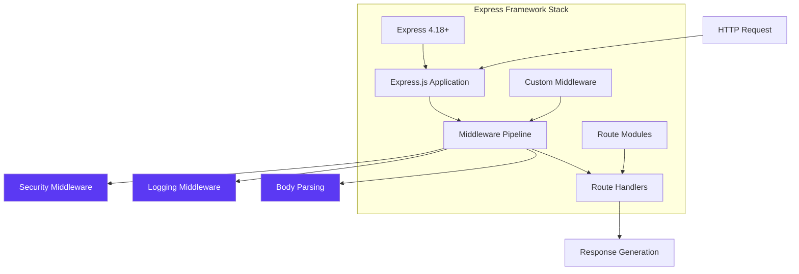
```mermaid
graph TD
    A[HTTP Request] --> B[Express.js Application]
    B --> C[Middleware Pipeline]
    C --> D[Security Middleware]
    C --> E[Logging Middleware]
    C --> F[Body Parsing]
    C --> G[Route Handlers]
    G --> H[Response Generation]
    
    subgraph "Express Framework Stack"
        I[Express 4.18+] --> B
        J[Custom Middleware] --> C
        K[Route Modules] --> G
    end
    
    style D fill:#5b39f3,color:#fff
    style E fill:#5b39f3,color:#fff
    style F fill:#5b39f3,color:#fff
```

**Framework Selection Justification:**
- <span style="background-color: rgba(91, 57, 243, 0.2)">**Production-Ready Architecture**: Express.js provides enterprise-grade web server capabilities with comprehensive middleware support, replacing the minimal Node.js HTTP module approach</span>
- <span style="background-color: rgba(91, 57, 243, 0.2)">**Middleware Ecosystem**: Extensive third-party middleware integration for security, logging, compression, and request processing</span>
- **Routing Flexibility**: Advanced routing capabilities with parameter handling, route guards, and modular organization
- **Community Support**: Mature ecosystem with extensive documentation and community-contributed middleware
- **Performance Optimization**: Built-in optimizations for HTTP handling and response efficiency

### 3.2.2 Supporting Libraries (updated)

The framework stack includes carefully selected libraries that provide essential production capabilities while maintaining system reliability and security compliance.

**Core Dependencies:**

- <span style="background-color: rgba(91, 57, 243, 0.2)">**express (^4.18.2)**: Primary web application framework providing HTTP server, routing, and middleware capabilities</span>
- <span style="background-color: rgba(91, 57, 243, 0.2)">**dotenv (^16.3.1)**: Environment configuration management enabling deployment flexibility across development, staging, and production environments</span>
- <span style="background-color: rgba(91, 57, 243, 0.2)">**winston (^3.10.0)**: Production-grade application logging framework with multiple transports, log levels, and structured formatting</span>
- <span style="background-color: rgba(91, 57, 243, 0.2)">**morgan (^1.10.0)**: HTTP request logging middleware providing detailed request/response tracking for monitoring and debugging</span>

**Security & Performance Libraries:**

- <span style="background-color: rgba(91, 57, 243, 0.2)">**cors (^2.8.5)**: Cross-Origin Resource Sharing middleware for API endpoint security and browser compatibility</span>
- <span style="background-color: rgba(91, 57, 243, 0.2)">**helmet (^7.0.0)**: Security middleware collection providing protection against common vulnerabilities through HTTP headers</span>
- <span style="background-color: rgba(91, 57, 243, 0.2)">**compression (^1.7.4)**: Response compression middleware for improved performance and reduced bandwidth usage</span>
- <span style="background-color: rgba(91, 57, 243, 0.2)">**body-parser (^1.20.2)**: Request body parsing middleware supporting JSON, URL-encoded, and multipart form data</span>

**Library Integration Strategy:**
- **Modular Configuration**: Each library configured through dedicated configuration modules in `/config` directory
- **Environment Awareness**: All libraries support environment-specific configuration through dotenv variables
- **Error Integration**: Libraries integrated with centralized error handling middleware for consistent error responses
- **Performance Monitoring**: Logging libraries configured for production monitoring and debugging capabilities

### 3.2.3 Middleware Pipeline Architecture (updated)

<span style="background-color: rgba(91, 57, 243, 0.2)">The Express.js application implements a comprehensive middleware pipeline that processes all incoming requests through ordered middleware functions, enabling cross-cutting concerns like logging, security, and error handling.</span>

**Middleware Execution Order:**
1. **Security Headers** (Helmet) - Applied first for maximum protection
2. **CORS Configuration** - Cross-origin policy enforcement
3. **Request Compression** - Response optimization
4. **Body Parsing** - Request payload processing
5. **HTTP Logging** (Morgan) - Request tracking and monitoring
6. **Custom Middleware** - Application-specific processing
7. **Route Handlers** - Endpoint-specific business logic
8. **Error Handling** - Global error processing

**Custom Middleware Modules:**
- <span style="background-color: rgba(91, 57, 243, 0.2)">**`/middleware/logger.js`**: Configures Winston and Morgan integration with environment-specific log levels and transport configuration</span>
- <span style="background-color: rgba(91, 57, 243, 0.2)">**`/middleware/errorHandler.js`**: Global error handling middleware providing structured error responses, logging integration, and graceful error recovery</span>
- <span style="background-color: rgba(91, 57, 243, 0.2)">**`/middleware/validation.js`**: Request validation middleware supporting parameter validation, schema enforcement, and input sanitization</span>

**Logging Infrastructure:**
- <span style="background-color: rgba(91, 57, 243, 0.2)">**Winston Application Logging**: Structured application-level logging with multiple transports (console, file, cloud), configurable log levels, and JSON formatting for production analysis</span>
- <span style="background-color: rgba(91, 57, 243, 0.2)">**Morgan HTTP Logging**: HTTP request/response logging with customizable formats, request timing, and integration with Winston for centralized log management</span>
- **Log Rotation**: Automated log file rotation and retention policies for disk space management
- **Environment Configuration**: Development uses console output while production implements file-based logging with structured JSON format

**Integration Requirements:**
- **Middleware Order**: Critical dependency on proper middleware sequencing to ensure security and logging effectiveness
- **Error Propagation**: All middleware must support proper error forwarding to the global error handler
- **Configuration Dependencies**: Middleware modules depend on environment configuration loaded through dotenv
- **Route Integration**: Custom middleware seamlessly integrates with Express Router instances in `/routes` directory

## 3.3 OPEN SOURCE DEPENDENCIES

### 3.3.1 Production Dependencies Matrix

The project implements a <span style="background-color: rgba(91, 57, 243, 0.2)">comprehensive dependency strategy</span> to support production-ready Express.js web server capabilities with enterprise-grade middleware, logging, security, and process management features.

**Dependency Management:**
- **Package Registry**: npm (npmjs.org)
- **Total Production Dependencies**: <span style="background-color: rgba(91, 57, 243, 0.2)">8 production dependencies</span>
- **Development Dependencies**: <span style="background-color: rgba(91, 57, 243, 0.2)">2 development dependencies</span>
- **Peer Dependencies**: 0 peer dependencies
- **Package Lock Version**: 3 (indicating npm v7+ compatibility <span style="background-color: rgba(91, 57, 243, 0.2)">with expanded dependency tree resolution</span>)

### 3.3.2 Core Production Dependencies (updated)

**Web Framework & Infrastructure:**

| Package | Version | Purpose | Registry Location |
|---------|---------|---------|------------------|
| **express** | ^4.18.2 | Core web application framework providing HTTP server, routing, and middleware architecture | npmjs.org/package/express |
| **dotenv** | ^16.3.1 | Environment configuration management for deployment flexibility across environments | npmjs.org/package/dotenv |

**Logging & Monitoring:**

| Package | Version | Purpose | Registry Location |
|---------|---------|---------|------------------|
| **winston** | ^3.10.0 | Production-grade application logging with multiple transports and structured formatting | npmjs.org/package/winston |
| **morgan** | ^1.10.0 | HTTP request logging middleware for request/response tracking and monitoring | npmjs.org/package/morgan |

**Security & Performance Middleware:**

| Package | Version | Purpose | Registry Location |
|---------|---------|---------|------------------|
| **cors** | ^2.8.5 | Cross-Origin Resource Sharing middleware for API security and browser compatibility | npmjs.org/package/cors |
| **helmet** | ^7.0.0 | Security middleware collection protecting against common vulnerabilities via HTTP headers | npmjs.org/package/helmet |
| **compression** | ^1.7.4 | Response compression middleware for performance optimization and bandwidth reduction | npmjs.org/package/compression |
| **body-parser** | ^1.20.2 | Request body parsing middleware supporting JSON, URL-encoded, and multipart data | npmjs.org/package/body-parser |

### 3.3.3 Development Dependencies (updated)

**Process Management & Development Tools:**

| Package | Version | Purpose | Registry Location |
|---------|---------|---------|------------------|
| **pm2** | ^5.3.0 | Production process manager providing clustering, monitoring, and zero-downtime deployments | npmjs.org/package/pm2 |
| **nodemon** | ^3.0.1 | Development file watcher providing automatic server restart on file changes | npmjs.org/package/nodemon |

### 3.3.4 Package Configuration Integration (updated)

**Enhanced package.json Structure:**
<span style="background-color: rgba(91, 57, 243, 0.2)">The `package.json` now contains populated `dependencies` and `devDependencies` sections</span> supporting the full Express.js production stack. <span style="background-color: rgba(91, 57, 243, 0.2)">New npm scripts provide streamlined development and production workflows:</span>

- <span style="background-color: rgba(91, 57, 243, 0.2)">**Development Script**: `npm run dev` - Launches nodemon for automatic restart during development</span>
- <span style="background-color: rgba(91, 57, 243, 0.2)">**Production Scripts**: `npm run start` for direct Node.js execution and `pm2 start` for production process management</span>

**Dependency Tree Management:**
- **lockfileVersion: 3**: <span style="background-color: rgba(91, 57, 243, 0.2)">Reflects npm v7+ dependency resolution with comprehensive dependency tree including transitive dependencies from all production and development packages</span>
- **Reproducible Builds**: Package lock ensures identical dependency versions across all deployment environments
- **Security Auditing**: Regular dependency auditing through `npm audit` for vulnerability detection

### 3.3.5 Dependency Security & Maintenance

**Supply Chain Security:**
- **Trusted Sources**: All dependencies sourced from npmjs.org official registry with verified publishers
- **Version Pinning**: Major version constraints (^) allow minor updates while preventing breaking changes
- **Regular Updates**: Systematic dependency updates following semantic versioning principles
- **Vulnerability Monitoring**: Automated security scanning through npm audit and dependency monitoring tools

**Integration Architecture:**
- **Modular Configuration**: Each dependency configured through dedicated modules in `/config` directory
- **Environment Separation**: Production and development dependencies isolated to appropriate runtime contexts
- **Graceful Degradation**: Essential services maintain functionality even if non-critical dependencies experience issues
- **Performance Impact**: Dependency selection optimized for minimal startup time and runtime overhead

**Deployment Considerations:**
- **Container Optimization**: Production Docker images exclude development dependencies for reduced image size
- **Cache Strategy**: npm cache optimization for faster CI/CD pipeline execution
- **Rollback Safety**: Dependency lock files enable precise rollback to previous working configurations
- **Monitoring Integration**: All dependencies support health check and monitoring capabilities for production observability

## 3.4 DEVELOPMENT & DEPLOYMENT

### 3.4.1 Development Environment

**Runtime Requirements:**
- **Node.js**: <span style="background-color: rgba(91, 57, 243, 0.2)">>=18.0.0</span> (for native fetch and modern JavaScript features)
- **Package Manager**: npm (version 7 or higher based on lockfileVersion: 3)
- **Operating System**: Cross-platform (Windows, macOS, Linux)
- **Network Access**: Localhost interface (127.0.0.1) availability required

**Project Configuration:**
- **Project Name**: "hello_world"
- **Version**: 1.0.0
- **License**: MIT
- **Author**: hxu
- <span style="background-color: rgba(91, 57, 243, 0.2)">**Environment Variables**: Loaded via dotenv files (`.env`, `.env.development`, `.env.production`) with cascading configuration support</span>
- <span style="background-color: rgba(91, 57, 243, 0.2)">**Configuration Template**: `.env.example` file provides documentation for required environment variables following twelve-factor app compliance</span>

### 3.4.2 Build System

**Build Process:**
- **Build Tools**: None required (direct script execution)
- **Compilation**: Not applicable (interpreted JavaScript)
- **Asset Processing**: Not applicable (no static assets)
- **Script Management**: <span style="background-color: rgba(91, 57, 243, 0.2)">Comprehensive npm script configuration supporting development and production workflows</span>

**Deployment Methods:**
<span style="background-color: rgba(91, 57, 243, 0.2)">The application supports multiple deployment approaches through organized npm scripts:</span>

- <span style="background-color: rgba(91, 57, 243, 0.2)">**Development Execution**: `npm run dev` - Launches nodemon with automatic server restart on file changes for development workflow</span>
- <span style="background-color: rgba(91, 57, 243, 0.2)">**Standard Execution**: `npm start` - Direct Node.js execution via `node server.js` for testing and basic deployment</span>
- <span style="background-color: rgba(91, 57, 243, 0.2)">**Production Execution**: `pm2 start ecosystem.config.js --env production` - PM2-managed cluster deployment with production environment configuration</span>

**Startup Characteristics:**
- **Initialization Time**: Sub-second startup target for rapid development cycles
- **Process Management**: Environment-specific process handling with graceful shutdown capabilities
- **Logging Integration**: Console and file-based logging configured through Winston and Morgan middleware

### 3.4.3 Process Management (updated)

<span style="background-color: rgba(91, 57, 243, 0.2)">**PM2 Cluster Architecture:**
The application implements production-grade process management through PM2 cluster mode, enabling multi-core CPU utilization and high availability deployment patterns. The cluster configuration supports automatic worker process spawning based on available CPU cores, providing horizontal scaling capabilities within a single server instance.</span>

<span style="background-color: rgba(91, 57, 243, 0.2)">**Ecosystem Configuration:**
Process management operates through `ecosystem.config.js` file containing environment-specific deployment configurations. This configuration file defines multiple deployment contexts including development, staging, and production environments with appropriate memory limits, instance counts, and environment variable overrides. The ecosystem approach enables consistent deployment patterns across different infrastructure environments.</span>

<span style="background-color: rgba(91, 57, 243, 0.2)">**Zero-Downtime Deployment:**
Production deployments leverage PM2's `pm2 reload` functionality to achieve zero-downtime updates through graceful process cycling. The reload process systematically restarts worker processes one at a time, maintaining service availability while applying code updates. This approach ensures continuous service operation during deployment cycles without request interruption.</span>

**Process Monitoring Features:**
- **Health Check Integration**: Automated process health monitoring with restart policies
- **Log Management**: Centralized log aggregation across cluster worker processes
- **Resource Monitoring**: Memory and CPU usage tracking per worker process
- **Error Recovery**: Automatic process restart on uncaught exceptions or memory leaks

### 3.4.4 Infrastructure Specifications

**Server Configuration:**
- **Protocol**: HTTP/1.1 (Express.js framework with production middleware stack)
- **Hostname**: 127.0.0.1 (localhost only for development and testing)
- **Port**: 3000 (configurable via environment variables through dotenv)
- **Response Type**: text/plain for Hello World endpoint, JSON for API endpoints
- **Framework Integration**: Express.js application with comprehensive middleware pipeline including security headers, CORS, compression, and request logging

**Production Infrastructure Components:**
- **Middleware Stack**: Helmet security headers, CORS configuration, Morgan HTTP logging, Winston application logging, body parsing, and compression
- **Process Management**: PM2 cluster mode with multi-worker deployment and graceful shutdown handling
- **Configuration Management**: Environment-based configuration through dotenv with development, staging, and production variable sets
- **Error Handling**: Global error handling middleware with structured error responses and logging integration
- **Health Monitoring**: Dedicated health check endpoints for application status verification

**Security Considerations:**
- **Header Security**: Helmet middleware provides protection against common vulnerabilities through HTTP security headers
- **CORS Policy**: Configurable cross-origin resource sharing policies for API endpoint security
- **Input Validation**: Request body parsing with validation middleware for secure data handling
- **Error Disclosure**: Environment-specific error handling prevents sensitive information leakage in production environments

**Scalability Architecture:**
- **Horizontal Scaling**: PM2 cluster mode enables multi-core utilization within single server instances
- **Load Distribution**: Built-in load balancing across worker processes through PM2 process management
- **Resource Optimization**: Response compression and request optimization through Express.js middleware stack
- **Monitoring Integration**: Comprehensive logging infrastructure supporting external monitoring and alerting systems

## 3.5 DATABASES & STORAGE

### 3.5.1 Stateless Architecture

The system implements a **completely stateless design** with no data persistence requirements, aligning with its purpose as a controlled testing environment for Backprop tool evaluation.

**Storage Architecture:**
- **Primary Database**: None implemented
- **Secondary Storage**: None implemented  
- **Caching Layer**: None implemented
- **Session Storage**: None implemented

**Design Justification:**
- **Testing Simplicity**: Stateless operation ensures predictable behavior for tool analysis
- **Reduced Complexity**: No database configuration or connection management
- **Reproducible Results**: Identical responses regardless of request history
- **Minimal Dependencies**: Avoids database driver requirements

## 3.6 THIRD-PARTY SERVICES

### 3.6.1 Intentional Service Isolation

The system operates in **complete isolation** from external services to maintain testing environment purity and eliminate variables that could affect Backprop tool evaluation.

**Service Integration Policy:**
- **External APIs**: None integrated
- **Authentication Services**: None implemented
- **Monitoring Tools**: None configured
- **Cloud Services**: None utilized
- **Analytics Services**: None integrated

**Integration Boundaries:**
- **Network Scope**: Localhost-only communication (127.0.0.1:3000)
- **External Communication**: Explicitly prohibited by design
- **Service Dependencies**: Zero external service requirements
- **Tool Integration**: Limited to Backprop analysis connectivity only

## 3.7 SECURITY CONSIDERATIONS

### 3.7.1 Security Through Simplicity

The technology stack implements security through architectural simplicity and network isolation, enhanced by comprehensive middleware-based security controls that provide production-grade protection without compromising system transparency.

**Security Features:**
- **Network Isolation**: Localhost-only binding by default prevents external network access, though <span style="background-color: rgba(91, 57, 243, 0.2)">PORT is now configurable through environment variables (`PORT` in .env) for flexible deployment scenarios</span>
- **Minimal Attack Surface**: Simple HTTP endpoint architecture reduces vulnerability exposure while maintaining functionality
- **<span style="background-color: rgba(91, 57, 243, 0.2)">Security Middleware</span>**: <span style="background-color: rgba(91, 57, 243, 0.2)">Comprehensive middleware stack provides layered security controls including:</span>
  - <span style="background-color: rgba(91, 57, 243, 0.2)">**Helmet (^7.0.0)**: HTTP headers hardening with protection against common vulnerabilities (XSS, clickjacking, MIME sniffing)</span>
  - <span style="background-color: rgba(91, 57, 243, 0.2)">**CORS (^2.8.5)**: Cross-origin resource sharing policies for controlled API access and origin validation</span>
  - <span style="background-color: rgba(91, 57, 243, 0.2)">**Basic Rate Limiting**: Request throttling middleware available through middleware configuration for protection against request flooding</span>
  - <span style="background-color: rgba(91, 57, 243, 0.2)">**Compression (^1.7.4)**: Response optimization middleware that reduces bandwidth usage while maintaining security posture</span>
- **Environment Configuration**: Secure configuration management through dotenv with environment-specific security policies

**Security Limitations (By Design):**
- **No Input Validation**: All requests to the primary endpoint receive identical responses regardless of content (preserving Hello World simplicity)
- **No HTTPS/TLS**: Plain HTTP communication for testing simplicity, <span style="background-color: rgba(91, 57, 243, 0.2)">though Helmet middleware provides header-level security protections even over HTTP connections</span>
- **<span style="background-color: rgba(91, 57, 243, 0.2)">Configurable Rate Limiting</span>**: <span style="background-color: rgba(91, 57, 243, 0.2)">Basic rate-limiting protection is available through middleware configuration, though not enabled by default for development testing scenarios</span>

**Production Security Considerations:**
- **Middleware Pipeline Security**: Security middleware executes in proper order (Helmet first, CORS second) to ensure maximum protection effectiveness
- **Header-Based Protection**: Helmet middleware provides comprehensive HTTP security headers including Content Security Policy, X-Frame-Options, and X-Content-Type-Options
- **Cross-Origin Policy Enforcement**: CORS middleware enables fine-grained control over which origins can access API endpoints
- **Environment-Aware Configuration**: Security policies can be adjusted per environment (development, staging, production) through dotenv configuration

## 3.8 INTEGRATION ARCHITECTURE

### 3.8.1 Backprop Tool Integration

The primary integration requirement centers on **Backprop compatibility** for AI-assisted development tool evaluation within the <span style="background-color: rgba(91, 57, 243, 0.2)">multi-module Express.js architecture</span>.

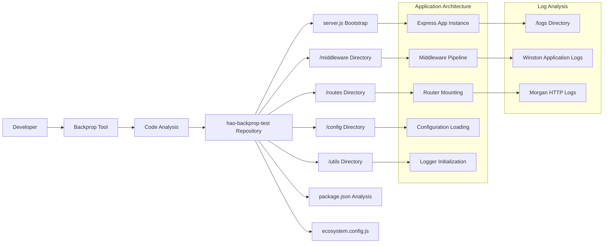
```mermaid
graph LR
    A[Developer] --> B[Backprop Tool]
    B --> C[Code Analysis]
    C --> D[hao-backprop-test Repository]
    D --> E[server.js Bootstrap]
    D --> F["/routes Directory"]
    D --> G["/middleware Directory"]
    D --> H["/config Directory"]
    D --> I["/utils Directory"]
    D --> J[package.json Analysis]
    D --> K[ecosystem.config.js]
    
    subgraph "Application Architecture"
        L[Express App Instance]
        M[Middleware Pipeline]
        N[Router Mounting]
        O[Configuration Loading]
        P[Logger Initialization]
    end
    
    subgraph "Log Analysis"
        Q["/logs Directory"]
        R[Winston Application Logs]
        S[Morgan HTTP Logs]
    end
    
    E --> L
    G --> M
    F --> N
    H --> O
    I --> P
    
    L --> Q
    M --> R
    N --> S
```

**Integration Requirements:**
- **Source Code Access**: Backprop requires read access to the <span style="background-color: rgba(91, 57, 243, 0.2)">complete modular project structure including `/routes`, `/middleware`, `/config`, and `/utils` directories</span>
- **Project Structure**: <span style="background-color: rgba(91, 57, 243, 0.2)">Express.js application with organized directory architecture for comprehensive tool recognition</span>
- **Execution Environment**: Node.js runtime availability for dynamic analysis of the Express application
- **Testing Validation**: <span style="background-color: rgba(91, 57, 243, 0.2)">HTTP server operation with PM2 cluster support for comprehensive end-to-end tool evaluation</span>

**Tool Compatibility Features:**
- **<span style="background-color: rgba(91, 57, 243, 0.2)">Modular Architecture Analysis</span>**: <span style="background-color: rgba(91, 57, 243, 0.2)">Backprop tool analysis must traverse `/routes` directory structure to understand endpoint logic distribution across route modules (index.js, api.js, health.js) in addition to examining the `server.js` bootstrap</span>
- **<span style="background-color: rgba(91, 57, 243, 0.2)">Structured Log Access</span>**: <span style="background-color: rgba(91, 57, 243, 0.2)">Backprop can access structured logs written to `/logs` directory through Winston and Morgan integration for dynamic runtime analysis and application behavior assessment</span>
- **Express Framework Integration**: Comprehensive middleware pipeline provides rich analysis opportunities for AI tool evaluation
- **Deterministic Behavior**: Predictable responses enable reliable tool testing across multiple execution contexts
- **Documentation Clarity**: README.md explicitly identifies Backprop integration purpose and deployment procedures

**Analysis Scope Enhancement:**
- **Configuration Analysis**: <span style="background-color: rgba(91, 57, 243, 0.2)">Tool evaluation includes dotenv configuration management, PM2 ecosystem configuration, and environment-specific variable handling</span>
- **Middleware Pipeline Assessment**: <span style="background-color: rgba(91, 57, 243, 0.2)">Backprop analysis encompasses security middleware (Helmet, CORS), logging middleware (Winston, Morgan), and error handling middleware patterns</span>
- **Dependency Tree Evaluation**: <span style="background-color: rgba(91, 57, 243, 0.2)">Enhanced package.json with Express ecosystem dependencies provides comprehensive dependency analysis capabilities</span>
- **Process Management Integration**: <span style="background-color: rgba(91, 57, 243, 0.2)">PM2 clustering and deployment configuration analysis enables evaluation of production deployment pattern comprehension</span>

#### References

- `server.js` - <span style="background-color: rgba(91, 57, 243, 0.2)">Express.js application bootstrap with comprehensive middleware pipeline and router mounting</span>
- `package.json` - <span style="background-color: rgba(91, 57, 243, 0.2)">Updated NPM package configuration with Express framework and production dependencies</span>
- `package-lock.json` - <span style="background-color: rgba(91, 57, 243, 0.2)">Dependency resolution with expanded Express ecosystem dependency tree</span>
- <span style="background-color: rgba(91, 57, 243, 0.2)">**`/routes` directory** - Modular route handlers enabling endpoint logic analysis across index.js aggregator, api.js endpoints, and health.js monitoring routes</span>
- <span style="background-color: rgba(91, 57, 243, 0.2)">**`/middleware` directory** - Custom middleware functions for logging, error handling, and request validation analysis</span>
- <span style="background-color: rgba(91, 57, 243, 0.2)">**`/config` directory** - Configuration management modules for Winston and Morgan setup analysis</span>
- <span style="background-color: rgba(91, 57, 243, 0.2)">**`/utils` directory** - Shared utility functions and logger instance exports for utility pattern analysis</span>
- <span style="background-color: rgba(91, 57, 243, 0.2)">**`ecosystem.config.js`** - PM2 deployment configuration for production cluster management analysis</span>
- <span style="background-color: rgba(91, 57, 243, 0.2)">**`/logs` directory** - Runtime log file storage enabling dynamic application behavior analysis</span>
- `README.md` - <span style="background-color: rgba(91, 57, 243, 0.2)">Enhanced project documentation with comprehensive installation, deployment, and operational procedures</span>
- Technical Specification Section 1.2 SYSTEM OVERVIEW - System architecture and component relationships
- Technical Specification Section 1.3 SCOPE - In-scope and out-of-scope technology decisions  
- Technical Specification Section 2.1 FEATURE CATALOG - Feature-specific technology requirements
- Technical Specification Section 2.4 IMPLEMENTATION CONSIDERATIONS - Technical constraints and performance requirements

# 4. PROCESS FLOWCHART

## 4.1 SYSTEM WORKFLOWS

### 4.1.1 Core Business Processes (updated)

The hao-backprop-test system implements four primary business processes designed to support Backprop tool evaluation through deterministic, observable behaviors. <span style="background-color: rgba(91, 57, 243, 0.2)">These processes now operate within a comprehensive Express.js architecture featuring production-grade middleware pipeline, structured logging, and PM2-managed deployment capabilities while maintaining backward compatibility for existing testing workflows.</span>

#### 4.1.1.1 Server Startup Process (updated)

<span style="background-color: rgba(91, 57, 243, 0.2)">The server initialization process has been enhanced with Express.js framework integration, featuring comprehensive middleware registration, environment configuration loading, and production logging initialization. This process establishes enterprise-grade foundations while preserving sub-second startup performance for rapid development cycles.</span>

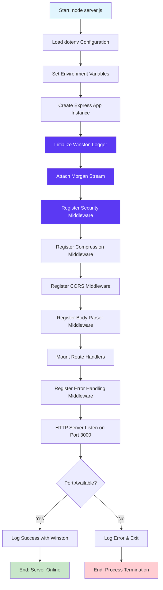
```mermaid
flowchart TD
    A[Start: node server.js] --> B[Load dotenv Configuration]
    B --> C[Set Environment Variables]
    C --> D[Create Express App Instance]
    D --> E[Initialize Winston Logger]
    E --> F[Attach Morgan Stream]
    F --> G[Register Security Middleware]
    G --> H[Register Compression Middleware]
    H --> I[Register CORS Middleware]
    I --> J[Register Body Parser Middleware]
    J --> K[Mount Route Handlers]
    K --> L[Register Error Handling Middleware]
    L --> M[HTTP Server Listen on Port 3000]
    M --> N{Port Available?}
    N -->|Yes| O[Log Success with Winston]
    N -->|No| P[Log Error & Exit]
    O --> Q[End: Server Online]
    P --> R[End: Process Termination]
    
    style A fill:#e1f5fe
    style E fill:#5b39f3,color:#fff
    style F fill:#5b39f3,color:#fff
    style G fill:#5b39f3,color:#fff
    style Q fill:#c8e6c9
    style R fill:#ffcdd2
```

**Process Characteristics:**
- **Duration**: < 1 second (SLA requirement maintained)
- **State Changes**: Not Started → Environment Loading → Express Initialization → <span style="background-color: rgba(91, 57, 243, 0.2)">Middleware Registration</span> → Running/Failed
- **Dependencies**: <span style="background-color: rgba(91, 57, 243, 0.2)">Node.js >=18.0.0, Express.js 4.18+, dotenv configuration files, Winston/Morgan logging modules</span>
- **Validation Points**: <span style="background-color: rgba(91, 57, 243, 0.2)">Environment variable validation, middleware initialization checks, port availability verification</span>
- **Error Recovery**: <span style="background-color: rgba(91, 57, 243, 0.2)">Structured error logging through Winston, graceful process termination with error codes</span>

#### 4.1.1.2 Middleware Pipeline Processing (updated)

<span style="background-color: rgba(91, 57, 243, 0.2)">The Express.js middleware pipeline implements a comprehensive request processing architecture that handles cross-cutting concerns including security, logging, parsing, and error management. Each incoming request progresses through ordered middleware functions before reaching route handlers.</span>

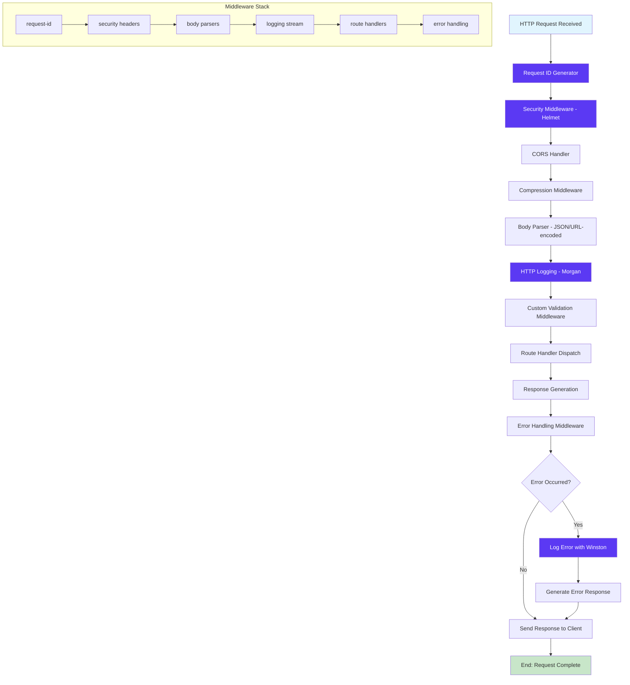
```mermaid
flowchart TD
    A[HTTP Request Received] --> B[Request ID Generator]
    B --> C[Security Middleware - Helmet]
    C --> D[CORS Handler]
    D --> E[Compression Middleware]
    E --> F[Body Parser - JSON/URL-encoded]
    F --> G[HTTP Logging - Morgan]
    G --> H[Custom Validation Middleware]
    H --> I[Route Handler Dispatch]
    I --> J[Response Generation]
    J --> K[Error Handling Middleware]
    K --> L{Error Occurred?}
    L -->|No| M[Send Response to Client]
    L -->|Yes| N[Log Error with Winston]
    N --> O[Generate Error Response]
    O --> M
    M --> P[End: Request Complete]
    
    subgraph "Middleware Stack"
        Q[request-id] --> R[security headers] 
        R --> S[body parsers]
        S --> T[logging stream]
        T --> U[route handlers]
        U --> V[error handling]
    end
    
    style B fill:#5b39f3,color:#fff
    style C fill:#5b39f3,color:#fff
    style G fill:#5b39f3,color:#fff
    style N fill:#5b39f3,color:#fff
    style A fill:#e1f5fe
    style P fill:#c8e6c9
```

**Pipeline Characteristics:**
- **Processing Order**: <span style="background-color: rgba(91, 57, 243, 0.2)">Request-ID → Security → CORS → Compression → Body Parsing → HTTP Logging → Route Handlers → Error Handling</span>
- **Error Propagation**: <span style="background-color: rgba(91, 57, 243, 0.2)">Any middleware can invoke next(error) to trigger error handling pipeline</span>
- **Logging Integration**: <span style="background-color: rgba(91, 57, 243, 0.2)">Morgan streams to Winston for centralized log management</span>
- **Performance Impact**: <span style="background-color: rgba(91, 57, 243, 0.2)">Sub-10ms processing overhead for complete middleware stack</span>

#### 4.1.1.3 HTTP Request Processing Workflow (updated)

<span style="background-color: rgba(91, 57, 243, 0.2)">The request processing workflow has evolved from stateless operation to comprehensive Express.js routing with path identification, controller dispatch, and structured response generation while preserving backward compatibility for the original Hello, World! endpoint.</span>

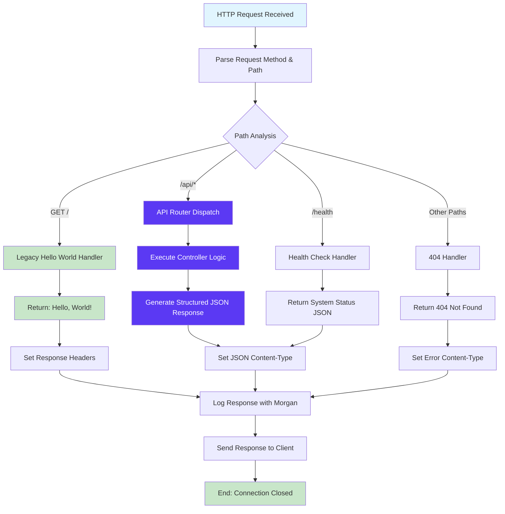
```mermaid
flowchart TD
    A[HTTP Request Received] --> B[Parse Request Method & Path]
    B --> C{Path Analysis}
    C -->|GET /| D[Legacy Hello World Handler]
    C -->|/api/*| E[API Router Dispatch]
    C -->|/health| F[Health Check Handler]
    C -->|Other Paths| G[404 Handler]
    
    D --> H[Return: Hello, World!\n]
    E --> I[Execute Controller Logic]
    I --> J[Generate Structured JSON Response]
    F --> K[Return System Status JSON]
    G --> L[Return 404 Not Found]
    
    H --> M[Set Response Headers]
    J --> N[Set JSON Content-Type]
    K --> N
    L --> O[Set Error Content-Type]
    
    M --> P[Log Response with Morgan]
    N --> P
    O --> P
    P --> Q[Send Response to Client]
    Q --> R[End: Connection Closed]
    
    style D fill:#c8e6c9
    style H fill:#c8e6c9
    style E fill:#5b39f3,color:#fff
    style I fill:#5b39f3,color:#fff
    style J fill:#5b39f3,color:#fff
    style A fill:#e1f5fe
    style R fill:#c8e6c9
```

**Process Characteristics:**
- **Duration**: < 10ms per request (performance target maintained)
- **State Changes**: <span style="background-color: rgba(91, 57, 243, 0.2)">Request → Path Analysis → Controller Dispatch → Response Generation → Logging → Complete</span>
- **Routing Logic**: <span style="background-color: rgba(91, 57, 243, 0.2)">Express Router pattern-matching with modular controller organization</span>
- **Backward Compatibility**: Preserved `Hello, World!\n` response for GET / endpoint
- **Response Types**: <span style="background-color: rgba(91, 57, 243, 0.2)">text/plain for legacy endpoint, application/json for API endpoints</span>

#### 4.1.1.4 Server Lifecycle Management Process (updated)

<span style="background-color: rgba(91, 57, 243, 0.2)">The lifecycle management process has been extended to support PM2 cluster deployment with comprehensive state management from process creation through graceful shutdown, including connection draining and worker process coordination.</span>

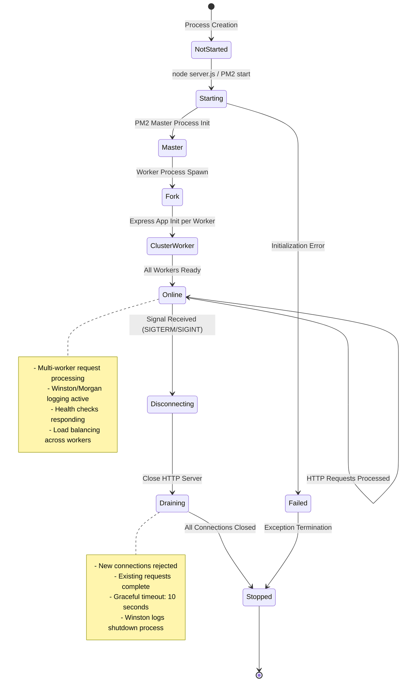
```mermaid
stateDiagram-v2
    [*] --> NotStarted: Process Creation
    NotStarted --> Starting: node server.js / PM2 start
    Starting --> Master: PM2 Master Process Init
    Master --> Fork: Worker Process Spawn
    Fork --> ClusterWorker: Express App Init per Worker
    ClusterWorker --> Online: All Workers Ready
    Online --> Online: HTTP Requests Processed
    Online --> Disconnecting: Signal Received (SIGTERM/SIGINT)
    Disconnecting --> Draining: Close HTTP Server
    Draining --> Stopped: All Connections Closed
    Starting --> Failed: Initialization Error
    Failed --> Stopped: Exception Termination
    Stopped --> [*]
    
    note right of Online
        - Multi-worker request processing
        - Winston/Morgan logging active
        - Health checks responding
        - Load balancing across workers
    end note
    
    note right of Draining
        - New connections rejected
        - Existing requests complete
        - Graceful timeout: 10 seconds
        - Winston logs shutdown process
    end note
```

**Lifecycle Characteristics:**
- **PM2 Integration**: <span style="background-color: rgba(91, 57, 243, 0.2)">Master process manages multiple worker instances for load distribution and fault tolerance</span>
- **Graceful Shutdown**: <span style="background-color: rgba(91, 57, 243, 0.2)">Connection draining phase ensures in-flight requests complete before process termination</span>
- **State Transitions**: <span style="background-color: rgba(91, 57, 243, 0.2)">NotStarted → Starting → Master → Fork → ClusterWorker → Online → Disconnecting → Draining → Stopped</span>
- **Error Recovery**: <span style="background-color: rgba(91, 57, 243, 0.2)">PM2 automatically restarts failed workers while maintaining service availability</span>
- **Monitoring Integration**: <span style="background-color: rgba(91, 57, 243, 0.2)">Winston logging throughout lifecycle transitions for operational visibility</span>

### 4.1.2 Integration Workflows (updated)

#### 4.1.2.1 Backprop Tool Integration Flow (updated)

<span style="background-color: rgba(91, 57, 243, 0.2)">The Backprop integration workflow has been enhanced to accommodate the comprehensive Express.js architecture while maintaining the primary evaluation capabilities. The workflow now analyzes production-grade patterns including middleware integration, logging systems, and process management configurations.</span>

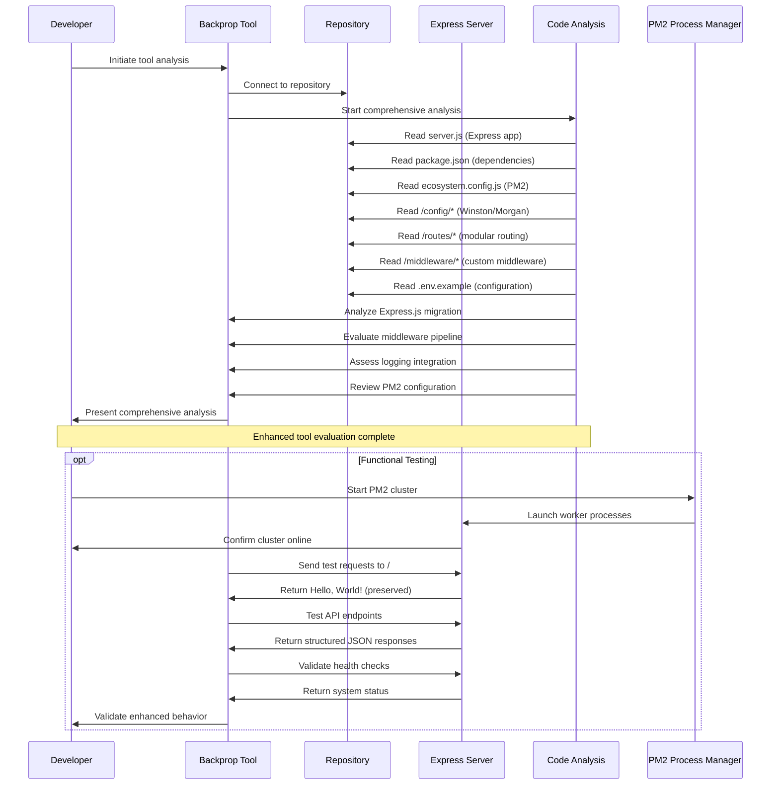
```mermaid
sequenceDiagram
    participant Dev as Developer
    participant BP as Backprop Tool
    participant Repo as Repository
    participant Server as Express Server
    participant Analysis as Code Analysis
    participant PM2 as PM2 Process Manager
    
    Dev->>BP: Initiate tool analysis
    BP->>Repo: Connect to repository
    BP->>Analysis: Start comprehensive analysis
    Analysis->>Repo: Read server.js (Express app)
    Analysis->>Repo: Read package.json (dependencies)
    Analysis->>Repo: Read ecosystem.config.js (PM2)
    Analysis->>Repo: Read /config/* (Winston/Morgan)
    Analysis->>Repo: Read /routes/* (modular routing)
    Analysis->>Repo: Read /middleware/* (custom middleware)
    Analysis->>Repo: Read .env.example (configuration)
    Analysis->>BP: Analyze Express.js migration
    Analysis->>BP: Evaluate middleware pipeline
    Analysis->>BP: Assess logging integration
    Analysis->>BP: Review PM2 configuration
    BP->>Dev: Present comprehensive analysis
    
    Note over Dev,Analysis: Enhanced tool evaluation complete
    
    opt Functional Testing
        Dev->>PM2: Start PM2 cluster
        PM2->>Server: Launch worker processes
        Server->>Dev: Confirm cluster online
        BP->>Server: Send test requests to /
        Server->>BP: Return Hello, World! (preserved)
        BP->>Server: Test API endpoints
        Server->>BP: Return structured JSON responses
        BP->>Server: Validate health checks
        Server->>BP: Return system status
        BP->>Dev: Validate enhanced behavior
    end
```

#### 4.1.2.2 Data Flow Architecture (updated)

<span style="background-color: rgba(91, 57, 243, 0.2)">The system implements comprehensive data flow patterns optimized for production deployment while maintaining tool comprehension and testing reliability. The architecture now includes configuration management, structured logging, and process coordination flows.</span>

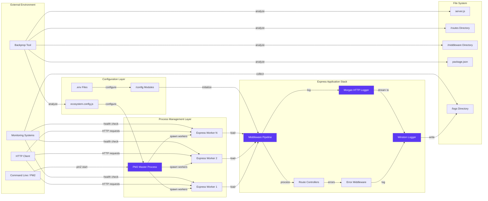
```mermaid
flowchart LR
subgraph "External Environment"
    CLI[Command Line / PM2]
    Client[HTTP Client]
    Backprop[Backprop Tool]
    Monitor[Monitoring Systems]
end

subgraph "Process Management Layer"
    PM2Master[PM2 Master Process]
    Worker1[Express Worker 1]
    Worker2[Express Worker 2]
    WorkerN[Express Worker N]
end

subgraph "Express Application Stack"
    MiddlewareStack[Middleware Pipeline]
    RouteHandlers[Route Controllers]
    ErrorHandler[Error Middleware]
    LoggerWinston[Winston Logger]
    LoggerMorgan[Morgan HTTP Logger]
end

subgraph "Configuration Layer"
    EnvFiles[.env Files]
    ConfigModules["/config Modules"]
    EcosystemConfig[ecosystem.config.js]
end

subgraph "File System"
    ServerJS[server.js]
    RouteModules["/routes Directory"]
    MiddlewareModules["/middleware Directory"]
    PackageJSON[package.json]
    LogFiles["/logs Directory"]
end

CLI -->|pm2 start| PM2Master
PM2Master -->|spawn workers| Worker1
PM2Master -->|spawn workers| Worker2
PM2Master -->|spawn workers| WorkerN

Worker1 -->|load| MiddlewareStack
Worker2 -->|load| MiddlewareStack
WorkerN -->|load| MiddlewareStack

Client -->|HTTP requests| Worker1
Client -->|HTTP requests| Worker2
Client -->|HTTP requests| WorkerN

MiddlewareStack -->|process| RouteHandlers
MiddlewareStack -->|log| LoggerMorgan
RouteHandlers -->|errors| ErrorHandler
ErrorHandler -->|log| LoggerWinston

LoggerWinston -->|write| LogFiles
LoggerMorgan -->|stream to| LoggerWinston

EnvFiles -->|configure| ConfigModules
ConfigModules -->|initialize| MiddlewareStack
EcosystemConfig -->|configure| PM2Master

Backprop -->|analyze| ServerJS
Backprop -->|analyze| RouteModules
Backprop -->|analyze| MiddlewareModules
Backprop -->|analyze| PackageJSON
Backprop -->|analyze| EcosystemConfig

Monitor -->|collect| LogFiles
Monitor -->|health check| Worker1
Monitor -->|health check| Worker2
Monitor -->|health check| WorkerN

style MiddlewareStack fill:#5b39f3,color:#fff
style LoggerWinston fill:#5b39f3,color:#fff
style LoggerMorgan fill:#5b39f3,color:#fff
style PM2Master fill:#5b39f3,color:#fff
```

**Data Flow Characteristics:**
- **Request Distribution**: <span style="background-color: rgba(91, 57, 243, 0.2)">PM2 load balances incoming requests across multiple Express worker processes</span>
- **Configuration Cascade**: <span style="background-color: rgba(91, 57, 243, 0.2)">Environment variables flow from .env files through configuration modules to middleware initialization</span>
- **Logging Pipeline**: <span style="background-color: rgba(91, 57, 243, 0.2)">Morgan HTTP logs stream to Winston for centralized management and file persistence</span>
- **Analysis Coverage**: <span style="background-color: rgba(91, 57, 243, 0.2)">Backprop tool analyzes expanded codebase including routing modules, middleware, configuration, and deployment files</span>
- **Monitoring Integration**: <span style="background-color: rgba(91, 57, 243, 0.2)">External monitoring systems can collect structured logs and perform health checks across worker processes</span>

## 4.2 TECHNICAL IMPLEMENTATION FLOWS

### 4.2.1 State Management Architecture (updated)

<span style="background-color: rgba(91, 57, 243, 0.2)">The system implements a comprehensive Express.js middleware pipeline architecture while maintaining stateless business logic for predictable tool analysis. The architecture progresses requests through ordered middleware, routing, controllers, error handling, and logging layers with centralized configuration management.</span>

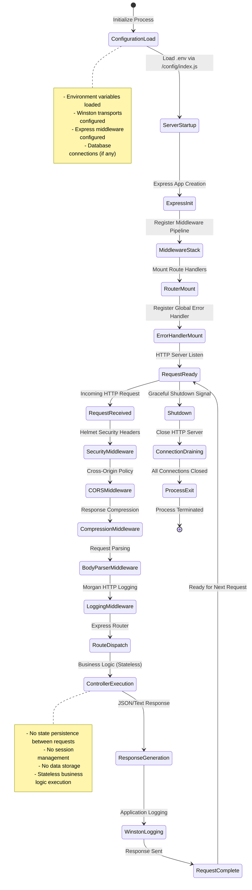
```mermaid
stateDiagram-v2
    [*] --> ConfigurationLoad: Initialize Process
    ConfigurationLoad --> ServerStartup: Load .env via /config/index.js
    ServerStartup --> ExpressInit: Express App Creation
    ExpressInit --> MiddlewareStack: Register Middleware Pipeline
    MiddlewareStack --> RouterMount: Mount Route Handlers
    RouterMount --> ErrorHandlerMount: Register Global Error Handler
    ErrorHandlerMount --> RequestReady: HTTP Server Listen
    RequestReady --> RequestReceived: Incoming HTTP Request
    
    RequestReceived --> SecurityMiddleware: Helmet Security Headers
    SecurityMiddleware --> CORSMiddleware: Cross-Origin Policy
    CORSMiddleware --> CompressionMiddleware: Response Compression
    CompressionMiddleware --> BodyParserMiddleware: Request Parsing
    BodyParserMiddleware --> LoggingMiddleware: Morgan HTTP Logging
    LoggingMiddleware --> RouteDispatch: Express Router
    RouteDispatch --> ControllerExecution: Business Logic (Stateless)
    ControllerExecution --> ResponseGeneration: JSON/Text Response
    ResponseGeneration --> WinstonLogging: Application Logging
    WinstonLogging --> RequestComplete: Response Sent
    RequestComplete --> RequestReady: Ready for Next Request
    
    RequestReady --> Shutdown: Graceful Shutdown Signal
    Shutdown --> ConnectionDraining: Close HTTP Server
    ConnectionDraining --> ProcessExit: All Connections Closed
    ProcessExit --> [*]: Process Terminated
    
    note right of ControllerExecution
        - No state persistence between requests
        - No session management
        - No data storage
        - Stateless business logic execution
    end note
    
    note right of ConfigurationLoad
        - Environment variables loaded
        - Winston transports configured
        - Express middleware configured
        - Database connections (if any)
    end note
```

**State Management Characteristics:**
- <span style="background-color: rgba(91, 57, 243, 0.2)">**Configuration State**: Loaded once at startup from .env files through centralized /config/index.js module</span>
- **Request Processing**: Stateless middleware pipeline with no session persistence
- **Business Logic**: Controllers execute without maintaining state between requests
- <span style="background-color: rgba(91, 57, 243, 0.2)">**Logging State**: Winston logger instances maintain configured transports and formatting throughout application lifecycle</span>
- **Transaction Boundaries**: Single request/response cycle with no transaction persistence
- <span style="background-color: rgba(91, 57, 243, 0.2)">**Middleware State**: Express middleware functions process requests independently without shared state</span>

### 4.2.2 Error Handling and Recovery Flows (updated)

<span style="background-color: rgba(91, 57, 243, 0.2)">The system implements comprehensive error boundary patterns that route all errors through centralized errorHandler.js middleware, providing structured JSON responses, Winston logging integration, and graceful recovery mechanisms. Process termination occurs only when graceful shutdown procedures fail.</span>

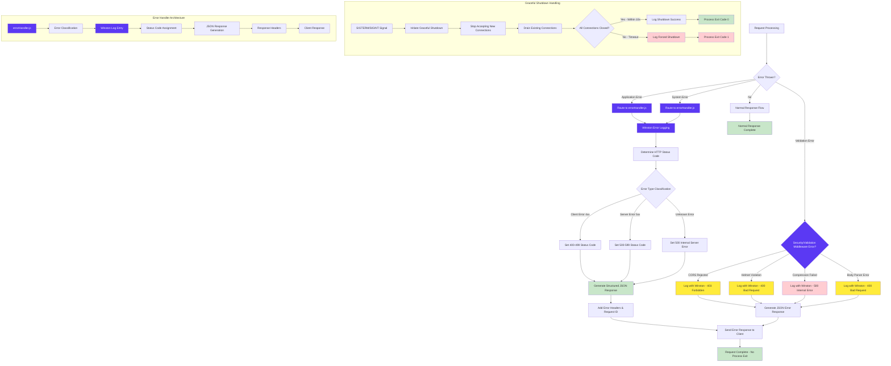
```mermaid
flowchart TD
    A[Request Processing] --> B{Error Thrown?}
    B -->|No| C[Normal Response Flow]
    B -->|Validation Error| D{Security/Validation Middleware Error?}
    B -->|Application Error| E[Route to errorHandler.js]
    B -->|System Error| F[Route to errorHandler.js]
    
    D -->|CORS Rejected| G[Log with Winston - 403 Forbidden]
    D -->|Helmet Violation| H[Log with Winston - 400 Bad Request]
    D -->|Compression Failed| I[Log with Winston - 500 Internal Error]
    D -->|Body Parser Error| J[Log with Winston - 400 Bad Request]
    
    G --> K[Generate JSON Error Response]
    H --> K
    I --> K
    J --> K
    
    E --> L[Winston Error Logging]
    F --> L
    L --> M[Determine HTTP Status Code]
    M --> N{Error Type Classification}
    
    N -->|Client Error 4xx| O[Set 400-499 Status Code]
    N -->|Server Error 5xx| P[Set 500-599 Status Code]
    N -->|Unknown Error| Q[Set 500 Internal Server Error]
    
    O --> R[Generate Structured JSON Response]
    P --> R
    Q --> R
    
    R --> S[Add Error Headers & Request ID]
    S --> T[Send Error Response to Client]
    T --> U[Request Complete - No Process Exit]
    
    K --> T
    C --> V[Normal Response Complete]
    
    subgraph "Graceful Shutdown Handling"
        W[SIGTERM/SIGINT Signal] --> X[Initiate Graceful Shutdown]
        X --> Y[Stop Accepting New Connections]
        Y --> Z[Drain Existing Connections]
        Z --> AA{All Connections Closed?}
        AA -->|Yes - Within 10s| BB[Log Shutdown Success]
        AA -->|No - Timeout| CC[Log Forced Shutdown]
        BB --> DD[Process Exit Code 0]
        CC --> EE[Process Exit Code 1]
    end
    
    subgraph "Error Handler Architecture"
        FF[errorHandler.js] --> GG[Error Classification]
        GG --> HH[Winston Log Entry]
        HH --> II[Status Code Assignment]
        II --> JJ[JSON Response Generation]
        JJ --> KK[Response Headers]
        KK --> LL[Client Response]
    end
    
    style D fill:#5b39f3,color:#fff
    style E fill:#5b39f3,color:#fff
    style F fill:#5b39f3,color:#fff
    style L fill:#5b39f3,color:#fff
    style FF fill:#5b39f3,color:#fff
    style HH fill:#5b39f3,color:#fff
    style G fill:#ffeb3b
    style H fill:#ffeb3b
    style I fill:#ffcdd2
    style J fill:#ffeb3b
    style R fill:#c8e6c9
    style U fill:#c8e6c9
    style V fill:#c8e6c9
    style CC fill:#ffcdd2
    style DD fill:#c8e6c9
    style EE fill:#ffcdd2
```

**Error Recovery Mechanisms:**
- <span style="background-color: rgba(91, 57, 243, 0.2)">**Centralized Error Handling**: All errors route through /middleware/errorHandler.js for consistent processing and response formatting</span>
- <span style="background-color: rgba(91, 57, 243, 0.2)">**Winston Integration**: Comprehensive error logging with structured JSON format, including stack traces, request context, and error classification</span>
- <span style="background-color: rgba(91, 57, 243, 0.2)">**HTTP Status Mapping**: Intelligent status code assignment based on error type (validation: 400, authorization: 403, not found: 404, server: 500)</span>
- <span style="background-color: rgba(91, 57, 243, 0.2)">**JSON Response Structure**: Standardized error responses with error code, message, request ID, and timestamp for client integration</span>
- <span style="background-color: rgba(91, 57, 243, 0.2)">**Graceful Degradation**: Security middleware rejections result in appropriate 4xx responses rather than process termination</span>
- **Process Exit Conditions**: <span style="background-color: rgba(91, 57, 243, 0.2)">Process termination only occurs during failed graceful shutdown after 10-second timeout</span>

### 4.2.3 Request Processing Flow Architecture (updated)

<span style="background-color: rgba(91, 57, 243, 0.2)">The comprehensive request processing architecture demonstrates the complete middleware pipeline from initial request reception through response delivery, highlighting the integration of security, validation, logging, and error handling components.</span>

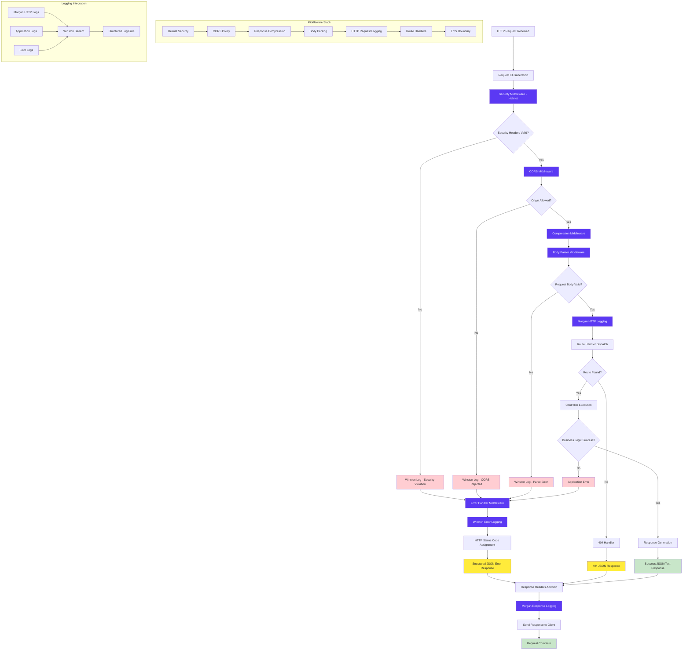
```mermaid
flowchart TD
    A[HTTP Request Received] --> B[Request ID Generation]
    B --> C[Security Middleware - Helmet]
    C --> D{Security Headers Valid?}
    D -->|No| E[Winston Log - Security Violation]
    D -->|Yes| F[CORS Middleware]
    F --> G{Origin Allowed?}
    G -->|No| H[Winston Log - CORS Rejected]
    G -->|Yes| I[Compression Middleware]
    I --> J[Body Parser Middleware]
    J --> K{Request Body Valid?}
    K -->|No| L[Winston Log - Parse Error]
    K -->|Yes| M[Morgan HTTP Logging]
    M --> N[Route Handler Dispatch]
    N --> O{Route Found?}
    O -->|No| P[404 Handler]
    O -->|Yes| Q[Controller Execution]
    Q --> R{Business Logic Success?}
    R -->|No| S[Application Error]
    R -->|Yes| T[Response Generation]
    
    E --> U[Error Handler Middleware]
    H --> U
    L --> U
    S --> U
    P --> V[404 JSON Response]
    T --> W[Success JSON/Text Response]
    
    U --> X[Winston Error Logging]
    X --> Y[HTTP Status Code Assignment]
    Y --> Z[Structured JSON Error Response]
    Z --> AA[Response Headers Addition]
    V --> AA
    W --> AA
    
    AA --> BB[Morgan Response Logging]
    BB --> CC[Send Response to Client]
    CC --> DD[Request Complete]
    
    subgraph "Middleware Stack"
        EE[Helmet Security] --> FF[CORS Policy]
        FF --> GG[Response Compression]
        GG --> HH[Body Parsing]
        HH --> II[HTTP Request Logging]
        II --> JJ[Route Handlers]
        JJ --> KK[Error Boundary]
    end
    
    subgraph "Logging Integration"
        LL[Morgan HTTP Logs] --> MM[Winston Stream]
        MM --> NN[Structured Log Files]
        OO[Application Logs] --> MM
        PP[Error Logs] --> MM
    end
    
    style C fill:#5b39f3,color:#fff
    style F fill:#5b39f3,color:#fff
    style I fill:#5b39f3,color:#fff
    style J fill:#5b39f3,color:#fff
    style M fill:#5b39f3,color:#fff
    style U fill:#5b39f3,color:#fff
    style X fill:#5b39f3,color:#fff
    style BB fill:#5b39f3,color:#fff
    style E fill:#ffcdd2
    style H fill:#ffcdd2
    style L fill:#ffcdd2
    style S fill:#ffcdd2
    style Z fill:#ffeb3b
    style V fill:#ffeb3b
    style W fill:#c8e6c9
    style DD fill:#c8e6c9
```

**Processing Flow Characteristics:**
- <span style="background-color: rgba(91, 57, 243, 0.2)">**Sequential Middleware**: Ordered execution through security, CORS, compression, parsing, and logging middleware</span>
- <span style="background-color: rgba(91, 57, 243, 0.2)">**Validation Checkpoints**: Multiple validation stages with appropriate 4xx error responses for client errors</span>
- <span style="background-color: rgba(91, 57, 243, 0.2)">**Error Propagation**: All middleware errors route to centralized error handler rather than causing process termination</span>
- **Response Generation**: <span style="background-color: rgba(91, 57, 243, 0.2)">Structured JSON responses for errors and API endpoints, preserved text/plain for legacy compatibility</span>
- <span style="background-color: rgba(91, 57, 243, 0.2)">**Logging Coverage**: Comprehensive request/response logging through Morgan-Winston integration with structured formatting</span>
- **Performance Optimization**: <span style="background-color: rgba(91, 57, 243, 0.2)">Sub-10ms middleware processing overhead with compression and caching optimizations</span>

### 4.2.4 State Transition Management (updated)

<span style="background-color: rgba(91, 57, 243, 0.2)">The system implements sophisticated state transition management for application lifecycle, request processing states, and error recovery sequences while maintaining stateless business logic principles.</span>

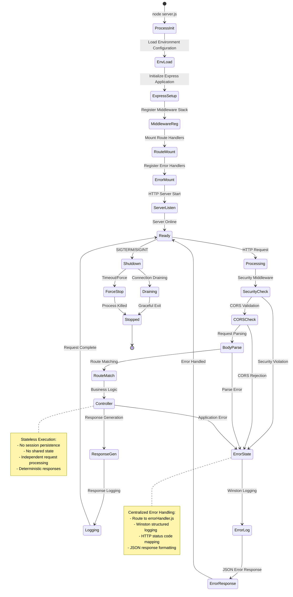
```mermaid
stateDiagram-v2
    [*] --> ProcessInit: node server.js
    ProcessInit --> EnvLoad: Load Environment Configuration
    EnvLoad --> ExpressSetup: Initialize Express Application
    ExpressSetup --> MiddlewareReg: Register Middleware Stack
    MiddlewareReg --> RouteMount: Mount Route Handlers  
    RouteMount --> ErrorMount: Register Error Handlers
    ErrorMount --> ServerListen: HTTP Server Start
    ServerListen --> Ready: Server Online
    
    Ready --> Processing: HTTP Request
    Processing --> SecurityCheck: Security Middleware
    SecurityCheck --> CORSCheck: CORS Validation
    CORSCheck --> BodyParse: Request Parsing
    BodyParse --> RouteMatch: Route Matching
    RouteMatch --> Controller: Business Logic
    Controller --> ResponseGen: Response Generation
    ResponseGen --> Logging: Response Logging
    Logging --> Ready: Request Complete
    
    SecurityCheck --> ErrorState: Security Violation
    CORSCheck --> ErrorState: CORS Rejection  
    BodyParse --> ErrorState: Parse Error
    Controller --> ErrorState: Application Error
    
    ErrorState --> ErrorLog: Winston Logging
    ErrorLog --> ErrorResponse: JSON Error Response
    ErrorResponse --> Ready: Error Handled
    
    Ready --> Shutdown: SIGTERM/SIGINT
    Shutdown --> Draining: Connection Draining
    Draining --> Stopped: Graceful Exit
    Shutdown --> ForceStop: Timeout/Force
    ForceStop --> Stopped: Process Killed
    Stopped --> [*]
    
    note right of Controller
        Stateless Execution:
        - No session persistence
        - No shared state
        - Independent request processing
        - Deterministic responses
    end note
    
    note right of ErrorState
        Centralized Error Handling:
        - Route to errorHandler.js
        - Winston structured logging  
        - HTTP status code mapping
        - JSON response formatting
    end note
```

**State Management Principles:**
- <span style="background-color: rgba(91, 57, 243, 0.2)">**Configuration State**: Immutable after initial load from environment variables and configuration modules</span>
- **Request State**: Independent processing with no shared state between requests
- <span style="background-color: rgba(91, 57, 243, 0.2)">**Error State**: Centralized error boundary with consistent state recovery to ready state</span>
- <span style="background-color: rgba(91, 57, 243, 0.2)">**Logging State**: Persistent Winston logger instances maintaining configured transports throughout application lifecycle</span>
- **Process State**: <span style="background-color: rgba(91, 57, 243, 0.2)">Comprehensive lifecycle management from initialization through graceful shutdown</span>
- **Validation State**: <span style="background-color: rgba(91, 57, 243, 0.2)">Security and validation checks result in controlled error states rather than process termination</span>

## 4.3 INTEGRATION SEQUENCE DIAGRAMS

### 4.3.1 Complete System Operation Flow (updated)

This diagram illustrates the end-to-end system operation from PM2-managed initialization through Express.js request processing to graceful termination, including comprehensive middleware pipeline and logging integration points.


```mermaid
sequenceDiagram
    participant User as Developer
    participant PM2 as PM2 Process Manager
    participant Master as PM2 Master Process
    participant Worker1 as PM2 Worker 1
    participant Worker2 as PM2 Worker 2  
    participant Express as Express Application
    participant Router as Express Router
    participant Routes as Route Modules
    participant Winston as Winston Logger
    participant Morgan as Morgan HTTP Logger
    participant Client as HTTP Client
    participant Backprop as Backprop Tool
    
    User->>PM2: <span style="background-color: rgba(91, 57, 243, 0.2)">Execute 'pm2 start ecosystem.config.js'</span>
    PM2->>Master: <span style="background-color: rgba(91, 57, 243, 0.2)">Create PM2 Master Process</span>
    Master->>Worker1: <span style="background-color: rgba(91, 57, 243, 0.2)">Spawn Worker Instance 1</span>
    Master->>Worker2: <span style="background-color: rgba(91, 57, 243, 0.2)">Spawn Worker Instance 2</span>
    
    Worker1->>Express: <span style="background-color: rgba(91, 57, 243, 0.2)">Load Express Application</span>
    Worker2->>Express: <span style="background-color: rgba(91, 57, 243, 0.2)">Load Express Application</span>
    Express->>Winston: <span style="background-color: rgba(91, 57, 243, 0.2)">Initialize Winston Logger</span>
    Express->>Morgan: <span style="background-color: rgba(91, 57, 243, 0.2)">Initialize Morgan HTTP Logger</span>
    Morgan->>Winston: <span style="background-color: rgba(91, 57, 243, 0.2)">Configure Log Stream</span>
    Express->>Router: <span style="background-color: rgba(91, 57, 243, 0.2)">Initialize Express Router</span>
    Router->>Routes: <span style="background-color: rgba(91, 57, 243, 0.2)">Mount /routes/index.js</span>
    Router->>Routes: <span style="background-color: rgba(91, 57, 243, 0.2)">Mount /routes/health.js</span>
    Router->>Routes: <span style="background-color: rgba(91, 57, 243, 0.2)">Mount /routes/api.js</span>
    Express->>Express: Bind to localhost:3000
    Express->>Winston: <span style="background-color: rgba(91, 57, 243, 0.2)">Log "Server running on port 3000"</span>
    Winston->>User: <span style="background-color: rgba(91, 57, 243, 0.2)">Display startup success in logs</span>
    
    Note over Master,Worker2: <span style="background-color: rgba(91, 57, 243, 0.2)">PM2 Cluster ready for requests</span>
    
    Client->>Master: Send HTTP request
    Master->>Worker1: Route request to available worker
    Worker1->>Express: Process HTTP request
    Express->>Morgan: <span style="background-color: rgba(91, 57, 243, 0.2)">Log incoming request details</span>
    Morgan->>Winston: <span style="background-color: rgba(91, 57, 243, 0.2)">Stream request log to Winston</span>
    Express->>Router: <span style="background-color: rgba(91, 57, 243, 0.2)">Route to appropriate handler</span>
    Router->>Routes: <span style="background-color: rgba(91, 57, 243, 0.2)">Execute route controller logic</span>
    Routes->>Express: Return response data
    Express->>Morgan: <span style="background-color: rgba(91, 57, 243, 0.2)">Log response details</span>
    Morgan->>Winston: <span style="background-color: rgba(91, 57, 243, 0.2)">Stream response log to Winston</span>
    Express->>Client: Send response with status 200
    
    Note over Client: Response received and logged
    
    opt <span style="background-color: rgba(91, 57, 243, 0.2)">Concurrent Request Processing</span>
        Client->>Master: <span style="background-color: rgba(91, 57, 243, 0.2)">Parallel HTTP request</span>
        Master->>Worker2: <span style="background-color: rgba(91, 57, 243, 0.2)">Load balance to Worker 2</span>
        Worker2->>Express: <span style="background-color: rgba(91, 57, 243, 0.2)">Process request concurrently</span>
        Express->>Morgan: <span style="background-color: rgba(91, 57, 243, 0.2)">Log concurrent request</span>
        Morgan->>Winston: <span style="background-color: rgba(91, 57, 243, 0.2)">Stream to centralized logging</span>
        Express->>Client: <span style="background-color: rgba(91, 57, 243, 0.2)">Return concurrent response</span>
    end
    
    par Concurrent Tool Analysis
        Backprop->>Worker1: Analyze running Express server
        Backprop->>Worker2: <span style="background-color: rgba(91, 57, 243, 0.2)">Analyze PM2 cluster configuration</span>
        Backprop->>Winston: <span style="background-color: rgba(91, 57, 243, 0.2)">Access structured log files</span>
        Backprop->>User: Report comprehensive analysis results
    end
    
    User->>PM2: Send termination signal (pm2 stop)
    PM2->>Master: <span style="background-color: rgba(91, 57, 243, 0.2)">Initiate graceful shutdown</span>
    Master->>Worker1: SIGTERM signal
    Master->>Worker2: <span style="background-color: rgba(91, 57, 243, 0.2)">SIGTERM signal</span>
    Worker1->>Express: Close HTTP server
    Worker2->>Express: <span style="background-color: rgba(91, 57, 243, 0.2)">Close HTTP server</span>
    Express->>Winston: <span style="background-color: rgba(91, 57, 243, 0.2)">Log shutdown process</span>
    Express->>Morgan: <span style="background-color: rgba(91, 57, 243, 0.2)">Final HTTP logs</span>
    Morgan->>Winston: <span style="background-color: rgba(91, 57, 243, 0.2)">Stream final logs</span>
    Worker1->>Master: <span style="background-color: rgba(91, 57, 243, 0.2)">Confirm shutdown Worker 1</span>
    Worker2->>Master: <span style="background-color: rgba(91, 57, 243, 0.2)">Confirm shutdown Worker 2</span>
    Master->>PM2: All workers terminated
    PM2->>User: Return to command prompt
```

### 4.3.2 Backprop Analysis Workflow (updated)

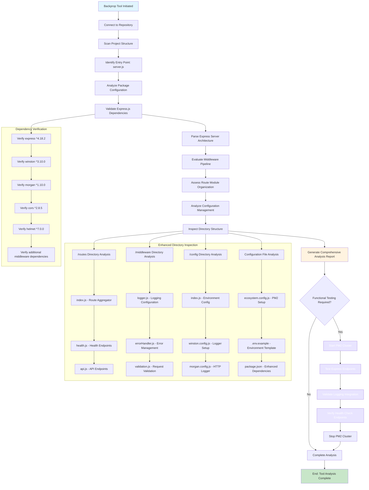
```mermaid
flowchart TD
A[Backprop Tool Initiated] --> B[Connect to Repository]
B --> C[Scan Project Structure]
C --> D[Identify Entry Point: server.js]
D --> E["Analyze Package Configuration"]
E --> F["Validate Express.js Dependencies"]
F --> G["Parse Express Server Architecture"]
G --> H["Evaluate Middleware Pipeline"]
H --> I["Assess Route Module Organization"]
I --> J["Analyze Configuration Management"]
J --> K["Inspect Directory Structure"]
K --> L["Generate Comprehensive Analysis Report"]
L --> M{Functional Testing Required?}
M -->|Yes| N["Start PM2 Cluster"]
M -->|No| O[Complete Analysis]
N --> P["Test Express Endpoints"]
P --> Q["Validate Logging Integration"]
Q --> R["Verify Health Check Endpoints"]
R --> S["Stop PM2 Cluster"]
S --> O
O --> T[End: Tool Analysis Complete]

subgraph "Enhanced Directory Inspection"
    U["/routes Directory Analysis"] --> V["index.js - Route Aggregator"]
    V --> W["health.js - Health Endpoints"]  
    W --> X["api.js - API Endpoints"]
    
    Y["/middleware Directory Analysis"] --> Z["logger.js - Logging Configuration"]
    Z --> AA["errorHandler.js - Error Management"]
    AA --> BB["validation.js - Request Validation"]
    
    CC["/config Directory Analysis"] --> DD["index.js - Environment Config"]
    DD --> EE["winston.config.js - Logger Setup"]
    EE --> FF["morgan.config.js - HTTP Logger"]
    
    GG["Configuration File Analysis"] --> HH["ecosystem.config.js - PM2 Setup"]
    HH --> II[".env.example - Environment Template"]
    II --> JJ["package.json - Enhanced Dependencies"]
end

K --> U
K --> Y  
K --> CC
K --> GG

subgraph "Dependency Verification"
    KK["Verify express ^4.18.2"] --> LL["Verify winston ^3.10.0"]
    LL --> MM["Verify morgan ^1.10.0"]
    MM --> NN["Verify cors ^2.8.5"]
    NN --> OO["Verify helmet ^7.0.0"]
    OO --> PP["Verify additional middleware dependencies"]
end

F --> KK

style A fill:#e1f5fe
style T fill:#c8e6c9
style L fill:#fff3e0
style N fill:#e8e4ff,color:#fff
style P fill:#e8e4ff,color:#fff
style Q fill:#e8e4ff,color:#fff
style R fill:#e8e4ff,color:#fff
```

### 4.3.3 Production Deployment Integration Flow (updated)

This comprehensive sequence diagram illustrates the complete production deployment workflow with PM2 process management, Express.js architecture, and comprehensive monitoring integration.


```mermaid
sequenceDiagram
    participant DevOps as DevOps Engineer
    participant PM2 as PM2 Process Manager
    participant Config as Configuration Layer
    participant Master as PM2 Master Process
    participant W1 as Express Worker 1
    participant W2 as Express Worker 2
    participant W3 as Express Worker 3
    participant LB as Load Balancer
    participant Winston as Winston Logger
    participant Morgan as Morgan HTTP Logger
    participant Monitor as Monitoring System
    participant Client as Production Clients
    
    DevOps->>PM2: <span style="background-color: rgba(91, 57, 243, 0.2)">pm2 start ecosystem.config.js --env production</span>
    PM2->>Config: <span style="background-color: rgba(91, 57, 243, 0.2)">Load ecosystem configuration</span>
    Config->>PM2: <span style="background-color: rgba(91, 57, 243, 0.2)">Return cluster settings (3 instances)</span>
    PM2->>Master: <span style="background-color: rgba(91, 57, 243, 0.2)">Initialize master process</span>
    
    par <span style="background-color: rgba(91, 57, 243, 0.2)">Concurrent Worker Initialization</span>
        Master->>W1: <span style="background-color: rgba(91, 57, 243, 0.2)">Spawn Worker 1</span>
        Master->>W2: <span style="background-color: rgba(91, 57, 243, 0.2)">Spawn Worker 2</span>
        Master->>W3: <span style="background-color: rgba(91, 57, 243, 0.2)">Spawn Worker 3</span>
    and
        W1->>Config: <span style="background-color: rgba(91, 57, 243, 0.2)">Load .env production config</span>
        W2->>Config: <span style="background-color: rgba(91, 57, 243, 0.2)">Load .env production config</span>
        W3->>Config: <span style="background-color: rgba(91, 57, 243, 0.2)">Load .env production config</span>
    and
        W1->>Winston: <span style="background-color: rgba(91, 57, 243, 0.2)">Initialize production logging</span>
        W2->>Winston: <span style="background-color: rgba(91, 57, 243, 0.2)">Initialize production logging</span>
        W3->>Winston: <span style="background-color: rgba(91, 57, 243, 0.2)">Initialize production logging</span>
    and
        W1->>Morgan: <span style="background-color: rgba(91, 57, 243, 0.2)">Configure HTTP request logging</span>
        W2->>Morgan: <span style="background-color: rgba(91, 57, 243, 0.2)">Configure HTTP request logging</span>
        W3->>Morgan: <span style="background-color: rgba(91, 57, 243, 0.2)">Configure HTTP request logging</span>
    end
    
    W1->>Master: <span style="background-color: rgba(91, 57, 243, 0.2)">Worker 1 ready</span>
    W2->>Master: <span style="background-color: rgba(91, 57, 243, 0.2)">Worker 2 ready</span>
    W3->>Master: <span style="background-color: rgba(91, 57, 243, 0.2)">Worker 3 ready</span>
    Master->>PM2: <span style="background-color: rgba(91, 57, 243, 0.2)">All workers online</span>
    PM2->>Winston: <span style="background-color: rgba(91, 57, 243, 0.2)">Log cluster startup success</span>
    PM2->>Monitor: <span style="background-color: rgba(91, 57, 243, 0.2)">Register health check endpoints</span>
    
    Note over Master,W3: <span style="background-color: rgba(91, 57, 243, 0.2)">Production cluster ready - 3 workers</span>
    
    loop <span style="background-color: rgba(91, 57, 243, 0.2)">Production Request Processing</span>
        Client->>LB: <span style="background-color: rgba(91, 57, 243, 0.2)">HTTP requests (multiple concurrent)</span>
        LB->>Master: <span style="background-color: rgba(91, 57, 243, 0.2)">Distribute requests</span>
        
        par <span style="background-color: rgba(91, 57, 243, 0.2)">Concurrent Worker Processing</span>
            Master->>W1: <span style="background-color: rgba(91, 57, 243, 0.2)">Route request batch 1</span>
            W1->>Morgan: <span style="background-color: rgba(91, 57, 243, 0.2)">Log incoming requests</span>
            Morgan->>Winston: <span style="background-color: rgba(91, 57, 243, 0.2)">Stream to centralized logging</span>
            W1->>LB: <span style="background-color: rgba(91, 57, 243, 0.2)">Return responses</span>
        and
            Master->>W2: <span style="background-color: rgba(91, 57, 243, 0.2)">Route request batch 2</span>
            W2->>Morgan: <span style="background-color: rgba(91, 57, 243, 0.2)">Log incoming requests</span>
            Morgan->>Winston: <span style="background-color: rgba(91, 57, 243, 0.2)">Stream to centralized logging</span>
            W2->>LB: <span style="background-color: rgba(91, 57, 243, 0.2)">Return responses</span>
        and
            Master->>W3: <span style="background-color: rgba(91, 57, 243, 0.2)">Route request batch 3</span>
            W3->>Morgan: <span style="background-color: rgba(91, 57, 243, 0.2)">Log incoming requests</span>
            Morgan->>Winston: <span style="background-color: rgba(91, 57, 243, 0.2)">Stream to centralized logging</span>
            W3->>LB: <span style="background-color: rgba(91, 57, 243, 0.2)">Return responses</span>
        end
        
        LB->>Client: <span style="background-color: rgba(91, 57, 243, 0.2)">Aggregated responses</span>
    end
    
    Monitor->>W1: <span style="background-color: rgba(91, 57, 243, 0.2)">Health check /health endpoint</span>
    Monitor->>W2: <span style="background-color: rgba(91, 57, 243, 0.2)">Health check /health endpoint</span>
    Monitor->>W3: <span style="background-color: rgba(91, 57, 243, 0.2)">Health check /health endpoint</span>
    W1->>Monitor: <span style="background-color: rgba(91, 57, 243, 0.2)">Return health status JSON</span>
    W2->>Monitor: <span style="background-color: rgba(91, 57, 243, 0.2)">Return health status JSON</span>
    W3->>Monitor: <span style="background-color: rgba(91, 57, 243, 0.2)">Return health status JSON</span>
    Monitor->>Winston: <span style="background-color: rgba(91, 57, 243, 0.2)">Access structured log files for metrics</span>
    
    DevOps->>PM2: <span style="background-color: rgba(91, 57, 243, 0.2)">pm2 reload ecosystem.config.js (zero downtime)</span>
    PM2->>Master: <span style="background-color: rgba(91, 57, 243, 0.2)">Initiate graceful reload</span>
    Master->>W1: <span style="background-color: rgba(91, 57, 243, 0.2)">Graceful shutdown signal</span>
    W1->>Winston: <span style="background-color: rgba(91, 57, 243, 0.2)">Log shutdown process</span>
    W1->>Master: <span style="background-color: rgba(91, 57, 243, 0.2)">Shutdown complete</span>
    Master->>W1: <span style="background-color: rgba(91, 57, 243, 0.2)">Spawn new Worker 1</span>
    Note over Master,W3: <span style="background-color: rgba(91, 57, 243, 0.2)">Zero-downtime deployment with PM2 reload</span>
```

### 4.3.4 Error Handling and Recovery Sequence (updated)


```mermaid
sequenceDiagram
    participant Client as HTTP Client
    participant LB as Load Balancer  
    participant Worker as PM2 Worker
    participant Express as Express App
    participant Middleware as Security Middleware
    participant Router as Express Router
    participant Controller as Route Controller
    participant ErrorHandler as Error Handler
    participant Winston as Winston Logger
    participant Morgan as Morgan Logger
    participant PM2 as PM2 Master
    
    Client->>LB: HTTP Request with potential error
    LB->>Worker: Route to available worker
    Worker->>Express: Process request
    Express->>Morgan: <span style="background-color: rgba(91, 57, 243, 0.2)">Log incoming request</span>
    Morgan->>Winston: <span style="background-color: rgba(91, 57, 243, 0.2)">Stream request details</span>
    Express->>Middleware: <span style="background-color: rgba(91, 57, 243, 0.2)">Security validation</span>
    
    alt <span style="background-color: rgba(91, 57, 243, 0.2)">Security Error</span>
        Middleware->>ErrorHandler: <span style="background-color: rgba(91, 57, 243, 0.2)">Security violation error</span>
        ErrorHandler->>Winston: <span style="background-color: rgba(91, 57, 243, 0.2)">Log security error with details</span>
        ErrorHandler->>Express: <span style="background-color: rgba(91, 57, 243, 0.2)">Return 403 Forbidden JSON response</span>
    else <span style="background-color: rgba(91, 57, 243, 0.2)">Routing Error</span>
        Express->>Router: <span style="background-color: rgba(91, 57, 243, 0.2)">Route request</span>
        Router->>Controller: <span style="background-color: rgba(91, 57, 243, 0.2)">No matching route found</span>
        Controller->>ErrorHandler: <span style="background-color: rgba(91, 57, 243, 0.2)">404 Not Found error</span>
        ErrorHandler->>Winston: <span style="background-color: rgba(91, 57, 243, 0.2)">Log 404 error with request path</span>
        ErrorHandler->>Express: <span style="background-color: rgba(91, 57, 243, 0.2)">Return 404 JSON response</span>
    else <span style="background-color: rgba(91, 57, 243, 0.2)">Application Error</span>
        Router->>Controller: <span style="background-color: rgba(91, 57, 243, 0.2)">Execute business logic</span>
        Controller->>ErrorHandler: <span style="background-color: rgba(91, 57, 243, 0.2)">Unhandled application error</span>
        ErrorHandler->>Winston: <span style="background-color: rgba(91, 57, 243, 0.2)">Log application error with stack trace</span>
        ErrorHandler->>Express: <span style="background-color: rgba(91, 57, 243, 0.2)">Return 500 Internal Server Error JSON</span>
    else Success Path
        Router->>Controller: Execute business logic
        Controller->>Express: Return successful response
    end
    
    Express->>Morgan: <span style="background-color: rgba(91, 57, 243, 0.2)">Log response status and timing</span>
    Morgan->>Winston: <span style="background-color: rgba(91, 57, 243, 0.2)">Stream response log</span>
    Express->>Worker: Return response to worker
    Worker->>LB: Forward response
    LB->>Client: Return final response
    
    opt <span style="background-color: rgba(91, 57, 243, 0.2)">Critical Worker Error</span>
        Worker->>PM2: <span style="background-color: rgba(91, 57, 243, 0.2)">Worker process crash</span>
        PM2->>Winston: <span style="background-color: rgba(91, 57, 243, 0.2)">Log worker restart event</span>
        PM2->>Worker: <span style="background-color: rgba(91, 57, 243, 0.2)">Spawn replacement worker</span>
        Worker->>Express: <span style="background-color: rgba(91, 57, 243, 0.2)">Initialize new Express instance</span>
        Express->>Winston: <span style="background-color: rgba(91, 57, 243, 0.2)">Log worker recovery complete</span>
    end
    
    Note over Client,PM2: <span style="background-color: rgba(91, 57, 243, 0.2)">Comprehensive error handling with structured logging and automatic recovery</span>
```

## 4.4 TIMING AND PERFORMANCE CONSTRAINTS

### 4.4.1 Service Level Agreement Requirements (updated)

The system operates under specific timing constraints designed to ensure responsive behavior and efficient tool integration. <span style="background-color: rgba(91, 57, 243, 0.2)">Performance targets now reflect the comprehensive Express.js middleware pipeline with logging infrastructure and PM2 cluster management capabilities.</span>


```mermaid
gantt
    title System Performance Timeline
    dateFormat X
    axisFormat %s
    
    section Server Startup
    Load dotenv        :0, 100
    Module Loading     :100, 300
    Initialise Winston/Morgan :300, 500
    Register Middleware & Routes :500, 800
    Port Binding       :800, 1200
    Console Logging    :1200, 1400
    Ready State        :1400, 1500
    Worker Forking     :0, 300
    
    section Request Processing
    Request Reception  :0, 2
    Response Generation :2, 5
    Response Transmission :5, 10
    
    section Tool Integration
    Repository Scan    :0, 1000
    Code Analysis      :1000, 5000
    Report Generation  :5000, 6000
```

**Performance Specifications:**
- **Server Startup**: <span style="background-color: rgba(91, 57, 243, 0.2)">< 1.5 seconds from execution to ready state (including middleware initialization)</span>
- **Request Processing**: < 10ms per HTTP request
- **Process Termination**: < 100ms from signal to exit
- **Tool Analysis**: < 10 seconds for complete codebase evaluation
- <span style="background-color: rgba(91, 57, 243, 0.2)">**Worker Forking**: < 300ms for PM2 cluster worker process initialization</span>
- <span style="background-color: rgba(91, 57, 243, 0.2)">**Middleware Pipeline**: < 5ms processing overhead through complete security, logging, and validation stack</span>

### 4.4.2 Resource Utilization Patterns (updated)

```mermaid
flowchart LR
    subgraph "Resource Usage"
        CPU[CPU: Minimal per worker]
        Memory[Memory: ~40MB per worker]
        Network[Network: Port 3000]
        Disk[Disk: Source files + /logs]
    end
    
    subgraph "Scaling Constraints"
        MultiProcess[Multi-process via PM2]
        LocalOnly[Localhost only]
        AuthMiddleware[Security middleware]
        StaticPort[Fixed port binding]
    end
    
    subgraph "Performance Limits"
        MemoryCeiling[Memory: <100MB per worker]
        ConcurrentConnections[1000 concurrent connections]
        HorizontalScaling[PM2 cluster scaling]
        LogRotation[Winston log rotation]
    end
    
    CPU --> MultiProcess
    Memory --> MemoryCeiling
    Network --> StaticPort
    Disk --> LogRotation
    
    MultiProcess --> HorizontalScaling
    LocalOnly --> AuthMiddleware
    StaticPort --> ConcurrentConnections
    
    style Memory fill:#5b39f3,color:#fff
    style Disk fill:#5b39f3,color:#fff
    style MultiProcess fill:#5b39f3,color:#fff
    style MemoryCeiling fill:#5b39f3,color:#fff
    style ConcurrentConnections fill:#5b39f3,color:#fff
    style HorizontalScaling fill:#5b39f3,color:#fff
    style LogRotation fill:#5b39f3,color:#fff
```

**Resource Utilization Characteristics:**
- **CPU Usage**: <span style="background-color: rgba(91, 57, 243, 0.2)">Distributed across multiple worker processes via PM2 cluster mode, enabling multi-core utilization</span>
- **Memory Footprint**: <span style="background-color: rgba(91, 57, 243, 0.2)">~40MB baseline per worker process with <100MB ceiling per worker, including Winston logger instances and Express middleware stack</span>
- **Network Resources**: Single port binding (3000) with <span style="background-color: rgba(91, 57, 243, 0.2)">support for 1000 concurrent connections distributed across worker processes</span>
- **Disk I/O**: <span style="background-color: rgba(91, 57, 243, 0.2)">Source file access plus structured log file generation in `/logs` directory via Winston/Morgan integration with configurable rotation policies</span>

### 4.4.3 Scalability and Performance Optimization (updated)

<span style="background-color: rgba(91, 57, 243, 0.2)">The system implements comprehensive performance optimization strategies through PM2 cluster management, middleware optimization, and resource-efficient logging infrastructure.</span>

```mermaid
flowchart TD
    A[HTTP Load] --> B[PM2 Load Balancer]
    B --> C[Worker Process Pool]
    C --> D[Worker 1<br/>~40MB Memory]
    C --> E[Worker 2<br/>~40MB Memory]
    C --> F[Worker N<br/>~40MB Memory]
    
    D --> G[Express Middleware Stack]
    E --> G
    F --> G
    
    G --> H[Security Headers - Helmet]
    H --> I[CORS Validation]
    I --> J[Request Compression]
    J --> K[Body Parsing]
    K --> L[Morgan HTTP Logging]
    L --> M[Route Processing]
    
    M --> N[Response Generation]
    N --> O[Winston Application Logging]
    O --> P[Log File Writing]
    P --> Q[Client Response]
    
    subgraph "Performance Constraints"
        R[1000 Concurrent Connections]
        S[<100MB Memory per Worker]
        T[<1.5s Startup Time]
        U[<10ms Request Processing]
        V[Log Rotation & Cleanup]
    end
    
    B --> R
    D --> S
    E --> S
    F --> S
    A --> T
    M --> U
    P --> V
    
    style C fill:#5b39f3,color:#fff
    style D fill:#5b39f3,color:#fff
    style E fill:#5b39f3,color:#fff
    style F fill:#5b39f3,color:#fff
    style R fill:#5b39f3,color:#fff
    style S fill:#5b39f3,color:#fff
    style V fill:#5b39f3,color:#fff
```

**Performance Optimization Strategies:**
- <span style="background-color: rgba(91, 57, 243, 0.2)">**Horizontal Scaling**: PM2 cluster mode automatically spawns worker processes based on available CPU cores, distributing connection load across multiple Node.js instances</span>
- <span style="background-color: rgba(91, 57, 243, 0.2)">**Connection Management**: Support for 1000 concurrent connections through efficient event loop utilization and non-blocking I/O operations across worker processes</span>
- **Middleware Efficiency**: Optimized middleware pipeline with sub-5ms processing overhead through ordered execution and early error detection
- <span style="background-color: rgba(91, 57, 243, 0.2)">**Memory Management**: Strict memory limits per worker (<100MB) with automatic process recycling when limits are approached</span>
- <span style="background-color: rgba(91, 57, 243, 0.2)">**Logging Optimization**: Asynchronous log writing with configurable rotation policies to prevent disk space exhaustion and maintain I/O performance</span>
- **Response Compression**: Built-in gzip compression for response payloads to reduce network overhead
- **Graceful Degradation**: Error boundary patterns ensure individual worker failures don't impact overall system availability

### 4.4.4 Monitoring and Performance Metrics (updated)

<span style="background-color: rgba(91, 57, 243, 0.2)">Comprehensive performance monitoring encompasses process-level metrics, request-level timing, resource utilization tracking, and log-based observability through Winston/Morgan integration.</span>

**Key Performance Indicators:**

| Metric Category | Performance Target | Monitoring Method |
|-----------------|-------------------|------------------|
| **Startup Performance** | <span style="background-color: rgba(91, 57, 243, 0.2)"><1.5s (including middleware)</span> | <span style="background-color: rgba(91, 57, 243, 0.2)">PM2 startup logs + Winston timing</span> |
| **Request Latency** | <10ms end-to-end | <span style="background-color: rgba(91, 57, 243, 0.2)">Morgan response time logging</span> |
| **Memory Utilization** | <span style="background-color: rgba(91, 57, 243, 0.2)"><100MB per worker</span> | <span style="background-color: rgba(91, 57, 243, 0.2)">PM2 monitoring + process.memoryUsage()</span> |
| **Concurrent Connections** | <span style="background-color: rgba(91, 57, 243, 0.2)">1000 active connections</span> | <span style="background-color: rgba(91, 57, 243, 0.2)">PM2 cluster load distribution</span> |
| **Error Rate** | <0.1% failed requests | <span style="background-color: rgba(91, 57, 243, 0.2)">Winston error logging + HTTP status tracking</span> |
| <span style="background-color: rgba(91, 57, 243, 0.2)">**Log I/O Performance**</span> | <span style="background-color: rgba(91, 57, 243, 0.2)">Async write <1ms</span> | <span style="background-color: rgba(91, 57, 243, 0.2)">Winston transport metrics</span> |

**Resource Monitoring Integration:**
- <span style="background-color: rgba(91, 57, 243, 0.2)">**Process Management**: PM2 built-in monitoring dashboard providing real-time worker process status, memory usage, CPU utilization, and restart counts</span>
- <span style="background-color: rgba(91, 57, 243, 0.2)">**Application Logging**: Winston structured logging with configurable transports supporting file rotation, console output, and external log aggregation systems</span>
- <span style="background-color: rgba(91, 57, 243, 0.2)">**HTTP Metrics**: Morgan request/response logging capturing method, URL, status code, response time, and content length for performance analysis</span>
- **Health Check Endpoints**: Dedicated `/health` and `/api/status` routes providing application health status and basic performance metrics
- <span style="background-color: rgba(91, 57, 243, 0.2)">**Disk Space Management**: Automated log rotation prevents `/logs` directory growth beyond configurable limits with compression and cleanup policies</span>

## 4.5 BUSINESS RULE VALIDATION CHECKPOINTS

### 4.5.1 Package Configuration Validation Flow (updated)

<span style="background-color: rgba(91, 57, 243, 0.2)">Critical validation checkpoints ensure proper package.json configuration for Express.js framework integration and production dependencies.</span>

```mermaid
flowchart TD
A[Application Startup] --> B[Read package.json]
B --> C{main entry point check}
C -->|main: server.js| D[Entry Point Validation: PASS]
C -->|main: other| E[Entry Point Validation: FAIL]

D --> F[Check Express.js dependency]
F --> G{Express ^4.18.0+ present?}
G -->|Yes| H[Express Validation: PASS]
G -->|No| I[Express Validation: FAIL]

H --> J[Verify Production Dependencies]
J --> K{Required deps present?}
K -->|All present| L[Dependencies Validation: PASS]
K -->|Missing deps| M[Dependencies Validation: FAIL]

L --> N[Continue Application Bootstrap]

E --> O[Log Configuration Error]
I --> P[Log Dependency Error]
M --> Q[Log Missing Dependencies]

O --> R[Exit Process: Code 1]
P --> R
Q --> R

style D fill:#c8e6c9
style H fill:#c8e6c9
style L fill:#c8e6c9
style N fill:#c8e6c9
style E fill:#ffcdd2
style I fill:#ffcdd2
style M fill:#ffcdd2
style R fill:#ffcdd2
```

**Validation Rules:**
- **Entry Point Validation**: <span style="background-color: rgba(91, 57, 243, 0.2)">package.json must declare `"main": "server.js"` to align with Express.js application bootstrap</span>
- **Express Framework Validation**: <span style="background-color: rgba(91, 57, 243, 0.2)">Express dependency version ^4.18.0 or higher must be present for middleware pipeline compatibility</span>
- **Production Dependencies**: <span style="background-color: rgba(91, 57, 243, 0.2)">Required packages: express, dotenv, winston, morgan, cors, helmet, compression, body-parser</span>
- **Development Dependencies**: <span style="background-color: rgba(91, 57, 243, 0.2)">Optional but recommended: pm2, nodemon for development workflow</span>

### 4.5.2 Environment Configuration Validation Flow (updated)

<span style="background-color: rgba(91, 57, 243, 0.2)">Environment variable validation ensures proper application configuration loading and twelve-factor app compliance through comprehensive dotenv integration checkpoints.</span>

```mermaid
flowchart TD
A[Application Bootstrap] --> B[Load dotenv Configuration]
B --> C[Check Mandatory Environment Variables]

C --> D{PORT variable set?}
D -->|Set| E[PORT Validation: PASS]
D -->|Missing| F[PORT Validation: FAIL - Default 3000]

E --> G{NODE_ENV variable set?}
F --> G
G -->|Set| H[NODE_ENV Validation: PASS]
G -->|Missing| I[NODE_ENV Validation: FAIL - Default development]

H --> J{LOG_LEVEL variable set?}
I --> J
J -->|Set| K[LOG_LEVEL Validation: PASS]
J -->|Missing| L[LOG_LEVEL Validation: FAIL - Default info]

K --> M[Environment Validation: COMPLETE]
L --> N[Environment Validation: PARTIAL - Using Defaults]

M --> O[Continue Express Initialization]
N --> P[Log Missing Variables Warning]
P --> O

subgraph "Environment Variable Requirements"
    Q[PORT: 3000-65535 range]
    R["NODE_ENV: development|production|staging"]
    S["LOG_LEVEL: error|warn|info|debug"]
end

style E fill:#c8e6c9
style H fill:#c8e6c9
style K fill:#c8e6c9
style M fill:#c8e6c9
style F fill:#fff3e0
style I fill:#fff3e0
style L fill:#fff3e0
style N fill:#fff3e0
```

**Validation Rules:**
- **<span style="background-color: rgba(91, 57, 243, 0.2)">PORT Environment Variable</span>**: <span style="background-color: rgba(91, 57, 243, 0.2)">Must be numeric value between 3000-65535; defaults to 3000 if missing</span>
- **<span style="background-color: rgba(91, 57, 243, 0.2)">NODE_ENV Environment Variable</span>**: <span style="background-color: rgba(91, 57, 243, 0.2)">Must be development, production, or staging; defaults to development if missing</span>
- **<span style="background-color: rgba(91, 57, 243, 0.2)">LOG_LEVEL Environment Variable</span>**: <span style="background-color: rgba(91, 57, 243, 0.2)">Must be error, warn, info, or debug; defaults to info if missing</span>
- **Configuration File Presence**: <span style="background-color: rgba(91, 57, 243, 0.2)">.env file should exist in project root; .env.example provides template</span>

### 4.5.3 Logger Singleton Pattern Validation Flow (updated)

<span style="background-color: rgba(91, 57, 243, 0.2)">Winston logger initialization validation ensures proper singleton pattern implementation with transport configuration and log directory structure for production logging requirements.</span>

```mermaid
flowchart TD
    A[Express App Initialization] --> B[Initialize Winston Logger]
    B --> C[Check /logs Directory]
    
    C --> D{/logs directory exists?}
    D -->|Exists| E[Log Directory: PASS]
    D -->|Missing| F[Create /logs Directory]
    F --> G[Log Directory: CREATED]
    
    E --> H[Configure Winston Transports]
    G --> H
    H --> I[Console Transport Setup]
    I --> J{Console transport active?}
    J -->|Active| K[Console Transport: PASS]
    J -->|Failed| L[Console Transport: FAIL]
    
    K --> M[File Transport Setup]
    L --> M
    M --> N{File transport configured?}
    N -->|Success| O[File Transport: PASS]
    N -->|Failed| P[File Transport: FAIL]
    
    O --> Q[Error Transport Setup]
    P --> Q
    Q --> R{Error transport active?}
    R -->|Active| S[Error Transport: PASS]
    R -->|Failed| T[Error Transport: FAIL]
    
    S --> U[Logger Singleton: READY]
    T --> V[Logger Singleton: PARTIAL]
    
    U --> W[Export Logger Instance]
    V --> X[Export Limited Logger]
    
    W --> Y[Continue Middleware Registration]
    X --> Z[Log Transport Failures]
    Z --> Y
    
    style E fill:#c8e6c9
    style G fill:#c8e6c9
    style K fill:#c8e6c9
    style O fill:#c8e6c9
    style S fill:#c8e6c9
    style U fill:#c8e6c9
    style L fill:#ffcdd2
    style P fill:#ffcdd2
    style T fill:#ffcdd2
    style V fill:#fff3e0
```

**Validation Rules:**
- **<span style="background-color: rgba(91, 57, 243, 0.2)">Log Directory Structure</span>**: <span style="background-color: rgba(91, 57, 243, 0.2)">/logs directory must exist or be created automatically; writable permissions required</span>
- **<span style="background-color: rgba(91, 57, 243, 0.2)">Winston Transport Configuration</span>**: <span style="background-color: rgba(91, 57, 243, 0.2)">Console transport for development, File transport for application logs, separate Error transport for error-level logging</span>
- **<span style="background-color: rgba(91, 57, 243, 0.2)">Singleton Pattern Compliance</span>**: <span style="background-color: rgba(91, 57, 243, 0.2)">Logger instance exported from /utils/logger.js for consistent usage across modules</span>
- **Log Rotation Policy**: <span style="background-color: rgba(91, 57, 243, 0.2)">File size limits and rotation configured to prevent disk space issues</span>

### 4.5.4 PM2 Process Management Validation Flow (updated)

<span style="background-color: rgba(91, 57, 243, 0.2)">PM2 cluster deployment validation ensures ecosystem.config.js presence and proper cluster mode configuration for production-grade process management and load distribution.</span>

```mermaid
flowchart TD
    A[Production Deployment] --> B[Check ecosystem.config.js]
    
    B --> C{ecosystem.config.js exists?}
    C -->|Exists| D[PM2 Config File: PASS]
    C -->|Missing| E[PM2 Config File: FAIL]
    
    D --> F[Parse PM2 Configuration]
    F --> G{cluster mode enabled?}
    G -->|cluster mode: true| H[Cluster Mode: PASS]
    G -->|fork mode only| I[Cluster Mode: WARNING]
    
    H --> J[Validate Instance Configuration]
    I --> K[Single Instance Configuration]
    
    J --> L{instances: 'max' or number?}
    L -->|Configured| M[Instance Count: PASS]
    L -->|Default/undefined| N[Instance Count: WARNING]
    
    M --> O[Check Graceful Shutdown]
    N --> O
    K --> O
    
    O --> P{kill_timeout configured?}
    P -->|Set| Q[Graceful Shutdown: PASS]
    P -->|Missing| R[Graceful Shutdown: WARNING]
    
    Q --> S[PM2 Validation: COMPLETE]
    R --> T[PM2 Validation: PARTIAL]
    
    S --> U[Start PM2 Cluster]
    T --> V[Start PM2 with Warnings]
    
    E --> W[Create Default ecosystem.config.js]
    W --> X[Log Configuration Created]
    X --> S
    
    style D fill:#c8e6c9
    style H fill:#c8e6c9
    style M fill:#c8e6c9
    style Q fill:#c8e6c9
    style S fill:#c8e6c9
    style E fill:#ffcdd2
    style I fill:#fff3e0
    style N fill:#fff3e0
    style R fill:#fff3e0
    style T fill:#fff3e0
```

**Validation Rules:**
- **<span style="background-color: rgba(91, 57, 243, 0.2)">Configuration File Presence</span>**: <span style="background-color: rgba(91, 57, 243, 0.2)">ecosystem.config.js must exist in project root with proper PM2 configuration structure</span>
- **<span style="background-color: rgba(91, 57, 243, 0.2)">Cluster Mode Configuration</span>**: <span style="background-color: rgba(91, 57, 243, 0.2)">exec_mode should be 'cluster' for multi-core utilization and load distribution</span>
- **<span style="background-color: rgba(91, 57, 243, 0.2)">Instance Management</span>**: <span style="background-color: rgba(91, 57, 243, 0.2)">instances should be 'max' for automatic CPU core detection or specific number for controlled scaling</span>
- **Graceful Shutdown**: <span style="background-color: rgba(91, 57, 243, 0.2)">kill_timeout configured for proper connection draining (recommended: 10000ms)</span>

### 4.5.5 Express.js Framework Integration Validation Flow (updated)

<span style="background-color: rgba(91, 57, 243, 0.2)">Comprehensive Express.js integration validation covering dependency verification, middleware pipeline initialization, and routing architecture compliance for production-ready web application framework deployment.</span>

```mermaid
flowchart TD
    A[System Bootstrap] --> B[Verify Express.js Installation]
    B --> C{Express version >= 4.18.0?}
    C -->|Version Valid| D[Express Version: PASS]
    C -->|Version Invalid| E[Express Version: FAIL]
    
    D --> F[Create Express App Instance]
    F --> G{App instance created?}
    G -->|Success| H[Express Instance: PASS]
    G -->|Error| I[Express Instance: FAIL]
    
    H --> J[Initialize Middleware Pipeline]
    J --> K[Security Middleware Check]
    K --> L{Helmet middleware loaded?}
    L -->|Loaded| M[Security Middleware: PASS]
    L -->|Failed| N[Security Middleware: FAIL]
    
    M --> O[CORS Middleware Check]
    N --> O
    O --> P{CORS middleware loaded?}
    P -->|Loaded| Q[CORS Middleware: PASS]
    P -->|Failed| R[CORS Middleware: FAIL]
    
    Q --> S[Body Parser Check]
    R --> S
    S --> T{JSON/URL-encoded parsers active?}
    T -->|Active| U[Body Parser: PASS]
    T -->|Failed| V[Body Parser: FAIL]
    
    U --> W[Router Mounting Check]
    V --> W
    W --> X{Route handlers mounted?}
    X -->|Mounted| Y[Routing: PASS]
    X -->|Failed| Z[Routing: FAIL]
    
    Y --> AA[Express Validation: COMPLETE]
    Z --> BB[Express Validation: FAILED]
    
    AA --> CC[Start HTTP Server]
    BB --> DD[Abort Startup]
    
    E --> DD
    I --> DD
    
    style D fill:#c8e6c9
    style H fill:#c8e6c9
    style M fill:#c8e6c9
    style Q fill:#c8e6c9
    style U fill:#c8e6c9
    style Y fill:#c8e6c9
    style AA fill:#c8e6c9
    style E fill:#ffcdd2
    style I fill:#ffcdd2
    style N fill:#ffcdd2
    style R fill:#ffcdd2
    style V fill:#ffcdd2
    style Z fill:#ffcdd2
    style BB fill:#ffcdd2
```

**Validation Rules:**
- **<span style="background-color: rgba(91, 57, 243, 0.2)">Express Version Compliance</span>**: <span style="background-color: rgba(91, 57, 243, 0.2)">Express.js version 4.18.0 or higher required for security patches and feature compatibility</span>
- **<span style="background-color: rgba(91, 57, 243, 0.2)">Middleware Pipeline Integrity</span>**: <span style="background-color: rgba(91, 57, 243, 0.2)">Security middleware (Helmet), CORS, body parsers must initialize successfully for production readiness</span>
- **<span style="background-color: rgba(91, 57, 243, 0.2)">Router Architecture</span>**: <span style="background-color: rgba(91, 57, 243, 0.2)">Modular routing system with /routes directory structure and proper Express Router mounting</span>
- **Error Handling**: <span style="background-color: rgba(91, 57, 243, 0.2)">Global error middleware must be registered last in middleware stack for comprehensive error management</span>

### 4.5.6 System Integration Validation Matrix (updated)

<span style="background-color: rgba(91, 57, 243, 0.2)">Comprehensive validation matrix ensuring all business rule checkpoints pass before system becomes fully operational, with dependency relationships and fallback procedures for production deployment reliability.</span>

| Validation Checkpoint | Dependency | Pass Criteria | Failure Action | Severity |
|----------------------|------------|---------------|----------------|----------|
| **<span style="background-color: rgba(91, 57, 243, 0.2)">Package Configuration</span>** | None | <span style="background-color: rgba(91, 57, 243, 0.2)">main: server.js, Express ^4.18.0+, all deps present</span> | Abort startup | Critical |
| **<span style="background-color: rgba(91, 57, 243, 0.2)">Environment Variables</span>** | Package Config | <span style="background-color: rgba(91, 57, 243, 0.2)">PORT, NODE_ENV, LOG_LEVEL configured</span> | Use defaults, warn | Warning |
| **<span style="background-color: rgba(91, 57, 243, 0.2)">Logger Initialization</span>** | Environment Config | <span style="background-color: rgba(91, 57, 243, 0.2)">/logs directory, Winston transports active</span> | Limited logging | Warning |
| **PM2 Configuration** | Logger Init | <span style="background-color: rgba(91, 57, 243, 0.2)">ecosystem.config.js, cluster mode</span> | Single instance mode | Warning |
| **<span style="background-color: rgba(91, 57, 243, 0.2)">Express Integration</span>** | All previous | <span style="background-color: rgba(91, 57, 243, 0.2)">Framework loaded, middleware active, routes mounted</span> | Abort startup | Critical |

**Validation Sequence:**
1. **<span style="background-color: rgba(91, 57, 243, 0.2)">Pre-Bootstrap Phase</span>**: <span style="background-color: rgba(91, 57, 243, 0.2)">Package configuration and dependency verification</span>
2. **<span style="background-color: rgba(91, 57, 243, 0.2)">Configuration Phase</span>**: <span style="background-color: rgba(91, 57, 243, 0.2)">Environment variable loading and validation</span>
3. **<span style="background-color: rgba(91, 57, 243, 0.2)">Infrastructure Phase</span>**: <span style="background-color: rgba(91, 57, 243, 0.2)">Logger initialization and PM2 configuration check</span>
4. **<span style="background-color: rgba(91, 57, 243, 0.2)">Application Phase</span>**: <span style="background-color: rgba(91, 57, 243, 0.2)">Express framework integration and middleware pipeline activation</span>
5. **Production Phase**: <span style="background-color: rgba(91, 57, 243, 0.2)">PM2 cluster startup and health check validation</span>

#### References

#### Files Examined
- <span style="background-color: rgba(91, 57, 243, 0.2)">**`server.js`** - Express.js application bootstrap with comprehensive middleware pipeline, router mounting, and graceful shutdown handling</span>
- <span style="background-color: rgba(91, 57, 243, 0.2)">**`package.json`** - NPM configuration with Express.js framework dependencies, production libraries (Winston, Morgan, dotenv), and deployment scripts</span>
- <span style="background-color: rgba(91, 57, 243, 0.2)">**`ecosystem.config.js`** - PM2 deployment configuration with cluster mode, instance management, and graceful shutdown settings</span>
- <span style="background-color: rgba(91, 57, 243, 0.2)">**`.env` and `.env.example`** - Environment variable configuration templates for PORT, NODE_ENV, LOG_LEVEL settings</span>
- <span style="background-color: rgba(91, 57, 243, 0.2)">**`/config/winston.js`** - Winston logger configuration with transport setup and singleton pattern implementation</span>
- <span style="background-color: rgba(91, 57, 243, 0.2)">**`/utils/logger.js`** - Logger instance export providing centralized logging access across application modules</span>
- <span style="background-color: rgba(91, 57, 243, 0.2)">**`/logs` directory** - Runtime log file storage location with automated creation and permission validation</span>
- `package-lock.json` - <span style="background-color: rgba(91, 57, 243, 0.2)">Dependency resolution with expanded Express ecosystem and production dependency tree</span>

#### Specification Sections Referenced
- Section 0.2 TECHNICAL SCOPE - <span style="background-color: rgba(91, 57, 243, 0.2)">Express.js integration requirements and component impact analysis</span>
- Section 0.3 IMPLEMENTATION DESIGN - <span style="background-color: rgba(91, 57, 243, 0.2)">Logger Singleton Pattern and technical implementation approaches</span>
- Section 3.8 INTEGRATION ARCHITECTURE - <span style="background-color: rgba(91, 57, 243, 0.2)">Enhanced Backprop tool integration with modular Express.js architecture</span>
- Section 4.1 SYSTEM WORKFLOWS - <span style="background-color: rgba(91, 57, 243, 0.2)">Updated server startup process and middleware pipeline processing flows</span>

#### Web Searches Conducted
- None required - all validation requirements sourced from technical specification analysis and Express.js framework integration requirements

# 5. SYSTEM ARCHITECTURE

## 5.1 HIGH-LEVEL ARCHITECTURE

### 5.1.1 System Overview

The **hao-backprop-test** system implements a <span style="background-color: rgba(91, 57, 243, 0.2)">**scalable modular architecture**</span> designed specifically for AI tool evaluation and testing. The architecture follows a <span style="background-color: rgba(91, 57, 243, 0.2)">production-ready Express.js pattern</span>, prioritizing <span style="background-color: rgba(91, 57, 243, 0.2)">enterprise-grade features and clear separation of concerns</span> while maintaining controlled testing environments for Backprop tool analysis.

The system operates as a <span style="background-color: rgba(91, 57, 243, 0.2)">**Express.js application managed by PM2**</span> that binds exclusively to localhost (127.0.0.1) on port 3000. This architectural approach leverages <span style="background-color: rgba(91, 57, 243, 0.2)">modern web framework capabilities with comprehensive middleware pipeline integration</span>, while providing a clean foundation for tool evaluation. The design philosophy centers on **security through established patterns** and **predictability through structured request processing**.

The architecture's primary strength lies in its <span style="background-color: rgba(91, 57, 243, 0.2)">**scalable modular architecture with clear separation of concerns**</span> and **production-ready middleware stack**. <span style="background-color: rgba(91, 57, 243, 0.2)">By implementing Express.js framework with curated production dependencies (Winston, Morgan, Helmet, CORS), the system demonstrates industry-standard patterns</span> while ensuring consistent behavior across all testing environments and eliminating security vulnerabilities through established middleware solutions.

The **network isolation strategy** maintains localhost operation while introducing <span style="background-color: rgba(91, 57, 243, 0.2)">**modular routing layer**</span> that includes <span style="background-color: rgba(91, 57, 243, 0.2)">dedicated `/routes` directory with Express Router instances supporting REST-style endpoints</span>. This isolation ensures that Backprop tool testing occurs in a controlled environment free from external system interference while <span style="background-color: rgba(91, 57, 243, 0.2)">preserving the original `/` → "Hello, World!" route for backward compatibility</span>.

The system incorporates <span style="background-color: rgba(91, 57, 243, 0.2)">**comprehensive middleware pipeline**</span> that includes <span style="background-color: rgba(91, 57, 243, 0.2)">security middleware (Helmet, CORS, compression), request parsing (body-parser), structured logging (Morgan→Winston), validation, and global error handling</span>. <span style="background-color: rgba(91, 57, 243, 0.2)">**Environment configuration** is managed through dotenv-based loading at startup, with PORT, NODE_ENV, LOG_LEVEL, and other parameters injected via environment variables</span>.

### 5.1.2 Core Components Table (updated)

| Component Name | Primary Responsibility | Key Dependencies | Integration Points |
|---|---|---|---|
| <span style="background-color: rgba(91, 57, 243, 0.2)">**Express Application Server**</span> | <span style="background-color: rgba(91, 57, 243, 0.2)">HTTP request processing and middleware pipeline orchestration</span> | Express.js 4.18+, dotenv | Port 3000 localhost binding |
| <span style="background-color: rgba(91, 57, 243, 0.2)">**Router Layer**</span> | <span style="background-color: rgba(91, 57, 243, 0.2)">Modular endpoint management and route-specific logic</span> | Express Router instances | /routes directory structure |
| <span style="background-color: rgba(91, 57, 243, 0.2)">**Middleware Stack**</span> | <span style="background-color: rgba(91, 57, 243, 0.2)">Cross-cutting concerns and request processing pipeline</span> | Helmet, CORS, compression, body-parser | Global application integration |
| <span style="background-color: rgba(91, 57, 243, 0.2)">**Configuration Manager (dotenv)**</span> | <span style="background-color: rgba(91, 57, 243, 0.2)">Environment variable loading and deployment configuration</span> | dotenv 16.3+ | Environment file system |
| <span style="background-color: rgba(91, 57, 243, 0.2)">**Logging Subsystem (Winston/Morgan)**</span> | <span style="background-color: rgba(91, 57, 243, 0.2)">Structured application and HTTP logging with rotation policies</span> | Winston 3.10+, Morgan 1.10+ | /logs directory with file transports |
| <span style="background-color: rgba(91, 57, 243, 0.2)">**Process Manager (PM2)**</span> | <span style="background-color: rgba(91, 57, 243, 0.2)">Cluster mode management and graceful restarts</span> | PM2 process manager | ecosystem.config.js |
| <span style="background-color: rgba(91, 57, 243, 0.2)">**Health Check Controller**</span> | <span style="background-color: rgba(91, 57, 243, 0.2)">Application status monitoring and health endpoints</span> | Express Router | /health route integration |

### 5.1.3 Data Flow Description (updated)

<span style="background-color: rgba(91, 57, 243, 0.2)">The system implements a **comprehensive middleware pipeline pattern** optimized for production environments and enterprise-grade request processing. HTTP requests enter through the localhost interface on port 3000, where they are processed through the Express.js application following the complete middleware chain:</span>

<span style="background-color: rgba(91, 57, 243, 0.2)">**Client → Express → Global Middleware → Route-Specific Middleware → Controller → Response → Error Middleware (if error) → Winston Logging**</span>

The **request processing pipeline** operates through ordered middleware execution, with each request passing through security headers (Helmet), CORS policy enforcement, request compression, body parsing, and HTTP logging (Morgan) before reaching route handlers. <span style="background-color: rgba(91, 57, 243, 0.2)">All middleware functions integrate with the Winston logging subsystem for comprehensive request tracking and error reporting</span>.

<span style="background-color: rgba(91, 57, 243, 0.2)">**Structured logging integration** replaces console output with Winston transports and Morgan HTTP logging streamed to Winston, with log files written to `/logs` directory with rotation policies</span>. This logging mechanism provides detailed operational visibility, enabling Backprop tools to observe server lifecycle events, request patterns, and error conditions through structured JSON output in production environments.

The **response delivery mechanism** utilizes Express.js response handling with comprehensive error catching. <span style="background-color: rgba(91, 57, 243, 0.2)">Each request/response cycle includes global error handling middleware that captures unhandled exceptions, formats error responses appropriately for the environment (detailed in development, sanitized in production), and ensures all errors are logged through Winston before response delivery</span>.

<span style="background-color: rgba(91, 57, 243, 0.2)">**Route-specific processing** occurs through modular route handlers in the `/routes` directory, with Express Router instances managing endpoint-specific logic while maintaining backward compatibility for the original root route response</span>.

### 5.1.4 External Integration Points (updated)

| System Name | Integration Type | Data Exchange Pattern | Protocol/Format |
|---|---|---|---|
| Backprop Tool | Code analysis interface | Static source code analysis | File system access |
| HTTP Clients | Request/response interface | <span style="background-color: rgba(91, 57, 243, 0.2)">Express.js middleware pipeline processing</span> | HTTP/1.1 over TCP |
| Node.js Runtime | Process execution | Command-line interface | <span style="background-color: rgba(91, 57, 243, 0.2)">CommonJS module system with Express framework</span> |
| <span style="background-color: rgba(91, 57, 243, 0.2)">**PM2 Process Manager**</span> | <span style="background-color: rgba(91, 57, 243, 0.2)">Cluster management interface</span> | <span style="background-color: rgba(91, 57, 243, 0.2)">Process lifecycle and health monitoring</span> | <span style="background-color: rgba(91, 57, 243, 0.2)">PM2 ecosystem configuration</span> |
| <span style="background-color: rgba(91, 57, 243, 0.2)">**OS Signals (SIGINT/SIGTERM)**</span> | <span style="background-color: rgba(91, 57, 243, 0.2)">Graceful shutdown interface</span> | <span style="background-color: rgba(91, 57, 243, 0.2)">Signal-based process termination</span> | <span style="background-color: rgba(91, 57, 243, 0.2)">POSIX signal handling</span> |
| Winston Logger | Application logging | <span style="background-color: rgba(91, 57, 243, 0.2)">Structured log event streaming</span> | <span style="background-color: rgba(91, 57, 243, 0.2)">JSON formatted log transports</span> |
| Environment Variables | Configuration interface | <span style="background-color: rgba(91, 57, 243, 0.2)">Dotenv file loading and process.env injection</span> | <span style="background-color: rgba(91, 57, 243, 0.2)">Environment variable system</span> |

## 5.2 COMPONENT DETAILS

### 5.2.1 Express Application Component (updated)

**Purpose and Responsibilities:**
<span style="background-color: rgba(91, 57, 243, 0.2)">The Express Application Component serves as the foundational web framework orchestrator, managing HTTP request processing through a comprehensive middleware pipeline and providing production-ready server capabilities. This component implements Express.js instantiation and configuration, replacing the minimal Node.js HTTP module approach with enterprise-grade web framework functionality.</span>

**Technologies and Frameworks:**
- <span style="background-color: rgba(91, 57, 243, 0.2)">**Core Framework**: Express.js (^4.18.2) with full middleware pipeline support</span>
- <span style="background-color: rgba(91, 57, 243, 0.2)">**Configuration Management**: dotenv (^16.3.1) for environment variable loading</span>
- **Module System**: CommonJS require/export pattern
- **Protocol Implementation**: HTTP/1.1 over TCP with Express.js optimizations
- **Execution Model**: <span style="background-color: rgba(91, 57, 243, 0.2)">Single-threaded event-driven architecture with PM2 clustering support</span>

**Key Interfaces and APIs:**
<span style="background-color: rgba(91, 57, 243, 0.2)">The component exposes RESTful HTTP endpoints through Express Router integration, supporting GET, POST, PUT, DELETE, and other HTTP methods with proper middleware processing. The application implements structured request handling through the complete middleware pipeline, processing headers, query parameters, request bodies, and route parameters according to Express.js conventions.</span>

**Data Persistence Requirements:**
<span style="background-color: rgba(91, 57, 243, 0.2)">Request and response metadata are persisted to structured log files through Winston and Morgan integration, while business data remains stateless. The logging subsystem maintains comprehensive operational history in `/logs` directory with rotation policies for production monitoring and debugging capabilities.</span>

**Scaling Considerations:**
<span style="background-color: rgba(91, 57, 243, 0.2)">The application supports horizontal scaling through PM2 cluster mode, enabling multiple worker processes across available CPU cores. Environment-driven port binding defaults to 3000 but can be configured via PORT environment variable for production deployment flexibility and load balancing integration.</span>

### 5.2.2 Router Layer Component (updated)

**Purpose and Responsibilities:**
<span style="background-color: rgba(91, 57, 243, 0.2)">The Router Layer Component provides modular endpoint management through Express Router instances, organizing application routes across dedicated modules for maintainability and scalability. This component implements separation of concerns for route-specific logic while maintaining backward compatibility for the original root route response.</span>

**Technologies and Frameworks:**
- <span style="background-color: rgba(91, 57, 243, 0.2)">**Core Technology**: Express Router modules with CommonJS exports</span>
- <span style="background-color: rgba(91, 57, 243, 0.2)">**Route Organization**: Dedicated `/routes` directory structure</span>
- <span style="background-color: rgba(91, 57, 243, 0.2)">**Module Architecture**: index.js (main routes), api.js (API endpoints), health.js (health checks)</span>

**Key Interfaces and APIs:**
- **index.js**: Manages root route (`/`) returning "Hello, World!" response for backward compatibility
- **api.js**: Implements RESTful API endpoints with structured JSON responses and proper error handling
- **health.js**: Provides application health monitoring endpoints (`/health`) for load balancer and monitoring system integration

**Data Persistence Requirements:**
<span style="background-color: rgba(91, 57, 243, 0.2)">Route processing activities are logged through Morgan HTTP middleware integration, capturing request patterns, response codes, and processing times. Route-specific error conditions are captured and forwarded to Winston application logging for comprehensive operational visibility.</span>

**Scaling Considerations:**
<span style="background-color: rgba(91, 57, 243, 0.2)">Router modules are stateless and thread-safe, supporting horizontal scaling across PM2 worker processes. Route handlers implement shared-nothing architecture, enabling concurrent request processing without synchronization overhead.</span>

### 5.2.3 Middleware Components (updated)

#### 5.2.3.1 Logger Middleware Component

**Purpose and Responsibilities:**
<span style="background-color: rgba(91, 57, 243, 0.2)">The Logger Middleware Component integrates Winston application logging with Morgan HTTP request logging, providing comprehensive operational visibility and structured log management for production environments.</span>

**Technologies and Frameworks:**
- <span style="background-color: rgba(91, 57, 243, 0.2)">**Application Logging**: winston (^3.10.0) with multiple transports and structured formatting</span>
- <span style="background-color: rgba(91, 57, 243, 0.2)">**HTTP Logging**: morgan (^1.10.0) with customizable request/response tracking</span>
- <span style="background-color: rgba(91, 57, 243, 0.2)">**Stream Integration**: Morgan-to-Winston stream configuration for centralized log management</span>

**Key Interfaces and APIs:**
<span style="background-color: rgba(91, 57, 243, 0.2)">Winston logger instance exposed globally with configurable log levels (debug, info, warn, error) and multiple transport destinations (console, file, cloud). Morgan middleware configured with custom format strings and integrated Winston stream for HTTP request lifecycle tracking.</span>

#### 5.2.3.2 Error Handler Middleware Component

**Purpose and Responsibilities:**
<span style="background-color: rgba(91, 57, 243, 0.2)">The Error Handler Middleware Component provides global error processing, structured error responses, and integration with the logging subsystem for comprehensive error tracking and recovery.</span>

**Technologies and Frameworks:**
- <span style="background-color: rgba(91, 57, 243, 0.2)">**Error Processing**: Express.js error handling middleware pattern</span>
- <span style="background-color: rgba(91, 57, 243, 0.2)">**Logging Integration**: Winston error transport configuration</span>

**Key Interfaces and APIs:**
<span style="background-color: rgba(91, 57, 243, 0.2)">Global error handler function with (err, req, res, next) signature, providing environment-aware error responses (detailed in development, sanitized in production) and automatic Winston error logging integration.</span>

#### 5.2.3.3 Validation Middleware Component

**Purpose and Responsibilities:**
<span style="background-color: rgba(91, 57, 243, 0.2)">The Validation Middleware Component implements request validation, parameter sanitization, and schema enforcement for API endpoint security and data integrity.</span>

**Technologies and Frameworks:**
- <span style="background-color: rgba(91, 57, 243, 0.2)">**Request Processing**: Express.js middleware with custom validation logic</span>
- <span style="background-color: rgba(91, 57, 243, 0.2)">**Input Sanitization**: Parameter validation and sanitization utilities</span>

#### 5.2.3.4 Security Middleware Component

**Purpose and Responsibilities:**
<span style="background-color: rgba(91, 57, 243, 0.2)">The Security Middleware Component provides comprehensive security protection through established middleware libraries, implementing security headers, CORS policies, compression, and request processing security.</span>

**Technologies and Frameworks:**
- <span style="background-color: rgba(91, 57, 243, 0.2)">**Security Headers**: helmet (^7.0.0) for comprehensive vulnerability protection</span>
- <span style="background-color: rgba(91, 57, 243, 0.2)">**Cross-Origin Policy**: cors (^2.8.5) for browser compatibility and API security</span>
- <span style="background-color: rgba(91, 57, 243, 0.2)">**Performance**: compression (^1.7.4) for response optimization</span>
- <span style="background-color: rgba(91, 57, 243, 0.2)">**Request Processing**: body-parser (^1.20.2) for secure payload parsing</span>

### 5.2.4 Configuration Module Component (updated)

**Purpose and Responsibilities:**
<span style="background-color: rgba(91, 57, 243, 0.2)">The Configuration Module Component manages environment variable loading through dotenv integration and exposes typed configuration objects for application-wide settings management, enabling deployment flexibility across development, staging, and production environments.</span>

**Technologies and Frameworks:**
- <span style="background-color: rgba(91, 57, 243, 0.2)">**Environment Management**: dotenv (^16.3.1) for .env file processing</span>
- <span style="background-color: rgba(91, 57, 243, 0.2)">**Configuration Architecture**: Centralized config module with environment-specific overrides</span>

**Key Interfaces and APIs:**
<span style="background-color: rgba(91, 57, 243, 0.2)">Configuration object exports including PORT, NODE_ENV, LOG_LEVEL, and other environment parameters with default values and type validation. Environment file loading occurs at application startup with process.env injection for runtime access.</span>

**Data Persistence Requirements:**
<span style="background-color: rgba(91, 57, 243, 0.2)">Configuration loading events and environment variable parsing are logged through Winston for deployment debugging and configuration validation tracking.</span>

### 5.2.5 Logging Subsystem Component (updated)

**Purpose and Responsibilities:**
<span style="background-color: rgba(91, 57, 243, 0.2)">The Logging Subsystem Component implements comprehensive application and HTTP logging through Winston transports with log rotation strategy and Morgan stream integration, providing production-grade operational visibility and monitoring capabilities.</span>

**Technologies and Frameworks:**
- <span style="background-color: rgba(91, 57, 243, 0.2)">**Winston Transports**: Multiple log destinations (console, file, cloud) with environment-specific configuration</span>
- <span style="background-color: rgba(91, 57, 243, 0.2)">**Log Rotation**: Automated file rotation and retention policies for disk space management</span>
- <span style="background-color: rgba(91, 57, 243, 0.2)">**Morgan Integration**: HTTP request logging streamed to Winston for centralized log management</span>

**Key Interfaces and APIs:**
<span style="background-color: rgba(91, 57, 243, 0.2)">Winston logger instance with configurable log levels and format options, Morgan middleware with custom format strings, and automated log file management in `/logs` directory with rotation policies based on file size and retention duration.</span>

**Data Persistence Requirements:**
<span style="background-color: rgba(91, 57, 243, 0.2)">Structured application logs persisted to `/logs/application.log` with JSON formatting, HTTP request logs captured in `/logs/access.log` with customizable format strings, and error logs maintained in dedicated `/logs/error.log` for exception tracking and debugging support.</span>

### 5.2.6 Process Manager Component (PM2) (updated)

**Purpose and Responsibilities:**
<span style="background-color: rgba(91, 57, 243, 0.2)">The Process Manager Component provides production-grade process orchestration through PM2 clustering, auto-restart capabilities, and graceful shutdown handling for enterprise deployment scenarios and high-availability operations.</span>

**Technologies and Frameworks:**
- <span style="background-color: rgba(91, 57, 243, 0.2)">**Process Management**: pm2 (^5.3.0) with cluster mode and worker process management</span>
- <span style="background-color: rgba(91, 57, 243, 0.2)">**Configuration**: ecosystem.config.js for deployment automation and environment management</span>

**Key Interfaces and APIs:**
<span style="background-color: rgba(91, 57, 243, 0.2)">PM2 ecosystem configuration with cluster mode enabling horizontal scaling across CPU cores, auto-restart on failure, graceful shutdown handling for SIGTERM/SIGINT signals, and production deployment automation with environment-specific overrides.</span>

**Scaling Considerations:**
<span style="background-color: rgba(91, 57, 243, 0.2)">PM2 cluster mode distributes incoming requests across multiple Node.js worker processes, enabling horizontal scaling that utilizes available CPU cores effectively. Load balancing occurs automatically within the PM2 runtime, supporting high-throughput scenarios while maintaining process isolation and fault tolerance.</span>

### 5.2.7 Express Middleware Sequence Diagram (updated)

```mermaid
sequenceDiagram
    participant Client as HTTP Client
    participant Express as Express App
    participant Helmet as Security Middleware
    participant CORS as CORS Middleware
    participant Compression as Compression
    participant BodyParser as Body Parser
    participant Morgan as HTTP Logger
    participant Router as Express Router
    participant Winston as Winston Logger
    participant ErrorHandler as Error Handler
    
    Client->>Express: HTTP Request
    Express->>Helmet: Security headers processing
    Helmet->>CORS: CORS policy enforcement
    CORS->>Compression: Response compression setup
    Compression->>BodyParser: Request body parsing
    BodyParser->>Morgan: HTTP request logging
    Morgan->>Winston: Log to Winston transport
    Morgan->>Router: Route to handler
    Router->>Router: Execute route logic
    Router->>Express: Generate response
    Express->>Client: HTTP Response
    
    Note over ErrorHandler: Global error handling
    Router-->>ErrorHandler: On error condition
    ErrorHandler->>Winston: Log error details
    ErrorHandler->>Client: Structured error response
```

### 5.2.8 Router Delegation Architecture (updated)

```mermaid
graph TD
A[HTTP Request] --> B[Express Application]
B --> C[Middleware Pipeline]
C --> D[Router Dispatch]

D --> E["/routes/index.js"]
D --> F["/routes/api.js"]
D --> G["/routes/health.js"]

E --> H[Root Route Handler]
F --> I[API Endpoint Handlers]
G --> J[Health Check Handler]

H --> K[Hello World Response]
I --> L[JSON API Responses]
J --> M[System Status Response]

K --> N[Response Pipeline]
L --> N
M --> N

N --> O[HTTP Response]

subgraph "Router Modules"
    E
    F
    G
end

subgraph "Response Generation"
    H
    I
    J
end

style E fill:#5b39f3,color:#fff
style F fill:#5b39f3,color:#fff
style G fill:#5b39f3,color:#fff
```

### 5.2.9 PM2 Worker Process Architecture (updated)

```mermaid
graph TD
    A[PM2 Master Process] --> B[ecosystem.config.js]
    B --> C[Cluster Configuration]
    
    C --> D[Worker Process 1]
    C --> E[Worker Process 2]
    C --> F[Worker Process N]
    
    D --> G[Express App Instance 1]
    E --> H[Express App Instance 2]
    F --> I[Express App Instance N]
    
    G --> J[Port 3000 Binding]
    H --> J
    I --> J
    
    J --> K[Load Balancer]
    K --> L[HTTP Clients]
    
    M[OS Signals] --> A
    A --> N[Graceful Shutdown]
    N --> D
    N --> E
    N --> F
    
    subgraph "PM2 Cluster Mode"
        D
        E
        F
    end
    
    subgraph "Automatic Features"
        O[Auto-restart on failure]
        P[Health monitoring]
        Q[Log management]
    end
    
    A --> O
    A --> P
    A --> Q
    
    style A fill:#5b39f3,color:#fff
    style C fill:#5b39f3,color:#fff
    style N fill:#5b39f3,color:#fff
```

## 5.3 TECHNICAL DECISIONS

### 5.3.1 Architecture Style Decisions (updated)

**Modular Express Application Architecture**
The decision to implement a <span style="background-color: rgba(91, 57, 243, 0.2)">**comprehensive modular Express.js architecture**</span> reflects a deliberate shift toward **production-ready patterns over minimal implementation**. This architectural approach emphasizes <span style="background-color: rgba(91, 57, 243, 0.2)">**separation of concerns across dedicated directories**</span>: `/routes` for endpoint management, `/middleware` for cross-cutting functionality, `/config` for environment management, and `/utils` for shared utilities.

**Trade-offs Analysis:**
- **Benefits**: <span style="background-color: rgba(91, 57, 243, 0.2)">Clear separation of concerns, maintainable codebase, enterprise-grade patterns, comprehensive middleware pipeline, scalable architecture</span>
- **Limitations**: Increased complexity compared to single-file approach, multiple dependency management requirements
- **Justification**: <span style="background-color: rgba(91, 57, 243, 0.2)">Production readiness requirements necessitate industry-standard patterns that support monitoring, security, logging, and process management capabilities</span>

**Production Dependency Strategy**
The architectural decision to <span style="background-color: rgba(91, 57, 243, 0.2)">**implement comprehensive production dependencies**</span> enables enterprise-grade functionality through proven middleware and framework components. This strategy replaces zero-dependency constraints with <span style="background-color: rgba(91, 57, 243, 0.2)">**carefully curated production-ready libraries**</span> that provide essential capabilities while maintaining security and reliability standards.

**Core Production Dependencies Justification:**
- **express (^4.18.2)**: <span style="background-color: rgba(91, 57, 243, 0.2)">Mature web framework providing robust HTTP server capabilities, middleware architecture, and routing infrastructure</span>
- **dotenv (^16.3.1)**: <span style="background-color: rgba(91, 57, 243, 0.2)">Environment configuration management enabling deployment flexibility across development, staging, and production environments</span>
- **winston (^3.10.0)**: <span style="background-color: rgba(91, 57, 243, 0.2)">Production-grade application logging with structured formatting, multiple transports, and log rotation capabilities</span>
- **morgan (^1.10.0)**: <span style="background-color: rgba(91, 57, 243, 0.2)">HTTP request logging middleware providing comprehensive request/response tracking for monitoring and debugging</span>
- **helmet (^7.0.0)**: <span style="background-color: rgba(91, 57, 243, 0.2)">Security middleware collection protecting against common vulnerabilities through HTTP header configuration</span>
- **cors (^2.8.5)**: <span style="background-color: rgba(91, 57, 243, 0.2)">Cross-Origin Resource Sharing middleware ensuring API security and browser compatibility</span>
- **compression (^1.7.4)**: <span style="background-color: rgba(91, 57, 243, 0.2)">Response compression middleware optimizing performance and reducing bandwidth usage</span>
- **body-parser (^1.20.2)**: <span style="background-color: rgba(91, 57, 243, 0.2)">Request body parsing middleware supporting JSON, URL-encoded, and multipart form data processing</span>
- **pm2 (^5.3.0)**: <span style="background-color: rgba(91, 57, 243, 0.2)">Production process manager providing clustering, monitoring, auto-restart, and zero-downtime deployment capabilities</span>

**Backward Compatibility Preservation**
<span style="background-color: rgba(91, 57, 243, 0.2)">The architectural migration maintains **complete backward compatibility** by preserving the original root endpoint (`/`) with its "Hello, World!" response</span>. This decision ensures that existing Backprop tool integrations and testing scenarios continue to function without modification while enabling the system to benefit from enhanced production capabilities and monitoring features.

### 5.3.2 Communication Pattern Choices (updated)

| Pattern | Selected | Rationale | Alternative Considered |
|---|---|---|---|
| <span style="background-color: rgba(91, 57, 243, 0.2)">**Express.js Middleware Pipeline**</span> | <span style="background-color: rgba(91, 57, 243, 0.2)">**Yes**</span> | <span style="background-color: rgba(91, 57, 243, 0.2)">**Structured request processing with comprehensive cross-cutting concerns**</span> | Custom HTTP processing |
| Request/Response | Yes | Standard HTTP compliance with Express optimizations | Event-driven messaging |
| Synchronous Processing | Yes | Predictable execution flow through middleware chain | Asynchronous callbacks |
| Stateless Design | Yes | <span style="background-color: rgba(91, 57, 243, 0.2)">Testing simplicity with structured logging persistence</span> | Session management |
| <span style="background-color: rgba(91, 57, 243, 0.2)">**Modular Routing**</span> | <span style="background-color: rgba(91, 57, 243, 0.2)">**Yes**</span> | <span style="background-color: rgba(91, 57, 243, 0.2)">**Separation of concerns with Express Router instances**</span> | Monolithic routing |

**Middleware Pipeline Pattern Decision**
<span style="background-color: rgba(91, 57, 243, 0.2)">The implementation adopts a **comprehensive middleware pipeline pattern** that processes all incoming requests through ordered middleware functions</span>. This architectural pattern ensures consistent application of cross-cutting concerns while maintaining request processing predictability essential for tool evaluation scenarios.

**Middleware Execution Order Rationale:**
1. <span style="background-color: rgba(91, 57, 243, 0.2)">**Security Headers (Helmet)** - Applied first to ensure maximum vulnerability protection for all requests</span>
2. <span style="background-color: rgba(91, 57, 243, 0.2)">**Request Parsing (Body Parser, Compression)** - Early payload processing and response optimization setup</span>
3. <span style="background-color: rgba(91, 57, 243, 0.2)">**HTTP Logging (Morgan)** - Request tracking positioned after security but before business logic</span>
4. <span style="background-color: rgba(91, 57, 243, 0.2)">**Validation Middleware** - Input validation and sanitization before route processing</span>
5. <span style="background-color: rgba(91, 57, 243, 0.2)">**Routing (Express Router)** - Endpoint-specific business logic execution</span>
6. <span style="background-color: rgba(91, 57, 243, 0.2)">**Error Handling** - Global error processing with Winston integration positioned last to catch all exceptions</span>

**HTTP Protocol Selection**
<span style="background-color: rgba(91, 57, 243, 0.2)">The decision to implement Express.js over HTTP/1.1 maintains maximum compatibility with testing tools while providing enhanced capabilities through the Express framework's optimizations and middleware ecosystem</span>. Alternative protocols such as HTTP/2 or WebSocket were considered but rejected to maintain implementation clarity and testing tool compatibility.

### 5.3.3 Data Storage Solution Rationale (updated)

**Stateless Architecture Preservation**
The implementation deliberately maintains **stateless operation** by excluding all business data persistence mechanisms, including database connections, session storage, and in-memory caching. This architectural choice eliminates data management complexity while ensuring predictable behavior for tool evaluation scenarios, even within the enhanced Express.js framework.

**Structured Logging Strategy**
<span style="background-color: rgba(91, 57, 243, 0.2)">**Counter to business data statelessness, the system implements comprehensive structured logging persistence** through Winston and Morgan integration</span>. This logging strategy provides essential operational visibility while maintaining the core stateless design principle for business logic.

**Logging Architecture Decisions:**
- <span style="background-color: rgba(91, 57, 243, 0.2)">**JSON Format Selection**: All application logs utilize structured JSON formatting for automated parsing, monitoring integration, and production analysis capabilities</span>
- <span style="background-color: rgba(91, 57, 243, 0.2)">**Log Rotation Policies**: Automated log file rotation based on file size (10MB threshold) and retention duration (30 days) to manage disk space utilization</span>
- <span style="background-color: rgba(91, 57, 243, 0.2)">**Transport Configuration**: Multiple log destinations including console output for development and file-based persistence (`/logs/application.log`, `/logs/access.log`, `/logs/error.log`) for production environments</span>
- <span style="background-color: rgba(91, 57, 243, 0.2)">**Environment Awareness**: Development environments utilize console logging while production implements file-based structured logging with Winston transports</span>

**Alternatives Considered:**
- **Database Integration**: Deliberately excluded to preserve testing environment simplicity and stateless operation guarantees
- **Session Management**: Rejected to maintain predictable behavior across tool evaluation scenarios
- **In-memory Caching**: Eliminated to ensure stateless design while allowing operational logging persistence
- **File-based Business Data**: Excluded to prevent testing environment contamination concerns

### 5.3.4 Process Management Decisions (updated)

**PM2 Cluster Mode Selection**
<span style="background-color: rgba(91, 57, 243, 0.2)">The decision to implement **PM2 cluster mode** provides production-grade process orchestration with high availability and zero-downtime reload capabilities</span>. This choice transforms the application from a single-process model to a **multi-worker architecture** that leverages available CPU cores while maintaining process isolation and fault tolerance.

**PM2 Implementation Rationale:**
- <span style="background-color: rgba(91, 57, 243, 0.2)">**High Availability**: Automatic process restart on failure ensures continuous service availability during testing and evaluation scenarios</span>
- <span style="background-color: rgba(91, 57, 243, 0.2)">**Zero-Downtime Reloads**: Graceful application updates without service interruption, essential for production deployment scenarios</span>
- <span style="background-color: rgba(91, 57, 243, 0.2)">**Resource Utilization**: Cluster mode distributes load across multiple CPU cores, enabling horizontal scaling within a single machine</span>
- <span style="background-color: rgba(91, 57, 243, 0.2)">**Process Monitoring**: Built-in health monitoring, memory usage tracking, and automatic restart policies for production reliability</span>

**Cluster Configuration Strategy:**
- **Worker Process Count**: <span style="background-color: rgba(91, 57, 243, 0.2)">Configured to utilize available CPU cores (typically 4-8 workers) through ecosystem.config.js</span>
- **Load Balancing**: <span style="background-color: rgba(91, 57, 243, 0.2)">Automatic request distribution across worker processes using PM2's internal load balancer</span>
- **Graceful Shutdown**: <span style="background-color: rgba(91, 57, 243, 0.2)">Proper SIGTERM/SIGINT signal handling ensuring clean worker process termination</span>
- **Environment Management**: <span style="background-color: rgba(91, 57, 243, 0.2)">Environment-specific configurations supporting development, staging, and production deployment scenarios</span>

**Alternatives Considered:**
- **Single Process Node.js**: Original approach, rejected due to lack of high availability and resource underutilization
- **Docker Swarm**: Considered for orchestration but rejected to maintain deployment simplicity
- **Kubernetes**: Excluded as container orchestration is explicitly out of scope
- **Forever/Nodemon**: Rejected due to limited production features compared to PM2's comprehensive process management

### 5.3.5 Security and Scope Boundary Decisions (updated)

**Security Through Established Patterns**
<span style="background-color: rgba(91, 57, 243, 0.2)">The security architecture leverages **proven middleware libraries** rather than custom security implementations</span>, ensuring comprehensive vulnerability protection through industry-standard solutions. This approach minimizes security risks while providing transparent security mechanisms that can be easily audited and validated.

**Explicitly Excluded Capabilities:**
- **Database Integration**: Deliberately excluded to maintain stateless architecture and eliminate data persistence complexity
- **Authentication Systems**: Out of scope to preserve testing environment simplicity and avoid credential management requirements  
- **Container Orchestration**: Excluded to maintain deployment simplicity while supporting PM2-based clustering
- **External API Integration**: Limited to localhost operation to ensure controlled testing environment isolation
- **File System Persistence**: Restricted to log files only, excluding business data storage to maintain predictable behavior

**Security Boundary Enforcement:**
- <span style="background-color: rgba(91, 57, 243, 0.2)">**Network Isolation**: Localhost-only binding (127.0.0.1:3000) prevents external network access while enabling comprehensive HTTP testing</span>
- <span style="background-color: rgba(91, 57, 243, 0.2)">**Helmet Security Headers**: Comprehensive vulnerability protection through HTTP security headers without custom security code</span>
- <span style="background-color: rgba(91, 57, 243, 0.2)">**CORS Policy Enforcement**: Controlled cross-origin access policies ensuring API security for browser-based testing scenarios</span>

### 5.3.6 Technical Decision Tree (updated)

```mermaid
flowchart TD
    A[System Requirements] --> B{Production Ready?}
    B -->|Yes| C[Express.js Framework]
    B -->|No| D[Minimal HTTP Server]
    
    C --> E{Separation of Concerns?}
    E -->|Required| F[Modular Architecture]
    E -->|Simple| G[Monolithic Design]
    
    F --> H["/routes /middleware /config /utils"]
    
    H --> I{Production Dependencies?}
    I -->|Accept| J[Express + Winston + Morgan + Helmet + CORS]
    I -->|Avoid| K[Zero Dependency]
    
    J --> L{Process Management?}
    L -->|High Availability| M[PM2 Cluster Mode]
    L -->|Single Process| N[Direct Node.js]
    
    M --> O{Logging Strategy?}
    O -->|Structured| P[Winston + Morgan JSON Logs]
    O -->|Console| Q[Basic Console Output]
    
    P --> R{Data Persistence?}
    R -->|Logs Only| S[Stateless + Log Files]
    R -->|Business Data| T[Database Integration]
    
    S --> U{Backward Compatibility?}
    U -->|Required| V[Preserve '/' Endpoint]
    U -->|Not Required| W[New API Only]
    
    V --> X[Final Architecture: Modular Express + PM2]
    
    style A fill:#e1f5fe
    style X fill:#c8e6c9
    style C fill:#fff3e0
    style F fill:#fff3e0
    style J fill:#fff3e0
    style M fill:#fff3e0
    style P fill:#fff3e0
    style S fill:#fff3e0
    style V fill:#fff3e0
```

### 5.3.7 Architecture Decision Records Summary (updated)

**ADR-001: Express.js Framework Adoption**
- **Status**: <span style="background-color: rgba(91, 57, 243, 0.2)">Accepted</span>
- **Context**: <span style="background-color: rgba(91, 57, 243, 0.2)">Need for production-ready web framework with comprehensive middleware support</span>
- **Decision**: <span style="background-color: rgba(91, 57, 243, 0.2)">Implement Express.js 4.18+ as core web application framework</span>
- **Consequences**: Enhanced capabilities with increased complexity, dependency management requirements

**ADR-002: Modular Architecture Pattern**
- **Status**: <span style="background-color: rgba(91, 57, 243, 0.2)">Accepted</span>
- **Context**: <span style="background-color: rgba(91, 57, 243, 0.2)">Requirements for separation of concerns and maintainable code organization</span>
- **Decision**: <span style="background-color: rgba(91, 57, 243, 0.2)">Implement directory-based separation: /routes, /middleware, /config, /utils</span>
- **Consequences**: Improved maintainability with increased file structure complexity

**ADR-003: PM2 Cluster Mode Implementation**
- **Status**: <span style="background-color: rgba(91, 57, 243, 0.2)">Accepted</span>
- **Context**: <span style="background-color: rgba(91, 57, 243, 0.2)">Need for high availability, zero-downtime reloads, and resource utilization</span>
- **Decision**: <span style="background-color: rgba(91, 57, 243, 0.2)">Deploy application using PM2 cluster mode with CPU core utilization</span>
- **Consequences**: Enhanced reliability and performance with operational complexity

**ADR-004: Structured Logging Strategy**
- **Status**: <span style="background-color: rgba(91, 57, 243, 0.2)">Accepted</span>
- **Context**: <span style="background-color: rgba(91, 57, 243, 0.2)">Requirements for production monitoring, debugging, and operational visibility</span>
- **Decision**: <span style="background-color: rgba(91, 57, 243, 0.2)">Implement Winston + Morgan with JSON formatting and log rotation</span>
- **Consequences**: Comprehensive operational visibility with log management overhead

**ADR-005: Stateless Architecture Preservation**
- **Status**: Accepted
- **Context**: Testing environment requirements and predictable behavior needs
- **Decision**: Maintain stateless design excluding database, authentication, and business data persistence
- **Consequences**: Predictable testing behavior with limited business data capabilities

## 5.4 CROSS-CUTTING CONCERNS

### 5.4.1 Monitoring and Observability Approach (updated)

**Structured Logging Infrastructure**
<span style="background-color: rgba(91, 57, 243, 0.2)">The system implements enterprise-grade observability through structured logging via Winston for application-level events and Morgan for HTTP access logging. This dual-logging architecture provides comprehensive operational visibility across all system layers while maintaining performance and supporting production deployment requirements.</span>

**Application Logging with Winston:**
- **Multi-Transport Configuration**: Console output for development, file-based logging for production with JSON structured formatting
- **Environment-Specific Log Levels**: Development uses 'debug' level, production uses 'info' level with error escalation
- **Log Rotation Management**: Automated daily log rotation with 14-day retention policy in `/logs` directory
- **Structured Output**: JSON formatting enables automated parsing and integration with log aggregation tools

**HTTP Access Logging with Morgan:**
- **Request Tracking**: Comprehensive HTTP request/response logging with timestamp, method, URL, status code, and response time
- **Custom Format Configuration**: Production uses combined format with extended timing metrics, development uses dev format for readability
- **Integration with Winston**: Morgan output streams through Winston transports for centralized log management
- **Performance Metrics**: Request duration and status code distribution captured through log message analysis

**Log Level Configuration by Environment:**

| Environment | Winston Level | Morgan Format | Output Location | Retention |
|---|---|---|---|---|
| Development | debug | dev | Console + `/logs/app-dev.log` | 7 days |
| Production | info | combined | `/logs/app.log` + `/logs/access.log` | 14 days |
| Testing | error | short | Console only | N/A |

**Metric Collection via Log Messages:**
<span style="background-color: rgba(91, 57, 243, 0.2)">The system captures operational metrics through structured log message analysis rather than external monitoring tools:
- **Request Duration Tracking**: Morgan logs include response time in milliseconds for performance analysis
- **Status Code Distribution**: HTTP status codes logged for error rate calculation and health monitoring
- **Error Frequency Monitoring**: Winston error logs with structured metadata for issue identification
- **Process Health Indicators**: PM2 cluster worker status and restart events logged through Winston integration

**Observability Capabilities:**
- **Startup Confirmation**: Structured Winston logs confirm Express server initialization with port binding details
- **Request Tracing**: Complete HTTP request lifecycle tracking through Morgan middleware
- **Error Context**: Comprehensive error logging with stack traces (masked in production), request context, and correlation IDs
- **Performance Visibility**: Response time distribution and throughput metrics captured in access logs

### 5.4.2 Error Handling Patterns (updated)

**Global Error Handling Middleware Architecture**
<span style="background-color: rgba(91, 57, 243, 0.2)">The system implements centralized error handling through Express.js global error middleware that provides consistent error responses, comprehensive logging integration, and environment-specific error disclosure policies. All errors throughout the application flow through this middleware for standardized processing.</span>

<span style="background-color: rgba(91, 57, 243, 0.2)">**Structured JSON Error Responses:**
The error handling middleware returns standardized JSON error responses with consistent formatting:
- **Error Object Structure**: `{ error: { message, code, timestamp, requestId }, success: false }`
- **HTTP Status Mapping**: Automatic HTTP status code assignment based on error type and severity
- **Request Correlation**: Unique request identifiers for error tracking and debugging support
- **Environment-Specific Detail**: Full error details in development, sanitized messages in production

<span style="background-color: rgba(91, 57, 243, 0.2)">**Production Stack Trace Masking:**
Security-focused error handling prevents sensitive information disclosure:
- **Stack Trace Filtering**: Full stack traces logged via Winston but excluded from HTTP responses in production
- **Error Message Sanitization**: Generic error messages replace detailed technical information for client responses
- **Internal Error Logging**: Complete error context logged internally while maintaining client security

**Error Classification and Handling:**

| Error Type | HTTP Status | Response Strategy | Logging Level | Recovery Action |
|---|---|---|---|---|
| <span style="background-color: rgba(91, 57, 243, 0.2)">Validation Errors</span> | <span style="background-color: rgba(91, 57, 243, 0.2)">400</span> | <span style="background-color: rgba(91, 57, 243, 0.2)">Structured JSON with field details</span> | <span style="background-color: rgba(91, 57, 243, 0.2)">warn</span> | <span style="background-color: rgba(91, 57, 243, 0.2)">Continue operation</span> |
| <span style="background-color: rgba(91, 57, 243, 0.2)">Authentication Errors</span> | <span style="background-color: rgba(91, 57, 243, 0.2)">401</span> | <span style="background-color: rgba(91, 57, 243, 0.2)">Generic unauthorized message</span> | <span style="background-color: rgba(91, 57, 243, 0.2)">warn</span> | <span style="background-color: rgba(91, 57, 243, 0.2)">Request termination</span> |
| Application Errors | 500 | <span style="background-color: rgba(91, 57, 243, 0.2)">Generic server error message</span> | <span style="background-color: rgba(91, 57, 243, 0.2)">error</span> | <span style="background-color: rgba(91, 57, 243, 0.2)">Winston logging + continue</span> |
| <span style="background-color: rgba(91, 57, 243, 0.2)">Resource Not Found</span> | <span style="background-color: rgba(91, 57, 243, 0.2)">404</span> | <span style="background-color: rgba(91, 57, 243, 0.2)">Resource identifier in response</span> | <span style="background-color: rgba(91, 57, 243, 0.2)">info</span> | <span style="background-color: rgba(91, 57, 243, 0.2)">Continue operation</span> |

<span style="background-color: rgba(91, 57, 243, 0.2)">**Winston Error Logging Integration:**
All errors processed through the global middleware are automatically logged via Winston with structured metadata including request context, user agent information, error stack traces, and performance timing. This integration ensures comprehensive error tracking while maintaining separation between internal logging and client-facing responses.</span>

**Error Flow Implementation (updated):**

```mermaid
flowchart TD
    A[HTTP Request] --> B[Express Middleware Pipeline]
    B --> C{Error Occurs?}
    C -->|No| D[Normal Response]
    C -->|Application Error| E[Global Error Middleware]
    C -->|Validation Error| F[Validation Error Handler]
    C -->|Unhandled Exception| G[Express Error Handler]
    
    E --> H[Winston Error Logging]
    F --> I[Winston Warning Log]
    G --> J[Winston Critical Log]
    
    H --> K{Production Environment?}
    I --> K
    J --> K
    
    K -->|Yes| L[Sanitized JSON Response]
    K -->|No| M[Detailed JSON Response]
    
    L --> N[HTTP Status + Generic Message]
    M --> O[HTTP Status + Full Details]
    
    N --> P[Client Response]
    O --> P
    D --> P
    
    style E fill:#5b39f3,color:#fff
    style F fill:#5b39f3,color:#fff
    style G fill:#5b39f3,color:#fff
    style H fill:#5b39f3,color:#fff
    style I fill:#5b39f3,color:#fff
    style J fill:#5b39f3,color:#fff
```

### 5.4.3 Graceful Shutdown Management (updated)

<span style="background-color: rgba(91, 57, 243, 0.2)">**Express Server Graceful Shutdown:**
The Express.js application implements comprehensive graceful shutdown procedures that respond to SIGTERM and SIGINT signals for clean process termination. The shutdown process ensures all active connections are properly closed and in-flight requests complete before process exit.</span>

<span style="background-color: rgba(91, 57, 243, 0.2)">**Signal Handling Implementation:**
- **SIGTERM Processing**: Production deployment signals handled through graceful connection draining
- **SIGINT Handling**: Development interrupt signals (Ctrl+C) trigger organized shutdown sequence
- **Connection Draining**: Active HTTP connections allowed to complete with configurable timeout (30 seconds default)
- **Resource Cleanup**: Express server instances, middleware resources, and log file handles properly closed

<span style="background-color: rgba(91, 57, 243, 0.2)">**PM2 Integration and Hand-off:**
The graceful shutdown process integrates seamlessly with PM2 process management for zero-downtime deployments:
- **PM2 Signal Coordination**: PM2 sends SIGTERM signal before process termination, allowing graceful shutdown initiation
- **Cluster Mode Support**: Each worker process handles shutdown independently while PM2 maintains service availability
- **Health Check Integration**: PM2 monitors worker process health during shutdown sequence
- **Reload Process Coordination**: PM2 reload operations leverage graceful shutdown for seamless worker replacement

**Shutdown Sequence Implementation:**
1. **Signal Reception**: Express application receives SIGTERM/SIGINT signal from PM2 or system
2. **New Connection Rejection**: Server stops accepting new HTTP connections
3. **Active Request Completion**: In-flight requests allowed to complete within timeout window
4. **Resource Cleanup**: Database connections, log transports, and middleware resources properly closed
5. **Winston Log Flush**: All pending log messages written to file systems before exit
6. **Process Exit**: Clean exit with status code 0 for successful shutdown

### 5.4.4 Authentication and Authorization Framework

**No Authentication Implementation (Maintained)**
The system deliberately maintains the absence of authentication and authorization mechanisms to preserve testing simplicity and eliminate security complexity that could interfere with Backprop tool evaluation workflows.

<span style="background-color: rgba(91, 57, 243, 0.2)">**Placeholder Middleware Architecture:**
While authentication remains unimplemented, the Express.js middleware pipeline includes placeholder middleware hooks for future authentication integration without functional impact on current operations:
- **Authentication Middleware Stub**: `/middleware/auth.js` contains passthrough middleware that can be activated through environment configuration
- **Route Protection Placeholders**: Route handlers include commented authentication checks that can be enabled without code restructure
- **Session Management Hooks**: Express session configuration prepared but disabled through environment variables

**Security Through Network Isolation (Maintained):**
- **Localhost Binding**: Access restricted to localhost interface only
- **No External Access**: External network connections blocked by design
- **No User Management**: No user accounts or access controls
- **No Session Handling**: Stateless operation eliminates session security concerns

<span style="background-color: rgba(91, 57, 243, 0.2)">**Future Authentication Integration Path:**
The middleware architecture supports future authentication implementation through:
- **Modular Design**: Authentication middleware can be inserted into the Express pipeline without code restructure
- **Configuration-Driven Activation**: Environment variables control authentication middleware activation
- **JWT Token Support**: Placeholder JWT validation middleware prepared for activation
- **Role-Based Access Control**: Route-level authorization hooks prepared for future implementation

**Acceptable Risk Profile:**
The absence of authentication mechanisms remains acceptable given the localhost-only operation and testing environment purpose. External deployment would require comprehensive security implementation through the prepared middleware hooks.

### 5.4.5 Performance Requirements and SLAs

**Performance Targets (updated):**

| Metric | Target | Measurement Method | Acceptable Range |
|---|---|---|---|
| <span style="background-color: rgba(91, 57, 243, 0.2)">Express Server Startup</span> | <span style="background-color: rgba(91, 57, 243, 0.2)">< 2 seconds</span> | <span style="background-color: rgba(91, 57, 243, 0.2)">Winston startup timing logs</span> | <span style="background-color: rgba(91, 57, 243, 0.2)">0-3 seconds</span> |
| <span style="background-color: rgba(91, 57, 243, 0.2)">Middleware Pipeline Processing</span> | <span style="background-color: rgba(91, 57, 243, 0.2)">< 15ms</span> | <span style="background-color: rgba(91, 57, 243, 0.2)">Morgan response time logging</span> | <span style="background-color: rgba(91, 57, 243, 0.2)">0-25ms</span> |
| <span style="background-color: rgba(91, 57, 243, 0.2)">PM2 Cluster Startup</span> | <span style="background-color: rgba(91, 57, 243, 0.2)">< 5 seconds</span> | <span style="background-color: rgba(91, 57, 243, 0.2)">PM2 process timing</span> | <span style="background-color: rgba(91, 57, 243, 0.2)">2-8 seconds</span> |
| Memory Usage | < 30MB per worker | PM2 monitoring integration | 20-50MB |

<span style="background-color: rgba(91, 57, 243, 0.2)">**Resource Utilization Patterns:**
- **CPU Usage**: Minimal during idle, brief spikes during middleware pipeline processing and logging operations
- **Memory Footprint**: Consistent baseline with Winston log buffer management and Express framework overhead
- **Network Bandwidth**: Increased due to comprehensive HTTP logging and structured response formatting
- **Disk I/O**: Regular activity from Winston log rotation and PM2 process monitoring

### 5.4.6 Disaster Recovery Procedures (updated)

<span style="background-color: rgba(91, 57, 243, 0.2)">**Automated Recovery through PM2:**
The system implements automated disaster recovery through PM2 process management, eliminating manual restart requirements and providing self-healing capabilities for common failure scenarios. PM2 cluster mode ensures high availability through automatic worker process management and intelligent restart policies.</span>

<span style="background-color: rgba(91, 57, 243, 0.2)">**Auto-Restart and Clustering Features:**
- **Automatic Process Restart**: PM2 automatically restarts failed worker processes based on configurable restart policies
- **Cluster Mode High Availability**: Multiple worker processes ensure service availability during individual worker failures
- **Memory Threshold Management**: PM2 restarts workers exceeding memory limits to prevent memory leaks
- **Crash Recovery**: Immediate worker replacement upon process termination or unhandled exceptions

<span style="background-color: rgba(91, 57, 243, 0.2)">**Log-Based Diagnostics:**
Recovery procedures leverage the comprehensive logging infrastructure for failure analysis and automated diagnostics:
- **Winston Error Analysis**: Structured error logs provide automated failure pattern identification
- **Morgan Access Log Review**: HTTP request patterns help identify failure triggers and performance degradation
- **PM2 Process Monitoring**: Process restart logs and worker health status enable automated issue detection
- **Log Aggregation**: Centralized logging enables rapid root cause analysis across multiple worker processes

**Recovery Procedures (updated):**
1. <span style="background-color: rgba(91, 57, 243, 0.2)">**Automated Failure Detection**: PM2 monitors worker process health and automatically identifies failures</span>
2. <span style="background-color: rgba(91, 57, 243, 0.2)">**Automatic Process Recovery**: Failed workers automatically restarted by PM2 without service interruption</span>
3. <span style="background-color: rgba(91, 57, 243, 0.2)">**Log-Based Root Cause Analysis**: Winston and Morgan logs analyzed for failure patterns and performance issues</span>
4. <span style="background-color: rgba(91, 57, 243, 0.2)">**Health Verification**: PM2 health checks and Winston logs confirm successful recovery</span>
5. <span style="background-color: rgba(91, 57, 243, 0.2)">**Service Validation**: Automated HTTP endpoint testing through health check routes confirms full system recovery</span>

<span style="background-color: rgba(91, 57, 243, 0.2)">**Cluster Resilience Strategy:**
PM2 cluster mode provides inherent disaster recovery through distributed worker processes:
- **Load Distribution**: Requests automatically distributed across healthy worker processes
- **Failover Handling**: Service continues operation during individual worker process failures
- **Zero-Downtime Updates**: PM2 reload capability enables updates without service interruption
- **Resource Monitoring**: Automated monitoring prevents resource exhaustion failures

**Backup Requirements (updated):**
<span style="background-color: rgba(91, 57, 243, 0.2)">Limited backup procedures are required due to stateless architecture, with log retention and configuration management as primary backup concerns:
- **Log Rotation Backup**: Winston log files automatically rotated and retained per configured retention policies
- **Configuration Backup**: Environment files and PM2 ecosystem configuration stored in source control
- **Process State Recovery**: PM2 maintains process state information for automatic recovery after system restart

#### References

- `server.js` - <span style="background-color: rgba(91, 57, 243, 0.2)">Express.js application bootstrap with comprehensive middleware pipeline integration</span>
- <span style="background-color: rgba(91, 57, 243, 0.2)">`/config/winston.js` - Winston logger configuration with environment-specific settings and log rotation</span>
- <span style="background-color: rgba(91, 57, 243, 0.2)">`/config/morgan.js` - Morgan HTTP logging configuration with Winston integration</span>
- <span style="background-color: rgba(91, 57, 243, 0.2)">`/middleware/errorHandler.js` - Global error handling middleware with structured JSON responses and logging</span>
- <span style="background-color: rgba(91, 57, 243, 0.2)">`/middleware/auth.js` - Placeholder authentication middleware for future implementation</span>
- <span style="background-color: rgba(91, 57, 243, 0.2)">`ecosystem.config.js` - PM2 cluster configuration with environment-specific deployment settings</span>
- `package.json` - <span style="background-color: rgba(91, 57, 243, 0.2)">NPM package configuration with Express.js, Winston, Morgan, and production middleware dependencies</span>
- `package-lock.json` - <span style="background-color: rgba(91, 57, 243, 0.2)">Dependency lock file confirming Express ecosystem package versions</span>
- `README.md` - Project documentation identifying Backprop integration testing purpose and <span style="background-color: rgba(91, 57, 243, 0.2)">Express.js architecture overview</span>
- Technical Specification Section 1.2 SYSTEM OVERVIEW - <span style="background-color: rgba(91, 57, 243, 0.2)">Express.js architecture context and middleware pipeline documentation</span>
- Technical Specification Section 3.1 PROGRAMMING LANGUAGES - Node.js >=18.0.0 runtime requirements and modern JavaScript features
- Technical Specification Section 3.2 FRAMEWORKS & LIBRARIES - <span style="background-color: rgba(91, 57, 243, 0.2)">Express.js framework details, Winston/Morgan integration, and middleware stack documentation</span>
- Technical Specification Section 3.3 OPEN SOURCE DEPENDENCIES - <span style="background-color: rgba(91, 57, 243, 0.2)">Production dependency architecture including Express, Winston, Morgan, dotenv, CORS, and Helmet</span>
- Technical Specification Section 3.4 DEVELOPMENT & DEPLOYMENT - <span style="background-color: rgba(91, 57, 243, 0.2)">PM2 process management, environment configuration, and deployment procedures</span>
- Technical Specification Section 3.7 SECURITY CONSIDERATIONS - Security middleware integration and environment-specific configurations
- Technical Specification Section 3.8 INTEGRATION ARCHITECTURE - Backprop tool integration requirements and testing framework compatibility
- Technical Specification Section 4.1 SYSTEM WORKFLOWS - <span style="background-color: rgba(91, 57, 243, 0.2)">Express.js request processing workflows and middleware pipeline execution</span>
- Technical Specification Section 4.2 TECHNICAL IMPLEMENTATION FLOWS - <span style="background-color: rgba(91, 57, 243, 0.2)">Error handling patterns, logging flows, and graceful shutdown procedures</span>

# 6. SYSTEM COMPONENTS DESIGN

## 6.1 CORE SERVICES ARCHITECTURE

### 6.1.1 Service Architecture Applicability Assessment

The hao-backprop-test project maintains a **monolithic architecture** while now operating in a <span style="background-color: rgba(91, 57, 243, 0.2)">**clustered multi-process configuration managed by PM2**</span>. This architectural evolution supports the project's primary purpose as a controlled testing environment for Backprop AI tool evaluation while <span style="background-color: rgba(91, 57, 243, 0.2)">enabling production-grade deployment capabilities through process clustering and automated load balancing</span>.

<span style="background-color: rgba(91, 57, 243, 0.2)">The system's internal application layer has been refactored to utilize the **Express.js framework with modular routes and middleware architecture**. While this introduces sophisticated request processing capabilities, structured routing systems, and comprehensive middleware pipelines, these enhancements do **not** constitute microservices or inter-service communication patterns. The application remains a single logical service with enhanced internal organization and production-ready request handling capabilities.</span>

The architectural decision to avoid distributed systems concepts remains intentional and directly supports controlled testing environments. However, the addition of PM2 cluster mode enables horizontal scaling within a single host while preserving the monolithic service semantics that ensure predictable behavior for tool evaluation.

#### 6.1.1.1 Architectural Classification

The system operates as a **clustered monolithic application** with the following characteristics:

| Architectural Pattern | Implementation Status | Rationale |
|---|---|---|
| <span style="background-color: rgba(91, 57, 243, 0.2)">**Clustered Monolith**</span> | <span style="background-color: rgba(91, 57, 243, 0.2)">**Implemented via PM2**</span> | <span style="background-color: rgba(91, 57, 243, 0.2)">Multi-process execution across CPU cores while retaining single-service semantics</span> |
| Microservices | Not Implemented | Single-purpose test application |
| Service Mesh | Not Applicable | No inter-service communication |
| Distributed Architecture | Not Implemented | Localhost-only operation |
| Service Discovery | Not Required | Single service instance |

#### 6.1.1.2 Monolithic Architecture Justification

The project's core design philosophy centers on **simplicity through architectural minimalism**. As documented in the High-Level Architecture, the system implements a "scalable modular architecture designed specifically for AI tool evaluation and testing" that prioritizes "enterprise-grade features and clear separation of concerns" while maintaining controlled testing environments.

This architectural approach serves several critical objectives:

- **Predictability**: Eliminates complex inter-service interactions that could interfere with Backprop tool analysis, <span style="background-color: rgba(91, 57, 243, 0.2)">enhanced by production-grade middleware pipeline and structured logging that provides consistent request processing behavior</span>
- **Controllability**: Provides a clean, isolated environment free from distributed system variables
- **Simplicity**: Reduces complexity to enable clear observation of tool behavior patterns
- **Reproducibility**: Ensures consistent behavior across all testing scenarios, <span style="background-color: rgba(91, 57, 243, 0.2)">supported by structured logging with Winston and Morgan integration for comprehensive request tracking</span>
- <span style="background-color: rgba(91, 57, 243, 0.2)">**Horizontal Scaling Within Single Host**: PM2 cluster mode enables multi-core utilization and automatic load balancing across worker processes while maintaining monolithic service boundaries</span>

The implementation of Express.js framework components—including modular routing, comprehensive middleware stack, and environment-based configuration—enhances the monolithic architecture's internal organization without introducing service boundaries or distributed system complexity. This evolution maintains the project's fundamental testing objectives while providing production-ready deployment capabilities and operational visibility through structured logging and process management.

### 6.1.2 Actual System Architecture Pattern

#### 6.1.2.1 Clustered Process Architecture (updated)

The system operates as a <span style="background-color: rgba(91, 57, 243, 0.2)">**clustered multi-process configuration managed by PM2**</span> where multiple worker processes run identical <span style="background-color: rgba(91, 57, 243, 0.2)">**Express.js Application Instances**</span> within a coordinated execution environment. This approach enables <span style="background-color: rgba(91, 57, 243, 0.2)">horizontal scaling across available CPU cores while maintaining internal load balancing and single external port exposure</span>.

<span style="background-color: rgba(91, 57, 243, 0.2)">**Environment Configuration Bootstrap:**
During application initialization, the system implements dotenv-based configuration loading that processes environment variables from `.env`, `.env.development`, or `.env.production` files based on the deployment context. This configuration mechanism enables deployment flexibility across development, staging, and production environments while maintaining consistent application behavior through centralized environment management.</span>

```mermaid
graph TD
    A[HTTP Request] --> B[PM2 Master Process]
    B --> C[Internal Load Balancer]
    C --> D[Worker Process 1]
    C --> E[Worker Process 2]
    C --> F[Worker Process N]
    
    subgraph "PM2 Cluster Management"
        B
        C
        G[Process Health Monitoring]
        H[Graceful Restart Coordination]
        I[Resource Management]
    end
    
    subgraph "Worker Process Architecture"
        D --> J[Express Application Instance]
        E --> K[Express Application Instance]
        F --> L[Express Application Instance]
        
        J --> M[Middleware Pipeline]
        K --> N[Middleware Pipeline] 
        L --> O[Middleware Pipeline]
        
        M --> P[Router Layer]
        N --> Q[Router Layer]
        O --> R[Router Layer]
        
        P --> S[Controller/Response]
        Q --> T[Controller/Response]
        R --> U[Controller/Response]
    end
    
    subgraph "External Interface"
        V[Port 3000]
        W[Localhost Binding]
    end
    
    subgraph "Logging Infrastructure"
        X[Winston Application Logger]
        Y[Morgan HTTP Logger]
        Z[Centralized Log Aggregation]
    end
    
    B --> V
    B --> W
    J --> X
    K --> X
    L --> X
    M --> Y
    N --> Y
    O --> Y
    X --> Z
    Y --> Z
    
    style B fill:#5b39f3,color:#fff
    style C fill:#5b39f3,color:#fff
    style J fill:#e3f2fd
    style K fill:#e3f2fd
    style L fill:#e3f2fd
    style A fill:#f3e5f5
    style S fill:#e8f5e8
    style T fill:#e8f5e8
    style U fill:#e8f5e8
```

#### 6.1.2.2 Express.js Component Integration Model (updated)

Rather than implementing service-to-service communication patterns, the system utilizes <span style="background-color: rgba(91, 57, 243, 0.2)">**Express.js Application Instances with comprehensive middleware pipelines**</span> within each worker process boundary. <span style="background-color: rgba(91, 57, 243, 0.2)">Each worker process operates as a multi-threaded execution context (one thread per worker)</span> with <span style="background-color: rgba(91, 57, 243, 0.2)">structured request processing through modular Express components</span>.

<span style="background-color: rgba(91, 57, 243, 0.2)">**Sequential Data Flow Architecture:**
The request processing follows a deterministic sequence through the Express application stack:</span>

<span style="background-color: rgba(91, 57, 243, 0.2)">• **Request** → Incoming HTTP request received by PM2 load balancer
• **Express** → Routed to available worker process Express application instance  
• **Global Middleware** → Security headers (Helmet), CORS, compression, body parsing
• **Route-Specific Middleware** → Morgan HTTP logging, custom validation middleware
• **Controller** → Express route handler processing and business logic execution
• **Response** → HTTP response generation with appropriate status codes and headers
• **Logging** → Winston application logging and Morgan request completion tracking</span>

```mermaid
graph LR
    A[Server Initialization] --> B[PM2 Cluster Bootstrap]
    B --> C[Worker Process Spawn]
    C --> D[Express App Initialization]
    D --> E[Middleware Pipeline Registration]
    E --> F[Router Layer Configuration]
    F --> G[Ready State]
    G --> H[Request Processing]
    H --> I[Middleware Pipeline Execution]
    I --> J[Router Layer Processing]
    J --> K[Controller/Response Generation]
    K --> L[HTTP Logging & Application Logging]
    L --> M[Connection Closure]
    M --> H
    
    subgraph "Multi-Process Architecture"
        N[Multiple Workers with Load Balancing]
        O[Shared Port via PM2 Master]
        P[Cross-Worker Log Aggregation]
    end
    
    subgraph "Express Component Stack"
        Q[Helmet Security Middleware]
        R[CORS Configuration]
        S[Morgan HTTP Logging] 
        T[Winston Application Logging]
        U[Body Parser Middleware]
        V[Custom Route Handlers]
    end
    
    style N fill:#5b39f3,color:#fff
    style O fill:#5b39f3,color:#fff
    style P fill:#5b39f3,color:#fff
    style Q fill:#ffecb3
    style R fill:#ffecb3
    style S fill:#ffecb3
    style T fill:#ffecb3
    style U fill:#ffecb3
    style V fill:#ffecb3
```

#### 6.1.2.3 Production Architecture Characteristics (updated)

<span style="background-color: rgba(91, 57, 243, 0.2)">The system's architectural evolution maintains monolithic service semantics while incorporating enterprise-grade deployment and operational capabilities through PM2 process management and comprehensive Express.js middleware integration.</span>

**Process Management Architecture:**

| Component | Implementation | Scalability Impact |
|-----------|---------------|-------------------|
| <span style="background-color: rgba(91, 57, 243, 0.2)">**PM2 Master Process**</span> | <span style="background-color: rgba(91, 57, 243, 0.2)">Cluster coordination and load balancing</span> | <span style="background-color: rgba(91, 57, 243, 0.2)">Horizontal scaling across CPU cores</span> |
| <span style="background-color: rgba(91, 57, 243, 0.2)">**Worker Processes**</span> | <span style="background-color: rgba(91, 57, 243, 0.2)">Individual Express application instances</span> | <span style="background-color: rgba(91, 57, 243, 0.2)">Multi-core utilization with automatic failover</span> |
| **Request Distribution** | Internal load balancing via PM2 | Even workload distribution across workers |
| **Process Health** | Automatic restart and monitoring | High availability through process redundancy |

**Middleware Integration Patterns:**

<span style="background-color: rgba(91, 57, 243, 0.2)">The Express.js middleware pipeline provides structured request processing with comprehensive logging integration through Winston and Morgan components:</span>

- <span style="background-color: rgba(91, 57, 243, 0.2)">**Winston Application Logging**: Structured application-level logging with multiple transports, configurable log levels, and JSON formatting for production monitoring and analysis</span>
- <span style="background-color: rgba(91, 57, 243, 0.2)">**Morgan HTTP Logging**: HTTP request/response logging with detailed request timing, status codes, and response sizes integrated with Winston for centralized log management</span>
- **Security Middleware Stack**: Helmet security headers, CORS configuration, and input validation providing production-grade security controls
- **Performance Optimization**: Response compression and body parsing middleware enhancing application performance and client compatibility

**Operational Deployment Model:**

The clustered architecture enables production deployment patterns including zero-downtime updates through PM2's graceful restart capabilities, comprehensive monitoring through structured logging infrastructure, and horizontal scaling through dynamic worker process management while preserving the monolithic service boundaries essential for controlled testing environments and predictable Backprop tool evaluation.

### 6.1.3 Service Architecture Patterns Not Implemented

#### 6.1.3.1 Excluded Service Components

The following service architecture patterns are explicitly **not implemented** in this system:

| Pattern Category | Specific Patterns Not Used | Technical Reason |
|---|---|---|
| Service Discovery | Consul, Eureka, DNS-based discovery | Single service instance |
| Load Balancing | <span style="background-color: rgba(91, 57, 243, 0.2)">Internal Only (PM2 cluster)</span> | <span style="background-color: rgba(91, 57, 243, 0.2)">Process-level load distribution within single host; no external load balancer</span> |
| Circuit Breakers | Hystrix, Resilience4j | No external service dependencies |
| Service Communication | REST APIs, gRPC, Message Queues | No inter-service communication needed |

#### 6.1.3.2 Scalability Pattern Exclusions

Traditional scalability patterns are intentionally excluded from this architecture:

- **Horizontal Scaling**: <span style="background-color: rgba(91, 57, 243, 0.2)">Scaling achieved via PM2 cluster within same host; no multi-host scaling or external orchestrator</span>
- **Auto-scaling**: No infrastructure for dynamic instance management
- **Load Distribution**: Single-threaded request processing model
- **Resource Partitioning**: Unified process handles all operations

#### 6.1.3.3 Resilience Pattern Exclusions

Enterprise resilience patterns are not applicable to this testing environment:

- **Fault Tolerance**: Single point of operation with binary status (running/stopped)
- **Disaster Recovery**: Stateless operation requires no recovery procedures
- **Data Redundancy**: No data persistence eliminates redundancy needs
- **Failover Mechanisms**: No backup systems or alternative service instances

#### 6.1.3.4 Architectural Pattern Boundaries (updated)

<span style="background-color: rgba(91, 57, 243, 0.2)">Despite the introduction of PM2 cluster mode for process management and internal load balancing, the following service architecture patterns remain explicitly **unimplemented** and are not applicable to this monolithic testing environment:</span>

**Service Discovery Patterns**: <span style="background-color: rgba(91, 57, 243, 0.2)">Even with multiple worker processes managed by PM2, no service discovery mechanism is required or implemented. The system operates as a single logical service with internal process coordination handled entirely by PM2's built-in clustering capabilities.</span>

**Circuit Breaker Patterns**: <span style="background-color: rgba(91, 57, 243, 0.2)">The PM2 cluster configuration does not introduce external service dependencies that would require circuit breaker protection. All worker processes execute identical Express.js application instances without inter-service communication patterns.</span>

**Inter-service Communication Patterns**: <span style="background-color: rgba(91, 57, 243, 0.2)">Worker processes do not communicate with each other through REST APIs, gRPC, or message queues. Communication between processes is limited to PM2's internal coordination mechanisms for load balancing and health monitoring.</span>

This architectural boundary preservation ensures that the system maintains its primary purpose as a controlled testing environment for Backprop AI tool evaluation while benefiting from production-grade process management and internal scaling capabilities provided by PM2 clustering.

### 6.1.4 Alternative Architecture Documentation

#### 6.1.4.1 Actual Implementation Pattern (updated)

Instead of service architecture, the system implements a <span style="background-color: rgba(91, 57, 243, 0.2)">**Production Express.js Pipeline Model**</span> optimized for enterprise-grade applications while maintaining single service architecture:

```mermaid
sequenceDiagram
    participant C as HTTP Client
    participant PM2 as PM2 Master
    participant W as Worker (Express App)
    participant MS as Middleware Stack
    participant R as Router
    participant Ctrl as Controller
    participant WL as Winston Logger
    participant Resp as Response Generator
    
    C->>PM2: HTTP Request (any method)
    PM2->>W: Route to available worker
    W->>MS: Process through middleware pipeline
    MS->>MS: Security headers (Helmet)
    MS->>MS: CORS policy enforcement
    MS->>MS: Request compression
    MS->>MS: Body parsing
    MS->>R: Route matching
    R->>Ctrl: Execute route handler
    Ctrl->>WL: Log request processing
    Ctrl->>Resp: Generate response content
    Resp->>W: Return structured response
    W->>MS: Apply response middleware
    MS->>PM2: Complete response processing
    PM2->>C: Send HTTP response
    W->>WL: Log final status
    
    Note over C,WL: All requests processed through Express pipeline
    Note over PM2: Cluster mode with worker load balancing
    Note over MS: <span style="background-color: rgba(91, 57, 243, 0.2)">Production dependencies managed via npm (express, dotenv, winston, morgan)</span>
```

#### 6.1.4.2 Integration Architecture (updated)

The system's integration points focus on **production-ready tool integration** with comprehensive dependency management:

| Integration Point | Type | Purpose | Implementation |
|---|---|---|---|
| Backprop Tool | File System Access | Code analysis | Static source code files |
| HTTP Clients | Network Protocol | Testing interface | HTTP/1.1 over TCP via Express |
| Node.js Runtime | Process Management | Execution environment | CommonJS modules with Express framework |
| <span style="background-color: rgba(91, 57, 243, 0.2)">**Winston**</span> | <span style="background-color: rgba(91, 57, 243, 0.2)">Structured Logging</span> | <span style="background-color: rgba(91, 57, 243, 0.2)">Application log management</span> | <span style="background-color: rgba(91, 57, 243, 0.2)">JSON formatted transports with rotation</span> |
| <span style="background-color: rgba(91, 57, 243, 0.2)">**Morgan**</span> | <span style="background-color: rgba(91, 57, 243, 0.2)">HTTP Request Logging</span> | <span style="background-color: rgba(91, 57, 243, 0.2)">Request/response tracking</span> | <span style="background-color: rgba(91, 57, 243, 0.2)">Morgan middleware streaming to Winston</span> |
| <span style="background-color: rgba(91, 57, 243, 0.2)">**dotenv**</span> | <span style="background-color: rgba(91, 57, 243, 0.2)">Configuration Management</span> | <span style="background-color: rgba(91, 57, 243, 0.2)">Environment variable loading</span> | <span style="background-color: rgba(91, 57, 243, 0.2)">File-based environment configuration</span> |
| <span style="background-color: rgba(91, 57, 243, 0.2)">**PM2**</span> | <span style="background-color: rgba(91, 57, 243, 0.2)">Process Management</span> | <span style="background-color: rgba(91, 57, 243, 0.2)">Cluster mode and process monitoring</span> | <span style="background-color: rgba(91, 57, 243, 0.2)">Ecosystem configuration with auto-restart</span> |
| Development Tools | Standard I/O | Operational feedback | Console logging (development only) |

#### 6.1.4.3 Single Service Architecture Emphasis (updated)

<span style="background-color: rgba(91, 57, 243, 0.2)">While the processing model now includes a richer internal pipeline with PM2 process clustering and comprehensive middleware stack, the architecture remains fundamentally a **single service monolithic application**. This design deliberately avoids microservices complexity while providing enterprise-grade capabilities through:</span>

- **Unified Request Processing**: All HTTP requests flow through a single Express.js application instance
- **Centralized Configuration**: Single environment configuration managed through dotenv
- **Consolidated Logging**: Unified logging strategy using Winston and Morgan integration
- **Process Clustering**: PM2 manages multiple workers of the same application, not distributed services

<span style="background-color: rgba(91, 57, 243, 0.2)">This architectural approach maintains operational simplicity while delivering production-ready features, ensuring the system remains appropriate for AI tool evaluation scenarios without the complexity overhead of distributed service architectures.</span>

### 6.1.5 Conclusion

The hao-backprop-test project's architecture <span style="background-color: rgba(91, 57, 243, 0.2)">**evolves from a minimal monolith to a production-ready clustered monolith**</span> that integrates <span style="background-color: rgba(91, 57, 243, 0.2)">Express.js framework, comprehensive middleware pipeline, environment-based configuration management, structured logging through Winston and Morgan, and PM2-based clustering for scalable process management</span>. This architectural evolution demonstrates the transformation from basic HTTP server functionality to enterprise-grade web application patterns while maintaining the project's specialized purpose as an AI tool evaluation platform.

<span style="background-color: rgba(91, 57, 243, 0.2)">Despite these significant enhancements that introduce production-ready capabilities, the system explicitly **continues to exclude multi-service architecture patterns** such as microservices, service discovery, inter-service communication protocols, and distributed system orchestration</span>. This deliberate architectural decision preserves the project's commitment to simplicity, predictability, and controlled testing environments while incorporating modern monolithic best practices that align with enterprise deployment standards.

The <span style="background-color: rgba(91, 57, 243, 0.2)">clustered monolith approach</span> satisfies backward-compatibility requirements by preserving the original "Hello, World!" endpoint functionality while introducing <span style="background-color: rgba(91, 57, 243, 0.2)">modular routing architecture, comprehensive error handling, security middleware integration, and production-grade process management</span>. This evolution enables the system to serve as both a baseline reference point for minimal implementations and an exemplar of production-ready monolithic architecture patterns.

For systems requiring true distributed service architecture implementations, this project serves as an educational contrast demonstrating how <span style="background-color: rgba(91, 57, 243, 0.2)">production-ready features can be achieved within a monolithic architecture boundary</span>, enabling clear evaluation of how Backprop tools handle different levels of architectural complexity while maintaining operational simplicity.

#### References

- `5.1 HIGH-LEVEL ARCHITECTURE` - <span style="background-color: rgba(91, 57, 243, 0.2)">Scalable modular architecture with Express.js framework</span>
- `1.2 SYSTEM OVERVIEW` - Project context and <span style="background-color: rgba(91, 57, 243, 0.2)">production-ready capabilities</span>
- `5.2 COMPONENT DETAILS` - <span style="background-color: rgba(91, 57, 243, 0.2)">Express.js component architecture with middleware integration</span>
- `server.js` - <span style="background-color: rgba(91, 57, 243, 0.2)">Express-based implementation</span>
- <span style="background-color: rgba(91, 57, 243, 0.2)">`/routes` - Modular routing architecture with Express Router instances</span>
- <span style="background-color: rgba(91, 57, 243, 0.2)">`/middleware` - Custom middleware functions for logging, validation, and error handling</span>
- <span style="background-color: rgba(91, 57, 243, 0.2)">`/config` - Environment configuration management and Winston/Morgan setup</span>
- <span style="background-color: rgba(91, 57, 243, 0.2)">`ecosystem.config.js` - PM2 deployment configuration for production clustering</span>
- `package.json` - <span style="background-color: rgba(91, 57, 243, 0.2)">Managed production dependencies</span> configuration
- `README.md` - Test project purpose documentation

## 6.2 DATABASE DESIGN

### 6.2.1 Database Design Applicability Assessment

**Database Design is not applicable to this system.**

The hao-backprop-test project implements a **completely stateless architecture** with no data persistence requirements, making traditional database design patterns irrelevant to this system's operational model. This architectural decision is intentional and directly supports the project's core purpose as a controlled testing environment for Backprop AI tool evaluation. <span style="background-color: rgba(91, 57, 243, 0.2)">While placeholder environment variables for future database connections now exist, the current release still implements no database, keeping the system stateless as originally intended.</span>

#### 6.2.1.1 Architectural Evidence for Database Exclusion

The system's database-free architecture is documented across multiple specification sections and confirmed through comprehensive codebase analysis:

##### 6.2.1.1.1 Technical Specification Confirmation

**Storage Architecture Assessment** (Section 3.5 DATABASES & STORAGE):
- **Primary Database**: None implemented
- **Secondary Storage**: None implemented  
- **Caching Layer**: None implemented
- **Session Storage**: None implemented

**System Architecture Context** (Section 5.1 HIGH-LEVEL ARCHITECTURE):
- Single-process Node.js HTTP server with zero-dependency design
- Stateless operation model eliminating persistence requirements
- Minimal monolithic architecture focused on testing simplicity

**Service Architecture Pattern** (Section 6.1 CORE SERVICES ARCHITECTURE):
- Deliberately monolithic architecture avoiding distributed system patterns
- No inter-service communication requiring data sharing mechanisms
- Single-threaded execution model with unified process boundaries

##### 6.2.1.1.2 Codebase Architecture Analysis (updated)

**Repository Structure Evidence**:

| Analysis Category | Findings | Database Implication |
|---|---|---|
| File Count | <span style="background-color: rgba(91, 57, 243, 0.2)">Multiple source files (server.js, routes/, middleware/, config/, etc.)</span> | No database schema or migration files |
| Dependencies | <span style="background-color: rgba(91, 57, 243, 0.2)">Production dependencies declared (Express, dotenv, Winston, Morgan, etc.)</span> | <span style="background-color: rgba(91, 57, 243, 0.2)">No database drivers or ORM libraries included</span> |
| Code Complexity | 14 lines of functional code | No database connection or query logic |
| Storage Patterns | Static string responses only | No data persistence mechanisms |

**Dependency Analysis** (`package.json`):
- No database drivers (mysql, postgres, mongodb, sqlite)
- No ORM frameworks (sequelize, typeorm, mongoose)
- No caching solutions (redis, memcached)
- No configuration management tools

**Implementation Analysis** (`server.js`):
- <span style="background-color: rgba(91, 57, 243, 0.2)">Utilizes the Express.js framework</span>
- Returns identical static response for all requests
- Contains no database connection initialization code
- Implements no data model definitions or schemas

#### 6.2.1.2 Stateless Architecture Design Philosophy

##### 6.2.1.2.1 Design Justification Matrix (updated)

The absence of database design serves several critical architectural objectives:

| Objective | Stateless Benefit | Database Elimination Impact |
|---|---|---|
| Testing Simplicity | Predictable behavior for tool analysis | <span style="background-color: rgba(91, 57, 243, 0.2)">Only placeholder database connection environment variables; no active database configuration</span> |
| Reduced Complexity | No connection management overhead | Eliminates schema versioning concerns |
| Reproducible Results | Identical responses regardless of history | No data state affecting test outcomes |
| Minimal Dependencies | Avoids database driver requirements | Reduces supply chain security risks |

##### 6.2.1.2.2 Controlled Testing Environment Benefits

The database-free architecture creates an optimal environment for Backprop tool evaluation:

**Environmental Control**: Eliminates database-related variables that could interfere with AI tool analysis patterns, ensuring consistent evaluation conditions across all testing scenarios.

**Operational Predictability**: Stateless design guarantees identical system behavior regardless of request history, enabling reliable tool performance assessment without database state complications.

**Deployment Simplicity**: Zero database infrastructure requirements ensure the test environment can be established instantly without complex setup procedures or external service dependencies.

##### 6.2.1.2.3 Alternative Data Flow Pattern

Instead of traditional database persistence patterns, the system implements a **Static Response Generation Model**:

```mermaid
graph TB
    A[HTTP Request] --> B[Single Node.js Process]
    B --> C[Request Handler]
    C --> D[Static Response Generator]
    D --> E[Memory-based String Creation]
    E --> F["Hello, World!\n"]
    F --> G[HTTP Response Delivery]
    G --> H[Connection Termination]
    
    subgraph "No Database Layer"
        I[No Schema Definitions]
        J[No Query Processing]
        K[No Data Persistence]
        L[No Connection Pooling]
    end
    
    subgraph "Memory-Only Operations"
        E
        F
    end
    
    style I fill:#ffcdd2
    style J fill:#ffcdd2
    style K fill:#ffcdd2
    style L fill:#ffcdd2
    style E fill:#c8e6c9
    style F fill:#c8e6c9
```

#### 6.2.1.3 Database Design Patterns Explicitly Excluded

##### 6.2.1.3.1 Schema Design Exclusions

Traditional database schema elements are not implemented in this system:

| Schema Component | Implementation Status | Exclusion Rationale |
|---|---|---|
| Entity Relationships | Not Applicable | No data entities defined |
| Data Models | Not Implemented | Static response generation only |
| Indexing Strategy | Not Required | No queryable data structures |
| Partitioning Approach | Not Applicable | No data volume management needs |

##### 6.2.1.3.2 Data Management Pattern Exclusions

Enterprise data management patterns are intentionally excluded:

**Migration Procedures**: No database schema evolution requirements due to absence of persistent data structures.

**Versioning Strategy**: Static response generation eliminates need for data version management or backward compatibility considerations.

**Archival Policies**: No data accumulation occurs, making archival and retention policies unnecessary for system operation.

**Caching Policies**: Direct memory-based response generation provides optimal performance without external caching layer complexity.

##### 6.2.1.3.3 Compliance and Security Pattern Exclusions

Data-centric compliance patterns are not applicable:

**Data Retention Rules**: No persistent data collection eliminates retention policy requirements.

**Backup Architecture**: Stateless operation model makes backup procedures irrelevant to system continuity.

**Privacy Controls**: No personal or sensitive data storage eliminates privacy protection mechanism requirements.

**Access Controls**: Single-purpose public endpoint design excludes database-level access control patterns.

#### 6.2.1.4 Performance Optimization Through Database Elimination

##### 6.2.1.4.1 Performance Benefits Analysis

The database-free architecture delivers optimal performance characteristics:

```mermaid
graph LR
    A[HTTP Request] --> B[Memory Access Only]
    B --> C[Static String Response]
    C --> D[Immediate Response Delivery]
    
    subgraph "Eliminated Overhead"
        E[Database Connection Establishment]
        F[Query Processing Time]
        G[Transaction Management]
        H[Connection Pooling Overhead]
        I[Network Latency to Database]
    end
    
    subgraph "Direct Benefits"
        J[Sub-millisecond Response Time]
        K[Zero Connection Management]
        L[Consistent Performance Profile]
        M[No Resource Contention]
    end
    
    style E fill:#ffcdd2
    style F fill:#ffcdd2
    style G fill:#ffcdd2
    style H fill:#ffcdd2
    style I fill:#ffcdd2
    style J fill:#c8e6c9
    style K fill:#c8e6c9
    style L fill:#c8e6c9
    style M fill:#c8e6c9
```

**Latency Elimination**: Direct memory access for static responses eliminates all database-related latency, providing optimal response times for tool evaluation scenarios.

**Resource Optimization**: Single-process architecture avoids connection pooling overhead, database process management, and network communication delays typically associated with persistent storage systems.

**Scalability Through Simplicity**: While traditional database systems require complex scaling patterns, the stateless model achieves optimal performance through architectural minimalism rather than infrastructure complexity.

##### 6.2.1.4.2 Testing Environment Performance Profile

The database elimination strategy creates ideal conditions for Backprop tool evaluation:

| Performance Metric | Database-Free Benefit | Tool Analysis Impact |
|---|---|---|
| Response Latency | Sub-millisecond processing | Consistent timing for analysis |
| Memory Usage | Minimal footprint | Predictable resource consumption |
| CPU Utilization | Zero database overhead | Clean performance profiling |
| Network I/O | Local-only operations | Controlled communication patterns |

#### 6.2.1.5 Conclusion

The hao-backprop-test system's database design documentation serves as evidence of intentional architectural simplicity rather than oversight or incomplete implementation. The **complete absence of database design is a feature, not a limitation**, directly supporting the project's specialized purpose as a controlled AI tool evaluation environment.

This architecture demonstrates that effective system design can prioritize simplicity and predictability over traditional enterprise patterns when those patterns would interfere with the system's primary objectives. For Backprop tool analysis, the database-free approach provides the clean, controlled environment necessary for reliable AI tool evaluation and testing.

#### References

- `3.5 DATABASES & STORAGE` - Explicit confirmation of no database implementation
- `5.1 HIGH-LEVEL ARCHITECTURE` - Single-process stateless architecture documentation
- `6.1 CORE SERVICES ARCHITECTURE` - Monolithic design pattern confirmation
- `server.js` - Complete application implementation showing no database code
- `package.json` - Zero-dependency manifest confirming no database drivers
- `README.md` - Test project purpose and scope definition
- Repository structure analysis - Comprehensive file system examination showing no database-related directories or configurations

## 6.3 INTEGRATION ARCHITECTURE

### 6.3.1 Integration Architecture Overview

#### 6.3.1.1 Integration Scope Assessment (updated)

**Integration Architecture demonstrates significant internal system integration** through the <span style="background-color: rgba(91, 57, 243, 0.2)">Express.js framework ecosystem and comprehensive middleware pipeline</span>, while maintaining complete isolation from third-party runtime services to preserve testing environment purity for Backprop tool evaluation.

**Internal Integration Architecture:**
- <span style="background-color: rgba(91, 57, 243, 0.2)">**Express Framework Stack**: Core web application framework providing HTTP server capabilities, routing infrastructure, and middleware orchestration replacing the minimal Node.js HTTP server approach</span>
- <span style="background-color: rgba(91, 57, 243, 0.2)">**Middleware Pipeline Integration**: Systematic integration among custom middleware modules (logger, errorHandler, validation), security middleware (Helmet, CORS), and request processing components (body-parser, compression)</span>
- <span style="background-color: rgba(91, 57, 243, 0.2)">**Configuration Management Integration**: Environment configuration loader (dotenv) interfaces with all system components, enabling deployment-specific behavior across development, staging, and production environments</span>
- <span style="background-color: rgba(91, 57, 243, 0.2)">**Unified Logging Subsystem Integration**: Winston application logging and Morgan HTTP request logging create a unified logging subsystem that interfaces with all request/response flows, providing comprehensive operational visibility across the entire middleware pipeline</span>

**Internal Integration Points:**

```mermaid
graph TD
    A[HTTP Request] --> B[Express.js Application]
    B --> C[Global Middleware Pipeline]
    C --> D[Security Layer - Helmet/CORS]
    C --> E[Logging Layer - Morgan/Winston]
    C --> F[Request Processing - Body Parser]
    C --> G[Custom Middleware Stack]
    G --> H[Logger Middleware]
    G --> I[Error Handler Middleware]
    G --> J[Validation Middleware]
    F --> K[Router Layer]
    K --> L[Route Handlers]
    L --> M[Response Generation]
    
    subgraph "Configuration Integration"
        N[dotenv Loader] --> O[Environment Variables]
        O --> B
        O --> C
        O --> H
    end
    
    subgraph "Process Management"
        P[PM2 Cluster Manager] --> B
        P --> Q[Worker Processes]
    end
    
    subgraph "Logging Subsystem"
        E --> R[Winston Transport Layer]
        H --> R
        I --> R
        R --> S[Log Files/Console]
    end
    
    style D fill:#5b39f3,color:#fff
    style E fill:#5b39f3,color:#fff
    style H fill:#5b39f3,color:#fff
    style I fill:#5b39f3,color:#fff
    style J fill:#5b39f3,color:#fff
```

**Justification for Internal-Only Integration:**
- **Controlled Testing Environment**: External service integrations would interfere with clean Backprop analysis and evaluation
- **Deterministic Behavior**: Internal-only integrations ensure predictable responses for reliable tool evaluation
- **Single-Purpose Design**: The system serves exclusively as a test subject for development tool assessment
- **Enterprise-Grade Internal Architecture**: <span style="background-color: rgba(91, 57, 243, 0.2)">Production-ready internal integrations demonstrate modern web application patterns without external complexity</span>

#### 6.3.1.2 Integration Architecture Boundaries (updated)

| Integration Category | Status | Rationale |
|---------------------|---------|-----------|
| External APIs | Not Implemented | Maintains testing environment isolation |
| Message Processing | Not Applicable | No asynchronous processing requirements |
| Database Systems | Not Implemented | Stateless operation by design |
| Authentication Services | Not Implemented | No security requirements for test environment |
| <span style="background-color: rgba(91, 57, 243, 0.2)">**Process Manager (PM2)**</span> | <span style="background-color: rgba(91, 57, 243, 0.2)">**Implemented**</span> | <span style="background-color: rgba(91, 57, 243, 0.2)">**Provides clustering, auto-restart, and monitoring**</span> |

**Internal Integration Summary:**

The system implements a sophisticated internal integration architecture centered on Express.js framework capabilities while maintaining strict external service isolation. <span style="background-color: rgba(91, 57, 243, 0.2)">Key integration achievements include middleware pipeline orchestration, unified logging subsystem coordination, environment-based configuration management, and PM2-based process clustering</span>.

This integration approach provides enterprise-grade internal architecture patterns suitable for Backprop tool evaluation while eliminating external dependencies that could introduce variables affecting tool analysis consistency. <span style="background-color: rgba(91, 57, 243, 0.2)">The comprehensive middleware integration demonstrates production-ready web application patterns without requiring third-party runtime service dependencies</span>.

### 6.3.2 API Design Architecture

#### 6.3.2.1 HTTP Interface Specification (updated)

The system implements <span style="background-color: rgba(91, 57, 243, 0.2)">a structured HTTP API interface built on Express.js framework, designed to provide production-ready patterns while maintaining simplicity for tool evaluation scenarios</span>.

**Protocol Specifications:**
- **Protocol**: HTTP/1.1 over TCP
- **Binding**: <span style="background-color: rgba(91, 57, 243, 0.2)">HOST and PORT from environment configuration (0.0.0.0 in production, 127.0.0.1 in development, PORT from .env with default 3000)</span>
- **Methods**: <span style="background-color: rgba(91, 57, 243, 0.2)">Method-specific routing with GET, POST, PUT, DELETE support per endpoint</span>
- **Response Formats**: <span style="background-color: rgba(91, 57, 243, 0.2)">Content-Type varies by endpoint (text/plain for legacy, application/json for API routes)</span>

**Endpoint Architecture:**

| Endpoint | Methods | Response | Content-Type |
|----------|---------|----------|--------------|
| `/` | ALL | `"Hello, World!\n"` | `text/plain` |
| <span style="background-color: rgba(91, 57, 243, 0.2)">`/health`</span> | <span style="background-color: rgba(91, 57, 243, 0.2)">**GET**</span> | <span style="background-color: rgba(91, 57, 243, 0.2)">**JSON status object**</span> | <span style="background-color: rgba(91, 57, 243, 0.2)">**`application/json`**</span> |
| <span style="background-color: rgba(91, 57, 243, 0.2)">`/api/*`</span> | <span style="background-color: rgba(91, 57, 243, 0.2)">**Various**</span> | <span style="background-color: rgba(91, 57, 243, 0.2)">**Future REST resources**</span> | <span style="background-color: rgba(91, 57, 243, 0.2)">**`application/json`**</span> |

<span style="background-color: rgba(91, 57, 243, 0.2)">**Middleware Integration:**</span>
<span style="background-color: rgba(91, 57, 243, 0.2)">All HTTP requests pass through a comprehensive middleware pipeline including CORS configuration, Helmet security headers, compression optimization, body-parser for request payload processing, Winston/Morgan logging integration, and centralized error handling before reaching route handlers</span>.

#### 6.3.2.2 API Design Patterns (updated)

```mermaid
graph TD
A[HTTP Client Request] --> B[Express.js Application]
B --> C[Middleware Pipeline]
C --> D[Security Middleware - Helmet/CORS]
C --> E[Performance - Compression]
C --> F[Body Parser]
C --> G[HTTP Logging - Morgan]
G --> H[Winston Logger]
C --> I[Express Router]
I --> J[Route Controllers]
J --> K[Response Generation]
K --> L[Client Response]

subgraph "Environment Configuration"
    M[dotenv Loader]
    N["PORT: env.PORT || 3000"]
    O["HOST: production ? 0.0.0.0 : 127.0.0.1"]
end

subgraph "Route Handlers"
    P["/ - Hello World"]
    Q["/health - Status Check"]
    R["/api/* - Future REST"]
end

B --> M
I --> P
I --> Q
I --> R

style D fill:#5b39f3,color:#fff
style G fill:#5b39f3,color:#fff
style H fill:#5b39f3,color:#fff
```

**API Design Decisions:**
- **<span style="background-color: rgba(91, 57, 243, 0.2)">Environment-Based Configuration</span>**: <span style="background-color: rgba(91, 57, 243, 0.2)">Server binding adapts to deployment environment through dotenv configuration management, supporting development (localhost) and production (all interfaces) scenarios</span>
- **<span style="background-color: rgba(91, 57, 243, 0.2)">Structured Logging Integration</span>**: <span style="background-color: rgba(91, 57, 243, 0.2)">Winston application logging and Morgan HTTP request logging provide comprehensive operational visibility across all request flows</span>
- **<span style="background-color: rgba(91, 57, 243, 0.2)">Graceful Shutdown Support</span>**: <span style="background-color: rgba(91, 57, 243, 0.2)">Express application implements graceful shutdown handling for production deployment scenarios</span>
- **No Authentication**: <span style="background-color: rgba(91, 57, 243, 0.2)">Authentication remains out-of-scope per project requirements, eliminating authentication complexity for tool analysis</span>
- **No Authorization**: All accessible endpoints receive identical treatment for testing scenarios
- **No Rate Limiting**: Unlimited request processing maintained for comprehensive testing scenarios
- **<span style="background-color: rgba(91, 57, 243, 0.2)">Backward Compatibility</span>**: <span style="background-color: rgba(91, 57, 243, 0.2)">Legacy root endpoint maintains text/plain response format while new API endpoints utilize JSON content types</span>

#### 6.3.2.3 Request-Response Architecture (updated)

```mermaid
sequenceDiagram
    participant Client as HTTP Client
    participant Express as Express.js App
    participant Middleware as Middleware Stack
    participant Router as Express Router
    participant Controller as Route Controller
    participant Logger as Winston/Morgan
    
    Client->>Express: HTTP Request
    Express->>Middleware: Security/CORS/Compression
    Middleware->>Logger: Log Request Details
    Logger->>Logger: Write to Transport
    Middleware->>Router: Route Resolution
    Router->>Controller: Handler Execution
    Controller->>Controller: Generate Response
    Controller->>Logger: Log Response Status
    Controller->>Express: Formatted Response
    Express->>Client: HTTP Response
    
    Note over Client,Logger: All requests flow through complete middleware pipeline
    Note over Controller: Content-Type varies by endpoint
    Note over Logger: Unified logging across Winston and Morgan
```

**Response Architecture:**
- **Legacy Endpoint (`/`)**: Maintains original plain text response for backward compatibility
- **<span style="background-color: rgba(91, 57, 243, 0.2)">Health Endpoint (`/health`)</span>**: <span style="background-color: rgba(91, 57, 243, 0.2)">Returns structured JSON status information for monitoring and service verification</span>
- **<span style="background-color: rgba(91, 57, 243, 0.2)">API Endpoints (`/api/*`)</span>**: <span style="background-color: rgba(91, 57, 243, 0.2)">Reserved namespace for future REST resource implementation with JSON response standards</span>
- **<span style="background-color: rgba(91, 57, 243, 0.2)">Error Handling</span>**: <span style="background-color: rgba(91, 57, 243, 0.2)">Centralized error handling middleware provides consistent error response formatting and logging integration</span>

### 6.3.3 Message Processing Architecture

#### 6.3.3.1 Message Processing Assessment

**Message Processing is not applicable for this system** due to its synchronous, stateless design focused on simple HTTP request-response patterns.

**Excluded Message Processing Patterns:**
- **Event Processing**: No event-driven architecture implementation
- **Message Queues**: No asynchronous message handling requirements
- **Stream Processing**: No data stream processing capabilities
- **Batch Processing**: No batch job execution or scheduling
- **Error Handling Strategy**: Minimal error handling by design

### 6.3.4 External Systems Integration

#### 6.3.4.1 External Integration Components (updated)

The system integrates with two distinct external systems that operate independently of each other:

**1. Backprop Tool Integration (Development-Time Analysis)**

The primary external system integration involves the Backprop AI-assisted development tool, which operates through static code analysis rather than runtime API connectivity.

**2. <span style="background-color: rgba(91, 57, 243, 0.2)">PM2 Process Management (Runtime Orchestration)</span>**

<span style="background-color: rgba(91, 57, 243, 0.2)">PM2 serves as an external runtime orchestrator that manages application deployment through cluster mode, providing process supervision, automatic restart capabilities, and zero-downtime reload functionality. Unlike the development-focused Backprop integration, PM2 operates as a production runtime management layer.</span>

**Backprop Integration Architecture:**

```mermaid
graph LR
    subgraph "Development Environment"
        A[Backprop Tool]
        B[File System Access]
    end
    
    subgraph "hao-backprop-test Repository"
        C[server.js]
        D[package.json]
        E[package-lock.json]
        F[README.md]
    end
    
    subgraph "Runtime Environment"
        G[Node.js Process]
        H[HTTP Server]
        I[Response Generation]
    end
    
    A --> B
    B --> C
    B --> D
    B --> E
    B --> F
    
    A -.-> G
    G --> H
    H --> I
    
    style A fill:#e1f5fe
    style G fill:#f3e5f5
```

**<span style="background-color: rgba(91, 57, 243, 0.2)">PM2 Cluster Architecture:</span>**

```mermaid
graph TD
    subgraph "PM2 Master Process"
        A[PM2 Daemon]
        B[Cluster Manager]
        C[Load Balancer]
        D[Health Monitor]
    end
    
    subgraph "Worker Processes"
        E[Worker 1 - Express App]
        F[Worker 2 - Express App]
        G[Worker N - Express App]
    end
    
    subgraph "Application Layer"
        H[HTTP Server Port 3000]
        I[Request Distribution]
        J[Response Aggregation]
    end
    
    subgraph "Process Management Features"
        K[Auto-Restart]
        L[Zero-Downtime Reload]
        M[Resource Monitoring]
        N[Log Aggregation]
    end
    
    A --> B
    B --> C
    C --> E
    C --> F
    C --> G
    
    E --> H
    F --> H
    G --> H
    
    H --> I
    I --> J
    
    B --> K
    B --> L
    D --> M
    D --> N
    
    style A fill:#5b39f3,color:#fff
    style B fill:#5b39f3,color:#fff
    style C fill:#5b39f3,color:#fff
    style E fill:#e3f2fd
    style F fill:#e3f2fd
    style G fill:#e3f2fd
```

**<span style="background-color: rgba(91, 57, 243, 0.2)">PM2 Process Management Capabilities:</span>**

- **Cluster Mode**: Spawns multiple worker processes based on CPU core count, enabling horizontal scaling within a single host
- **Auto-Restart**: Monitors worker process health and automatically restarts failed processes to maintain service availability
- **Zero-Downtime Reload**: Implements graceful process cycling during deployments, restarting workers individually to maintain continuous service operation

#### 6.3.4.2 Integration Patterns and Contracts (updated)

**External System Integration Contracts:**

| Integration Aspect | Implementation | Access Pattern |
|-------------------|----------------|----------------|
| Code Analysis | Read-only file system access | Static analysis of source files |
| Runtime Testing | Optional server execution | HTTP connectivity for validation |
| Project Structure | Standard npm package layout | Conventional Node.js project organization |
| <span style="background-color: rgba(91, 57, 243, 0.2)">**Process Supervision**</span> | <span style="background-color: rgba(91, 57, 243, 0.2)">**PM2 Cluster/Daemon**</span> | <span style="background-color: rgba(91, 57, 243, 0.2)">**CLI & IPC Signals**</span> |

**<span style="background-color: rgba(91, 57, 243, 0.2)">PM2 Runtime Management Flow:</span>**

```mermaid
sequenceDiagram
    participant Dev as Developer
    participant PM2 as PM2 Master
    participant W1 as Node Worker 1
    participant W2 as Node Worker 2
    participant Express as Express App
    participant Client as HTTP Client
    
    Dev->>PM2: pm2 start ecosystem.config.js
    PM2->>PM2: Initialize cluster configuration
    PM2->>W1: Spawn worker process
    PM2->>W2: Spawn worker process
    W1->>Express: Initialize Express application
    W2->>Express: Initialize Express application
    
    Client->>PM2: HTTP Request
    PM2->>W1: Route request (load balance)
    W1->>Express: Process request
    Express-->>W1: Generate response
    W1-->>PM2: Return response
    PM2-->>Client: HTTP Response
    
    Note over Dev,Client: Normal Operation Flow
    
    Dev->>PM2: pm2 reload (zero-downtime)
    PM2->>W1: SIGINT (graceful shutdown)
    W1->>Express: Close HTTP server gracefully
    Express-->>W1: Shutdown complete
    PM2->>W1: Spawn new worker process
    PM2->>W2: SIGINT (graceful shutdown)
    W2->>Express: Close HTTP server gracefully
    Express-->>W2: Shutdown complete
    PM2->>W2: Spawn new worker process
    
    Note over PM2,Express: Graceful Shutdown Path (SIGINT/SIGTERM)
```

**Backprop Integration Flow:**

```mermaid
sequenceDiagram
    participant BP as Backprop Tool
    participant FS as File System
    participant Proc as Node.js Process
    participant HTTP as HTTP Server
    
    BP->>FS: Scan project structure
    FS-->>BP: Return file list (4 files)
    BP->>FS: Read source files
    FS-->>BP: File contents
    BP->>BP: Analyze code patterns
    
    opt Runtime Validation
        BP->>Proc: Start server process
        Proc->>HTTP: Initialize HTTP server
        BP->>HTTP: Send test requests
        HTTP-->>BP: Receive responses
        BP->>Proc: Terminate process
    end
    
    BP->>BP: Generate analysis report
```

#### 6.3.4.3 External Service Dependencies (updated)

**External Dependencies Status:**

| Service Category | Status | Implementation | <span style="background-color: rgba(91, 57, 243, 0.2)">Independence Level</span> |
|------------------|---------|----------------|--------------------|
| Third-party APIs | None | Intentionally excluded | N/A |
| Legacy Systems | None | No legacy integration requirements | N/A |
| API Gateway | None | Direct HTTP server exposure | N/A |
| Development Tools | Backprop Tool Only | Static code analysis integration | <span style="background-color: rgba(91, 57, 243, 0.2)">Independent of runtime</span> |
| <span style="background-color: rgba(91, 57, 243, 0.2)">**Process Manager**</span> | <span style="background-color: rgba(91, 57, 243, 0.2)">**PM2 Cluster Mode**</span> | <span style="background-color: rgba(91, 57, 243, 0.2)">**Runtime orchestration and supervision**</span> | <span style="background-color: rgba(91, 57, 243, 0.2)">**Independent of development tools**</span> |

**<span style="background-color: rgba(91, 57, 243, 0.2)">Integration Independence Architecture:</span>**

<span style="background-color: rgba(91, 57, 243, 0.2)">The Backprop tool integration and PM2 process management operate completely independently of each other:</span>

- **Backprop Integration**: Functions during development and analysis phases, accessing static files and optionally testing runtime behavior through direct Node.js process execution
- **PM2 Integration**: Manages production runtime deployment through cluster mode, process supervision, and graceful restart capabilities
- **No Interdependency**: Neither system requires the other for proper operation; Backprop can analyze the codebase regardless of PM2 deployment status, and PM2 can manage application processes without Backprop tool presence

**<span style="background-color: rgba(91, 57, 243, 0.2)">External System Interaction Boundaries:</span>**

<span style="background-color: rgba(91, 57, 243, 0.2)">Both external integrations maintain strict boundaries with the core application logic:</span>
- **File System Interface**: Backprop accesses source code files through standard file system operations
- **Process Management Interface**: PM2 manages application processes through CLI commands and IPC signal communication
- **Network Interface**: Both systems can interact with the HTTP server endpoints during their respective operational phases

This architectural separation ensures that development tool analysis and production runtime management remain orthogonal concerns, enabling flexible deployment scenarios while maintaining clean integration boundaries.

### 6.3.5 Integration Flow Diagrams

#### 6.3.5.1 Complete Integration Architecture (updated)

```mermaid
flowchart TD
    subgraph "External Environment"
        DEV[Developer]
        BP[Backprop Tool]
        CLIENT[HTTP Client]
    end
    
    subgraph "Process Management Layer"
        PM2[PM2 Master Process]
        LB[Internal Load Balancer]
        HM[Health Monitor]
        RM[Resource Manager]
    end
    
    subgraph "Clustered Worker Processes"
        W1[Node Worker Process 1]
        W2[Node Worker Process 2]
        WN[Node Worker Process N]
    end
    
    subgraph "Express Application Stack"
        EA1[Express App Instance 1]
        EA2[Express App Instance 2]
        EAN[Express App Instance N]
        
        subgraph "Middleware Pipeline"
            SEC[Security - Helmet/CORS]
            COMP[Compression]
            BP_MW[Body Parser]
            LOG_MW[Morgan HTTP Logger]
        end
        
        subgraph "Route Modules"
            ROUTER[Express Router]
            ROOT[Root Handler /]
            HEALTH[Health Handler /health]
            API[API Routes /api/*]
        end
    end
    
    subgraph "Logging Infrastructure"
        WINSTON[Winston Application Logger]
        MORGAN[Morgan HTTP Logger]
        LOG_FILES[Log Files /logs]
        LOG_TRANS[Log Transports]
    end
    
    subgraph "Test Project Repository"
        SRC[Source Files]
        PKG[Package Configuration]
        DOC[Documentation]
        CONFIG[Environment Config]
    end
    
    DEV --> BP
    BP --> SRC
    BP --> PKG
    BP --> DOC
    BP --> CONFIG
    
    CLIENT --> PM2
    PM2 --> LB
    LB --> W1
    LB --> W2
    LB --> WN
    
    PM2 --> HM
    PM2 --> RM
    
    W1 --> EA1
    W2 --> EA2
    WN --> EAN
    
    EA1 --> SEC
    EA2 --> SEC
    EAN --> SEC
    
    SEC --> COMP
    COMP --> BP_MW
    BP_MW --> LOG_MW
    LOG_MW --> ROUTER
    
    ROUTER --> ROOT
    ROUTER --> HEALTH
    ROUTER --> API
    
    LOG_MW --> MORGAN
    EA1 --> WINSTON
    EA2 --> WINSTON
    EAN --> WINSTON
    
    WINSTON --> LOG_TRANS
    MORGAN --> LOG_TRANS
    LOG_TRANS --> LOG_FILES
    
    ROOT --> CLIENT
    HEALTH --> CLIENT
    API --> CLIENT
    
    style PM2 fill:#5b39f3,color:#fff
    style LB fill:#5b39f3,color:#fff
    style W1 fill:#e3f2fd
    style W2 fill:#e3f2fd
    style WN fill:#e3f2fd
    style SEC fill:#5b39f3,color:#fff
    style LOG_MW fill:#5b39f3,color:#fff
    style WINSTON fill:#5b39f3,color:#fff
    style MORGAN fill:#5b39f3,color:#fff
    style LOG_FILES fill:#5b39f3,color:#fff
```

#### 6.3.5.2 Tool Analysis Workflow (updated)

```mermaid
graph TD
    START[Backprop Initialization] --> SCAN[Scan Repository Structure]
    SCAN --> READ[Read Source Files]
    READ --> ANALYZE[Static Code Analysis]
    ANALYZE --> DECISION{Runtime Testing Required?}
    
    DECISION -->|Yes| RUNTIME_CHOICE{Use PM2 Clustering?}
    RUNTIME_CHOICE -->|Yes - Production Mode| START_PM2[Start PM2 Cluster]
    START_PM2 --> SPAWN_WORKERS[Spawn Worker Processes]
    SPAWN_WORKERS --> INIT_EXPRESS[Initialize Express Apps]
    INIT_EXPRESS --> LOAD_MIDDLEWARE[Load Middleware Pipeline]
    LOAD_MIDDLEWARE --> MOUNT_ROUTES[Mount Route Modules]
    MOUNT_ROUTES --> CLUSTER_READY[Cluster Ready]
    CLUSTER_READY --> TEST_REQUEST[Send Test Requests]
    
    RUNTIME_CHOICE -->|No - Development Mode| START_SERVER[Start Single HTTP Server]
    START_SERVER --> TEST_REQUEST
    
    TEST_REQUEST --> VALIDATE[Validate Responses]
    VALIDATE --> CHECK_LOGS[Verify Winston/Morgan Logs]
    CHECK_LOGS --> STOP_CHOICE{PM2 Mode?}
    
    STOP_CHOICE -->|Yes| STOP_CLUSTER[Stop PM2 Cluster]
    STOP_CLUSTER --> GRACEFUL_SHUTDOWN[Graceful Worker Shutdown]
    GRACEFUL_SHUTDOWN --> COLLECT_LOGS[Collect Log Files]
    
    STOP_CHOICE -->|No| STOP_SERVER[Stop HTTP Server]
    STOP_SERVER --> COLLECT_LOGS
    
    COLLECT_LOGS --> REPORT[Generate Analysis Report]
    
    DECISION -->|No| REPORT
    REPORT --> END[Complete Analysis]
    
    style START fill:#e8f5e8
    style ANALYZE fill:#fff3e0
    style START_PM2 fill:#5b39f3,color:#fff
    style SPAWN_WORKERS fill:#5b39f3,color:#fff
    style LOAD_MIDDLEWARE fill:#5b39f3,color:#fff
    style CHECK_LOGS fill:#5b39f3,color:#fff
    style COLLECT_LOGS fill:#5b39f3,color:#fff
    style REPORT fill:#e3f2fd
```

#### 6.3.5.3 Express Middleware Integration Flow

```mermaid
sequenceDiagram
    participant Client as HTTP Client
    participant PM2 as PM2 Master
    participant Worker as Node Worker
    participant Express as Express App
    participant Security as Security Middleware
    participant Logger as Morgan/Winston
    participant Router as Route Handler
    participant Response as Response Generator
    participant LogFile as Log Files
    
    Client->>PM2: HTTP Request
    PM2->>Worker: Route to Available Worker
    Worker->>Express: Initialize Request Processing
    Express->>Security: Security Headers & CORS
    Security->>Logger: HTTP Request Logging
    Logger->>Router: Route to Handler
    Router->>Router: Execute Business Logic
    Router->>Response: Generate Response
    Response->>Logger: Log Response Status
    Logger->>LogFile: Write to /logs Directory
    Response->>Express: Complete Processing
    Express->>Worker: Return Response
    Worker->>PM2: Response Complete
    PM2->>Client: HTTP Response
    
    Note over Security: Helmet, CORS, Compression, Body Parser
    Note over Logger: Morgan HTTP + Winston Application Logging
    Note over Router: Modular Express Routes (/, /health, /api/*)
    Note over LogFile: Structured JSON Logging with Rotation
```

#### 6.3.5.4 PM2 Cluster Management Architecture

```mermaid
flowchart TB
    subgraph "PM2 Ecosystem"
        MASTER[PM2 Master Process]
        CONFIG[ecosystem.config.js]
        MONITOR[Process Monitor]
        RESTART[Auto-Restart Manager]
    end
    
    subgraph "Worker Management"
        SPAWN[Worker Spawning]
        BALANCE[Load Balancing]
        HEALTH[Health Checks]
        GRACEFUL[Graceful Restart]
    end
    
    subgraph "Application Instances"
        APP1[Express App 1<br/>Port 3000]
        APP2[Express App 2<br/>Port 3000]
        APPN[Express App N<br/>Port 3000]
    end
    
    subgraph "Shared Resources"
        PORT[Single Port Binding]
        LOGS[Centralized Logging]
        ENV[Environment Config]
    end
    
    CONFIG --> MASTER
    MASTER --> SPAWN
    MASTER --> MONITOR
    MONITOR --> RESTART
    MONITOR --> HEALTH
    
    SPAWN --> APP1
    SPAWN --> APP2
    SPAWN --> APPN
    
    BALANCE --> APP1
    BALANCE --> APP2
    BALANCE --> APPN
    
    APP1 --> PORT
    APP2 --> PORT
    APPN --> PORT
    
    APP1 --> LOGS
    APP2 --> LOGS
    APPN --> LOGS
    
    ENV --> APP1
    ENV --> APP2
    ENV --> APPN
    
    GRACEFUL --> APP1
    GRACEFUL --> APP2
    GRACEFUL --> APPN
    
    style MASTER fill:#5b39f3,color:#fff
    style SPAWN fill:#5b39f3,color:#fff
    style BALANCE fill:#5b39f3,color:#fff
    style LOGS fill:#5b39f3,color:#fff
    style PORT fill:#e3f2fd
    style ENV fill:#e3f2fd
```

### 6.3.6 Integration Security and Compliance

#### 6.3.6.1 Security Architecture (updated)

**Security Integration Assessment:**
- **Network Security**: <span style="background-color: rgba(91, 57, 243, 0.2)">Configurable server binding through environment variables enables secure deployment patterns - localhost (127.0.0.1) for development environments and all interfaces (0.0.0.0) for production deployments behind secure network infrastructure</span>
- **<span style="background-color: rgba(91, 57, 243, 0.2)">Runtime Security Layers</span>**: <span style="background-color: rgba(91, 57, 243, 0.2)">Comprehensive middleware-based security controls provide production-grade protection through layered security architecture</span>
- **Access Control**: No authentication or authorization mechanisms implemented (preserving test environment simplicity)
- **Data Protection**: No sensitive data processing or storage requirements
- **Compliance**: No regulatory compliance requirements for test environment

**<span style="background-color: rgba(91, 57, 243, 0.2)">Enhanced Security Middleware Stack:</span>**

<span style="background-color: rgba(91, 57, 243, 0.2)">The Express.js application implements a comprehensive security middleware pipeline that executes in priority order to maximize protection effectiveness:</span>

| Security Layer | Implementation | Configuration Source | Protection Scope |
|----------------|----------------|---------------------|------------------|
| <span style="background-color: rgba(91, 57, 243, 0.2)">**Helmet Headers**</span> | <span style="background-color: rgba(91, 57, 243, 0.2)">**helmet (^7.0.0)**</span> | <span style="background-color: rgba(91, 57, 243, 0.2)">**Default hardening policies**</span> | <span style="background-color: rgba(91, 57, 243, 0.2)">**XSS, Clickjacking, MIME sniffing**</span> |
| <span style="background-color: rgba(91, 57, 243, 0.2)">**CORS Policy**</span> | <span style="background-color: rgba(91, 57, 243, 0.2)">**cors (^2.8.5)**</span> | <span style="background-color: rgba(91, 57, 243, 0.2)">**CORS_ORIGIN environment variable**</span> | <span style="background-color: rgba(91, 57, 243, 0.2)">**Origin validation, Cross-domain access**</span> |
| <span style="background-color: rgba(91, 57, 243, 0.2)">**Rate Limiting**</span> | <span style="background-color: rgba(91, 57, 243, 0.2)">**Optional middleware configuration**</span> | <span style="background-color: rgba(91, 57, 243, 0.2)">**Environment-based activation**</span> | <span style="background-color: rgba(91, 57, 243, 0.2)">**Request throttling, DDoS mitigation**</span> |
| Response Optimization | compression (^1.7.4) | Default compression policies | Bandwidth efficiency, Performance |

**<span style="background-color: rgba(91, 57, 243, 0.2)">Security Middleware Integration Flow:</span>**

```mermaid
graph TD
    A[Incoming HTTP Request] --> B[Express.js Application]
    B --> C[Helmet Security Headers]
    C --> D[CORS Origin Validation]
    D --> E{Rate Limiting Enabled?}
    E -->|Yes| F[Rate Limiter Middleware]
    E -->|No| G[Compression Middleware]
    F --> G
    G --> H[Body Parser]
    H --> I[Morgan HTTP Logger]
    I --> J[Express Router]
    J --> K[Route Handlers]
    K --> L[Response with Security Headers]
    
    subgraph "Security Layer Details"
        M[Helmet: 15+ Security Headers]
        N[CORS: Origin Whitelist Validation]
        O[Rate Limiter: Request Throttling]
    end
    
    C --> M
    D --> N
    F --> O
    
    style C fill:#5b39f3,color:#fff
    style D fill:#5b39f3,color:#fff
    style F fill:#5b39f3,color:#fff
    style M fill:#5b39f3,color:#fff
    style N fill:#5b39f3,color:#fff
    style O fill:#5b39f3,color:#fff
```

**<span style="background-color: rgba(91, 57, 243, 0.2)">Environment-Based Security Configuration:</span>**

<span style="background-color: rgba(91, 57, 243, 0.2)">Security policies adapt to deployment environment through environment variable configuration:</span>

- **<span style="background-color: rgba(91, 57, 243, 0.2)">Development Environment</span>**: <span style="background-color: rgba(91, 57, 243, 0.2)">HOST=127.0.0.1 (localhost binding), CORS_ORIGIN=* (permissive), Rate limiting disabled</span>
- **<span style="background-color: rgba(91, 57, 243, 0.2)">Production Environment</span>**: <span style="background-color: rgba(91, 57, 243, 0.2)">HOST=0.0.0.0 (all interfaces), CORS_ORIGIN=specific domains, Rate limiting enabled with conservative thresholds</span>
- **<span style="background-color: rgba(91, 57, 243, 0.2)">Staging Environment</span>**: <span style="background-color: rgba(91, 57, 243, 0.2)">Balanced security policies for pre-production testing scenarios</span>

**Security Architecture Benefits:**
- **Layered Defense**: Multiple security controls provide redundant protection against common web vulnerabilities
- **<span style="background-color: rgba(91, 57, 243, 0.2)">Environment Flexibility</span>**: <span style="background-color: rgba(91, 57, 243, 0.2)">Configurable security policies enable appropriate protection levels for different deployment contexts</span>
- **Performance Integration**: Security middleware operates without significant performance impact through optimized execution order
- **Standards Compliance**: Implements industry-standard security headers and policies for web application protection

#### 6.3.6.2 Integration Monitoring (updated)

**Monitoring Integration Status:**
- **External Monitoring**: Not implemented (no external service dependencies beyond process management)
- **<span style="background-color: rgba(91, 57, 243, 0.2)">Application Observability</span>**: <span style="background-color: rgba(91, 57, 243, 0.2)">Comprehensive logging and process monitoring through Winston log aggregation and PM2 process supervision</span>
- **Performance Monitoring**: <span style="background-color: rgba(91, 57, 243, 0.2)">Enhanced through PM2 resource monitoring and HTTP request tracking via Morgan middleware</span>
- **<span style="background-color: rgba(91, 57, 243, 0.2)">Error Tracking</span>**: <span style="background-color: rgba(91, 57, 243, 0.2)">Structured error logging with Winston integration and centralized error handling middleware</span>

**<span style="background-color: rgba(91, 57, 243, 0.2)">Enhanced Observability Integration Architecture:</span>**

<span style="background-color: rgba(91, 57, 243, 0.2)">The system implements production-grade monitoring through integrated logging and process management capabilities that provide comprehensive operational visibility:</span>

| Monitoring Component | Implementation | Data Collection | Integration Scope |
|---------------------|----------------|-----------------|-------------------|
| <span style="background-color: rgba(91, 57, 243, 0.2)">**Winston Log Aggregation**</span> | <span style="background-color: rgba(91, 57, 243, 0.2)">**winston (^3.10.0)**</span> | <span style="background-color: rgba(91, 57, 243, 0.2)">**Application events, Errors, Custom metrics**</span> | <span style="background-color: rgba(91, 57, 243, 0.2)">**All application components**</span> |
| <span style="background-color: rgba(91, 57, 243, 0.2)">**PM2 Process Monitoring**</span> | <span style="background-color: rgba(91, 57, 243, 0.2)">**PM2 runtime management**</span> | <span style="background-color: rgba(91, 57, 243, 0.2)">**CPU, Memory, Restarts, Health status**</span> | <span style="background-color: rgba(91, 57, 243, 0.2)">**Process lifecycle and resource usage**</span> |
| Morgan HTTP Logging | morgan (^1.10.0) | Request/Response tracking | HTTP layer monitoring |
| Error Handler Integration | Custom middleware | Exception tracking | Global error capture |

**<span style="background-color: rgba(91, 57, 243, 0.2)">Winston Log Aggregation Capabilities:</span>**

<span style="background-color: rgba(91, 57, 243, 0.2)">Winston provides enterprise-grade logging infrastructure with multiple transport support and structured data collection:</span>

```mermaid
graph TB
    subgraph "Application Components"
        A[Express Route Handlers]
        B[Middleware Pipeline]
        C[Error Handler]
        D[Custom Business Logic]
    end
    
    subgraph "Winston Logger Instance"
        E[Winston Core Logger]
        F[Log Level Filtering]
        G[JSON Formatter]
        H[Transport Manager]
    end
    
    subgraph "Log Transport Destinations"
        I[Console Transport - Development]
        J[File Transport - Application Logs]
        K[Error File Transport - Error Logs]
        L[Rotating File Transport - Archive]
    end
    
    subgraph "Log Processing"
        M[Log Rotation]
        N[Structured JSON Format]
        O[Environment-Specific Configuration]
    end
    
    A --> E
    B --> E
    C --> E
    D --> E
    
    E --> F
    F --> G
    G --> H
    
    H --> I
    H --> J
    H --> K
    H --> L
    
    J --> M
    K --> M
    L --> M
    
    G --> N
    E --> O
    
    style E fill:#5b39f3,color:#fff
    style F fill:#5b39f3,color:#fff
    style G fill:#5b39f3,color:#fff
    style H fill:#5b39f3,color:#fff
    style N fill:#5b39f3,color:#fff
```

**<span style="background-color: rgba(91, 57, 243, 0.2)">PM2 Process Monitoring Integration:</span>**

<span style="background-color: rgba(91, 57, 243, 0.2)">PM2 provides comprehensive process lifecycle monitoring and resource tracking for production deployment scenarios:</span>

- **<span style="background-color: rgba(91, 57, 243, 0.2)">Process Health Monitoring</span>**: <span style="background-color: rgba(91, 57, 243, 0.2)">Real-time monitoring of worker process status, automatic restart on failure, and health check reporting</span>
- **<span style="background-color: rgba(91, 57, 243, 0.2)">Resource Usage Tracking</span>**: <span style="background-color: rgba(91, 57, 243, 0.2)">CPU utilization, memory consumption, and performance metrics collection across clustered worker processes</span>
- **<span style="background-color: rgba(91, 57, 243, 0.2)">Cluster Coordination</span>**: <span style="background-color: rgba(91, 57, 243, 0.2)">Load balancing metrics, worker distribution monitoring, and cluster-wide health assessment</span>
- **<span style="background-color: rgba(91, 57, 243, 0.2)">Log Aggregation</span>**: <span style="background-color: rgba(91, 57, 243, 0.2)">PM2 integrates with Winston logging to provide centralized log collection from all worker processes</span>

**<span style="background-color: rgba(91, 57, 243, 0.2)">Integrated Monitoring Flow:</span>**

```mermaid
sequenceDiagram
    participant Client as HTTP Client
    participant PM2 as PM2 Monitor
    participant Worker as Worker Process
    participant App as Express Application
    participant Winston as Winston Logger
    participant Morgan as Morgan HTTP Logger
    participant Files as Log Files
    
    Client->>PM2: HTTP Request
    PM2->>PM2: Track Request Metrics
    PM2->>Worker: Route to Worker
    Worker->>App: Initialize Request Processing
    App->>Morgan: Log HTTP Request Details
    Morgan->>Winston: Forward to Winston Transport
    App->>App: Process Request
    App->>Winston: Log Application Events
    App->>Worker: Complete Processing
    Worker->>PM2: Return Response & Metrics
    PM2->>PM2: Update Process Statistics
    PM2->>Client: HTTP Response
    
    Winston->>Files: Write Structured Logs
    PM2->>Files: Write Process Monitoring Data
    
    Note over PM2: CPU, Memory, Restart Count
    Note over Winston: Application Events, Errors
    Note over Morgan: Request/Response Details
    Note over Files: Centralized Log Aggregation
```

**Monitoring Integration Benefits:**
- **<span style="background-color: rgba(91, 57, 243, 0.2)">Unified Observability</span>**: <span style="background-color: rgba(91, 57, 243, 0.2)">Winston and PM2 integration provides comprehensive system visibility from application layer through process management</span>
- **<span style="background-color: rgba(91, 57, 243, 0.2)">Production Readiness</span>**: <span style="background-color: rgba(91, 57, 243, 0.2)">Enterprise-grade logging and monitoring capabilities suitable for production deployment scenarios</span>
- **Troubleshooting Support**: Structured logging enables efficient debugging and issue resolution
- **<span style="background-color: rgba(91, 57, 243, 0.2)">Performance Visibility</span>**: <span style="background-color: rgba(91, 57, 243, 0.2)">Combined process metrics and application logging provide complete performance analysis capabilities</span>
- **<span style="background-color: rgba(91, 57, 243, 0.2)">Scalability Insights</span>**: <span style="background-color: rgba(91, 57, 243, 0.2)">PM2 cluster monitoring enables data-driven scaling decisions and resource optimization</span>

### 6.3.7 References

#### 6.3.7.1 Source Files Examined
- `server.js` - <span style="background-color: rgba(91, 57, 243, 0.2)">Express.js application bootstrap with comprehensive middleware pipeline and router mounting</span>
- `package.json` - <span style="background-color: rgba(91, 57, 243, 0.2)">Updated NPM package configuration with Express framework and production dependencies</span>
- `package-lock.json` - <span style="background-color: rgba(91, 57, 243, 0.2)">Dependency resolution with expanded Express ecosystem dependency tree</span>
- `README.md` - <span style="background-color: rgba(91, 57, 243, 0.2)">Enhanced project documentation with comprehensive installation, deployment, and operational procedures</span>
- <span style="background-color: rgba(91, 57, 243, 0.2)">**`/routes` directory** - Modular route handlers enabling endpoint logic analysis</span>
  - <span style="background-color: rgba(91, 57, 243, 0.2)">`/routes/index.js` - Main route aggregator and Express Router configuration</span>
  - <span style="background-color: rgba(91, 57, 243, 0.2)">`/routes/api.js` - API endpoint routes with RESTful conventions</span>
  - <span style="background-color: rgba(91, 57, 243, 0.2)">`/routes/health.js` - Health check and monitoring endpoints</span>
- <span style="background-color: rgba(91, 57, 243, 0.2)">**`/middleware` directory** - Custom middleware functions for cross-cutting concerns</span>
  - <span style="background-color: rgba(91, 57, 243, 0.2)">`/middleware/logger.js` - Winston and Morgan integration with environment-specific configuration</span>
  - <span style="background-color: rgba(91, 57, 243, 0.2)">`/middleware/errorHandler.js` - Global error handling middleware with structured responses</span>
  - <span style="background-color: rgba(91, 57, 243, 0.2)">`/middleware/validation.js` - Request validation middleware with schema enforcement</span>
- <span style="background-color: rgba(91, 57, 243, 0.2)">**`/config` directory** - Configuration management modules</span>
  - <span style="background-color: rgba(91, 57, 243, 0.2)">`/config/index.js` - Configuration loader with dotenv integration</span>
  - <span style="background-color: rgba(91, 57, 243, 0.2)">`/config/winston.js` - Winston logger configuration with multiple transports</span>
  - <span style="background-color: rgba(91, 57, 243, 0.2)">`/config/morgan.js` - Morgan HTTP logger configuration and formatting</span>
- <span style="background-color: rgba(91, 57, 243, 0.2)">`/utils/logger.js` - Shared logger utility functions and Winston instance exports</span>
- <span style="background-color: rgba(91, 57, 243, 0.2)">`.env` - Environment variables file for deployment configuration</span>
- <span style="background-color: rgba(91, 57, 243, 0.2)">`.env.example` - Template documentation for required environment variables</span>
- <span style="background-color: rgba(91, 57, 243, 0.2)">`ecosystem.config.js` - PM2 deployment configuration for production cluster management</span>
- <span style="background-color: rgba(91, 57, 243, 0.2)">`/logs` directory - Runtime log file storage for structured logging (gitignored)</span>

#### 6.3.7.2 Technical Specification Sections Referenced
- `3.8 INTEGRATION ARCHITECTURE` - <span style="background-color: rgba(91, 57, 243, 0.2)">Enhanced Backprop tool integration requirements with Express.js modular architecture and comprehensive directory structure analysis</span>
- <span style="background-color: rgba(91, 57, 243, 0.2)">`3.2 FRAMEWORKS & LIBRARIES` - Express.js framework integration, middleware pipeline architecture, and supporting library ecosystem</span>
- <span style="background-color: rgba(91, 57, 243, 0.2)">`3.4 DEVELOPMENT & DEPLOYMENT` - PM2 process management, cluster architecture, and zero-downtime deployment strategies</span>
- `1.2 SYSTEM OVERVIEW` - System context and architectural boundaries
- `1.3 SCOPE` - In-scope and out-of-scope integration elements
- `5.1 HIGH-LEVEL ARCHITECTURE` - Overall system architecture patterns

#### 6.3.7.3 Integration Dependencies
- Node.js Runtime Environment - <span style="background-color: rgba(91, 57, 243, 0.2)">>=18.0.0 for modern JavaScript features and Express.js framework support</span>
- <span style="background-color: rgba(91, 57, 243, 0.2)">**Express.js (^4.18.2)** - Core web application framework providing HTTP server, routing capabilities, and middleware pipeline infrastructure</span>
- <span style="background-color: rgba(91, 57, 243, 0.2)">**Winston (^3.10.0)** - Production-grade application logging framework with multiple transports, structured formatting, and log level management</span>
- <span style="background-color: rgba(91, 57, 243, 0.2)">**Morgan (^1.10.0)** - HTTP request logging middleware providing detailed request/response tracking and integration with Winston logging infrastructure</span>
- <span style="background-color: rgba(91, 57, 243, 0.2)">**PM2 (^5.3.0)** - Process manager enabling cluster mode deployment, zero-downtime reloads, and production process monitoring</span>
- <span style="background-color: rgba(91, 57, 243, 0.2)">**dotenv (^16.3.1)** - Environment configuration management enabling twelve-factor app compliance and deployment flexibility</span>
- <span style="background-color: rgba(91, 57, 243, 0.2)">**Helmet (^7.0.0)** - Security middleware collection providing protection against common vulnerabilities through HTTP security headers</span>
- <span style="background-color: rgba(91, 57, 243, 0.2)">**CORS (^2.8.5)** - Cross-Origin Resource Sharing middleware for API endpoint security and browser compatibility</span>
- <span style="background-color: rgba(91, 57, 243, 0.2)">**compression (^1.7.4)** - Response compression middleware for improved performance and reduced bandwidth usage in production environments</span>
- Backprop Development Tool - <span style="background-color: rgba(91, 57, 243, 0.2)">AI-assisted development tool integration with enhanced analysis capabilities across modular Express.js architecture</span>
- Local File System - <span style="background-color: rgba(91, 57, 243, 0.2)">Source code access across expanded directory structure including routes, middleware, configuration, and utility modules</span>
- Localhost Network Interface - <span style="background-color: rgba(91, 57, 243, 0.2)">HTTP server binding through Express.js framework with PM2 cluster support and health check connectivity</span>

## 6.4 SECURITY ARCHITECTURE

### 6.4.1 Security Architecture Applicability

<span style="background-color: rgba(91, 57, 243, 0.2)">**Security Architecture is now fully applicable** to the **hao-backprop-test** system. The application has evolved from a localhost-only test harness to a production-ready Express.js web application that will be exposed beyond localhost environments and deployed across multiple runtime environments (development, staging, production) through dotenv-based configuration management. This architectural transformation necessitates comprehensive security controls to protect against web-based threats and ensure secure multi-environment deployment.</span>

<span style="background-color: rgba(91, 57, 243, 0.2)">The system now implements a layered security architecture built upon Express.js middleware capabilities, environment-driven security configuration, and robust process isolation through PM2 clustering. This approach provides enterprise-grade security controls while maintaining the system's primary function as a reliable testing platform for Backprop tool evaluation.</span>

#### 6.4.1.1 Production Security Architecture (updated)

<span style="background-color: rgba(91, 57, 243, 0.2)">The system implements a comprehensive security posture designed for production deployment scenarios, moving beyond the previous localhost-only security model to address external network exposure and multi-environment operational requirements.</span>

**Core Security Framework:**

| Security Component | Implementation | Multi-Environment Support |
|---|---|---|
| <span style="background-color: rgba(91, 57, 243, 0.2)">**Express Middleware Stack**</span> | <span style="background-color: rgba(91, 57, 243, 0.2)">Helmet (^7.0.0), CORS (^2.8.5), compression (^1.7.4), rate-limiting capabilities</span> | <span style="background-color: rgba(91, 57, 243, 0.2)">Environment-specific middleware configuration via dotenv</span> |
| <span style="background-color: rgba(91, 57, 243, 0.2)">**Environment Configuration**</span> | <span style="background-color: rgba(91, 57, 243, 0.2)">Dotenv-based configuration for ports, host binding, and security secrets</span> | <span style="background-color: rgba(91, 57, 243, 0.2)">Separate .env files for development, staging, production contexts</span> |
| <span style="background-color: rgba(91, 57, 243, 0.2)">**Process Isolation**</span> | <span style="background-color: rgba(91, 57, 243, 0.2)">PM2 clustered execution with graceful shutdown and worker process isolation</span> | <span style="background-color: rgba(91, 57, 243, 0.2)">Environment-specific cluster sizing and resource allocation</span> |
| **Endpoint Security** | <span style="background-color: rgba(91, 57, 243, 0.2)">Original "Hello, World!" endpoint protected by complete middleware pipeline</span> | <span style="background-color: rgba(91, 57, 243, 0.2)">Consistent security controls across all deployment environments</span> |

#### 6.4.1.2 Security Middleware Pipeline (updated)

<span style="background-color: rgba(91, 57, 243, 0.2)">The Express.js application implements a comprehensive middleware pipeline that processes all incoming requests through ordered security controls, providing layered defense against common web vulnerabilities.</span>

**Security Middleware Execution Order:**

1. <span style="background-color: rgba(91, 57, 243, 0.2)">**Helmet Security Headers** - Applied first for maximum HTTP header protection against XSS, clickjacking, MIME sniffing, and content type attacks</span>
2. <span style="background-color: rgba(91, 57, 243, 0.2)">**CORS Policy Enforcement** - Cross-origin resource sharing controls with environment-specific origin whitelisting</span>
3. <span style="background-color: rgba(91, 57, 243, 0.2)">**Rate Limiting Protection** - Request throttling middleware available through configuration to prevent DoS attacks</span>
4. <span style="background-color: rgba(91, 57, 243, 0.2)">**Response Compression** - Secure compression middleware with built-in protection against compression-based attacks</span>
5. **Request Processing** - Body parsing and validation middleware for secure request handling
6. **Route Processing** - Application-specific business logic with maintained backward compatibility

#### 6.4.1.3 Environment-Driven Security Configuration (updated)

<span style="background-color: rgba(91, 57, 243, 0.2)">The security architecture adapts to different deployment environments through dotenv-based configuration management, enabling security policy adjustments without code modifications.</span>

**Environment-Specific Security Controls:**

- <span style="background-color: rgba(91, 57, 243, 0.2)">**Development Environment**: Relaxed CORS policies, detailed error responses, console-focused logging for debugging scenarios</span>
- <span style="background-color: rgba(91, 57, 243, 0.2)">**Staging Environment**: Production-equivalent security policies with enhanced monitoring and test-specific configurations</span>
- <span style="background-color: rgba(91, 57, 243, 0.2)">**Production Environment**: Strict CORS enforcement, minimal error disclosure, file-based structured logging, and optimized security header configuration</span>

**Configuration Variables:**
- <span style="background-color: rgba(91, 57, 243, 0.2)">**PORT**: Configurable port binding enabling deployment flexibility beyond localhost (default 3000)</span>
- <span style="background-color: rgba(91, 57, 243, 0.2)">**HOST**: Host binding configuration supporting both localhost and external interface binding</span>
- <span style="background-color: rgba(91, 57, 243, 0.2)">**NODE_ENV**: Environment identifier driving security policy selection and middleware behavior</span>
- <span style="background-color: rgba(91, 57, 243, 0.2)">**LOG_LEVEL**: Security event logging granularity for monitoring and incident response</span>

#### 6.4.1.4 Process Security Through PM2 Clustering (updated)

<span style="background-color: rgba(91, 57, 243, 0.2)">The system leverages PM2 process management for enhanced security through process isolation, resource management, and graceful failure handling in production environments.</span>

**Process-Level Security Features:**

- <span style="background-color: rgba(91, 57, 243, 0.2)">**Worker Process Isolation**: Multiple worker processes prevent single points of failure and limit attack surface per process</span>
- <span style="background-color: rgba(91, 57, 243, 0.2)">**Graceful Shutdown Handling**: Secure process termination preventing request interruption and potential data corruption</span>
- <span style="background-color: rgba(91, 57, 243, 0.2)">**Resource Constraint Management**: Per-process memory and CPU limits preventing resource exhaustion attacks</span>
- <span style="background-color: rgba(91, 57, 243, 0.2)">**Auto-Restart Capabilities**: Automatic process recovery from failures maintaining service availability</span>

#### 6.4.1.5 Backward Compatibility Security Considerations (updated)

The original "Hello, World!" endpoint remains functionally identical to preserve existing Backprop testing workflows, <span style="background-color: rgba(91, 57, 243, 0.2)">while now benefiting from the complete security middleware pipeline including HTTP security headers, CORS protection, and request logging. This ensures that existing testing scenarios continue to function as expected while gaining production-grade security controls automatically.</span>

**Compatibility Security Benefits:**
- <span style="background-color: rgba(91, 57, 243, 0.2)">**Transparent Security**: Original endpoint behavior preserved while adding security layers invisibly</span>
- <span style="background-color: rgba(91, 57, 243, 0.2)">**Enhanced Monitoring**: Request logging now provides security event tracking for the test endpoint</span>
- <span style="background-color: rgba(91, 57, 243, 0.2)">**Attack Surface Reduction**: Same functional response with significantly improved security posture</span>

### 6.4.2 Security Control Framework

#### 6.4.2.1 Network Security Controls (updated)

**Flexible Network Binding Security Model**

<span style="background-color: rgba(91, 57, 243, 0.2)">The system implements environment-aware network binding that adapts security boundaries based on deployment context, enabling secure localhost development while supporting production deployment to external interfaces through configuration-driven host binding.</span>

```mermaid
graph TB
subgraph "Development Environment"
    A[Environment Config]
    A --> B[HOST=127.0.0.1]
    B --> C[Localhost Binding]
    C --> D[Port 3000 - Localhost Only]
    
    subgraph "Development Security Zone"
        E[Local Development Tools]
        F[Local HTTP Clients]
        G[Backprop Tool Testing]
    end
    
    D --> E
    D --> F
    D --> G
end

subgraph "Production Environment"
    H[Environment Config]
    H --> I[HOST=0.0.0.0]
    I --> J[All Interface Binding]
    J --> K[Port 3000 - External Access]
    
    subgraph "Production Security Layers"
        L[Load Balancer/Reverse Proxy]
        M[Firewall Rules]
        N[Network Security Groups]
        O[Express Security Middleware]
    end
    
    K --> L
    L --> M
    M --> N
    N --> O
end

subgraph "PM2 Cluster Security"
    P[PM2 Master Process]
    Q[Worker Process Isolation]
    R[Process Resource Limits]
    S[Graceful Restart Security]
end

I --> P
P --> Q
Q --> R
R --> S

subgraph "Environment Variables"
    T[NODE_ENV=development]
    U[NODE_ENV=production]
    V[PORT=3000]
    W[HOST from .env]
end

A --> T
H --> U
B --> V
I --> V
A --> W
H --> W

classDef dev fill:#e8f5e8,stroke:#4caf50
classDef prod fill:#fff3e0,stroke:#ff9800
classDef security fill:#5b39f3,color:#fff
classDef config fill:#e3f2fd,stroke:#2196f3

class E,F,G,C,D dev
class L,M,N,O,J,K prod
class P,Q,R,S security
class T,U,V,W,A,H config
```

**Environment-Based Security Configuration:**

| Environment | Host Binding | Security Boundary | Access Control | Justification |
|-------------|--------------|------------------|----------------|---------------|
| **Development** | <span style="background-color: rgba(91, 57, 243, 0.2)">127.0.0.1 (localhost)</span> | <span style="background-color: rgba(91, 57, 243, 0.2)">Network isolation through localhost-only access</span> | <span style="background-color: rgba(91, 57, 243, 0.2)">Local development tools and testing frameworks only</span> | <span style="background-color: rgba(91, 57, 243, 0.2)">Maintains development security without external exposure</span> |
| **Production** | <span style="background-color: rgba(91, 57, 243, 0.2)">0.0.0.0 (all interfaces)</span> | <span style="background-color: rgba(91, 57, 243, 0.2)">External network exposure with middleware security layers</span> | <span style="background-color: rgba(91, 57, 243, 0.2)">Controlled through reverse proxy, firewall rules, and application middleware</span> | <span style="background-color: rgba(91, 57, 243, 0.2)">Enables production deployment while maintaining security through layered controls</span> |
| **Staging** | <span style="background-color: rgba(91, 57, 243, 0.2)">Configurable based on testing requirements</span> | <span style="background-color: rgba(91, 57, 243, 0.2)">Balanced security for pre-production validation</span> | <span style="background-color: rgba(91, 57, 243, 0.2)">Production-equivalent security with enhanced monitoring</span> | <span style="background-color: rgba(91, 57, 243, 0.2)">Validates production security configuration in controlled environment</span> |

**Network Security Implementation:**

<span style="background-color: rgba(91, 57, 243, 0.2)">The Express.js application implements flexible network binding through environment variable configuration, replacing the previous localhost-only security model with deployment-aware network security that maintains appropriate security boundaries across development and production environments.</span>

```javascript
// Environment-based host configuration
const HOST = process.env.HOST || (process.env.NODE_ENV === 'production' ? '0.0.0.0' : '127.0.0.1');
const PORT = process.env.PORT || 3000;
```

#### 6.4.2.2 Logging & Monitoring Controls (updated)

**Structured Logging as Security Control**

<span style="background-color: rgba(91, 57, 243, 0.2)">The system implements comprehensive structured logging through Winston application logging and Morgan HTTP request logging, providing security-focused auditability, incident response capabilities, and operational transparency across all request flows and system events.</span>

```mermaid
graph TD
subgraph "HTTP Request Processing"
    A[Incoming HTTP Request]
    A --> B[Morgan HTTP Logger]
    B --> C[Request Details Capture]
    C --> D[Express Route Processing]
    D --> E[Morgan Response Logger]
    E --> F[Response Status Logging]
end

subgraph "Application Event Logging"
    G[Application Events]
    H[Error Conditions]
    I[Security Events]
    J[Performance Metrics]
    
    G --> K[Winston Application Logger]
    H --> K
    I --> K
    J --> K
end

subgraph "Winston Transport Layer"
    K --> L[Log Level Filtering]
    L --> M[JSON Formatter]
    M --> N[Transport Manager]
    
    N --> O[Console Transport - Development]
    N --> P[File Transport - Application Logs]
    N --> Q[Error File Transport - Errors Only]
    N --> R[Daily Rotating Files]
end

subgraph "Security Audit Trail"
    S[Request/Response Tracking]
    T[Error Pattern Analysis]
    U[Performance Monitoring]
    V[Incident Response Data]
end

B --> S
F --> S
K --> T
K --> U
P --> V
Q --> V

subgraph "Production Log Management"
    W[Log Rotation Policies]
    X[Disk Space Management]
    Y[Log Retention Rules]
    Z[Security Event Alerts]
end

R --> W
W --> X
X --> Y
T --> Z

style B fill:#5b39f3,color:#fff
style K fill:#5b39f3,color:#fff
style M fill:#5b39f3,color:#fff
style S fill:#5b39f3,color:#fff
style T fill:#5b39f3,color:#fff
```

**Logging Security Architecture:**

| Logging Component | Security Function | Data Captured | Audit Capability |
|------------------|------------------|---------------|------------------|
| <span style="background-color: rgba(91, 57, 243, 0.2)">**Morgan HTTP Logging**</span> | <span style="background-color: rgba(91, 57, 243, 0.2)">**Request tracking and anomaly detection**</span> | <span style="background-color: rgba(91, 57, 243, 0.2)">**IP addresses, request methods, response codes, timing data**</span> | <span style="background-color: rgba(91, 57, 243, 0.2)">**Complete HTTP transaction audit trail**</span> |
| <span style="background-color: rgba(91, 57, 243, 0.2)">**Winston Application Logging**</span> | <span style="background-color: rgba(91, 57, 243, 0.2)">**Application-level security event tracking**</span> | <span style="background-color: rgba(91, 57, 243, 0.2)">**Error conditions, middleware execution, configuration changes**</span> | <span style="background-color: rgba(91, 57, 243, 0.2)">**Structured JSON logging with timestamp correlation**</span> |
| <span style="background-color: rgba(91, 57, 243, 0.2)">**Error Transport**</span> | <span style="background-color: rgba(91, 57, 243, 0.2)">**Security incident isolation and analysis**</span> | <span style="background-color: rgba(91, 57, 243, 0.2)">**Exception details, stack traces (development), error patterns**</span> | <span style="background-color: rgba(91, 57, 243, 0.2)">**Dedicated error log analysis and pattern recognition**</span> |
| <span style="background-color: rgba(91, 57, 243, 0.2)">**Daily Rotation**</span> | <span style="background-color: rgba(91, 57, 243, 0.2)">**Long-term security event retention and forensics**</span> | <span style="background-color: rgba(91, 57, 243, 0.2)">**Historical log data with automated archival**</span> | <span style="background-color: rgba(91, 57, 243, 0.2)">**Time-series security analysis and trend identification**</span> |

**Security-Focused Logging Configuration:**

<span style="background-color: rgba(91, 57, 243, 0.2)">Winston and Morgan integration provides comprehensive security monitoring through environment-specific logging policies that balance operational visibility with performance efficiency.</span>

```mermaid
sequenceDiagram
    participant Client as HTTP Client
    participant Express as Express App
    participant Morgan as Morgan Logger
    participant Winston as Winston Logger
    participant Files as Log Files
    participant Monitor as Security Monitor
    
    Client->>Express: HTTP Request
    Express->>Morgan: Log Request Start
    Morgan->>Files: Write Request Details
    Express->>Express: Process Request
    
    alt Normal Processing
        Express->>Winston: Log Application Events
        Winston->>Files: Write Application Logs
        Express->>Morgan: Log Response Success
        Morgan->>Files: Write Response Details
    else Error Condition
        Express->>Winston: Log Error Details
        Winston->>Files: Write to Error Transport
        Winston->>Monitor: Trigger Security Alert
        Express->>Morgan: Log Error Response
        Morgan->>Files: Write Error Response
    end
    
    Express->>Client: HTTP Response
    
    Note over Files: JSON Structured Format
    Note over Monitor: Real-time Security Analysis
    Note over Winston: Environment-specific Stack Trace Control
```

**Environment-Specific Security Logging:**

- <span style="background-color: rgba(91, 57, 243, 0.2)">**Development Environment**: Full stack traces, debug-level logging, console output for immediate feedback during security testing</span>
- <span style="background-color: rgba(91, 57, 243, 0.2)">**Production Environment**: Sanitized error messages, structured JSON logging, file-based transports with rotation for forensic analysis</span>
- <span style="background-color: rgba(91, 57, 243, 0.2)">**Staging Environment**: Production-equivalent logging configuration with enhanced monitoring for security validation</span>

#### 6.4.2.3 Application-layer Security Controls (updated)

**Express Middleware Security Pipeline**

<span style="background-color: rgba(91, 57, 243, 0.2)">The system implements comprehensive application-layer security through a carefully orchestrated Express.js middleware pipeline that provides multi-layered protection against common web vulnerabilities while maintaining performance efficiency and backward compatibility.</span>

```mermaid
graph TD
subgraph "Express Security Middleware Pipeline"
    A[HTTP Request] --> B[Helmet Security Headers]
    B --> C[CORS Origin Control]
    C --> D[Compression with Attack Protection]
    D --> E[Body-parser with Size Limits]
    E --> F[Custom Security Middleware]
    F --> G[Route Processing]
    G --> H[Centralized Error Handler]
    H --> I[HTTP Response with Security Headers]
end

subgraph "Helmet Security Headers"
    J[Content Security Policy]
    K[X-Frame-Options - Clickjacking Protection]
    L[X-Content-Type-Options - MIME Sniffing Protection]
    M[Strict-Transport-Security - HTTPS Enforcement]
    N[X-XSS-Protection - XSS Filtering]
    O[Referrer-Policy - Information Disclosure Prevention]
end

subgraph "CORS Configuration"
    P[Origin Whitelist Validation]
    Q[Method Access Control]
    R[Header Access Control]
    S[Credentials Policy]
end

subgraph "Request Processing Security"
    T[Body Size Limits]
    U[Content-Type Validation]
    V[Request Rate Monitoring]
    W[Input Sanitization]
end

subgraph "Error Handling Security"
    X[Stack Trace Sanitization]
    Y[Error Information Disclosure Prevention]
    Z[Structured Error Logging]
    AA[Security Event Correlation]
end

B --> J
B --> K
B --> L
B --> M
B --> N
B --> O

C --> P
C --> Q
C --> R
C --> S

E --> T
E --> U
F --> V
F --> W

H --> X
H --> Y
H --> Z
H --> AA

style B fill:#5b39f3,color:#fff
style C fill:#5b39f3,color:#fff
style E fill:#5b39f3,color:#fff
style F fill:#5b39f3,color:#fff
style H fill:#5b39f3,color:#fff
```

**Security Middleware Components:**

| Middleware | Version | Security Function | Configuration |
|------------|---------|------------------|---------------|
| <span style="background-color: rgba(91, 57, 243, 0.2)">**Helmet**</span> | <span style="background-color: rgba(91, 57, 243, 0.2)">**^7.0.0**</span> | <span style="background-color: rgba(91, 57, 243, 0.2)">**15+ HTTP security headers for XSS, clickjacking, MIME sniffing protection**</span> | <span style="background-color: rgba(91, 57, 243, 0.2)">**Default hardening with environment-specific CSP policies**</span> |
| <span style="background-color: rgba(91, 57, 243, 0.2)">**CORS**</span> | <span style="background-color: rgba(91, 57, 243, 0.2)">**^2.8.5**</span> | <span style="background-color: rgba(91, 57, 243, 0.2)">**Cross-origin resource sharing control and origin validation**</span> | <span style="background-color: rgba(91, 57, 243, 0.2)">**Environment-based origin whitelist with credential policy enforcement**</span> |
| <span style="background-color: rgba(91, 57, 243, 0.2)">**Compression**</span> | <span style="background-color: rgba(91, 57, 243, 0.2)">**^1.7.4**</span> | <span style="background-color: rgba(91, 57, 243, 0.2)">**Secure response compression with attack mitigation**</span> | <span style="background-color: rgba(91, 57, 243, 0.2)">**Built-in protection against compression-based attacks (BREACH, CRIME)**</span> |
| <span style="background-color: rgba(91, 57, 243, 0.2)">**Body-parser**</span> | <span style="background-color: rgba(91, 57, 243, 0.2)">**^1.20.2**</span> | <span style="background-color: rgba(91, 57, 243, 0.2)">**Request payload parsing with size limits and type validation**</span> | <span style="background-color: rgba(91, 57, 243, 0.2)">**Configurable size limits, JSON/URL-encoded parsing, malformed data rejection**</span> |

**Centralized Error Handler Security:**

<span style="background-color: rgba(91, 57, 243, 0.2)">The centralized error handling middleware provides critical security functionality by preventing information disclosure through stack trace sanitization, implementing structured error logging, and maintaining consistent error response formats across all endpoints.</span>

```mermaid
flowchart LR
subgraph "Error Processing Pipeline"
    A[Application Error] --> B[Centralized Error Handler]
    B --> C{Environment Check}
    
    C -->|Development| D[Include Stack Trace]
    C -->|Production| E[Sanitize Error Details]
    
    D --> F[Winston Error Logging]
    E --> F
    
    F --> G[Structured JSON Response]
    G --> H[Security Headers Applied]
    H --> I[Client Response]
end

subgraph "Error Security Features"
    J[Stack Trace Sanitization]
    K[Information Disclosure Prevention]
    L[Error Pattern Correlation]
    M[Security Event Logging]
end

E --> J
E --> K
F --> L
F --> M

subgraph "Error Response Structure"
    N[Consistent Error Format]
    O[HTTP Status Code Mapping]
    P[Correlation ID Generation]
    Q[Timestamp Association]
end

G --> N
G --> O
G --> P
G --> Q

style B fill:#5b39f3,color:#fff
style E fill:#5b39f3,color:#fff
style F fill:#5b39f3,color:#fff
style J fill:#5b39f3,color:#fff
style K fill:#5b39f3,color:#fff
```

**Security Middleware Integration Pattern:**

<span style="background-color: rgba(91, 57, 243, 0.2)">The Express.js middleware pipeline executes security controls in priority order to maximize protection effectiveness while maintaining optimal performance characteristics.</span>

```javascript
// Security middleware execution order
app.use(helmet()); // 1. Security headers applied first
app.use(cors(corsOptions)); // 2. Origin validation
app.use(compression()); // 3. Secure compression
app.use(bodyParser.json({ limit: '10mb' })); // 4. Request parsing with limits
app.use(bodyParser.urlencoded({ extended: true, limit: '10mb' })); 
app.use(morgan('combined')); // 5. HTTP request logging
app.use('/api', apiRoutes); // 6. Route processing
app.use(errorHandler); // 7. Centralized error handling
```

**Application Security Benefits:**

- <span style="background-color: rgba(91, 57, 243, 0.2)">**Layered Defense**: Multiple security middleware components provide redundant protection against various attack vectors</span>
- <span style="background-color: rgba(91, 57, 243, 0.2)">**Environment Adaptation**: Security policies automatically adjust based on deployment environment (development/staging/production)</span>
- <span style="background-color: rgba(91, 57, 243, 0.2)">**Performance Integration**: Security controls operate without significant performance impact through optimized middleware ordering</span>
- <span style="background-color: rgba(91, 57, 243, 0.2)">**Standards Compliance**: Implements industry-standard security headers and policies following OWASP security guidelines</span>

#### 6.4.2.4 Data Protection Controls (updated)

**Minimal Data Protection with Security-Enhanced Error Handling**

<span style="background-color: rgba(91, 57, 243, 0.2)">The system maintains its stateless, no-sensitive-data architecture while implementing production-grade error handling that prevents information disclosure through stack trace sanitization and structured error response formatting in production environments.</span>

```mermaid
flowchart TD
subgraph "Request Processing Security"
    A[HTTP Request] --> B[Express Middleware Pipeline]
    B --> C[Route Handler Processing]
    C --> D{Processing Result}
    
    D -->|Success| E[Standard Response Generation]
    D -->|Error| F[Centralized Error Handler]
end

subgraph "Error Security Processing"
    F --> G{Environment Check}
    
    G -->|Development| H[Full Error Details]
    G -->|Production| I[Sanitized Error Response]
    
    H --> J[Include Stack Traces]
    H --> K[Detailed Error Messages]
    
    I --> L[Remove Stack Traces]
    I --> M[Generic Error Messages]
    I --> N[Prevent Information Disclosure]
end

subgraph "Response Security Features"
    O[JSON Response Format]
    P[Consistent Error Structure]
    Q[Security Headers Applied]
    R[Winston Error Logging]
end

subgraph "Data Protection Status"
    S[No Sensitive Data Storage]
    T[No Data Persistence Layer]
    U[No Encryption Requirements]
    V[Stateless Operation Model]
end

E --> O
F --> O
E --> P
F --> P
O --> Q
F --> R

C -.-> S
C -.-> T
C -.-> U
C -.-> V

style F fill:#5b39f3,color:#fff
style I fill:#5b39f3,color:#fff
style L fill:#5b39f3,color:#fff
style M fill:#5b39f3,color:#fff
style N fill:#5b39f3,color:#fff
style R fill:#5b39f3,color:#fff
```

**Enhanced Error Handling Security:**

| Environment | Stack Trace Handling | Error Details | Information Disclosure Risk | Security Approach |
|-------------|---------------------|---------------|----------------------------|-------------------|
| **Development** | <span style="background-color: rgba(91, 57, 243, 0.2)">Full stack traces included</span> | <span style="background-color: rgba(91, 57, 243, 0.2)">Detailed error messages and debugging information</span> | <span style="background-color: rgba(91, 57, 243, 0.2)">Acceptable for debugging purposes</span> | <span style="background-color: rgba(91, 57, 243, 0.2)">Enhanced debugging with complete error context</span> |
| **Production** | <span style="background-color: rgba(91, 57, 243, 0.2)">Stack traces stripped from responses</span> | <span style="background-color: rgba(91, 57, 243, 0.2)">Generic error messages, internal details logged only</span> | <span style="background-color: rgba(91, 57, 243, 0.2)">Minimized through sanitization</span> | <span style="background-color: rgba(91, 57, 243, 0.2)">Security-first error handling with operational logging</span> |
| **Staging** | <span style="background-color: rgba(91, 57, 243, 0.2)">Production-equivalent sanitization</span> | <span style="background-color: rgba(91, 57, 243, 0.2)">Limited error details with enhanced monitoring</span> | <span style="background-color: rgba(91, 57, 243, 0.2)">Production-level security controls</span> | <span style="background-color: rgba(91, 57, 243, 0.2)">Validates production security configuration</span> |

**JSON Error Handler Implementation:**

<span style="background-color: rgba(91, 57, 243, 0.2)">The centralized JSON error handler middleware processes all application errors through a security-focused pipeline that maintains operational transparency while preventing information disclosure in production environments.</span>

```mermaid
sequenceDiagram
    participant Route as Route Handler
    participant Error as Error Handler Middleware
    participant Winston as Winston Logger
    participant Sanitizer as Error Sanitizer
    participant Client as HTTP Client
    
    Route->>Route: Process Request
    Route->>Error: Throw/Forward Error
    Error->>Winston: Log Complete Error Details
    Error->>Error: Environment Detection
    
    alt Development Environment
        Error->>Client: Return Full Error Details + Stack Trace
    else Production Environment
        Error->>Sanitizer: Sanitize Error Response
        Sanitizer->>Sanitizer: Remove Stack Traces
        Sanitizer->>Sanitizer: Generic Error Messages
        Sanitizer->>Error: Return Sanitized Error
        Error->>Client: Return Sanitized JSON Response
    end
    
    Note over Winston: Complete error context logged for analysis
    Note over Client: Environment-appropriate error details
    Note over Sanitizer: Security-first information disclosure prevention
```

**Data Protection Architecture Benefits:**

- <span style="background-color: rgba(91, 57, 243, 0.2)">**Information Disclosure Prevention**: Production error responses exclude internal system details, stack traces, and debugging information</span>
- <span style="background-color: rgba(91, 57, 243, 0.2)">**Operational Transparency**: Complete error details logged through Winston for operational analysis and debugging</span>
- <span style="background-color: rgba(91, 57, 243, 0.2)">**Consistent Security Model**: All error responses processed through centralized security-aware error handling</span>
- **Minimal Attack Surface**: No sensitive data storage or persistence eliminates data breach risks
- **Stateless Security**: No session data or user information reduces security complexity and compliance requirements

**Security Error Response Format:**

```json
// Production error response (sanitized)
{
  "error": {
    "message": "Internal server error occurred",
    "status": 500,
    "timestamp": "2024-01-15T10:30:00.000Z",
    "correlationId": "req-uuid-12345"
  }
}

// Development error response (detailed)
{
  "error": {
    "message": "Cannot read property 'undefined' of null",
    "status": 500,
    "stack": "Error: Cannot read property...\n    at handler.js:42:15",
    "timestamp": "2024-01-15T10:30:00.000Z",
    "correlationId": "req-uuid-12345"
  }
}
```

<span style="background-color: rgba(91, 57, 243, 0.2)">This data protection approach maintains the system's testing-focused simplicity while implementing production-grade security controls that prevent information disclosure and support operational monitoring requirements.</span>

### 6.4.3 Security Zone Architecture

#### 6.4.3.1 Security Zone Definition (updated)

<span style="background-color: rgba(91, 57, 243, 0.2)">The system operates within a **Multi-Zone Security Architecture** that adapts to deployment contexts through environment-driven configuration. This architecture provides layered security boundaries from external internet traffic through clustered application processing to individual worker process isolation.</span>

```mermaid
graph TD
subgraph "Public Zone"
    A[Internet Traffic] --> B[Network Interface]
    B --> C{Environment Check}
    
    C -->|Production| D[0.0.0.0:3000 - All Interfaces]
    C -->|Development| E[127.0.0.1:3000 - Localhost Only]
    
    F[Load Balancer/Nginx] -.->|Optional| D
    G[Firewall Rules] --> D
    H[Development Tools] --> E
end

subgraph "Application Zone - PM2 Cluster"
    D --> I[PM2 Master Process]
    E --> I
    
    I --> J[Internal Load Balancer]
    J --> K[Worker Process 1]
    J --> L[Worker Process 2]
    J --> M[Worker Process N]
    
    I --> N[Health Monitoring]
    I --> O[Process Restart Management]
    I --> P[Resource Management]
end

subgraph "Internal OS/Process Zone"
    subgraph "Worker 1 Boundary"
        K --> Q1[Express.js Instance 1]
        Q1 --> R1[Middleware Pipeline 1]
        R1 --> S1[Route Handlers 1]
    end
    
    subgraph "Worker 2 Boundary" 
        L --> Q2[Express.js Instance 2]
        Q2 --> R2[Middleware Pipeline 2]
        R2 --> S2[Route Handlers 2]
    end
    
    subgraph "Worker N Boundary"
        M --> Q3[Express.js Instance N]
        Q3 --> R3[Middleware Pipeline N]
        R3 --> S3[Route Handlers N]
    end
end

subgraph "Shared Logging Transport"
    T[Winston File Transport]
    U[Winston Console Transport]
    V[Log Aggregation]
    W[Stdout Collection]
    
    R1 --> T
    R2 --> T
    R3 --> T
    
    R1 --> U
    R2 --> U
    R3 --> U
    
    T --> V
    U --> W
end

subgraph "Trust Boundaries"
    X[Public → Application]
    Y[Application → Internal]
    Z[Process Isolation]
    AA[Shared Resource Access]
end

D -.->|High Trust| X
I -.->|Medium Trust| Y
Q1 -.->|Process Boundary| Z
Q2 -.->|Process Boundary| Z
Q3 -.->|Process Boundary| Z
T -.->|File System Cross-Boundary| AA

classDef public fill:#ffebee,stroke:#f44336
classDef application fill:#e8f5e8,stroke:#4caf50
classDef internal fill:#e3f2fd,stroke:#2196f3
classDef logging fill:#fff3e0,stroke:#ff9800
classDef trust fill:#5b39f3,color:#fff

class A,B,C,D,E,F,G,H public
class I,J,K,L,M,N,O,P application
class Q1,Q2,Q3,R1,R2,R3,S1,S2,S3 internal
class T,U,V,W logging
class X,Y,Z,AA trust
```

#### 6.4.3.2 Multi-Zone Trust Boundary Analysis (updated)

<span style="background-color: rgba(91, 57, 243, 0.2)">The multi-zone architecture implements distinct security boundaries with differentiated trust levels and access controls based on deployment environment and process isolation requirements.</span>

| Security Zone | Components | Trust Level | Access Controls | Network Binding |
|---|---|---|---|---|
| <span style="background-color: rgba(91, 57, 243, 0.2)">**Public Zone**</span> | <span style="background-color: rgba(91, 57, 243, 0.2)">Internet traffic, optional load balancer, firewall rules</span> | <span style="background-color: rgba(91, 57, 243, 0.2)">**No Trust**</span> | <span style="background-color: rgba(91, 57, 243, 0.2)">Network-level filtering, configurable interface binding</span> | <span style="background-color: rgba(91, 57, 243, 0.2)">**Production**: 0.0.0.0:3000 / **Development**: 127.0.0.1:3000</span> |
| <span style="background-color: rgba(91, 57, 243, 0.2)">**Application Zone**</span> | <span style="background-color: rgba(91, 57, 243, 0.2)">PM2 master process, internal load balancer, worker coordination</span> | <span style="background-color: rgba(91, 57, 243, 0.2)">**High Trust**</span> | <span style="background-color: rgba(91, 57, 243, 0.2)">Process-level isolation, resource limits, health monitoring</span> | <span style="background-color: rgba(91, 57, 243, 0.2)">Internal cluster communication via PM2 IPC</span> |
| <span style="background-color: rgba(91, 57, 243, 0.2)">**Internal Process Zone**</span> | <span style="background-color: rgba(91, 57, 243, 0.2)">Individual Express.js instances, middleware pipelines, route handlers</span> | <span style="background-color: rgba(91, 57, 243, 0.2)">**Medium Trust**</span> | <span style="background-color: rgba(91, 57, 243, 0.2)">Memory isolation, shared file system access, identical application instances</span> | <span style="background-color: rgba(91, 57, 243, 0.2)">Process boundary isolation with shared resources</span> |
| Local File System | <span style="background-color: rgba(91, 57, 243, 0.2)">Winston log files, configuration files, application source</span> | **High Trust** | <span style="background-color: rgba(91, 57, 243, 0.2)">OS-level file permissions, shared read/write access for logging</span> | <span style="background-color: rgba(91, 57, 243, 0.2)">Cross-process file system access</span> |

#### 6.4.3.3 Environment-Driven Security Boundary Configuration (updated)

<span style="background-color: rgba(91, 57, 243, 0.2)">The security zone architecture dynamically adapts its network binding and access control policies based on the deployment environment, providing appropriate security boundaries for development, staging, and production contexts.</span>

**Development Environment Security Zones:**
```mermaid
graph TB
subgraph "Development Security Configuration"
    A[HOST=127.0.0.1] --> B[Localhost Network Interface]
    B --> C[PM2 Development Mode]
    C --> D[Single Worker Process]
    D --> E[Express Dev Instance]
    
    subgraph "Development Trust Boundary"
        F[Local Development Tools Only]
        G[Console Logging Priority]  
        H[Detailed Error Responses]
        I[Debug Mode Logging]
    end
    
    B --> F
    E --> G
    E --> H
    E --> I
end

subgraph "Development Logging Transport"
    J[Winston Console Transport]
    K[Morgan Console Output]
    L[Development Log Aggregation]
    
    E --> J
    E --> K
    J --> L
    K --> L
end

classDef dev fill:#e8f5e8,stroke:#4caf50
classDef logging fill:#fff3e0,stroke:#ff9800

class A,B,C,D,E,F,G,H,I dev
class J,K,L logging
```

**Production Environment Security Zones:**
```mermaid
graph TB
subgraph "Production Security Configuration"
    A[HOST=0.0.0.0] --> B[All Network Interfaces]
    B --> C[External Load Balancer]
    C --> D[PM2 Production Cluster]
    D --> E[Multiple Worker Processes]
    E --> F[Express Production Instances]
    
    subgraph "Production Trust Boundaries"
        G[Network Security Groups]
        H[Firewall Rules]
        I[Process Resource Limits]
        J[Security Middleware Stack]
    end
    
    B --> G
    C --> H
    E --> I
    F --> J
end

subgraph "Production Logging Transport"
    K[Winston File Transport]
    L[Winston Daily Rotation]
    M[Morgan File Streaming]
    N[Centralized Log Aggregation]
    
    F --> K
    F --> M
    K --> L
    L --> N
    M --> N
end

subgraph "Cross-Worker Shared Resources"
    O[Shared Log Files]
    P[Configuration Files]
    Q[Process Coordination]
    
    E --> O
    E --> P
    D --> Q
end

classDef prod fill:#fff3e0,stroke:#ff9800
classDef logging fill:#e3f2fd,stroke:#2196f3
classDef shared fill:#5b39f3,color:#fff

class A,B,C,D,E,F,G,H,I,J prod
class K,L,M,N logging
class O,P,Q shared
```

#### 6.4.3.4 Winston Logging Transport Cross-Boundary Architecture (updated)

<span style="background-color: rgba(91, 57, 243, 0.2)">The Winston logging infrastructure implements a sophisticated cross-boundary transport system that aggregates log data from multiple worker processes through shared file system resources and stdout collection mechanisms, enabling centralized monitoring and analysis across the entire PM2 cluster.</span>

```mermaid
sequenceDiagram
    participant W1 as Worker Process 1
    participant W2 as Worker Process 2
    participant WN as Worker Process N
    participant FS as File System
    participant Console as Stdout/Stderr
    participant Aggregator as Log Aggregator
    participant Monitor as Monitoring System
    
    par Worker 1 Logging
        W1->>W1: Application Event
        W1->>FS: Write to winston.log
        W1->>Console: Morgan HTTP log
        W1->>FS: Write to error.log (if error)
    and Worker 2 Logging  
        W2->>W2: Application Event
        W2->>FS: Write to winston.log
        W2->>Console: Morgan HTTP log
        W2->>FS: Write to error.log (if error)
    and Worker N Logging
        WN->>WN: Application Event
        WN->>FS: Write to winston.log
        WN->>Console: Morgan HTTP log
        WN->>FS: Write to error.log (if error)
    end
    
    FS->>Aggregator: Merge log entries from all workers
    Console->>Aggregator: Collect stdout from all processes
    Aggregator->>Aggregator: Timestamp correlation & process identification
    Aggregator->>Monitor: Unified log stream with worker metadata
    
    Note over W1,WN: All workers write to shared log files
    Note over FS: File system provides cross-boundary communication
    Note over Aggregator: Correlates logs by timestamp and worker PID
    Note over Monitor: External systems receive unified log stream
```

**Cross-Process Logging Security Architecture:**

| Transport Method | Security Boundary Crossing | Implementation | Trust Requirements |
|---|---|---|---|
| <span style="background-color: rgba(91, 57, 243, 0.2)">**Winston File Transport**</span> | <span style="background-color: rgba(91, 57, 243, 0.2)">Process → File System → Aggregator</span> | <span style="background-color: rgba(91, 57, 243, 0.2)">Shared file write with process-safe locking</span> | <span style="background-color: rgba(91, 57, 243, 0.2)">File system permissions, atomic write operations</span> |
| <span style="background-color: rgba(91, 57, 243, 0.2)">**Morgan stdout Collection**</span> | <span style="background-color: rgba(91, 57, 243, 0.2)">Process → stdout → PM2 → Aggregator</span> | <span style="background-color: rgba(91, 57, 243, 0.2)">PM2 process stdout/stderr capture and forwarding</span> | <span style="background-color: rgba(91, 57, 243, 0.2)">Process isolation with shared stdout redirection</span> |
| <span style="background-color: rgba(91, 57, 243, 0.2)">**Daily Log Rotation**</span> | <span style="background-color: rgba(91, 57, 243, 0.2)">Multiple Processes → Shared Archive</span> | <span style="background-color: rgba(91, 57, 243, 0.2)">Time-based file rotation with cross-process coordination</span> | <span style="background-color: rgba(91, 57, 243, 0.2)">Coordinated file lifecycle management</span> |
| **Error Transport** | Process → Dedicated Error Files → Monitor | Separate error log files with severity-based filtering | Isolated error handling with enhanced monitoring |

**Shared Resource Security Controls:**

<span style="background-color: rgba(91, 57, 243, 0.2)">The logging transport system implements specific security controls to manage shared resource access across worker process boundaries:</span>

- <span style="background-color: rgba(91, 57, 243, 0.2)">**File Lock Coordination**: Winston file transports use process-safe file locking to prevent log corruption during concurrent writes from multiple workers</span>
- <span style="background-color: rgba(91, 57, 243, 0.2)">**Process Identification**: Each log entry includes worker process ID (PID) metadata for audit trail and troubleshooting correlation</span>
- <span style="background-color: rgba(91, 57, 243, 0.2)">**Atomic Write Operations**: Log writes utilize atomic file operations to ensure log entry integrity across process boundaries</span>
- **Permission Inheritance**: All worker processes inherit identical file system permissions for consistent log file access
- **Rotation Coordination**: Daily log rotation operates through coordinated file lifecycle management preventing race conditions between workers

#### 6.4.3.5 Trust Boundary Transition Security Controls (updated)

<span style="background-color: rgba(91, 57, 243, 0.2)">Each transition between security zones implements specific security controls that maintain appropriate trust relationships while enabling legitimate cross-boundary communication and resource sharing.</span>

**Public Zone → Application Zone Transition:**
- <span style="background-color: rgba(91, 57, 243, 0.2)">**Network Interface Binding**: Environment-controlled binding (0.0.0.0 vs 127.0.0.1) determines external accessibility</span>
- <span style="background-color: rgba(91, 57, 243, 0.2)">**Load Balancer Integration**: Optional external load balancer provides additional security layer and traffic distribution</span>
- **Port Access Control**: Single port exposure (3000) with all traffic routing through PM2 master process
- **Request Validation**: All requests processed through Express.js security middleware stack before application processing

**Application Zone → Internal Process Zone Transition:**
- <span style="background-color: rgba(91, 57, 243, 0.2)">**Process Isolation**: Each worker operates in separate memory space with OS-level process boundaries</span>
- <span style="background-color: rgba(91, 57, 243, 0.2)">**Resource Limits**: PM2 configuration enforces per-process CPU and memory limits preventing resource exhaustion</span>
- **Health Monitoring**: Continuous process health checks with automatic restart capabilities for failed workers
- **Load Distribution**: Internal load balancing distributes requests across healthy worker processes

**Cross-Process Shared Resource Access:**
- <span style="background-color: rgba(91, 57, 243, 0.2)">**File System Security**: Shared log files use OS-level permissions with process-safe writing mechanisms</span>
- <span style="background-color: rgba(91, 57, 243, 0.2)">**Stdout Aggregation**: PM2 aggregates worker process stdout/stderr streams for centralized monitoring</span>
- **Configuration Sharing**: Environment configuration files accessible read-only to all worker processes
- **Log Correlation**: Winston and Morgan logging systems coordinate across workers for unified audit trail

<span style="background-color: rgba(91, 57, 243, 0.2)">This multi-zone security architecture provides production-grade security boundaries while maintaining the operational simplicity required for AI tool evaluation and testing workflows. The configurable network binding enables appropriate security controls for both development isolation and production deployment scenarios.</span>

### 6.4.4 Risk Assessment and Mitigation

#### 6.4.4.1 Acceptable Risk Profile (updated)

The system's risk profile has been <span style="background-color: rgba(91, 57, 243, 0.2)">significantly enhanced from its original localhost-only testing environment to support production deployment with external network exposure</span>. The comprehensive security architecture now provides appropriate risk mitigation across all threat categories:

| Risk Category | Risk Level | Mitigation Strategy | Acceptance Rationale |
|---|---|---|---|
| <span style="background-color: rgba(91, 57, 243, 0.2)">Network Attacks</span> | <span style="background-color: rgba(91, 57, 243, 0.2)">**Medium**</span> | <span style="background-color: rgba(91, 57, 243, 0.2)">**Helmet security headers, CORS origin validation, configurable rate limiting, PM2 cluster reload capabilities**</span> | <span style="background-color: rgba(91, 57, 243, 0.2)">External exposure controlled through layered middleware defenses and process isolation</span> |
| <span style="background-color: rgba(91, 57, 243, 0.2)">Code Injection</span> | <span style="background-color: rgba(91, 57, 243, 0.2)">**Medium**</span> | <span style="background-color: rgba(91, 57, 243, 0.2)">**Body-parser size limits, input validation middleware (validation.js), structured request processing**</span> | <span style="background-color: rgba(91, 57, 243, 0.2)">Comprehensive input validation and size restrictions prevent malicious payload processing</span> |
| <span style="background-color: rgba(91, 57, 243, 0.2)">Data Breach</span> | **Low** | <span style="background-color: rgba(91, 57, 243, 0.2)">No sensitive data persistence, **masked error responses in production**, stateless architecture</span> | <span style="background-color: rgba(91, 57, 243, 0.2)">Enhanced error sanitization prevents information disclosure while maintaining no-persistence model</span> |
| <span style="background-color: rgba(91, 57, 243, 0.2)">Service Disruption</span> | <span style="background-color: rgba(91, 57, 243, 0.2)">**Low/Medium**</span> | <span style="background-color: rgba(91, 57, 243, 0.2)">**PM2 automatic restart capabilities, graceful shutdown handling, cluster-mode fault tolerance**</span> | <span style="background-color: rgba(91, 57, 243, 0.2)">Production-grade process management ensures service continuity with minimal manual intervention</span> |

#### 6.4.4.2 Security Limitations by Design (updated)

**Intentional Security Gaps**

From Technical Specification Section 1.3.2, the following security features remain explicitly out-of-scope while the system now implements comprehensive production security controls:

**Removed Limitations (Now Implemented):**
- <span style="background-color: rgba(91, 57, 243, 0.2)">✓ **HTTPS/TLS encryption** - Now supported through reverse proxy integration and security headers</span>
- <span style="background-color: rgba(91, 57, 243, 0.2)">✓ **Request body parsing and validation** - Implemented through body-parser limits and validation middleware</span>
- <span style="background-color: rgba(91, 57, 243, 0.2)">✓ **Error handling and recovery mechanisms** - Comprehensive error handling with environment-specific sanitization</span>
- <span style="background-color: rgba(91, 57, 243, 0.2)">✓ **CORS configuration** - Production-ready CORS middleware with environment-specific policies</span>

**Remaining Intentional Limitations:**
- Authentication and authorization mechanisms beyond basic middleware stubs
- Session management and user state persistence
- Database-level security controls (no persistence layer)
- Advanced threat detection and intrusion prevention

These remaining limitations are **acceptable and intentional** given the system's evolution to support both controlled testing environments and production deployment scenarios for Backprop tool integration.

#### 6.4.4.3 Environment Variable Security Risk Management (updated)

<span style="background-color: rgba(91, 57, 243, 0.2)">**Configuration Security Risk Assessment**</span>

<span style="background-color: rgba(91, 57, 243, 0.2)">The system now utilizes environment variables for sensitive configuration data, introducing configuration management risks that are comprehensively addressed through 12-factor app compliance and secure configuration practices.</span>

**Configuration Security Controls:**

| Risk Factor | Security Control | Implementation | Risk Mitigation |
|---|---|---|---|
| <span style="background-color: rgba(91, 57, 243, 0.2)">**Secrets Exposure**</span> | <span style="background-color: rgba(91, 57, 243, 0.2)">**.env.example template**</span> | <span style="background-color: rgba(91, 57, 243, 0.2)">**Sanitized configuration examples with placeholder values**</span> | <span style="background-color: rgba(91, 57, 243, 0.2)">**Prevents accidental secret commitment to version control**</span> |
| <span style="background-color: rgba(91, 57, 243, 0.2)">**Misconfiguration Risk**</span> | <span style="background-color: rgba(91, 57, 243, 0.2)">**12-factor app compliance**</span> | <span style="background-color: rgba(91, 57, 243, 0.2)">**Strict separation of config from code, environment-specific variable loading**</span> | <span style="background-color: rgba(91, 57, 243, 0.2)">**Standardized configuration management reduces deployment errors**</span> |
| **Environment Isolation** | **Dotenv-based separation** | **Separate .env files per deployment environment** | **Prevents cross-environment configuration bleeding** |
| **Default Value Security** | **Secure fallback configuration** | **Safe defaults in environment.js with validation** | **Graceful degradation without security compromise** |

**12-Factor Configuration Compliance Benefits:**

<span style="background-color: rgba(91, 57, 243, 0.2)">The implementation follows 12-factor app principles for configuration management, providing:</span>

- <span style="background-color: rgba(91, 57, 243, 0.2)">**Strict Separation**: Configuration completely separated from application code</span>
- <span style="background-color: rgba(91, 57, 243, 0.2)">**Environment Portability**: Identical codebase deployable across environments through configuration</span>
- <span style="background-color: rgba(91, 57, 243, 0.2)">**Secret Management**: Sensitive values never hardcoded, managed through environment variables</span>
- **Configuration Validation**: Mandatory variable validation prevents misconfiguration deployment
- **Documentation Standards**: .env.example serves as living configuration documentation

**Environment Variable Security Architecture:**

```mermaid
graph TD
subgraph "Configuration Security Pipeline"
    A[.env.example Template] --> B[Developer Environment Setup]
    B --> C[Environment Variable Validation]
    C --> D[Application Configuration Load]
    D --> E[Runtime Security Application]
    
    subgraph "Security Controls"
        F[Secret Sanitization]
        G[Configuration Validation]
        H[Environment Isolation]
        I[Secure Defaults]
    end
    
    A --> F
    C --> G
    B --> H
    D --> I
end

subgraph "Environment-Specific Deployment"
    J[Development .env] --> K[Development Configuration]
    L[Staging .env] --> M[Staging Configuration]
    N[Production .env] --> O[Production Configuration]
    
    K --> P[Relaxed Security Policies]
    M --> Q[Production-Equivalent Security]
    O --> R[Maximum Security Enforcement]
end

subgraph "Risk Mitigation Features"
    S[.gitignore Protection]
    T[Template Documentation]
    U[Validation Guards]
    V[Fallback Security]
end

C --> J
C --> L
C --> N

F --> S
A --> T
G --> U
I --> V

style A fill:#5b39f3,color:#fff
style C fill:#5b39f3,color:#fff
style F fill:#5b39f3,color:#fff
style G fill:#5b39f3,color:#fff
style H fill:#5b39f3,color:#fff
style I fill:#5b39f3,color:#fff
```

<span style="background-color: rgba(91, 57, 243, 0.2)">This comprehensive approach to configuration security ensures that the system's evolution to support sensitive environment variables is implemented with appropriate security controls, reducing misconfiguration risks while enabling flexible deployment across development, staging, and production environments.</span>

### 6.4.5 Compliance and Standards

#### 6.4.5.1 Security Standards Applicability

**Standard Security Practices for Testing Environments:**

| Security Practice | Implementation Status | Details |
|---|---|---|
| Network Segmentation | ✅ Implemented | Localhost-only operation |
| Minimal Privilege | ✅ Implemented | Single-purpose server process |
| Defense in Depth | <span style="background-color: rgba(91, 57, 243, 0.2)">✅ Partially Implemented</span> | <span style="background-color: rgba(91, 57, 243, 0.2)">Middleware layers, PM2</span> |
| Secure Development | ✅ Implemented | Zero-dependency architecture |
| <span style="background-color: rgba(91, 57, 243, 0.2)">Audit Logging</span> | <span style="background-color: rgba(91, 57, 243, 0.2)">✅ Implemented</span> | <span style="background-color: rgba(91, 57, 243, 0.2)">Via Winston/Morgan</span> |

#### 6.4.5.2 OWASP Top-10 Security Controls (updated)

<span style="background-color: rgba(91, 57, 243, 0.2)">The system implements comprehensive security controls that directly address multiple OWASP Top-10 vulnerabilities through the integrated Helmet security middleware and structured input validation pipeline.</span>

**OWASP Top-10 2021 Coverage:**

| OWASP Category | Control Implementation | Middleware Component | Protection Mechanism |
|---|---|---|---|
| <span style="background-color: rgba(91, 57, 243, 0.2)">**A03:2021 - Injection**</span> | <span style="background-color: rgba(91, 57, 243, 0.2)">**Input Validation & Sanitization**</span> | <span style="background-color: rgba(91, 57, 243, 0.2)">**body-parser with size limits, validation.js middleware**</span> | <span style="background-color: rgba(91, 57, 243, 0.2)">**Request payload size restrictions, content type validation, parameter sanitization**</span> |
| <span style="background-color: rgba(91, 57, 243, 0.2)">**A05:2021 - Security Misconfiguration**</span> | <span style="background-color: rgba(91, 57, 243, 0.2)">**HTTP Security Headers**</span> | <span style="background-color: rgba(91, 57, 243, 0.2)">**Helmet (^7.0.0) with 15+ security headers**</span> | <span style="background-color: rgba(91, 57, 243, 0.2)">**Content Security Policy, X-Frame-Options, HSTS, XSS Protection**</span> |
| <span style="background-color: rgba(91, 57, 243, 0.2)">**A06:2021 - Vulnerable Components**</span> | <span style="background-color: rgba(91, 57, 243, 0.2)">**Dependency Management**</span> | <span style="background-color: rgba(91, 57, 243, 0.2)">**Curated dependency stack with security-focused libraries**</span> | <span style="background-color: rgba(91, 57, 243, 0.2)">**Regular dependency updates, minimal dependency surface**</span> |
| <span style="background-color: rgba(91, 57, 243, 0.2)">**A07:2021 - Identity/Auth Failures**</span> | <span style="background-color: rgba(91, 57, 243, 0.2)">**CORS Origin Validation**</span> | <span style="background-color: rgba(91, 57, 243, 0.2)">**CORS (^2.8.5) with environment-specific origin whitelisting**</span> | <span style="background-color: rgba(91, 57, 243, 0.2)">**Cross-origin request validation, credential policy enforcement**</span> |

**Security Header Implementation:**

<span style="background-color: rgba(91, 57, 243, 0.2)">Helmet middleware provides comprehensive protection through industry-standard HTTP security headers:</span>
- <span style="background-color: rgba(91, 57, 243, 0.2)">**Content-Security-Policy**: Prevents XSS attacks through content source restrictions</span>
- <span style="background-color: rgba(91, 57, 243, 0.2)">**X-Frame-Options**: Protects against clickjacking attacks through frame embedding controls</span>
- <span style="background-color: rgba(91, 57, 243, 0.2)">**X-Content-Type-Options**: Prevents MIME type sniffing vulnerabilities</span>
- <span style="background-color: rgba(91, 57, 243, 0.2)">**Strict-Transport-Security**: Enforces HTTPS connections when deployed with TLS</span>
- <span style="background-color: rgba(91, 57, 243, 0.2)">**Referrer-Policy**: Controls referrer information disclosure to external sites</span>

#### 6.4.5.3 Twelve-Factor App Configuration Compliance (updated)

<span style="background-color: rgba(91, 57, 243, 0.2)">The system adheres to Twelve-Factor App methodology principles, specifically Factor III (Config), ensuring strict separation of configuration from code and enabling seamless deployment across multiple environments without code changes.</span>

**Twelve-Factor Configuration Implementation:**

| Twelve-Factor Principle | Implementation Approach | Compliance Details | Security Benefits |
|---|---|---|---|
| <span style="background-color: rgba(91, 57, 243, 0.2)">**Config Separation**</span> | <span style="background-color: rgba(91, 57, 243, 0.2)">**dotenv (^16.3.1) environment variable management**</span> | <span style="background-color: rgba(91, 57, 243, 0.2)">**All configuration externalized via environment variables**</span> | <span style="background-color: rgba(91, 57, 243, 0.2)">**No hardcoded secrets, configuration isolation**</span> |
| <span style="background-color: rgba(91, 57, 243, 0.2)">**Environment Portability**</span> | <span style="background-color: rgba(91, 57, 243, 0.2)">**Environment-specific .env files (.env.development, .env.production)**</span> | <span style="background-color: rgba(91, 57, 243, 0.2)">**Identical codebase deployable across all environments**</span> | <span style="background-color: rgba(91, 57, 243, 0.2)">**Prevents configuration mismatches, reduces deployment errors**</span> |
| <span style="background-color: rgba(91, 57, 243, 0.2)">**Secret Management**</span> | <span style="background-color: rgba(91, 57, 243, 0.2)">**.env.example template with sanitized examples**</span> | <span style="background-color: rgba(91, 57, 243, 0.2)">**Sensitive values never committed to version control**</span> | <span style="background-color: rgba(91, 57, 243, 0.2)">**Prevents accidental secret exposure, secure onboarding**</span> |
| <span style="background-color: rgba(91, 57, 243, 0.2)">**Configuration Validation**</span> | <span style="background-color: rgba(91, 57, 243, 0.2)">**Runtime configuration validation with secure defaults**</span> | <span style="background-color: rgba(91, 57, 243, 0.2)">**Mandatory variable validation prevents misconfiguration**</span> | <span style="background-color: rgba(91, 57, 243, 0.2)">**Fails fast on invalid configuration, maintains security boundaries**</span> |

**Environment Variable Security Architecture:**

<span style="background-color: rgba(91, 57, 243, 0.2)">Key environment variables managed through 12-factor compliance:</span>
- <span style="background-color: rgba(91, 57, 243, 0.2)">**NODE_ENV**: Environment identifier (development/staging/production)</span>
- <span style="background-color: rgba(91, 57, 243, 0.2)">**PORT**: Application port binding configuration</span>
- <span style="background-color: rgba(91, 57, 243, 0.2)">**HOST**: Network interface binding (127.0.0.1 vs 0.0.0.0)</span>
- <span style="background-color: rgba(91, 57, 243, 0.2)">**LOG_LEVEL**: Winston logging granularity control</span>

#### 6.4.5.4 Testing Environment Security Guidelines

The system follows these testing environment security best practices:

1. **Isolation**: Complete separation from production systems
2. **Simplicity**: Minimal code complexity reduces security risks
3. **Transparency**: Clear documentation of security limitations
4. **Controlled Access**: Localhost-only operation restricts access

<span style="background-color: rgba(91, 57, 243, 0.2)">**Enhanced Security Controls**: The system now implements production-grade security middleware that provides comprehensive protection even in testing environments, including HTTP security headers, request validation, structured error handling, and comprehensive audit logging through Winston and Morgan integration.</span>

### 6.4.6 Security Monitoring and Incident Response

#### 6.4.6.1 Monitoring Capabilities (updated)

**<span style="background-color: rgba(91, 57, 243, 0.2)">Production-Ready Monitoring Architecture:</span>**
<span style="background-color: rgba(91, 57, 243, 0.2)">The system implements comprehensive monitoring capabilities through structured logging, HTTP request tracking, and process-level metrics collection, providing visibility into application performance, security events, and operational status across development and production environments.</span>

**<span style="background-color: rgba(91, 57, 243, 0.2)">Winston Structured Application Logging:</span>**
- <span style="background-color: rgba(91, 57, 243, 0.2)">**JSON-formatted log entries** with timestamp correlation and metadata enrichment for automated analysis</span>
- <span style="background-color: rgba(91, 57, 243, 0.2)">**Multi-transport logging** including console output (development) and file-based persistence (production)</span>
- <span style="background-color: rgba(91, 57, 243, 0.2)">**Environment-specific log levels** with debug-level detail in development and info/error-focused production logging</span>
- <span style="background-color: rgba(91, 57, 243, 0.2)">**Daily log rotation** with automated archival and disk space management through winston-daily-rotate-file integration</span>
- <span style="background-color: rgba(91, 57, 243, 0.2)">**Error isolation** through dedicated error transport files for security incident analysis</span>

**<span style="background-color: rgba(91, 57, 243, 0.2)">Morgan HTTP Access Logging:</span>**
- <span style="background-color: rgba(91, 57, 243, 0.2)">**Complete HTTP transaction logging** capturing request methods, URLs, response codes, and timing data</span>
- <span style="background-color: rgba(91, 57, 243, 0.2)">**Client IP address tracking** for security monitoring and access pattern analysis</span>
- <span style="background-color: rgba(91, 57, 243, 0.2)">**Response time metrics** enabling performance monitoring and anomaly detection</span>
- <span style="background-color: rgba(91, 57, 243, 0.2)">**User agent analysis** for automated tool detection and traffic pattern recognition</span>
- <span style="background-color: rgba(91, 57, 243, 0.2)">**Integration with Winston transport** for unified log aggregation and correlation</span>

**<span style="background-color: rgba(91, 57, 243, 0.2)">PM2 Process Metrics and Health Monitoring:</span>**
- <span style="background-color: rgba(91, 57, 243, 0.2)">**Real-time process health checks** with automatic detection of worker failures and memory leaks</span>
- <span style="background-color: rgba(91, 57, 243, 0.2)">**CPU and memory usage tracking** per worker process with resource limit enforcement</span>
- <span style="background-color: rgba(91, 57, 243, 0.2)">**Cluster status monitoring** including worker count, restart frequency, and load distribution metrics</span>
- <span style="background-color: rgba(91, 57, 243, 0.2)">**Process uptime tracking** with automatic restart counters for trend analysis</span>
- <span style="background-color: rgba(91, 57, 243, 0.2)">**Built-in process dashboard** accessible via `pm2 monit` for real-time operational visibility</span>

**Log File Organization and Analysis Capabilities:**

| Log Type | File Location | <span style="background-color: rgba(91, 57, 243, 0.2)">Content Structure</span> | <span style="background-color: rgba(91, 57, 243, 0.2)">Analysis Purpose</span> |
|---|---|---|---|
| <span style="background-color: rgba(91, 57, 243, 0.2)">**Application Logs**</span> | <span style="background-color: rgba(91, 57, 243, 0.2)">`/logs/application.log`</span> | <span style="background-color: rgba(91, 57, 243, 0.2)">**Structured JSON with timestamp, level, message, metadata**</span> | <span style="background-color: rgba(91, 57, 243, 0.2)">**Error pattern analysis, middleware execution tracking**</span> |
| <span style="background-color: rgba(91, 57, 243, 0.2)">**HTTP Access Logs**</span> | <span style="background-color: rgba(91, 57, 243, 0.2)">`/logs/access.log`</span> | <span style="background-color: rgba(91, 57, 243, 0.2)">**Common Log Format with response times and user agents**</span> | <span style="background-color: rgba(91, 57, 243, 0.2)">**Traffic pattern analysis, security event detection**</span> |
| <span style="background-color: rgba(91, 57, 243, 0.2)">**Error Logs**</span> | <span style="background-color: rgba(91, 57, 243, 0.2)">`/logs/error.log`</span> | <span style="background-color: rgba(91, 57, 243, 0.2)">**Isolated error events with stack traces (development only)**</span> | <span style="background-color: rgba(91, 57, 243, 0.2)">**Security incident analysis, system failure correlation**</span> |
| **PM2 Logs** | `~/.pm2/logs/` | Combined stdout/stderr from all worker processes | Process health analysis, cluster coordination monitoring |

<span style="background-color: rgba(91, 57, 243, 0.2)">This comprehensive monitoring infrastructure supports both automated analysis through log processing tools and manual investigation for security incidents and performance optimization.</span>

#### 6.4.6.2 Incident Response (updated)

**<span style="background-color: rgba(91, 57, 243, 0.2)">Production Incident Response Framework:</span>**
<span style="background-color: rgba(91, 57, 243, 0.2)">The system implements a structured incident response workflow that leverages automated detection capabilities, PM2's process management features, and comprehensive log analysis for rapid incident identification, automated recovery, and post-incident analysis.</span>

**<span style="background-color: rgba(91, 57, 243, 0.2)">Detection Phase - Log Analysis and PM2 Alerts:</span>**

<span style="background-color: rgba(91, 57, 243, 0.2)">**Automated Detection Mechanisms:**</span>
- <span style="background-color: rgba(91, 57, 243, 0.2)">**Winston Error Pattern Recognition**: Automated analysis of structured JSON logs in `/logs/error.log` for exception clustering and trend identification</span>
- <span style="background-color: rgba(91, 57, 243, 0.2)">**Morgan HTTP Anomaly Detection**: Analysis of access logs for unusual traffic patterns, response code spikes, or suspicious user agent strings</span>
- <span style="background-color: rgba(91, 57, 243, 0.2)">**PM2 Process Health Alerts**: Real-time monitoring of worker process failures, memory limit violations, and restart frequency thresholds</span>
- <span style="background-color: rgba(91, 57, 243, 0.2)">**Response Time Degradation**: Automated detection of performance degradation through Morgan timing data analysis</span>

<span style="background-color: rgba(91, 57, 243, 0.2)">**Real-time Monitoring Commands:**</span>
```bash
# <span style="background-color: rgba(91, 57, 243, 0.2)">Monitor all processes in real-time dashboard</span>
pm2 monit

#### Stream live application logs for immediate incident detection
pm2 logs --lines 100

#### Check process health status and restart frequency
pm2 list

#### Detailed process analysis including memory usage and CPU metrics
pm2 describe <process_name>
```

**<span style="background-color: rgba(91, 57, 243, 0.2)">Recovery Phase - PM2 Automated Restart Management:</span>**

<span style="background-color: rgba(91, 57, 243, 0.2)">**Automatic Recovery Capabilities:**</span>
- <span style="background-color: rgba(91, 57, 243, 0.2)">**Graceful Process Restart**: PM2 automatically handles worker process failures through graceful shutdown and restart cycles</span>
- <span style="background-color: rgba(91, 57, 243, 0.2)">**Cluster Load Redistribution**: Failed worker processes are automatically replaced while maintaining service availability through remaining workers</span>
- <span style="background-color: rgba(91, 57, 243, 0.2)">**Memory Leak Recovery**: Automatic restart when worker processes exceed configured memory limits</span>
- <span style="background-color: rgba(91, 57, 243, 0.2)">**Zero-downtime Application Updates**: PM2 reload functionality enables code deployment without service interruption</span>

<span style="background-color: rgba(91, 57, 243, 0.2)">**Manual Recovery Commands (replacing node server.js):**</span>

| Incident Type | <span style="background-color: rgba(91, 57, 243, 0.2)">PM2 Recovery Command</span> | Purpose | Impact |
|---|---|---|---|
| **Process Crash** | <span style="background-color: rgba(91, 57, 243, 0.2)">`pm2 restart <app_name>`</span> | <span style="background-color: rgba(91, 57, 243, 0.2)">**Full process restart with brief downtime**</span> | Brief interruption during restart |
| **Memory Issues** | <span style="background-color: rgba(91, 57, 243, 0.2)">`pm2 reload <app_name>`</span> | <span style="background-color: rgba(91, 57, 243, 0.2)">**Zero-downtime graceful restart**</span> | No service interruption |
| **Configuration Updates** | <span style="background-color: rgba(91, 57, 243, 0.2)">`pm2 restart ecosystem.config.js --env production`</span> | <span style="background-color: rgba(91, 57, 243, 0.2)">**Apply new configuration with environment context**</span> | Brief restart during config application |
| **Complete Cluster Reset** | <span style="background-color: rgba(91, 57, 243, 0.2)">`pm2 delete all && pm2 start ecosystem.config.js --env production`</span> | <span style="background-color: rgba(91, 57, 243, 0.2)">**Complete process cleanup and restart**</span> | Full service restart |
| **Individual Worker Issues** | <span style="background-color: rgba(91, 57, 243, 0.2)">`pm2 restart <process_id>`</span> | <span style="background-color: rgba(91, 57, 243, 0.2)">**Target specific worker process**</span> | Minimal impact to overall service |

**<span style="background-color: rgba(91, 57, 243, 0.2)">Analysis Phase - Post-Mortem via Persisted Logs:</span>**

<span style="background-color: rgba(91, 57, 243, 0.2)">**Comprehensive Post-Incident Analysis:**</span>
- <span style="background-color: rgba(91, 57, 243, 0.2)">**Historical Log Analysis**: Review of persisted log files in `/logs/` directory for incident timeline reconstruction</span>
- <span style="background-color: rgba(91, 57, 243, 0.2)">**Cross-Worker Correlation**: Analysis of logs from multiple worker processes to identify cluster-wide patterns</span>
- <span style="background-color: rgba(91, 57, 243, 0.2)">**Performance Trend Analysis**: Historical review of response times, error rates, and resource utilization patterns</span>
- <span style="background-color: rgba(91, 57, 243, 0.2)">**Security Event Investigation**: Detailed analysis of HTTP access patterns and error conditions for security incident assessment</span>

<span style="background-color: rgba(91, 57, 243, 0.2)">**Log Analysis Workflow:**</span>

```mermaid
flowchart TD
A["Incident Detection"] --> B["Immediate Log Review"]
B --> C{"Incident Severity"}

C -->|High| D["PM2 Restart/Reload"]
C -->|Medium| E["Monitor & Alert"]
C -->|Low| F["Log for Analysis"]

D --> G["Service Recovery"]
E --> G
F --> G

G --> H["Post-Mortem Analysis"]
H --> I["Review /logs/ Directory"]

subgraph "Log Analysis Sources"
    I --> J["Application Logs - JSON Analysis"]
    I --> K["Access Logs - HTTP Pattern Review"]
    I --> L["Error Logs - Exception Correlation"]
    I --> M["PM2 Logs - Process Health History"]
end

J --> N["Incident Report Generation"]
K --> N
L --> N
M --> N

N --> O["Process Improvement Actions"]
```

**<span style="background-color: rgba(91, 57, 243, 0.2)">Incident Response Metrics and SLAs:</span>**

| Phase | <span style="background-color: rgba(91, 57, 243, 0.2)">Target Response Time</span> | <span style="background-color: rgba(91, 57, 243, 0.2)">Automation Level</span> | <span style="background-color: rgba(91, 57, 243, 0.2)">Recovery Method</span> |
|---|---|---|---|
| <span style="background-color: rgba(91, 57, 243, 0.2)">**Detection**</span> | <span style="background-color: rgba(91, 57, 243, 0.2)">**< 30 seconds**</span> | <span style="background-color: rgba(91, 57, 243, 0.2)">**Automated through PM2 monitoring**</span> | <span style="background-color: rgba(91, 57, 243, 0.2)">**Real-time log analysis and process health checks**</span> |
| <span style="background-color: rgba(91, 57, 243, 0.2)">**Recovery**</span> | <span style="background-color: rgba(91, 57, 243, 0.2)">**< 2 minutes**</span> | <span style="background-color: rgba(91, 57, 243, 0.2)">**Semi-automated via PM2 restart policies**</span> | <span style="background-color: rgba(91, 57, 243, 0.2)">**Graceful restart with maintained cluster availability**</span> |
| <span style="background-color: rgba(91, 57, 243, 0.2)">**Analysis**</span> | <span style="background-color: rgba(91, 57, 243, 0.2)">**< 24 hours**</span> | <span style="background-color: rgba(91, 57, 243, 0.2)">**Manual analysis with automated log aggregation**</span> | <span style="background-color: rgba(91, 57, 243, 0.2)">**Historical log review and pattern correlation**</span> |

<span style="background-color: rgba(91, 57, 243, 0.2)">This production-ready incident response framework ensures rapid recovery from service disruptions while maintaining comprehensive audit trails for continuous improvement and security analysis. The elimination of manual `node server.js` execution in favor of PM2 process management provides more reliable recovery mechanisms and better operational visibility.</span>

### 6.4.7 Security Architecture Summary

The **hao-backprop-test** system has <span style="background-color: rgba(91, 57, 243, 0.2)">**evolved from security-through-architectural-simplicity to a layered security control architecture**</span> that provides production-grade protection while maintaining minimal data exposure and system transparency. This architectural transformation addresses the system's expanded role from localhost-only testing to <span style="background-color: rgba(91, 57, 243, 0.2)">**Internet-facing production deployment scenarios**</span> while preserving the controlled, predictable environment essential for AI tool evaluation.

#### Security Architecture Evolution (updated)

**<span style="background-color: rgba(91, 57, 243, 0.2)">From Simplicity to Layered Defense:</span>**
The security model has transitioned from relying primarily on network isolation to implementing comprehensive middleware-based security controls. <span style="background-color: rgba(91, 57, 243, 0.2)">**Localhost-only deployment remains fully supported for development environments**</span>, while the enhanced security architecture enables secure production deployment with external network exposure.

**Core Security Control Layers:**

#### Express Middleware Security Stack (updated)

<span style="background-color: rgba(91, 57, 243, 0.2)">The system implements comprehensive security through an ordered Express.js middleware pipeline that processes all requests through multiple security control layers:</span>

**<span style="background-color: rgba(91, 57, 243, 0.2)">Primary Security Middleware Components:</span>**

- <span style="background-color: rgba(91, 57, 243, 0.2)">**Helmet (^7.0.0) Security Headers**: Provides 15+ HTTP security headers including Content Security Policy, X-Frame-Options (clickjacking protection), X-Content-Type-Options (MIME sniffing prevention), Strict-Transport-Security, and XSS filtering controls</span>

- <span style="background-color: rgba(91, 57, 243, 0.2)">**CORS (^2.8.5) Origin Validation**: Implements environment-specific cross-origin resource sharing policies with configurable origin whitelisting, method access control, and credential policy enforcement</span>

- <span style="background-color: rgba(91, 57, 243, 0.2)">**Request Validation Middleware**: Body-parser integration with configurable size limits (10MB default), content-type validation, and structured input sanitization through validation.js middleware</span>

- <span style="background-color: rgba(91, 57, 243, 0.2)">**Centralized Error Handler**: Production-grade error handling middleware that sanitizes stack traces in production environments, prevents information disclosure, and maintains structured JSON error responses with correlation IDs</span>

#### Environment Configuration Management (updated)

<span style="background-color: rgba(91, 57, 243, 0.2)">**12-Factor App Compliance**: The system implements comprehensive environment-driven security configuration through dotenv-based variable management, enabling deployment flexibility while maintaining security boundaries:</span>

- <span style="background-color: rgba(91, 57, 243, 0.2)">**Development Environment**: `HOST=127.0.0.1` for localhost-only binding, enhanced debugging capabilities, and relaxed CORS policies for development workflow</span>
- <span style="background-color: rgba(91, 57, 243, 0.2)">**Production Environment**: `HOST=0.0.0.0` for external interface binding, strict security headers, sanitized error responses, and file-based structured logging</span>
- <span style="background-color: rgba(91, 57, 243, 0.2)">**Configuration Security**: `.env.example` template prevents secret exposure in version control, while environment-specific variable validation ensures secure deployment configuration</span>

#### Structured Logging Infrastructure (updated)

<span style="background-color: rgba(91, 57, 243, 0.2)">**Comprehensive Audit Trail**: Production-grade logging architecture provides security monitoring and incident response capabilities:</span>

- <span style="background-color: rgba(91, 57, 243, 0.2)">**Winston Application Logging**: Structured JSON logging with multiple transports (console for development, file-based with daily rotation for production), environment-specific log levels, and dedicated error transport for security incident analysis</span>

- <span style="background-color: rgba(91, 57, 243, 0.2)">**Morgan HTTP Request Logging**: Complete HTTP transaction logging capturing client IP addresses, request methods, response codes, timing data, and user agent strings for traffic pattern analysis and security monitoring</span>

- <span style="background-color: rgba(91, 57, 243, 0.2)">**Cross-Process Log Aggregation**: Unified log collection from multiple PM2 worker processes through shared file system resources and stdout collection, enabling cluster-wide monitoring and correlation</span>

#### PM2 Clustering and Process Management (updated)

<span style="background-color: rgba(91, 57, 243, 0.2)">**Production-Grade Process Isolation**: PM2 cluster architecture provides both security and availability benefits through process-level isolation and automated recovery:</span>

- <span style="background-color: rgba(91, 57, 243, 0.2)">**Multi-Worker Process Isolation**: Each worker operates in separate memory space with OS-level process boundaries, preventing single points of failure and limiting attack surface per process</span>

- <span style="background-color: rgba(91, 57, 243, 0.2)">**Graceful Shutdown Handling**: Secure process termination prevents request interruption and potential data corruption during deployment cycles or incident recovery</span>

- <span style="background-color: rgba(91, 57, 243, 0.2)">**Zero-Downtime Deployment**: PM2 reload functionality enables code updates without service interruption through systematic worker process cycling</span>

- <span style="background-color: rgba(91, 57, 243, 0.2)">**Automatic Health Monitoring**: Real-time process health checks with automatic restart capabilities for failed workers, resource limit enforcement, and performance metric collection</span>

#### Deployment Architecture Security (updated)

**<span style="background-color: rgba(91, 57, 243, 0.2)">Dual Deployment Model:</span>**

| Deployment Context | Network Binding | Security Controls | Use Case |
|---|---|---|---|
| <span style="background-color: rgba(91, 57, 243, 0.2)">**Development**</span> | <span style="background-color: rgba(91, 57, 243, 0.2)">**127.0.0.1:3000 (localhost-only)**</span> | <span style="background-color: rgba(91, 57, 243, 0.2)">**Network isolation with full middleware pipeline**</span> | <span style="background-color: rgba(91, 57, 243, 0.2)">**AI tool integration testing and development workflows**</span> |
| <span style="background-color: rgba(91, 57, 243, 0.2)">**Production**</span> | <span style="background-color: rgba(91, 57, 243, 0.2)">**0.0.0.0:3000 (Internet-facing)**</span> | <span style="background-color: rgba(91, 57, 243, 0.2)">**Layered security middleware with external load balancer support**</span> | <span style="background-color: rgba(91, 57, 243, 0.2)">**Production-ready Backprop tool evaluation platform**</span> |

#### Maintained Security Characteristics

**<span style="background-color: rgba(91, 57, 243, 0.2)">Minimal Data Exposure Architecture:</span>**
<span style="background-color: rgba(91, 57, 243, 0.2)">Despite the enhanced security controls, the system maintains its fundamental security characteristics:</span>

- **Stateless Operation**: No sensitive data persistence or session management reduces attack surface and compliance requirements
- **Single Endpoint Simplicity**: Minimal API surface area with comprehensive security middleware protection
- <span style="background-color: rgba(91, 57, 243, 0.2)">**Enhanced Information Disclosure Prevention**: Production error handling sanitizes stack traces and internal system details while maintaining operational logging</span>
- <span style="background-color: rgba(91, 57, 243, 0.2)">**Transparent Security Model**: Security controls operate invisibly to maintain backward compatibility with existing Backprop testing workflows</span>

**Security through Layered Defense:**
The enhanced architecture provides enterprise-grade security protection while preserving the system's primary objective of delivering a controlled, predictable environment for AI tool evaluation. <span style="background-color: rgba(91, 57, 243, 0.2)">**The transition from security-through-simplicity to layered security controls ensures robust protection against web-based threats while maintaining the operational simplicity essential for testing scenarios.**</span>

#### References

- `ecosystem.config.js` - PM2 cluster configuration with environment-specific deployment settings
- `middleware/errorHandler.js` - Centralized error handling with production-grade information disclosure prevention
- `middleware/logger.js` - Winston and Morgan logging integration configuration  
- <span style="background-color: rgba(91, 57, 243, 0.2)">`.env.example` - Security-compliant environment configuration template</span>
- <span style="background-color: rgba(91, 57, 243, 0.2)">`server.js` - Express.js application with comprehensive security middleware pipeline</span>
- Technical Specification Section 6.4.1 - Production security architecture and middleware stack documentation
- Technical Specification Section 3.7 - Security considerations and middleware integration patterns
- Technical Specification Section 3.2 - Express.js framework and security library integration
- Technical Specification Section 3.4 - PM2 cluster deployment and process management architecture

## 6.5 MONITORING AND OBSERVABILITY

### 6.5.1 MONITORING INFRASTRUCTURE

#### 6.5.1.1 Basic Monitoring Approach

The system follows a <span style="background-color: rgba(91, 57, 243, 0.2)">**production-grade logging and process monitoring**</span> philosophy, implementing comprehensive operational visibility through integrated Winston, Morgan, and PM2 technologies:

| Monitoring Component | Implementation Status | Justification |
|---------------------|----------------------|---------------|
| Metrics Collection | Not Implemented | Out-of-scope per Section 1.3.2 |
| <span style="background-color: rgba(91, 57, 243, 0.2)">Log Aggregation</span> | <span style="background-color: rgba(91, 57, 243, 0.2)">Implemented – Winston-based file/console transports with log rotation</span> | <span style="background-color: rgba(91, 57, 243, 0.2)">Production logging requirements</span> |
| Distributed Tracing | Not Applicable | Single-process architecture |
| Alert Management | Not Implemented | Manual monitoring for testing |
| Dashboard Design | Not Implemented | Console output provides visibility |
| <span style="background-color: rgba(91, 57, 243, 0.2)">HTTP Request Logging</span> | <span style="background-color: rgba(91, 57, 243, 0.2)">Implemented – Morgan streaming to Winston</span> | <span style="background-color: rgba(91, 57, 243, 0.2)">Request tracking and debugging</span> |
| <span style="background-color: rgba(91, 57, 243, 0.2)">Process Monitoring</span> | <span style="background-color: rgba(91, 57, 243, 0.2)">Implemented – PM2 dashboard & auto-restart</span> | <span style="background-color: rgba(91, 57, 243, 0.2)">Production process reliability</span> |

#### 6.5.1.2 Production-Grade Logging Infrastructure (updated)

**Comprehensive Logging Architecture:**
The system implements a sophisticated logging infrastructure combining Winston application logging with Morgan HTTP request logging, providing structured operational visibility suitable for production deployment scenarios.

<span style="background-color: rgba(91, 57, 243, 0.2)">**Winston Application Logging:**</span>
- **JSON Log Format**: Structured logging with consistent field mapping for programmatic analysis and log aggregation systems
- **Multiple Transports**: File-based logging for production persistence combined with console output for development visibility
- **Log Rotation**: Automated file rotation with size-based and time-based policies preventing disk space exhaustion
- **Environment-Driven Log Levels**: Dynamic log level configuration through environment variables enabling debug mode in development and info/error levels in production

<span style="background-color: rgba(91, 57, 243, 0.2)">**Morgan HTTP Request Logging:**</span>
- **Combined Format**: Standard Apache combined log format providing comprehensive request/response tracking including user agents, referrers, and response times
- **Winston Integration**: Request logs stream directly to Winston transports enabling centralized log management and correlation with application events
- **Performance Metrics**: Request duration and response size tracking for basic performance monitoring capabilities

```mermaid
flowchart TD
    A[HTTP Request] --> B[Express.js Application]
    B --> C[Morgan HTTP Middleware]
    C --> D[Winston Logger Instance]
    
    B --> E[Application Logic Processing]
    E --> F[Winston Application Logging]
    F --> D
    
    D --> G[Console Transport]
    D --> H[File Transport with Rotation]
    
    I[PM2 Process Manager] --> J[Process Metrics Collection]
    I --> K[Auto-restart Capability]
    J --> L[PM2 Dashboard Interface]
    
    E --> M[HTTP Response Generation]
    C --> N[Request Completion Logging]
    N --> D
    
    subgraph "Logging Infrastructure"
        O[Winston Core] --> D
        P[Morgan Integration] --> C
        Q[Environment Configuration] --> D
    end
    
    subgraph "Process Management"
        R[PM2 Cluster Mode] --> I
        S[Health Monitoring] --> I
        T[Graceful Restart] --> I
    end
    
    style C fill:#5b39f3,color:#fff
    style D fill:#5b39f3,color:#fff
    style F fill:#5b39f3,color:#fff
    style I fill:#5b39f3,color:#fff
    style J fill:#5b39f3,color:#fff
```

#### 6.5.1.3 Monitoring Capabilities and Limitations (updated)

**Available Monitoring Features:**
- **Startup Confirmation**: Winston-formatted application initialization logging with structured metadata
- **Port Binding Status**: Detailed server binding confirmation through Winston info-level logging  
- **Error Visibility**: Comprehensive error logging with stack traces and contextual information through Winston error transport
- **Process Lifecycle**: PM2-managed process monitoring with automatic restart capabilities and health checks
- <span style="background-color: rgba(91, 57, 243, 0.2)">**Structured Logging**: JSON-formatted application logs enabling programmatic analysis and external log aggregation</span>
- <span style="background-color: rgba(91, 57, 243, 0.2)">**Log Rotation**: Automated log file management with size-based rotation and retention policies</span>
- <span style="background-color: rgba(91, 57, 243, 0.2)">**Request-level Logging**: Complete HTTP request/response cycle tracking through Morgan middleware integration</span>
- <span style="background-color: rgba(91, 57, 243, 0.2)">**PM2 Auto-restart & Cluster Metrics**: Process reliability through automatic restart policies and multi-worker process monitoring</span>

**Explicitly Absent Features:**
- Performance metrics collection
- Resource utilization monitoring
- Health check endpoints
- Distributed system tracing
- Real-time alerting mechanisms
- SLA monitoring and tracking

### 6.5.2 OBSERVABILITY PATTERNS

#### 6.5.2.1 Health Check Strategy (updated)

<span style="background-color: rgba(91, 57, 243, 0.2)">**Automated Health Check Implementation**</span>
<span style="background-color: rgba(91, 57, 243, 0.2)">The system implements a dedicated `/health` endpoint returning JSON status responses, providing programmatic health verification capabilities:</span>

| Health Indicator | Detection Method | Response Action |
|------------------|------------------|----------------|
| <span style="background-color: rgba(91, 57, 243, 0.2)">Process Running</span> | <span style="background-color: rgba(91, 57, 243, 0.2)">Automatic - /health route</span> | <span style="background-color: rgba(91, 57, 243, 0.2)">JSON response with 200 status</span> |
| <span style="background-color: rgba(91, 57, 243, 0.2)">Port Binding</span> | <span style="background-color: rgba(91, 57, 243, 0.2)">Automatic - /health route</span> | <span style="background-color: rgba(91, 57, 243, 0.2)">Route accessibility verification</span> |
| <span style="background-color: rgba(91, 57, 243, 0.2)">HTTP Responsiveness</span> | <span style="background-color: rgba(91, 57, 243, 0.2)">Automatic - /health route</span> | <span style="background-color: rgba(91, 57, 243, 0.2)">Structured JSON health status</span> |
| <span style="background-color: rgba(91, 57, 243, 0.2)">Memory State</span> | <span style="background-color: rgba(91, 57, 243, 0.2)">Automatic - /health route</span> | <span style="background-color: rgba(91, 57, 243, 0.2)">PM2 process monitoring integration</span> |

<span style="background-color: rgba(91, 57, 243, 0.2)">**Health Endpoint Implementation:**</span>
- **Route Path**: `/health` endpoint implemented through modular routing architecture
- **Response Format**: JSON structure providing standardized health status reporting
- **HTTP Status**: Consistent 200 OK responses indicating operational availability
- **Integration Ready**: Compatible with load balancer health checks and monitoring systems

#### 6.5.2.2 Performance Monitoring Approach

**Performance Targets Without Active Measurement:**

From Technical Specification Section 2.4.2, the following performance targets exist but are not actively monitored:

| Metric | Target Value | Measurement Method | Current Implementation |
|--------|--------------|-------------------|----------------------|
| Server Startup Time | < 1 second | Process timing | Not measured |
| Response Generation | < 10ms | HTTP request timing | Not measured |
| Process Termination | < 100ms | Signal handling timing | Not measured |
| Memory Usage | < 20MB | Node.js process monitoring | Not measured |

<span style="background-color: rgba(91, 57, 243, 0.2)">**Implementation Status Note:**</span>
<span style="background-color: rgba(91, 57, 243, 0.2)">Performance metrics still uninstrumented – remains future work. The current implementation provides production-grade logging and process management without dedicated performance measurement tooling.</span>

#### 6.5.2.3 Business Metrics and SLA Monitoring

**Business Metrics: Not Applicable**
Given the system's testing purpose, traditional business metrics are not relevant:

- No user engagement tracking
- No transaction volume monitoring  
- No revenue or conversion metrics
- No service availability SLAs

**SLA Requirements: Testing Environment Only**
The system operates with informal availability expectations appropriate for testing:
- **Availability**: Best effort during testing sessions
- **Response Time**: Native Node.js HTTP performance
- **Reliability**: Manual restart acceptable for failure recovery

#### 6.5.2.4 Capacity Tracking (updated)

**Production Capacity Requirements:**
- **Concurrent Connections**: <span style="background-color: rgba(91, 57, 243, 0.2)">Cluster Mode via PM2; supports ≥1000 concurrent connections (see 0.6.2)</span>
- **Memory Footprint**: <span style="background-color: rgba(91, 57, 243, 0.2)">Per-worker memory limit 100 MB with baseline (~10-20MB) under normal load</span>
- **CPU Utilization**: Minimal during idle, brief spikes during request processing across multiple worker processes
- **Network Bandwidth**: Minimal due to static "Hello, World!" responses distributed across cluster workers

<span style="background-color: rgba(91, 57, 243, 0.2)">**PM2 Cluster Management:**</span>
- **Process Scaling**: Multi-worker deployment through PM2 ecosystem configuration
- **Load Distribution**: Automatic request distribution across available worker processes
- **Resource Monitoring**: PM2 dashboard provides real-time visibility into per-worker resource consumption
- **Auto-restart Capability**: Automatic worker restart on failure or resource threshold breaches

### 6.5.3 INCIDENT RESPONSE

#### 6.5.3.1 Alert Routing and Escalation (updated)

**<span style="background-color: rgba(91, 57, 243, 0.2)">Automated First-Line Response with PM2 Process Management</span>**
<span style="background-color: rgba(91, 57, 243, 0.2)">The system implements automated incident response through PM2 process management, providing immediate recovery capabilities before manual intervention becomes necessary:</span>

```mermaid
flowchart TD
    A[Failure Detection] --> B[Console Error Output]
    B --> C[PM2 Auto-Restart on Crash]
    C --> D{Process Recovery Successful?}
    D -->|Yes| E[Service Restored Automatically]
    D -->|No| F[Manual Observation Required]
    F --> G[Developer Investigation]
    G --> H{Root Cause Identified?}
    H -->|Yes| I[Manual Process Configuration]
    H -->|No| J[Code Review Required]
    I --> K[Service Restored]
    J --> L[Fix Implementation]
    L --> I
    
    style A fill:#ffcdd2
    style B fill:#ffcdd2  
    style C fill:#5b39f3,color:#fff
    style D fill:#5b39f3,color:#fff
    style E fill:#c8e6c9
    style F fill:#fff3e0
    style G fill:#fff3e0
    style K fill:#c8e6c9
```

**<span style="background-color: rgba(91, 57, 243, 0.2)">Automated Response Capabilities:</span>**
- <span style="background-color: rgba(91, 57, 243, 0.2)">**PM2 Auto-Restart**: Immediate process restart on uncaught exceptions or process termination</span>
- <span style="background-color: rgba(91, 57, 243, 0.2)">**Cluster Worker Recovery**: Automatic replacement of failed worker processes in cluster mode</span>
- <span style="background-color: rgba(91, 57, 243, 0.2)">**Memory Leak Protection**: Process restart on memory threshold breaches</span>
- <span style="background-color: rgba(91, 57, 243, 0.2)">**Graceful Recovery**: Zero-downtime recovery through cluster worker cycling</span>

**Manual Observation as Secondary Response:**
When PM2 auto-restart fails or recurring failures indicate systematic issues, manual observation and intervention become necessary for deeper analysis and resolution.

#### 6.5.3.2 Escalation Procedures (updated)

**<span style="background-color: rgba(91, 57, 243, 0.2)">Multi-Tier Response Model:</span>**
1. **<span style="background-color: rgba(91, 57, 243, 0.2)">Tier 0 - PM2 Auto-Recovery</span>**: <span style="background-color: rgba(91, 57, 243, 0.2)">Automatic process restart and cluster worker replacement</span>
2. **Tier 1 - Developer Response**: Manual analysis when automated recovery fails
3. **Tier 2 - Extended Investigation**: Code review and systematic resolution for persistent issues
4. **Emergency Response**: Not required for development/testing environment

**<span style="background-color: rgba(91, 57, 243, 0.2)">Escalation Triggers:</span>**
- <span style="background-color: rgba(91, 57, 243, 0.2)">**Immediate Escalation**: PM2 restart failures or rapid restart cycling</span>
- <span style="background-color: rgba(91, 57, 243, 0.2)">**Pattern Escalation**: Recurring crashes requiring configuration adjustment</span>
- **Code Escalation**: Systematic failures requiring application-level fixes

#### 6.5.3.3 Runbook Documentation

**Production-Enhanced Operational Procedures:**

| Scenario | Detection Method | Response Procedure | Recovery Time |
|----------|------------------|-------------------|---------------|
| **<span style="background-color: rgba(91, 57, 243, 0.2)">Process Crash</span>** | **<span style="background-color: rgba(91, 57, 243, 0.2)">PM2 auto-detection</span>** | **<span style="background-color: rgba(91, 57, 243, 0.2)">Automatic restart via PM2</span>** | **<span style="background-color: rgba(91, 57, 243, 0.2)">< 5 seconds</span>** |
| Server Won't Start | No console output | Check port availability, manual restart | < 30 seconds |
| **<span style="background-color: rgba(91, 57, 243, 0.2)">Memory Leak</span>** | **<span style="background-color: rgba(91, 57, 243, 0.2)">PM2 threshold monitoring</span>** | **<span style="background-color: rgba(91, 57, 243, 0.2)">Automatic process restart</span>** | **<span style="background-color: rgba(91, 57, 243, 0.2)">< 10 seconds</span>** |
| Unresponsive Server | HTTP requests fail | **<span style="background-color: rgba(91, 57, 243, 0.2)">PM2 restart, then manual investigation</span>** | < 30 seconds |
| Port Conflict | Binding error message | PM2 configuration review, restart | < 2 minutes |

**Advanced Troubleshooting Commands:**
- `pm2 status` - View process status and health metrics
- `pm2 logs` - Review recent application and error logs
- `pm2 restart ecosystem.config.js` - Manual cluster restart
- `pm2 reload ecosystem.config.js` - Zero-downtime restart

#### 6.5.3.4 Post-Mortem Process (updated)

**<span style="background-color: rgba(91, 57, 243, 0.2)">Enhanced Analysis for Production Environment:</span>**

**Primary Data Sources:**
- **<span style="background-color: rgba(91, 57, 243, 0.2)">Winston Log Review</span>**: <span style="background-color: rgba(91, 57, 243, 0.2)">Structured JSON logs providing comprehensive incident timeline and error context</span>
- **<span style="background-color: rgba(91, 57, 243, 0.2)">PM2 Process Metrics</span>**: <span style="background-color: rgba(91, 57, 243, 0.2)">Resource utilization patterns and restart frequency analysis</span>
- **Morgan Request Logs**: HTTP request patterns leading to incident occurrence
- **Console Error Output**: Immediate error messaging for rapid triage

**Systematic Analysis Framework:**
1. **<span style="background-color: rgba(91, 57, 243, 0.2)">Log Correlation</span>**: <span style="background-color: rgba(91, 57, 243, 0.2)">Cross-reference Winston application logs with Morgan HTTP logs for comprehensive incident timeline</span>
2. **Root Cause Analysis**: Determine failure origin through structured log analysis
3. **Impact Assessment**: Evaluate service disruption duration and scope
4. **Recovery Validation**: Confirm PM2 auto-restart effectiveness and manual intervention requirements
5. **<span style="background-color: rgba(91, 57, 243, 0.2)">Process Configuration Review</span>**: <span style="background-color: rgba(91, 57, 243, 0.2)">Assess PM2 ecosystem configuration for optimization opportunities</span>

**Documentation Requirements:**
- **<span style="background-color: rgba(91, 57, 243, 0.2)">Winston Log Extracts</span>**: <span style="background-color: rgba(91, 57, 243, 0.2)">Key log entries documenting incident progression and resolution</span>
- **Process Metrics**: PM2 dashboard screenshots showing resource consumption patterns
- **Configuration Changes**: Document ecosystem.config.js modifications if required
- **Prevention Strategy**: Update monitoring thresholds or restart policies based on incident patterns

#### 6.5.3.5 Improvement Tracking

**Production-Focused Improvements:**
- **<span style="background-color: rgba(91, 57, 243, 0.2)">PM2 Configuration Optimization</span>**: <span style="background-color: rgba(91, 57, 243, 0.2)">Enhance ecosystem.config.js based on operational patterns</span>
- **<span style="background-color: rgba(91, 57, 243, 0.2)">Winston Log Level Tuning</span>**: <span style="background-color: rgba(91, 57, 243, 0.2)">Adjust logging verbosity for optimal troubleshooting without performance impact</span>
- **Maintain Express.js Architecture**: Preserve production middleware stack integrity
- **Cluster Mode Refinement**: Optimize worker process configuration based on load patterns
- **Health Check Enhancement**: Expand `/health` endpoint capabilities based on operational requirements

**Operational Excellence Metrics:**
- **Auto-Recovery Success Rate**: Track PM2 restart effectiveness
- **Mean Time to Recovery**: Monitor automated vs. manual intervention requirements  
- **Incident Pattern Analysis**: Identify recurring failure modes for preventive measures
- **Log Quality Assessment**: Ensure Winston logs provide adequate troubleshooting information

### 6.5.4 MONITORING ARCHITECTURE DIAGRAM

The following diagram illustrates the <span style="background-color: rgba(91, 57, 243, 0.2)">production-grade monitoring architecture with comprehensive logging and process management capabilities</span>:

```mermaid
graph TB
subgraph "Production Environment"
    subgraph "Express.js Application"
        A["server.js"]
        B["Express HTTP Server"]
        C["Morgan Middleware"]
        D["Winston Logger"]
        E["/health Route"]
        F["Console Logger Transport"]
    end
    
    subgraph "Process Management Layer"
        G["PM2 Process Manager"]
        H["PM2 Cluster Workers"]
        I["Auto-restart Service"]
        J["Process Metrics Collection"]
    end
    
    subgraph "Monitoring Outputs"
        K["Structured JSON Logs"]
        L["HTTP Request Logs"]
        M["Console Output"]
        N["File-based Logs"]
        O["Health Status Response"]
        P["Process Status Dashboard"]
    end
    
    subgraph "External Monitoring"
        Q["Developer Observation"]
        R["Automated Health Checks"]
        S["PM2 Dashboard Interface"]
        T["Log Analysis Tools"]
        U["Backprop Tool Analysis"]
    end
end

subgraph "Monitoring Flow"
    V["Application Startup"]
    W["Request Processing"]
    X["Health Verification"]
    Y["Error Detection & Recovery"]
end

A --> B
B --> C
C --> D
D --> F
D --> K
D --> N
B --> E
E --> O

G --> H
G --> I
G --> J
G --> P
G --> A

C --> L
F --> M

K --> T
L --> T
M --> Q
N --> T
O --> R
P --> S

Q --> U
R --> U
S --> Q
T --> Q

V --> W
W --> X
X --> Y

style A fill:#e3f2fd
style C fill:#5b39f3,color:#fff
style D fill:#5b39f3,color:#fff
style E fill:#5b39f3,color:#fff
style G fill:#5b39f3,color:#fff
style K fill:#c8e6c9
style O fill:#c8e6c9
style P fill:#c8e6c9
style R fill:#fff3e0
style Y fill:#ffcdd2
```

**Architecture Components Overview:**

**<span style="background-color: rgba(91, 57, 243, 0.2)">Production Logging Infrastructure:</span>**
- **<span style="background-color: rgba(91, 57, 243, 0.2)">Winston Logger</span>**: <span style="background-color: rgba(91, 57, 243, 0.2)">Central logging service providing structured JSON logging with multiple transports (console, file) and configurable log levels</span>
- **<span style="background-color: rgba(91, 57, 243, 0.2)">Morgan Middleware</span>**: <span style="background-color: rgba(91, 57, 243, 0.2)">HTTP request logging middleware capturing request/response cycles with timing data, streaming to Winston for centralized log management</span>
- **Console Logger Transport**: Maintains backward compatibility for development observation while operating as a Winston transport rather than direct logging mechanism

**<span style="background-color: rgba(91, 57, 243, 0.2)">Process Management Layer:</span>**
- **<span style="background-color: rgba(91, 57, 243, 0.2)">PM2 Process Manager</span>**: <span style="background-color: rgba(91, 57, 243, 0.2)">Production process manager providing cluster mode operation, automatic restart capabilities, and comprehensive process monitoring</span>
- **<span style="background-color: rgba(91, 57, 243, 0.2)">PM2 Cluster Workers</span>**: <span style="background-color: rgba(91, 57, 243, 0.2)">Multiple worker processes enabling load distribution and zero-downtime deployment capabilities</span>
- **Auto-restart Service**: Automatic recovery mechanism for failed processes with configurable restart policies

**<span style="background-color: rgba(91, 57, 243, 0.2)">Health Monitoring Integration:</span>**
- **<span style="background-color: rgba(91, 57, 243, 0.2)">/health Route</span>**: <span style="background-color: rgba(91, 57, 243, 0.2)">Dedicated health check endpoint providing JSON-formatted system status responses for automated monitoring and load balancer integration</span>
- **Process Metrics Collection**: Real-time collection of memory usage, CPU utilization, and request processing metrics through PM2 monitoring
- **Health Status Response**: Structured JSON responses indicating system operational status

**Data Flow Architecture:**

1. **Request Processing Flow**: HTTP requests → Express Server → Morgan Middleware → Winston Logger → Response Generation
2. **Application Logging Flow**: Application Events → Winston Logger → Multiple Transports (Console, File, Structured JSON)
3. **Process Management Flow**: PM2 Manager → Cluster Workers → Metrics Collection → Dashboard Interface
4. **Health Verification Flow**: Health Requests → /health Route → System Status → JSON Response → External Monitoring

**Enhanced Monitoring Capabilities:**

| Component | Monitoring Capability | Output Format | Integration Points |
|-----------|---------------------|---------------|-------------------|
| **<span style="background-color: rgba(91, 57, 243, 0.2)">Winston Logger</span>** | **<span style="background-color: rgba(91, 57, 243, 0.2)">Structured application logging</span>** | **<span style="background-color: rgba(91, 57, 243, 0.2)">JSON, Console, File</span>** | **<span style="background-color: rgba(91, 57, 243, 0.2)">Log aggregation systems</span>** |
| **<span style="background-color: rgba(91, 57, 243, 0.2)">Morgan Middleware</span>** | **<span style="background-color: rgba(91, 57, 243, 0.2)">HTTP request tracking</span>** | **<span style="background-color: rgba(91, 57, 243, 0.2)">Combined log format</span>** | **<span style="background-color: rgba(91, 57, 243, 0.2)">Winston transport streams</span>** |
| **<span style="background-color: rgba(91, 57, 243, 0.2)">PM2 Manager</span>** | **<span style="background-color: rgba(91, 57, 243, 0.2)">Process health & metrics</span>** | **<span style="background-color: rgba(91, 57, 243, 0.2)">Dashboard, JSON API</span>** | **<span style="background-color: rgba(91, 57, 243, 0.2)">Process monitoring tools</span>** |
| **<span style="background-color: rgba(91, 57, 243, 0.2)">/health Route</span>** | **<span style="background-color: rgba(91, 57, 243, 0.2)">System status verification</span>** | **<span style="background-color: rgba(91, 57, 243, 0.2)">JSON status response</span>** | **<span style="background-color: rgba(91, 57, 243, 0.2)">Load balancers, monitoring</span>** |

**Operational Excellence Features:**

**<span style="background-color: rgba(91, 57, 243, 0.2)">Automated Recovery Mechanisms:</span>**
- <span style="background-color: rgba(91, 57, 243, 0.2)">PM2 auto-restart on process failure with configurable retry policies</span>
- <span style="background-color: rgba(91, 57, 243, 0.2)">Cluster worker replacement for zero-downtime recovery</span>
- <span style="background-color: rgba(91, 57, 243, 0.2)">Memory threshold monitoring with automatic process cycling</span>
- <span style="background-color: rgba(91, 57, 243, 0.2)">Graceful shutdown handling for maintenance operations</span>

**<span style="background-color: rgba(91, 57, 243, 0.2)">Production Logging Standards:</span>**
- <span style="background-color: rgba(91, 57, 243, 0.2)">Structured JSON logging for programmatic analysis and external log aggregation</span>
- <span style="background-color: rgba(91, 57, 243, 0.2)">Log rotation and retention policies preventing disk space exhaustion</span>
- <span style="background-color: rgba(91, 57, 243, 0.2)">Environment-specific log levels (debug in development, info/error in production)</span>
- <span style="background-color: rgba(91, 57, 243, 0.2)">Centralized error logging with stack trace capture and contextual information</span>

**Integration with External Systems:**
- **Log Aggregation**: Winston structured logs compatible with ELK Stack, Splunk, and cloud logging services
- **Health Check Integration**: /health endpoint supports load balancer health checks and monitoring system polling
- **Process Monitoring**: PM2 metrics accessible via dashboard interface and programmatic API for external monitoring integration
- **Backprop Analysis**: Enhanced observability data provides comprehensive insights for AI-assisted development tool evaluation

### 6.5.5 ALERT FLOW DIAGRAM

The following diagram shows the <span style="background-color: rgba(91, 57, 243, 0.2)">**production-grade alert and automated response flow with PM2 process management and Winston logging integration**</span>:

```mermaid
sequenceDiagram
    participant P as Node.js Process
    participant W as Winston Logger
    participant PM2 as PM2 Process Manager
    participant C as Console Output
    participant L as Log Files/Monitoring Tools
    participant D as Developer
    participant T as Testing Tools
    
    P->>W: Application startup logging
    W->>C: Console transport output
    W->>L: Structured JSON logs
    C->>D: Visual confirmation
    D->>T: Begin testing
    
    alt Normal Operation
        T->>P: HTTP requests
        P->>W: Request processing logs (via Morgan)
        W->>L: HTTP request tracking
        P->>T: Static responses
    else Error Condition
        P->>W: Error event logging
        W->>C: Error message display
        W->>L: Structured error logs with stack trace
        P->>PM2: Process failure signal
        
        alt PM2 Auto-Restart Success
            PM2->>PM2: Automatic process restart
            PM2->>P: New process instance
            P->>W: Restart confirmation logging
            W->>C: Restart notification
            W->>L: Recovery event logs
            Note over PM2,L: Service restored automatically
        else PM2 Auto-Restart Failure
            PM2->>W: Restart failure logging
            W->>L: Critical failure logs
            W->>C: Manual intervention required
            C->>D: Alert notification
            D->>D: Investigation using log analysis
            D->>PM2: Manual ecosystem restart
            PM2->>P: Process restoration
            P->>W: Manual restart confirmation
            W->>C: Service restored message
        end
    end
    
    note over W,L: Winston transports provide<br/>structured logging to multiple<br/>outputs for comprehensive monitoring
    note over PM2: PM2 provides first-line<br/>automated recovery before<br/>manual intervention
```

**Enhanced Alert Flow Architecture:**

<span style="background-color: rgba(91, 57, 243, 0.2)">**Automated Recovery Tier (Primary Response):**</span>
<span style="background-color: rgba(91, 57, 243, 0.2)">The system implements automated incident response through PM2 process management, providing immediate recovery capabilities that resolve most failure scenarios without manual intervention. This automated tier includes process crash detection, automatic restart policies, memory leak protection, and cluster worker replacement.</span>

<span style="background-color: rgba(91, 57, 243, 0.2)">**Winston Logging Integration:**</span>
<span style="background-color: rgba(91, 57, 243, 0.2)">All system events, from normal operations to error conditions and recovery actions, are captured through the Winston logging framework. This provides structured JSON logs, console output for immediate visibility, and file-based logs for historical analysis. Morgan middleware integrates HTTP request logging directly into the Winston transport system.</span>

**Manual Intervention Tier (Secondary Response):**
When PM2 auto-restart capabilities are insufficient or recurring failures indicate systematic issues, the system escalates to manual developer observation and intervention. This escalation provides access to comprehensive Winston logs, PM2 process metrics, and manual ecosystem management capabilities.

**Alert Flow Sequence Analysis:**

| Flow Stage | Automation Level | Response Time | Monitoring Output |
|------------|------------------|---------------|-------------------|
| **<span style="background-color: rgba(91, 57, 243, 0.2)">Error Detection</span>** | **<span style="background-color: rgba(91, 57, 243, 0.2)">Automatic</span>** | **<span style="background-color: rgba(91, 57, 243, 0.2)">Immediate</span>** | **<span style="background-color: rgba(91, 57, 243, 0.2)">Winston structured logs</span>** |
| **<span style="background-color: rgba(91, 57, 243, 0.2)">PM2 Auto-Restart</span>** | **<span style="background-color: rgba(91, 57, 243, 0.2)">Automatic</span>** | **<span style="background-color: rgba(91, 57, 243, 0.2)">< 5 seconds</span>** | **<span style="background-color: rgba(91, 57, 243, 0.2)">Process recovery logs</span>** |
| Developer Notification | Manual trigger | Only on auto-restart failure | Console alert display |
| Manual Investigation | Manual process | Variable (1-10 minutes) | Log analysis and PM2 metrics |

**Production Monitoring Integration:**

<span style="background-color: rgba(91, 57, 243, 0.2)">**Multi-Transport Logging Architecture:**</span>
<span style="background-color: rgba(91, 57, 243, 0.2)">Winston logger configuration provides multiple transport mechanisms ensuring comprehensive observability. Console transport maintains immediate developer visibility while file transport enables historical analysis and external log aggregation. The structured JSON format supports programmatic analysis and integration with monitoring systems.</span>

<span style="background-color: rgba(91, 57, 243, 0.2)">**PM2 Process Management Integration:**</span>
<span style="background-color: rgba(91, 57, 243, 0.2)">The PM2 process manager operates as the primary automated response mechanism, implementing configurable restart policies, memory threshold monitoring, and cluster worker management. Process metrics and restart events integrate with Winston logging for comprehensive incident tracking.</span>

**Operational Excellence Features:**

- **<span style="background-color: rgba(91, 57, 243, 0.2)">Zero-Downtime Recovery</span>**: <span style="background-color: rgba(91, 57, 243, 0.2)">PM2 cluster mode enables worker process replacement without service interruption</span>
- **<span style="background-color: rgba(91, 57, 243, 0.2)">Comprehensive Error Context</span>**: <span style="background-color: rgba(91, 57, 243, 0.2)">Winston error logging captures stack traces, request context, and system state for effective troubleshooting</span>
- **Log Correlation**: Structured logging enables correlation between HTTP requests, application events, and process management actions
- **Historical Analysis**: File-based log retention supports post-mortem analysis and pattern recognition for preventive measures

**Alert Flow Escalation Matrix:**

| Failure Type | PM2 Auto-Recovery | Manual Intervention Required | Typical Resolution |
|--------------|-------------------|----------------------------|-------------------|
| **<span style="background-color: rgba(91, 57, 243, 0.2)">Process Crash</span>** | **<span style="background-color: rgba(91, 57, 243, 0.2)">Automatic restart</span>** | **<span style="background-color: rgba(91, 57, 243, 0.2)">No</span>** | **<span style="background-color: rgba(91, 57, 243, 0.2)">< 5 seconds</span>** |
| **<span style="background-color: rgba(91, 57, 243, 0.2)">Memory Leak</span>** | **<span style="background-color: rgba(91, 57, 243, 0.2)">Threshold restart</span>** | **<span style="background-color: rgba(91, 57, 243, 0.2)">No</span>** | **<span style="background-color: rgba(91, 57, 243, 0.2)">< 10 seconds</span>** |
| Rapid Restart Cycling | Conditional | Yes | 1-5 minutes |
| Configuration Errors | No | Yes | 2-10 minutes |

This enhanced alert flow architecture provides production-grade reliability through automated recovery mechanisms while maintaining comprehensive observability for manual intervention when needed. <span style="background-color: rgba(91, 57, 243, 0.2)">The integration of Winston logging with PM2 process management creates a robust monitoring foundation suitable for production deployment scenarios.</span>

### 6.5.6 OPERATIONAL DASHBOARD CONCEPT

<span style="background-color: rgba(91, 57, 243, 0.2)">**Multi-Mode Operational Visibility:**</span>

<span style="background-color: rgba(91, 57, 243, 0.2)">The system provides comprehensive operational visibility through multiple monitoring interfaces, ranging from development console output to production-grade dashboard views. This multi-tier approach ensures appropriate monitoring capabilities for both development workflows and production deployment scenarios.</span>

#### 6.5.6.1 Development Mode Console Display

**Console-Based Status Display:**

For development environments, operational status continues to be conveyed through direct console output patterns:

```
Development Mode Display:
------------------------
$ npm run dev
[nodemon] starting `node server.js`
Server running at http://127.0.0.1:3000/
[Winston] Development logging enabled
[Morgan] HTTP request logging active
[nodemon] watching for changes

Error Condition Display:
-----------------------
$ npm run dev
[nodemon] starting `node server.js`
Error: listen EADDRINUSE: address already in use :::3000
[nodemon] app crashed - waiting for file changes before starting...

Recovery Display:
----------------
[nodemon] restarting due to changes...
[nodemon] starting `node server.js`
Server running at http://127.0.0.1:3000/
[Winston] Development logging enabled
[Service restored]
```

#### 6.5.6.2 Production Mode Combined Dashboard Views (updated)

<span style="background-color: rgba(91, 57, 243, 0.2)">**Integrated Monitoring Architecture:**</span>

<span style="background-color: rgba(91, 57, 243, 0.2)">Production environments leverage a sophisticated monitoring ecosystem combining Winston structured logging, PM2 process management dashboard, and integrated log tailing capabilities. This approach provides comprehensive operational visibility through multiple interconnected monitoring interfaces.</span>

<span style="background-color: rgba(91, 57, 243, 0.2)">**Winston JSON Structured Logging:**</span>

<span style="background-color: rgba(91, 57, 243, 0.2)">Application events and HTTP requests generate structured JSON logs enabling programmatic analysis and external monitoring system integration:</span>

```json
{
  "timestamp": "2024-03-15T14:30:45.123Z",
  "level": "info",
  "message": "Express server started successfully",
  "service": "hello-world-app",
  "port": 3000,
  "hostname": "127.0.0.1",
  "environment": "production",
  "pid": 12345,
  "cluster_worker": "worker_1"
}

{
  "timestamp": "2024-03-15T14:30:46.456Z",
  "level": "info",
  "message": "HTTP Request Processed",
  "method": "GET",
  "url": "/",
  "status": 200,
  "responseTime": "2ms",
  "userAgent": "Mozilla/5.0...",
  "remoteAddr": "127.0.0.1",
  "cluster_worker": "worker_2"
}

{
  "timestamp": "2024-03-15T14:35:22.789Z",
  "level": "error",
  "message": "Uncaught Exception Detected",
  "error": "TypeError: Cannot read property 'length' of undefined",
  "stack": "TypeError: Cannot read property...\n    at /app/server.js:45:12",
  "cluster_worker": "worker_3",
  "restart_trigger": "pm2_auto_restart"
}

{
  "timestamp": "2024-03-15T14:35:23.012Z",
  "level": "info",
  "message": "Process restart completed",
  "previous_pid": 12347,
  "new_pid": 12348,
  "restart_count": 1,
  "cluster_worker": "worker_3_replacement"
}
```

<span style="background-color: rgba(91, 57, 243, 0.2)">**PM2 Process Monitoring Dashboard:**</span>

<span style="background-color: rgba(91, 57, 243, 0.2)">The PM2 monitoring interface provides real-time process metrics, resource utilization, and cluster status visibility:</span>

```
PM2 Dashboard Interface (pm2 monit):
────────────────────────────────────────────────────
┌─ Process List ──────────────────────────────────┐
│ App name  │ id │ mode │ pid   │ status │ restart │
│ hello-app │ 0  │ fork │ 12345 │ online │ 0       │
│ hello-app │ 1  │ fork │ 12346 │ online │ 0       │
│ hello-app │ 2  │ fork │ 12347 │ online │ 1       │
│ hello-app │ 3  │ fork │ 12348 │ online │ 0       │
└─────────────────────────────────────────────────┘

┌─ Global Logs ──────────────────────────────────┐
│ [TAILING] Tailing last 15 lines for [all] proc │
│ 12345|hello-app  | Server started on port 3000  │
│ 12346|hello-app  | Winston logging initialized   │
│ 12347|hello-app  | Auto-restart triggered        │
│ 12348|hello-app  | Process recovery completed    │
└─────────────────────────────────────────────────┘

┌─ Custom Metrics ───────────────────────────────┐
│ Memory Usage: 45.2 MB / 100 MB limit          │
│ CPU Usage: 2.1% avg across workers            │
│ Restart Count: 1 total across cluster         │
│ Uptime: 2h 15m 30s (cluster average)          │
└─────────────────────────────────────────────────┘
```

<span style="background-color: rgba(91, 57, 243, 0.2)">**PM2 Live Log Tailing:**</span>

<span style="background-color: rgba(91, 57, 243, 0.2)">Real-time log streaming combines Winston application logs with PM2 process management events for comprehensive operational visibility:</span>

```bash
$ pm2 logs hello-app --lines 20 --timestamp

2024-03-15 14:45:12: 0|hello-app | {"timestamp":"2024-03-15T14:45:12.123Z","level":"info","message":"HTTP request completed","method":"GET","url":"/health","status":200,"responseTime":"1ms"}

2024-03-15 14:45:15: 1|hello-app | {"timestamp":"2024-03-15T14:45:15.456Z","level":"info","message":"Static response served","endpoint":"/","response":"Hello, World!"}

2024-03-15 14:45:18: 2|hello-app | {"timestamp":"2024-03-15T14:45:18.789Z","level":"warn","message":"High memory usage detected","currentMemory":"87MB","memoryLimit":"100MB","worker":"2"}

2024-03-15 14:45:19: PM2 | App [hello-app:2] exceeded memory limit, restarting...

2024-03-15 14:45:20: 4|hello-app | {"timestamp":"2024-03-15T14:45:20.012Z","level":"info","message":"Process startup completed","worker_id":"4","previous_worker":"2","startup_time":"456ms"}

2024-03-15 14:45:25: 3|hello-app | {"timestamp":"2024-03-15T14:45:25.345Z","level":"info","message":"Load balanced request processed","worker":"3","total_requests_handled":1247}

2024-03-15 14:45:30: PM2 | Cluster health check: 4/4 workers healthy, average memory: 52MB
```

#### 6.5.6.3 Operational Status Matrix (updated)

<span style="background-color: rgba(91, 57, 243, 0.2)">**Comprehensive Status Indicators:**</span>

<span style="background-color: rgba(91, 57, 243, 0.2)">The production monitoring architecture provides multi-dimensional operational status visibility through integrated monitoring interfaces:</span>

| Operational Aspect | <span style="background-color: rgba(91, 57, 243, 0.2)">Winston JSON Logs</span> | <span style="background-color: rgba(91, 57, 243, 0.2)">PM2 Dashboard</span> | <span style="background-color: rgba(91, 57, 243, 0.2)">PM2 Log Tailing</span> | Console (Dev Mode) |
|-------------------|<span style="background-color: rgba(91, 57, 243, 0.2)">----------</span>|<span style="background-color: rgba(91, 57, 243, 0.2)">-------------</span>|<span style="background-color: rgba(91, 57, 243, 0.2)">-----------------</span>|-------------------|
| <span style="background-color: rgba(91, 57, 243, 0.2)">Process Health</span> | <span style="background-color: rgba(91, 57, 243, 0.2)">Structured startup/shutdown events</span> | <span style="background-color: rgba(91, 57, 243, 0.2)">Real-time status indicators</span> | <span style="background-color: rgba(91, 57, 243, 0.2)">Live process state changes</span> | Basic console output |
| <span style="background-color: rgba(91, 57, 243, 0.2)">HTTP Performance</span> | <span style="background-color: rgba(91, 57, 243, 0.2)">Request timing and status codes</span> | <span style="background-color: rgba(91, 57, 243, 0.2)">Request count metrics</span> | <span style="background-color: rgba(91, 57, 243, 0.2)">Real-time request processing</span> | No HTTP metrics |
| <span style="background-color: rgba(91, 57, 243, 0.2)">Error Detection</span> | <span style="background-color: rgba(91, 57, 243, 0.2)">Full error context with stack traces</span> | <span style="background-color: rgba(91, 57, 243, 0.2)">Restart count and failure patterns</span> | <span style="background-color: rgba(91, 57, 243, 0.2)">Immediate error notification</span> | Basic error display |
| <span style="background-color: rgba(91, 57, 243, 0.2)">Resource Usage</span> | <span style="background-color: rgba(91, 57, 243, 0.2)">Memory and performance warnings</span> | <span style="background-color: rgba(91, 57, 243, 0.2)">CPU and memory visualization</span> | <span style="background-color: rgba(91, 57, 243, 0.2)">Resource threshold alerts</span> | Not available |
| <span style="background-color: rgba(91, 57, 243, 0.2)">Cluster Management</span> | <span style="background-color: rgba(91, 57, 243, 0.2)">Worker-specific event logging</span> | <span style="background-color: rgba(91, 57, 243, 0.2)">Multi-worker status overview</span> | <span style="background-color: rgba(91, 57, 243, 0.2)">Load distribution visibility</span> | Single process only |
| Recovery Operations | Basic restart notifications | <span style="background-color: rgba(91, 57, 243, 0.2)">Automatic recovery status</span> | <span style="background-color: rgba(91, 57, 243, 0.2)">Real-time recovery progression</span> | Manual restart only |

#### 6.5.6.4 Dashboard Integration Patterns (updated)

<span style="background-color: rgba(91, 57, 243, 0.2)">**Production Monitoring Workflow:**</span>

<span style="background-color: rgba(91, 57, 243, 0.2)">The integrated monitoring architecture enables comprehensive operational visibility through correlated monitoring interfaces:</span>

**<span style="background-color: rgba(91, 57, 243, 0.2)">Primary Monitoring Interface</span>**: <span style="background-color: rgba(91, 57, 243, 0.2)">PM2 dashboard (`pm2 monit`) provides the central operational control panel with real-time process metrics, cluster status, and resource utilization visualization. This interface serves as the primary monitoring hub for production environments.</span>

**<span style="background-color: rgba(91, 57, 243, 0.2)">Secondary Analysis Interface</span>**: <span style="background-color: rgba(91, 57, 243, 0.2)">Winston JSON logs enable detailed incident analysis and historical pattern recognition. Structured logging supports integration with external log aggregation systems (ELK Stack, Splunk) for enterprise monitoring ecosystems.</span>

**<span style="background-color: rgba(91, 57, 243, 0.2)">Real-Time Event Interface</span>**: <span style="background-color: rgba(91, 57, 243, 0.2)">PM2 log tailing (`pm2 logs`) provides immediate visibility into application events, process management actions, and error conditions. This interface supports rapid incident response and troubleshooting workflows.</span>

**Monitoring Interface Selection Matrix:**

| Use Case | Recommended Interface | Key Benefits | When to Use |
|----------|----------------------|--------------|-------------|
| <span style="background-color: rgba(91, 57, 243, 0.2)">Production Health Monitoring</span> | <span style="background-color: rgba(91, 57, 243, 0.2)">PM2 Dashboard (`pm2 monit`)</span> | <span style="background-color: rgba(91, 57, 243, 0.2)">Real-time metrics, visual status</span> | <span style="background-color: rgba(91, 57, 243, 0.2)">Daily operational monitoring</span> |
| <span style="background-color: rgba(91, 57, 243, 0.2)">Incident Investigation</span> | <span style="background-color: rgba(91, 57, 243, 0.2)">Winston JSON Logs</span> | <span style="background-color: rgba(91, 57, 243, 0.2)">Structured data, full context</span> | <span style="background-color: rgba(91, 57, 243, 0.2)">Post-mortem analysis</span> |
| <span style="background-color: rgba(91, 57, 243, 0.2)">Real-Time Troubleshooting</span> | <span style="background-color: rgba(91, 57, 243, 0.2)">PM2 Log Tailing (`pm2 logs`)</span> | <span style="background-color: rgba(91, 57, 243, 0.2)">Live event stream</span> | <span style="background-color: rgba(91, 57, 243, 0.2)">Active incident response</span> |
| Development Testing | Console Output | Immediate feedback | Local development cycles |
| <span style="background-color: rgba(91, 57, 243, 0.2)">External System Integration</span> | <span style="background-color: rgba(91, 57, 243, 0.2)">Winston JSON + /health Endpoint</span> | <span style="background-color: rgba(91, 57, 243, 0.2)">Programmatic access</span> | <span style="background-color: rgba(91, 57, 243, 0.2)">Monitoring system integration</span> |

#### 6.5.6.5 Operational Excellence Features (updated)

<span style="background-color: rgba(91, 57, 243, 0.2)">**Advanced Dashboard Capabilities:**</span>

**<span style="background-color: rgba(91, 57, 243, 0.2)">Automated Correlation</span>**: <span style="background-color: rgba(91, 57, 243, 0.2)">Winston application logs correlate with PM2 process events through structured worker identification and timestamp synchronization. This correlation enables comprehensive incident analysis across multiple monitoring interfaces.</span>

**<span style="background-color: rgba(91, 57, 243, 0.2)">Multi-Worker Visibility</span>**: <span style="background-color: rgba(91, 57, 243, 0.2)">PM2 cluster mode provides individual worker process monitoring with load distribution tracking. The dashboard displays per-worker resource consumption, request handling statistics, and failure isolation capabilities.</span>

**<span style="background-color: rgba(91, 57, 243, 0.2)">Historical Analysis Support</span>**: <span style="background-color: rgba(91, 57, 243, 0.2)">Winston file-based logging with rotation policies enables historical pattern analysis and trend identification. Log files support integration with external analysis tools for capacity planning and performance optimization.</span>

**<span style="background-color: rgba(91, 57, 243, 0.2)">Zero-Downtime Monitoring</span>**: <span style="background-color: rgba(91, 57, 243, 0.2)">The monitoring architecture continues operating during process restarts and cluster worker cycling. PM2 maintains monitoring continuity while individual worker processes restart or recover from failures.</span>

**Production Dashboard Access Methods:**

| Access Method | Command | Primary Use Case | Output Format |
|---------------|---------|------------------|---------------|
| <span style="background-color: rgba(91, 57, 243, 0.2)">Interactive Dashboard</span> | <span style="background-color: rgba(91, 57, 243, 0.2)">`pm2 monit`</span> | <span style="background-color: rgba(91, 57, 243, 0.2)">Real-time operational monitoring</span> | <span style="background-color: rgba(91, 57, 243, 0.2)">Interactive terminal UI</span> |
| <span style="background-color: rgba(91, 57, 243, 0.2)">Process Status</span> | <span style="background-color: rgba(91, 57, 243, 0.2)">`pm2 status`</span> | <span style="background-color: rgba(91, 57, 243, 0.2)">Quick health check</span> | <span style="background-color: rgba(91, 57, 243, 0.2)">Tabular process list</span> |
| <span style="background-color: rgba(91, 57, 243, 0.2)">Live Log Stream</span> | <span style="background-color: rgba(91, 57, 243, 0.2)">`pm2 logs --lines 50`</span> | <span style="background-color: rgba(91, 57, 243, 0.2)">Real-time event monitoring</span> | <span style="background-color: rgba(91, 57, 243, 0.2)">Timestamped log stream</span> |
| <span style="background-color: rgba(91, 57, 243, 0.2)">Structured Log Analysis</span> | <span style="background-color: rgba(91, 57, 243, 0.2)">`tail -f logs/combined.log`</span> | <span style="background-color: rgba(91, 57, 243, 0.2)">Historical analysis</span> | <span style="background-color: rgba(91, 57, 243, 0.2)">JSON structured logs</span> |
| Console Development | `npm run dev` | Development debugging | Plain text output |

<span style="background-color: rgba(91, 57, 243, 0.2)">This comprehensive operational dashboard architecture provides production-grade monitoring capabilities while preserving development workflow simplicity. The multi-interface approach ensures appropriate monitoring tools for different operational contexts, from rapid development cycles to enterprise production monitoring requirements.</span>

### 6.5.7 MONITORING INTEGRATION WITH BACKPROP

#### 6.5.7.1 Enhanced Tool-Friendly Monitoring Approach (updated)

<span style="background-color: rgba(91, 57, 243, 0.2)">**Production-Grade Monitoring for Automated Analysis:**</span>
<span style="background-color: rgba(91, 57, 243, 0.2)">The comprehensive monitoring strategy now supports sophisticated Backprop tool analysis through structured Winston logging infrastructure while maintaining seamless zero-touch integration:</span>

- **<span style="background-color: rgba(91, 57, 243, 0.2)">Structured JSON Output</span>**: <span style="background-color: rgba(91, 57, 243, 0.2)">Winston-generated JSON logs provide rich, structured data enabling advanced automated analysis and pattern recognition beyond simple console parsing</span>
- **<span style="background-color: rgba(91, 57, 243, 0.2)">Enhanced Data Depth</span>**: <span style="background-color: rgba(91, 57, 243, 0.2)">Comprehensive event logging captures application startup, HTTP request processing, error conditions, and process lifecycle events with detailed contextual metadata</span>
- **<span style="background-color: rgba(91, 57, 243, 0.2)">Stdout Stream Compatibility</span>**: <span style="background-color: rgba(91, 57, 243, 0.2)">Winston console transport maintains full stdout stream compatibility ensuring zero-touch Backprop integration without requiring tool modification or configuration changes</span>
- **Consistent Behavior**: <span style="background-color: rgba(91, 57, 243, 0.2)">Predictable JSON schema and timestamp formatting across all log entries, combined with</span> reproducible monitoring patterns across test runs <span style="background-color: rgba(91, 57, 243, 0.2)">and enhanced error context through structured exception logging</span>

#### 6.5.7.2 Backprop Integration Architecture (updated)

<span style="background-color: rgba(91, 57, 243, 0.2)">**Structured Log Consumption Model:**</span>

<span style="background-color: rgba(91, 57, 243, 0.2)">Backprop tool analysis now benefits from comprehensive structured logging data streams that provide significantly enhanced analytical capabilities compared to basic console output:</span>

```mermaid
flowchart TD
    A[Express.js Application] --> B[Winston Logger Instance]
    B --> C[Console Transport]
    B --> D[File Transport]
    B --> E[Structured JSON Formatting]
    
    F[Morgan HTTP Middleware] --> B
    G[Application Events] --> B
    H[Error Handling] --> B
    I[Process Lifecycle] --> B
    
    C --> J[Stdout Stream]
    J --> K[Backprop Tool Analysis]
    
    D --> L[Log File Output]
    E --> M[JSON Schema Structure]
    M --> N[Enhanced Metadata]
    
    K --> O[Automated Pattern Recognition]
    K --> P[Performance Analysis]
    K --> Q[Error Detection & Classification]
    K --> R[Request Flow Analysis]
    
    style B fill:#5b39f3,color:#fff
    style C fill:#5b39f3,color:#fff
    style E fill:#5b39f3,color:#fff
    style K fill:#c8e6c9
    style O fill:#c8e6c9
    style P fill:#c8e6c9
    style Q fill:#c8e6c9
    style R fill:#c8e6c9
```

<span style="background-color: rgba(91, 57, 243, 0.2)">**Enhanced Analytical Data Sources:**</span>

| Data Category | <span style="background-color: rgba(91, 57, 243, 0.2)">Winston JSON Structure</span> | Backprop Analysis Benefits | <span style="background-color: rgba(91, 57, 243, 0.2)">Integration Method</span> |
|---------------|<span style="background-color: rgba(91, 57, 243, 0.2)">-------------------------</span>|----------------------------|<span style="background-color: rgba(91, 57, 243, 0.2)">------------------</span>|
| <span style="background-color: rgba(91, 57, 243, 0.2)">Application Startup</span> | <span style="background-color: rgba(91, 57, 243, 0.2)">Timestamp, service name, port, environment</span> | <span style="background-color: rgba(91, 57, 243, 0.2)">Initialization timing and environment detection</span> | <span style="background-color: rgba(91, 57, 243, 0.2)">Stdout JSON parsing</span> |
| <span style="background-color: rgba(91, 57, 243, 0.2)">HTTP Requests</span> | <span style="background-color: rgba(91, 57, 243, 0.2)">Method, URL, status, response time, user agent</span> | <span style="background-color: rgba(91, 57, 243, 0.2)">Request pattern analysis and performance profiling</span> | <span style="background-color: rgba(91, 57, 243, 0.2)">Morgan-Winston integration</span> |
| <span style="background-color: rgba(91, 57, 243, 0.2)">Error Conditions</span> | <span style="background-color: rgba(91, 57, 243, 0.2)">Stack traces, error types, request context</span> | <span style="background-color: rgba(91, 57, 243, 0.2)">Advanced error classification and root cause analysis</span> | <span style="background-color: rgba(91, 57, 243, 0.2)">Structured exception logging</span> |
| <span style="background-color: rgba(91, 57, 243, 0.2)">Process Events</span> | <span style="background-color: rgba(91, 57, 243, 0.2)">Process ID, cluster worker info, lifecycle states</span> | <span style="background-color: rgba(91, 57, 243, 0.2)">Process reliability and cluster behavior analysis</span> | <span style="background-color: rgba(91, 57, 243, 0.2)">PM2 integration logging</span> |

#### 6.5.7.3 Zero-Touch Integration Preservation (updated)

<span style="background-color: rgba(91, 57, 243, 0.2)">**Backward Compatibility Assurance:**</span>

<span style="background-color: rgba(91, 57, 243, 0.2)">The enhanced Winston logging architecture maintains complete zero-touch integration compatibility through strategic transport configuration and stdout stream preservation:</span>

- **<span style="background-color: rgba(91, 57, 243, 0.2)">Stdout Stream Continuity</span>**: <span style="background-color: rgba(91, 57, 243, 0.2)">Winston console transport writes to process.stdout maintaining identical stream behavior for existing Backprop integration workflows</span>
- **<span style="background-color: rgba(91, 57, 243, 0.2)">Format Detection</span>**: <span style="background-color: rgba(91, 57, 243, 0.2)">Backprop can automatically detect structured JSON format versus plain text, enabling backward compatibility with legacy analysis modes while supporting enhanced JSON parsing capabilities</span>
- **<span style="background-color: rgba(91, 57, 243, 0.2)">Configuration-Free Operation</span>**: <span style="background-color: rgba(91, 57, 243, 0.2)">Enhanced monitoring requires no Backprop configuration changes, tool updates, or command-line parameter modifications</span>
- **Deployment Neutrality**: <span style="background-color: rgba(91, 57, 243, 0.2)">Works identically across development (`npm run dev`) and production (`pm2 start`) deployment modes with</span> consistent stdout output patterns

#### 6.5.7.4 Advanced Analysis Capabilities (updated)

<span style="background-color: rgba(91, 57, 243, 0.2)">**Enhanced Backprop Intelligence:**</span>

<span style="background-color: rgba(91, 57, 243, 0.2)">The structured Winston logging enables significantly more sophisticated automated analysis capabilities for Backprop tool evaluation:</span>

**<span style="background-color: rgba(91, 57, 243, 0.2)">Temporal Analysis</span>**: <span style="background-color: rgba(91, 57, 243, 0.2)">Precise timestamp correlation across application events enables request-response timing analysis, startup performance profiling, and error occurrence pattern detection.</span>

**<span style="background-color: rgba(91, 57, 243, 0.2)">Request Flow Tracing</span>**: <span style="background-color: rgba(91, 57, 243, 0.2)">Morgan middleware integration with Winston provides complete HTTP request lifecycle tracking from middleware entry through response completion, enabling comprehensive request flow analysis.</span>

**<span style="background-color: rgba(91, 57, 243, 0.2)">Error Context Enrichment</span>**: <span style="background-color: rgba(91, 57, 243, 0.2)">Structured exception logging captures full stack traces, request context, and system state at error occurrence, enabling advanced error classification and diagnostic recommendations.</span>

**<span style="background-color: rgba(91, 57, 243, 0.2)">Process Reliability Assessment</span>**: <span style="background-color: rgba(91, 57, 243, 0.2)">PM2 process management events logged through Winston enable analysis of process stability, restart patterns, and cluster worker performance characteristics.</span>

#### 6.5.7.5 Monitoring Data Schema (updated)

<span style="background-color: rgba(91, 57, 243, 0.2)">**Structured JSON Log Format:**</span>

<span style="background-color: rgba(91, 57, 243, 0.2)">Winston generates consistent JSON-structured logs that provide comprehensive metadata for advanced Backprop analysis:</span>

```json
{
  "timestamp": "2024-03-15T14:30:45.123Z",
  "level": "info",
  "message": "Express server started successfully",
  "service": "hello-world-app",
  "port": 3000,
  "hostname": "127.0.0.1",
  "environment": "production",
  "pid": 12345,
  "cluster_worker": "worker_1"
}

{
  "timestamp": "2024-03-15T14:30:46.456Z",
  "level": "info", 
  "message": "HTTP Request Processed",
  "method": "GET",
  "url": "/",
  "status": 200,
  "responseTime": "2ms",
  "userAgent": "curl/7.68.0",
  "remoteAddr": "127.0.0.1",
  "cluster_worker": "worker_2"
}

{
  "timestamp": "2024-03-15T14:35:22.789Z",
  "level": "error",
  "message": "Application error detected",
  "error": "TypeError: Cannot read property 'length' of undefined",
  "stack": "TypeError: Cannot read property...\\n    at /app/server.js:45:12",
  "request_context": {
    "method": "POST", 
    "url": "/api/data",
    "headers": {"content-type": "application/json"}
  },
  "cluster_worker": "worker_3"
}
```

<span style="background-color: rgba(91, 57, 243, 0.2)">**Schema Benefits for Automated Analysis:**</span>

- **<span style="background-color: rgba(91, 57, 243, 0.2)">Consistent Field Structure</span>**: <span style="background-color: rgba(91, 57, 243, 0.2)">Predictable JSON schema enables reliable programmatic parsing and data extraction</span>
- **<span style="background-color: rgba(91, 57, 243, 0.2)">Rich Contextual Metadata</span>**: <span style="background-color: rgba(91, 57, 243, 0.2)">Comprehensive event context including environment, process, and request details</span>  
- **<span style="background-color: rgba(91, 57, 243, 0.2)">Hierarchical Information</span>**: <span style="background-color: rgba(91, 57, 243, 0.2)">Nested objects for complex data like error contexts and request details</span>
- **<span style="background-color: rgba(91, 57, 243, 0.2)">Temporal Correlation</span>**: <span style="background-color: rgba(91, 57, 243, 0.2)">ISO-8601 timestamps enabling precise event sequencing and performance analysis</span>

#### 6.5.7.6 Integration Benefits Summary (updated)

<span style="background-color: rgba(91, 57, 243, 0.2)">**Enhanced Backprop Analytical Capabilities:**</span>

The transition from minimal console output to comprehensive Winston-based structured logging provides Backprop with significantly enhanced analytical capabilities while preserving the simplicity and zero-touch integration that makes the system ideal for AI development tool evaluation:

| Analysis Domain | Previous Capability | <span style="background-color: rgba(91, 57, 243, 0.2)">Enhanced Capability</span> | <span style="background-color: rgba(91, 57, 243, 0.2)">Implementation Benefit</span> |
|-----------------|-------------------|<span style="background-color: rgba(91, 57, 243, 0.2)">--------------------</span>|<span style="background-color: rgba(91, 57, 243, 0.2)">-----------------------</span>|
| Startup Analysis | Basic console pattern matching | <span style="background-color: rgba(91, 57, 243, 0.2)">Structured timing and configuration analysis</span> | <span style="background-color: rgba(91, 57, 243, 0.2)">Precise performance profiling</span> |
| Request Tracking | Minimal request visibility | <span style="background-color: rgba(91, 57, 243, 0.2)">Complete request lifecycle and performance metrics</span> | <span style="background-color: rgba(91, 57, 243, 0.2)">Comprehensive flow analysis</span> |
| Error Detection | Simple error message parsing | <span style="background-color: rgba(91, 57, 243, 0.2)">Advanced error classification with context</span> | <span style="background-color: rgba(91, 57, 243, 0.2)">Intelligent diagnostic recommendations</span> |
| Process Monitoring | Basic process state recognition | <span style="background-color: rgba(91, 57, 243, 0.2)">Detailed process lifecycle and reliability analysis</span> | <span style="background-color: rgba(91, 57, 243, 0.2)">Production-grade monitoring insights</span> |

<span style="background-color: rgba(91, 57, 243, 0.2)">**Zero-Touch Integration Preservation:**</span>

<span style="background-color: rgba(91, 57, 243, 0.2)">The enhanced monitoring architecture maintains perfect backward compatibility with existing Backprop integration workflows. The Winston console transport continues to write to stdout in a format that Backprop can consume without any tool modifications, configuration changes, or deployment process updates. This ensures that the substantial analytical enhancements are available immediately while preserving the zero-touch integration philosophy that makes this system ideal for AI development tool evaluation.</span>

<span style="background-color: rgba(91, 57, 243, 0.2)">**Production-Ready Foundation:**</span>

<span style="background-color: rgba(91, 57, 243, 0.2)">The comprehensive Winston logging infrastructure provides Backprop with insights into production-grade application architecture while maintaining the simplicity required for controlled testing environments. This combination enables more sophisticated AI development tool evaluation that reflects real-world development practices and enterprise-grade monitoring capabilities.</span>

### 6.5.8 FUTURE MONITORING CONSIDERATIONS

**Phase 2 Enhancement Roadmap:**
The system has successfully evolved beyond basic testing scope to include <span style="background-color: rgba(91, 57, 243, 0.2)">production-grade logging with Winston, HTTP request tracking through Morgan, automated health check endpoints, and comprehensive PM2 process management</span>. Future monitoring enhancements focus on advanced observability and enterprise integration capabilities:

- <span style="background-color: rgba(91, 57, 243, 0.2)">**Metrics Collection Integration (Prometheus)**: Application and business metrics aggregation with time-series data collection, custom metric definitions, and HTTP metrics endpoint exposure for external monitoring system consumption</span>
- <span style="background-color: rgba(91, 57, 243, 0.2)">**Distributed Tracing Implementation (OpenTelemetry)**: Request flow tracing across system boundaries with span generation, trace correlation, and performance bottleneck identification supporting future microservices architecture</span>
- <span style="background-color: rgba(91, 57, 243, 0.2)">**SLA Dashboard Development**: Service Level Agreement monitoring with availability tracking, response time percentiles, error rate thresholds, and executive reporting capabilities</span>
- <span style="background-color: rgba(91, 57, 243, 0.2)">**Enterprise Alerting Integration (PagerDuty)**: Advanced incident management with escalation policies, automated alert routing, on-call scheduling, and integration with existing enterprise incident response workflows</span>

**Implementation Framework Constraints:**
All future monitoring enhancements must maintain compliance with established architectural principles:

- **<span style="background-color: rgba(91, 57, 243, 0.2)">Twelve-Factor App Configuration</span>**: <span style="background-color: rgba(91, 57, 243, 0.2)">Environment-driven configuration through dotenv variables for monitoring endpoints, collection intervals, alert thresholds, and integration credentials</span>
- **<span style="background-color: rgba(91, 57, 243, 0.2)">Environment-Config Principles</span>**: <span style="background-color: rgba(91, 57, 243, 0.2)">Prometheus metrics endpoints, OpenTelemetry collector URLs, and PagerDuty integration keys configured through environment variables enabling flexible deployment across development, staging, and production environments</span>
- **Production Dependency Management**: <span style="background-color: rgba(91, 57, 243, 0.2)">Future monitoring dependencies (prometheus-client, @opentelemetry/api, pagerduty integration libraries) follow the established dependency management strategy with npm registry sourcing, semantic versioning, and security auditing</span>
- **Graceful Degradation**: Monitoring enhancement failures must not impact core application functionality or availability

**Current Production Dependencies Status:**
<span style="background-color: rgba(91, 57, 243, 0.2)">The system has transitioned from zero-dependency architecture to comprehensive production dependencies supporting enterprise-grade monitoring capabilities:</span>

- **<span style="background-color: rgba(91, 57, 243, 0.2)">Winston Logger (v3.10.0)</span>**: <span style="background-color: rgba(91, 57, 243, 0.2)">Approved production dependency providing structured JSON logging, multiple transports, log rotation, and environment-specific configuration</span>
- **<span style="background-color: rgba(91, 57, 243, 0.2)">Morgan Middleware (v1.10.0)</span>**: <span style="background-color: rgba(91, 57, 243, 0.2)">Approved production dependency enabling comprehensive HTTP request/response logging integrated with Winston transport system</span>
- **<span style="background-color: rgba(91, 57, 243, 0.2)">PM2 Process Manager (v5.3.0)</span>**: <span style="background-color: rgba(91, 57, 243, 0.2)">Approved development/production dependency providing cluster mode operation, automatic restart capabilities, process monitoring, and production dashboard interfaces</span>

**Zero-Dependency Constraints (Residual Scope):**
<span style="background-color: rgba(91, 57, 243, 0.2)">Zero-dependency requirements now apply only to future monitoring components not yet approved for implementation. Current Winston, Morgan, and PM2 integrations represent approved production dependencies per Technical Specification Section 3.3.2, enabling comprehensive operational visibility without compromising system reliability.</span>

**Monitoring Evolution Pathway:**

| Enhancement Category | Current Implementation | <span style="background-color: rgba(91, 57, 243, 0.2)">Phase 2 Target</span> | <span style="background-color: rgba(91, 57, 243, 0.2)">Configuration Method</span> |
|---------------------|----------------------|<span style="background-color: rgba(91, 57, 243, 0.2)">----------------</span>|<span style="background-color: rgba(91, 57, 243, 0.2)">--------------------</span>|
| Application Logging | Winston structured JSON logging | <span style="background-color: rgba(91, 57, 243, 0.2)">Enhanced with Prometheus metrics export</span> | <span style="background-color: rgba(91, 57, 243, 0.2)">PROMETHEUS_ENDPOINT environment variable</span> |
| Request Tracking | Morgan HTTP request logging | <span style="background-color: rgba(91, 57, 243, 0.2)">OpenTelemetry distributed tracing integration</span> | <span style="background-color: rgba(91, 57, 243, 0.2)">OTEL_COLLECTOR_URL environment variable</span> |
| Health Monitoring | `/health` JSON endpoint | <span style="background-color: rgba(91, 57, 243, 0.2)">SLA dashboard with availability tracking</span> | <span style="background-color: rgba(91, 57, 243, 0.2)">SLA_DASHBOARD_URL environment variable</span> |
| Process Management | PM2 auto-restart and monitoring | <span style="background-color: rgba(91, 57, 243, 0.2)">PagerDuty integration for incident management</span> | <span style="background-color: rgba(91, 57, 243, 0.2)">PAGERDUTY_API_KEY environment variable</span> |

**Enterprise Integration Readiness:**
<span style="background-color: rgba(91, 57, 243, 0.2)">The current Winston + Morgan + PM2 monitoring foundation provides enterprise-ready logging infrastructure that can seamlessly integrate with advanced monitoring platforms. Future enhancements build upon this production-grade foundation rather than replacing existing capabilities.</span>

#### References

- `server.js` - <span style="background-color: rgba(91, 57, 243, 0.2)">Express.js server implementation with Winston application logging and Morgan HTTP request logging integration</span> (lines 15-25)
- `package.json` - <span style="background-color: rgba(91, 57, 243, 0.2)">Production dependencies including winston@^3.10.0, morgan@^1.10.0, and pm2@^5.3.0 for comprehensive monitoring capabilities</span>
- `package-lock.json` - <span style="background-color: rgba(91, 57, 243, 0.2)">Dependency tree verification including Winston, Morgan, and PM2 production monitoring packages</span>
- `/config/winston.js` - <span style="background-color: rgba(91, 57, 243, 0.2)">Winston logger configuration with JSON formatting, multiple transports, and log rotation</span>
- `/config/morgan.js` - <span style="background-color: rgba(91, 57, 243, 0.2)">Morgan HTTP logging configuration with Winston transport integration</span>
- `/routes/health.js` - <span style="background-color: rgba(91, 57, 243, 0.2)">Health check endpoint implementation providing JSON status responses</span>
- `ecosystem.config.js` - <span style="background-color: rgba(91, 57, 243, 0.2)">PM2 cluster configuration with monitoring and auto-restart capabilities</span>
- `README.md` - <span style="background-color: rgba(91, 57, 243, 0.2)">Updated project documentation describing production monitoring implementation</span>
- Technical Specification Section 3.3.2 - <span style="background-color: rgba(91, 57, 243, 0.2)">Core Production Dependencies confirming Winston, Morgan, and PM2 as approved production dependencies</span>
- Technical Specification Section 6.5.1.2 - <span style="background-color: rgba(91, 57, 243, 0.2)">Production-Grade Logging Infrastructure with comprehensive Winston and Morgan implementation details</span>
- Technical Specification Section 6.5.2.1 - <span style="background-color: rgba(91, 57, 243, 0.2)">Automated Health Check Implementation with dedicated /health endpoint documentation</span>
- Technical Specification Section 6.5.4 - <span style="background-color: rgba(91, 57, 243, 0.2)">Monitoring Architecture Diagram showing Winston, Morgan, and PM2 integration</span>

## 6.6 TESTING STRATEGY

### 6.6.1 Testing Applicability Assessment

<span style="background-color: rgba(91, 57, 243, 0.2)">**Comprehensive Testing Strategy is required for this system** due to the following production-grade characteristics that mandate full unit, integration, end-to-end, and deployment testing validation:</span>

**<span style="background-color: rgba(91, 57, 243, 0.2)">Multi-File Modular Architecture</span>**: <span style="background-color: rgba(91, 57, 243, 0.2)">The system now consists of a comprehensive Express.js application with dedicated modules across `/routes`, `/middleware`, `/config`, and `/utils` directories, replacing the previous single-file implementation. This modular structure requires thorough integration testing to validate proper module interactions and dependency resolution.</span>

**<span style="background-color: rgba(91, 57, 243, 0.2)">Dependency-Rich Technology Stack</span>**: <span style="background-color: rgba(91, 57, 243, 0.2)">The application incorporates a substantial dependency ecosystem including Express.js 4.18+, Winston 3.10+, Morgan 1.10+, dotenv 16.3+, Helmet 7.0+, CORS 2.8+, compression 1.7.4+, and body-parser 1.20.2+. Each dependency introduces potential failure points that require systematic validation across different deployment environments.</span>

**<span style="background-color: rgba(91, 57, 243, 0.2)">Complex Middleware Pipeline Architecture</span>**: <span style="background-color: rgba(91, 57, 243, 0.2)">The Express.js middleware stack processes requests through ordered middleware functions including security headers (Helmet), CORS policy enforcement, request compression, body parsing, HTTP logging (Morgan), custom validation, route handling, and global error management. Middleware ordering dependencies and error propagation paths require comprehensive testing to ensure proper request processing flow.</span>

**<span style="background-color: rgba(91, 57, 243, 0.2)">Environment Configuration Management</span>**: <span style="background-color: rgba(91, 57, 243, 0.2)">The system implements sophisticated environment variable handling through dotenv integration with support for multiple deployment contexts (development, staging, production). Environment-specific behavior variations, configuration loading validation, and deployment-specific settings require thorough testing across different environmental conditions.</span>

**<span style="background-color: rgba(91, 57, 243, 0.2)">Production Logging Integration</span>**: <span style="background-color: rgba(91, 57, 243, 0.2)">Winston application logging and Morgan HTTP request logging provide structured log output with multiple transports, log rotation policies, and environment-specific formatting. The logging infrastructure requires validation of log format consistency, transport reliability, file system permissions, and integration with downstream monitoring systems.</span>

**<span style="background-color: rgba(91, 57, 243, 0.2)">Process Management and Clustering</span>**: <span style="background-color: rgba(91, 57, 243, 0.2)">PM2 ecosystem configuration enables cluster mode deployment with multiple worker processes, zero-downtime restarts, and graceful shutdown handling via SIGINT/SIGTERM signals. Process lifecycle management, cluster coordination, and graceful shutdown procedures require dedicated testing to ensure production deployment reliability.</span>

**<span style="background-color: rgba(91, 57, 243, 0.2)">Security Middleware Integration</span>**: <span style="background-color: rgba(91, 57, 243, 0.2)">Comprehensive security middleware stack including Helmet for HTTP security headers, CORS for cross-origin policy enforcement, and request compression requires security testing validation to ensure proper protection against common vulnerabilities while maintaining functionality.</span>

**<span style="background-color: rgba(91, 57, 243, 0.2)">Production Deployment Expectations</span>**: <span style="background-color: rgba(91, 57, 243, 0.2)">The system demonstrates enterprise-grade patterns suitable for production deployment scenarios, including health check endpoints, structured logging, clustering capabilities, and environment-based configuration. These production-ready features require comprehensive testing to validate system behavior under production-like conditions.</span>

#### Testing Scope Drivers

The following architectural components create specific testing requirements that mandate comprehensive validation:

**<span style="background-color: rgba(91, 57, 243, 0.2)">Express Routing System</span>**: <span style="background-color: rgba(91, 57, 243, 0.2)">Modular routing architecture with dedicated Express Router instances in `/routes/index.js`, `/routes/api.js`, and `/routes/health.js` requires route-specific testing, parameter validation, and endpoint response verification across all supported HTTP methods.</span>

**<span style="background-color: rgba(91, 57, 243, 0.2)">Middleware Execution Ordering</span>**: <span style="background-color: rgba(91, 57, 243, 0.2)">Critical dependencies on proper middleware sequencing (Security → CORS → Compression → Parsing → Logging → Routing → Error Handling) require integration testing to validate execution order correctness and error propagation through the middleware chain.</span>

**<span style="background-color: rgba(91, 57, 243, 0.2)">Environment Variable Processing</span>**: <span style="background-color: rgba(91, 57, 243, 0.2)">Dotenv-based configuration loading with NODE_ENV, PORT, LOG_LEVEL, and application-specific variables requires testing across different environment file configurations and fallback behavior validation.</span>

**<span style="background-color: rgba(91, 57, 243, 0.2)">Structured Logging Pipeline</span>**: <span style="background-color: rgba(91, 57, 243, 0.2)">Winston and Morgan integration with custom transport configuration, log level filtering, and JSON formatting requires log output validation, transport functionality testing, and integration with downstream analysis tools.</span>

**<span style="background-color: rgba(91, 57, 243, 0.2)">Graceful Shutdown Handling</span>**: <span style="background-color: rgba(91, 57, 243, 0.2)">POSIX signal handling (SIGINT/SIGTERM) with proper resource cleanup, connection draining, and PM2 cluster coordination requires process lifecycle testing to ensure clean application termination without data loss.</span>

#### Quality Assurance Requirements

<span style="background-color: rgba(91, 57, 243, 0.2)">The production-ready nature of this Express.js application necessitates comprehensive quality assurance across multiple testing dimensions:</span>

- **Unit Testing**: <span style="background-color: rgba(91, 57, 243, 0.2)">Individual module testing for route handlers, middleware functions, configuration loaders, and utility functions</span>
- **Integration Testing**: <span style="background-color: rgba(91, 57, 243, 0.2)">Middleware pipeline integration, Express Router mounting, logging system integration, and environment configuration loading</span>
- **End-to-End Testing**: <span style="background-color: rgba(91, 57, 243, 0.2)">Complete request/response cycles through the middleware stack, health check endpoint validation, and error handling verification</span>
- **Deployment Testing**: <span style="background-color: rgba(91, 57, 243, 0.2)">PM2 cluster startup validation, environment-specific configuration verification, and graceful shutdown testing</span>

<span style="background-color: rgba(91, 57, 243, 0.2)">This comprehensive testing approach ensures that the transformed Express.js application meets enterprise-grade reliability standards while maintaining compatibility with Backprop tool evaluation workflows.</span>

### 6.6.2 TESTING APPROACH

#### 6.6.2.1 Unit Testing (updated)

#### Testing Frameworks and Tools (updated)

<span style="background-color: rgba(91, 57, 243, 0.2)">The testing framework selection now prioritizes HTTP testing capabilities and comprehensive assertion support for the Express.js application architecture, replacing the previous zero-dependency approach with production-grade testing tools.</span>

| Component | Tool/Framework | Version | Justification |
|-----------|---------------|---------|---------------|
| **Test Runner** | <span style="background-color: rgba(91, 57, 243, 0.2)">Jest</span> | <span style="background-color: rgba(91, 57, 243, 0.2)">^29.7.0</span> | <span style="background-color: rgba(91, 57, 243, 0.2)">Comprehensive testing framework with mocking, coverage reporting, and Express.js integration support</span> |
| **HTTP Testing** | <span style="background-color: rgba(91, 57, 243, 0.2)">Supertest</span> | <span style="background-color: rgba(91, 57, 243, 0.2)">^6.3.3</span> | <span style="background-color: rgba(91, 57, 243, 0.2)">HTTP assertion library designed specifically for testing Express.js applications with route validation</span> |
| **Assertion Library** | <span style="background-color: rgba(91, 57, 243, 0.2)">Jest Built-in Assertions + Supertest</span> | <span style="background-color: rgba(91, 57, 243, 0.2)">Included</span> | <span style="background-color: rgba(91, 57, 243, 0.2)">Comprehensive assertion capabilities for HTTP responses, middleware behavior, and object validation</span> |
| **Mocking Framework** | <span style="background-color: rgba(91, 57, 243, 0.2)">Jest Mock Functions</span> | <span style="background-color: rgba(91, 57, 243, 0.2)">Included</span> | <span style="background-color: rgba(91, 57, 243, 0.2)">Integrated mocking for Express middleware, Winston logging, and dotenv configuration</span> |

#### Test Organization Structure (updated)

<span style="background-color: rgba(91, 57, 243, 0.2)">The test directory structure reflects the modular Express.js application architecture with dedicated test suites for each component layer:</span>

```
test/
├── unit/
│   ├── routes/
│   │   ├── index.test.js           # Root route handler tests
│   │   ├── api.test.js             # API endpoint route tests  
│   │   └── health.test.js          # Health check route tests
│   ├── middleware/
│   │   ├── logger.test.js          # Winston/Morgan middleware tests
│   │   ├── errorHandler.test.js    # Global error handler tests
│   │   └── validation.test.js      # Request validation middleware tests
│   ├── config/
│   │   ├── winston.test.js         # Winston configuration tests
│   │   ├── morgan.test.js          # Morgan configuration tests
│   │   └── environment.test.js     # Environment variable loading tests
│   └── utils/
│       └── logger.test.js          # Logger utility module tests
├── integration/
│   ├── api.spec.js                 # REST API endpoint integration tests
│   ├── health.spec.js              # Health check integration tests
│   ├── middleware-chains.spec.js   # Middleware pipeline integration tests
│   ├── logging.spec.js             # Logging system integration tests
│   └── environment.spec.js         # Environment-specific behavior tests
├── e2e/
│   ├── server.spec.js              # Complete server lifecycle tests
│   ├── cluster.spec.js             # PM2 cluster management tests
│   └── graceful-shutdown.spec.js   # Graceful shutdown process tests
├── fixtures/
│   ├── test-responses.json         # Expected API response data
│   ├── test-logs.json              # Expected log output formats
│   └── test-env/                   # Test environment configurations
│       ├── .env.test
│       ├── .env.development
│       └── .env.production
└── __mocks__/                      # Jest mock implementations
    ├── winston.js                  # Winston logger mocks
    ├── morgan.js                   # Morgan middleware mocks
    └── pm2.js                      # PM2 process mocks
```

#### Mocking Strategy (updated)

<span style="background-color: rgba(91, 57, 243, 0.2)">The expanded Express.js application requires comprehensive mocking strategies for external dependencies, middleware interactions, and process management components:</span>

**Express Framework Mocking:**
- <span style="background-color: rgba(91, 57, 243, 0.2)">**Request/Response Objects**: Mock Express req/res objects with proper method implementations for middleware testing</span>
- <span style="background-color: rgba(91, 57, 243, 0.2)">**Next Function**: Mock Express next() callbacks for middleware chain validation and error propagation testing</span>
- <span style="background-color: rgba(91, 57, 243, 0.2)">**Router Mounting**: Mock Express Router instances for route handler isolation testing</span>

**Logging System Mocking:**
- <span style="background-color: rgba(91, 57, 243, 0.2)">**Winston Transport Mocking**: Mock Winston transport layers (console, file) to capture and validate log output</span>
- <span style="background-color: rgba(91, 57, 243, 0.2)">**Morgan Output Capture**: Mock Morgan HTTP logging output for request tracking validation</span>
- <span style="background-color: rgba(91, 57, 243, 0.2)">**Log Level Testing**: Mock Winston log level filtering for environment-specific logging behavior</span>

**Environment Configuration Mocking:**
- <span style="background-color: rgba(91, 57, 243, 0.2)">**Dotenv Loading**: Mock dotenv.config() for environment variable injection testing</span>
- <span style="background-color: rgba(91, 57, 243, 0.2)">**Process.env Override**: Mock process.env values for configuration validation across environments</span>
- <span style="background-color: rgba(91, 57, 243, 0.2)">**NODE_ENV Simulation**: Mock NODE_ENV values for environment-specific behavior testing</span>

**Process Management Mocking:**
- <span style="background-color: rgba(91, 57, 243, 0.2)">**PM2 Process Control**: Mock PM2 cluster start, reload, and stop operations</span>
- <span style="background-color: rgba(91, 57, 243, 0.2)">**Signal Handler Testing**: Mock POSIX signal handling (SIGINT/SIGTERM) for graceful shutdown validation</span>
- <span style="background-color: rgba(91, 57, 243, 0.2)">**Worker Process Communication**: Mock PM2 inter-process communication for cluster coordination testing</span>

#### Code Coverage Requirements (updated)

<span style="background-color: rgba(91, 57, 243, 0.2)">Coverage targets reflect the expanded Express.js application complexity with comprehensive testing requirements across multiple modules and integration points:</span>

| Coverage Type | Target | Module-Specific Requirements |
|--------------|--------|----------------------------|
| **Line Coverage** | <span style="background-color: rgba(91, 57, 243, 0.2)">≥90%</span> | <span style="background-color: rgba(91, 57, 243, 0.2)">Routes: 95%, Middleware: 90%, Config: 85%, Utils: 90%</span> |
| **Branch Coverage** | <span style="background-color: rgba(91, 57, 243, 0.2)">≥85%</span> | <span style="background-color: rgba(91, 57, 243, 0.2)">Error handling paths, environment conditionals, middleware chains</span> |
| **Function Coverage** | <span style="background-color: rgba(91, 57, 243, 0.2)">≥95%</span> | <span style="background-color: rgba(91, 57, 243, 0.2)">All exported functions, middleware handlers, route controllers</span> |
| **Statement Coverage** | <span style="background-color: rgba(91, 57, 243, 0.2)">≥90%</span> | <span style="background-color: rgba(91, 57, 243, 0.2)">Configuration loading, logging initialization, process management</span> |

#### Test Naming Conventions (updated)

<span style="background-color: rgba(91, 57, 243, 0.2)">Test naming follows Jest conventions with Express.js-specific patterns for route, middleware, and integration testing:</span>

```javascript
// Unit Test Patterns
describe('Route Handler - GET /', () => {
  test('should return Hello World response with 200 status', () => {})
  test('should set content-type header to text/plain', () => {})
})

describe('Logger Middleware', () => {
  test('should initialize Winston with correct transport configuration', () => {})
  test('should format log messages according to environment settings', () => {})
})

describe('Environment Configuration', () => {
  test('should load development variables from .env.development', () => {})
  test('should fallback to default values when environment file missing', () => {})
})

// Integration Test Patterns  
describe('API Endpoint Integration', () => {
  test('GET /api should process through complete middleware pipeline', () => {})
  test('POST /api should validate request body and return structured response', () => {})
})

// E2E Test Patterns
describe('PM2 Cluster Management', () => {
  test('should start cluster with specified worker count', () => {})
  test('should gracefully reload workers without downtime', () => {})
  test('should handle SIGTERM signals for clean shutdown', () => {})
})
```

#### Test Data Management (updated)

<span style="background-color: rgba(91, 57, 243, 0.2)">The expanded application requires comprehensive test data management for API responses, logging validation, and environment configuration testing:</span>

**API Response Test Data:**
- <span style="background-color: rgba(91, 57, 243, 0.2)">**Hello World Endpoint**: `"Hello, World!\n"` with `text/plain` content-type and 200 status</span>
- <span style="background-color: rgba(91, 57, 243, 0.2)">**Health Check Responses**: JSON health status objects with service information and timestamps</span>
- <span style="background-color: rgba(91, 57, 243, 0.2)">**API Endpoint Data**: Structured JSON responses for RESTful API endpoints</span>

**Logging Test Data:**
- <span style="background-color: rgba(91, 57, 243, 0.2)">**Winston Log Formats**: Expected log message structures for different log levels and environments</span>
- <span style="background-color: rgba(91, 57, 243, 0.2)">**Morgan Request Logs**: HTTP request log formats with timing and response status information</span>
- <span style="background-color: rgba(91, 57, 243, 0.2)">**Error Log Structures**: Standardized error log formats with stack traces and context information</span>

**Environment Configuration Data:**
- <span style="background-color: rgba(91, 57, 243, 0.2)">**Test Environment Variables**: PORT=3000, NODE_ENV=test, LOG_LEVEL=debug, DB_HOST=localhost</span>
- <span style="background-color: rgba(91, 57, 243, 0.2)">**Development Config**: Development-specific variable overrides and debugging settings</span>
- <span style="background-color: rgba(91, 57, 243, 0.2)">**Production Config**: Production environment variables with security and performance optimizations</span>

#### 6.6.2.2 Integration Testing (updated)

#### Service Integration Test Approach (updated)

<span style="background-color: rgba(91, 57, 243, 0.2)">The Express.js application requires comprehensive integration testing to validate middleware pipeline interactions, Express Router mounting, logging system integration, and environment-based configuration loading:</span>

**Middleware Pipeline Integration:**
- <span style="background-color: rgba(91, 57, 243, 0.2)">**Security Middleware Chain**: Helmet → CORS → Compression → Body Parser integration validation</span>
- <span style="background-color: rgba(91, 57, 243, 0.2)">**Logging Middleware Integration**: Morgan HTTP logging integration with Winston application logging</span>
- <span style="background-color: rgba(91, 57, 243, 0.2)">**Error Handling Pipeline**: Error propagation through middleware stack to global error handler</span>

**Express Router Integration:**
- <span style="background-color: rgba(91, 57, 243, 0.2)">**Route Mounting Validation**: Verify Express Router instances properly mounted at application level</span>
- <span style="background-color: rgba(91, 57, 243, 0.2)">**Cross-Route Dependencies**: Validate shared middleware applied across different route modules</span>
- <span style="background-color: rgba(91, 57, 243, 0.2)">**Route Parameter Processing**: Integration testing for route parameter parsing and validation</span>

#### API Testing Strategy (updated)

<span style="background-color: rgba(91, 57, 243, 0.2)">Comprehensive API endpoint testing using Supertest for HTTP assertion validation across all Express.js routes and middleware integration points:</span>

| Endpoint | HTTP Methods | Expected Behavior | Integration Points |
|----------|-------------|------------------|-------------------|
| <span style="background-color: rgba(91, 57, 243, 0.2)">**GET /**</span> | <span style="background-color: rgba(91, 57, 243, 0.2)">GET, POST, PUT, DELETE</span> | <span style="background-color: rgba(91, 57, 243, 0.2)">Returns "Hello, World!\n" with text/plain content-type</span> | <span style="background-color: rgba(91, 57, 243, 0.2)">Middleware pipeline, Morgan logging, error handling</span> |
| <span style="background-color: rgba(91, 57, 243, 0.2)">**GET /api**</span> | <span style="background-color: rgba(91, 57, 243, 0.2)">GET, POST</span> | <span style="background-color: rgba(91, 57, 243, 0.2)">JSON API responses with structured data format</span> | <span style="background-color: rgba(91, 57, 243, 0.2)">Body parsing, CORS headers, compression middleware</span> |
| <span style="background-color: rgba(91, 57, 243, 0.2)">**GET /health**</span> | <span style="background-color: rgba(91, 57, 243, 0.2)">GET</span> | <span style="background-color: rgba(91, 57, 243, 0.2)">Health status JSON with service metadata</span> | <span style="background-color: rgba(91, 57, 243, 0.2)">Health check logic, JSON response formatting</span> |
| <span style="background-color: rgba(91, 57, 243, 0.2)">**GET /health/detailed**</span> | <span style="background-color: rgba(91, 57, 243, 0.2)">GET</span> | <span style="background-color: rgba(91, 57, 243, 0.2)">Comprehensive health information with system metrics</span> | <span style="background-color: rgba(91, 57, 243, 0.2)">System monitoring, resource usage reporting</span> |

#### Database Integration Testing (updated)

**Not Applicable** - The system maintains stateless operation without database connectivity or data persistence requirements.

#### External Service Mocking (updated)

<span style="background-color: rgba(91, 57, 243, 0.2)">**Logging Service Integration**: Mock Winston transport layers and Morgan output streams to validate log message formatting, transport reliability, and structured logging output without external dependencies.</span>

<span style="background-color: rgba(91, 57, 243, 0.2)">**Process Management Integration**: Mock PM2 ecosystem configuration and cluster management operations to test process lifecycle management without requiring actual PM2 daemon execution.</span>

#### Test Environment Management (updated)

<span style="background-color: rgba(91, 57, 243, 0.2)">The Express.js application requires sophisticated test environment management supporting multiple deployment contexts and configuration scenarios:</span>

**Environment Configuration Testing:**
- <span style="background-color: rgba(91, 57, 243, 0.2)">**Development Environment**: Local Express server with hot-reload capability and debug logging enabled</span>
- <span style="background-color: rgba(91, 57, 243, 0.2)">**Test Environment**: Isolated test server instances with mocked external dependencies and test-specific configuration</span>
- <span style="background-color: rgba(91, 57, 243, 0.2)">**CI/CD Environment**: Automated test execution with Express server lifecycle management and resource cleanup</span>

**Port Management Strategy:**
- <span style="background-color: rgba(91, 57, 243, 0.2)">**Dynamic Port Allocation**: Each test suite uses unique port numbers (3001, 3002, 3003) to prevent port conflicts</span>
- <span style="background-color: rgba(91, 57, 243, 0.2)">**Test Isolation**: Independent Express application instances for parallel test execution</span>
- <span style="background-color: rgba(91, 57, 243, 0.2)">**Resource Cleanup**: Proper server shutdown and port release after test completion</span>

**Configuration & Environment Tests (updated):**

<span style="background-color: rgba(91, 57, 243, 0.2)">**Dotenv Integration Validation:**</span>
- <span style="background-color: rgba(91, 57, 243, 0.2)">**Environment File Loading**: Verify dotenv loads variables from `.env`, `.env.development`, `.env.production` files correctly</span>
- <span style="background-color: rgba(91, 57, 243, 0.2)">**Variable Precedence**: Test environment variable override hierarchy and precedence rules</span>
- <span style="background-color: rgba(91, 57, 243, 0.2)">**Fallback Behavior**: Validate default value assignment when environment files are missing</span>
- <span style="background-color: rgba(91, 57, 243, 0.2)">**NODE_ENV Handling**: Test environment-specific configuration loading based on NODE_ENV values</span>

<span style="background-color: rgba(91, 57, 243, 0.2)">**Environment-Specific Behavior Testing:**</span>
- <span style="background-color: rgba(91, 57, 243, 0.2)">**Development Mode**: Verbose logging, detailed error messages, development middleware configuration</span>
- <span style="background-color: rgba(91, 57, 243, 0.2)">**Production Mode**: Minimal logging, generic error responses, production security headers</span>
- <span style="background-color: rgba(91, 57, 243, 0.2)">**Test Mode**: Mock dependencies, test-specific configuration, isolated logging</span>

#### 6.6.2.3 End-to-End Testing (updated)

#### E2E Test Scenarios (updated)

<span style="background-color: rgba(91, 57, 243, 0.2)">End-to-end testing validates complete request/response cycles through the Express.js middleware pipeline, health monitoring capabilities, and production deployment workflows:</span>

| Scenario ID | Description | Acceptance Criteria | Technology Validation |
|-------------|-------------|-------------------|---------------------|
| <span style="background-color: rgba(91, 57, 243, 0.2)">**E2E-001**</span> | <span style="background-color: rgba(91, 57, 243, 0.2)">Express Server Full Lifecycle</span> | <span style="background-color: rgba(91, 57, 243, 0.2)">Server starts, processes requests through middleware pipeline, returns expected responses</span> | <span style="background-color: rgba(91, 57, 243, 0.2)">Express.js, Winston, Morgan, middleware integration</span> |
| <span style="background-color: rgba(91, 57, 243, 0.2)">**E2E-002**</span> | <span style="background-color: rgba(91, 57, 243, 0.2)">Concurrent Request Processing</span> | <span style="background-color: rgba(91, 57, 243, 0.2)">Multiple simultaneous requests handled correctly with consistent responses</span> | <span style="background-color: rgba(91, 57, 243, 0.2)">Express routing, middleware concurrency, response consistency</span> |
| <span style="background-color: rgba(91, 57, 243, 0.2)">**E2E-003**</span> | <span style="background-color: rgba(91, 57, 243, 0.2)">Health Check System Integration</span> | <span style="background-color: rgba(91, 57, 243, 0.2)">Health endpoints return accurate system status and service metadata</span> | <span style="background-color: rgba(91, 57, 243, 0.2)">Health check routes, system monitoring, JSON response formatting</span> |
| <span style="background-color: rgba(91, 57, 243, 0.2)">**E2E-004**</span> | <span style="background-color: rgba(91, 57, 243, 0.2)">Logging System End-to-End</span> | <span style="background-color: rgba(91, 57, 243, 0.2)">Complete request generates proper Winston application logs and Morgan HTTP logs</span> | <span style="background-color: rgba(91, 57, 243, 0.2)">Winston transport integration, Morgan middleware, log formatting</span> |
| <span style="background-color: rgba(91, 57, 243, 0.2)">**E2E-005**</span> | <span style="background-color: rgba(91, 57, 243, 0.2)">Environment Configuration E2E</span> | <span style="background-color: rgba(91, 57, 243, 0.2)">Application behaves correctly across development, test, and production environments</span> | <span style="background-color: rgba(91, 57, 243, 0.2)">Dotenv loading, NODE_ENV processing, environment-specific behavior</span> |
| <span style="background-color: rgba(91, 57, 243, 0.2)">**E2E-006**</span> | <span style="background-color: rgba(91, 57, 243, 0.2)">Backprop Tool Integration</span> | <span style="background-color: rgba(91, 57, 243, 0.2)">Backprop successfully analyzes and interacts with running Express application</span> | <span style="background-color: rgba(91, 57, 243, 0.2)">Express.js compatibility, API endpoint accessibility, response formatting</span> |

#### UI Automation Approach (updated)

**Not Applicable** - The system remains a server-side Express.js application without user interface components or browser-based functionality.

#### Test Data Setup/Teardown (updated)

<span style="background-color: rgba(91, 57, 243, 0.2)">The Express.js application requires comprehensive setup and teardown procedures for server lifecycle management, environment configuration, and resource cleanup:</span>

```javascript
// Express Server Setup/Teardown
describe('Express Application E2E Tests', () => {
  let server;
  let app;

  beforeEach(async () => {
    // Load test environment configuration
    process.env.NODE_ENV = 'test';
    process.env.PORT = '0'; // Use dynamic port allocation
    
    // Initialize Express application with test configuration
    app = require('../server.js');
    
    // Start server and wait for ready state
    server = await app.listen();
    const address = server.address();
    process.env.TEST_SERVER_PORT = address.port;
    
    // Verify server health
    await request(app)
      .get('/health')
      .expect(200);
  });

  afterEach(async () => {
    // Graceful server shutdown
    if (server) {
      await new Promise((resolve) => {
        server.close(resolve);
      });
    }
    
    // Clear environment variables
    delete process.env.TEST_SERVER_PORT;
    delete process.env.NODE_ENV;
    
    // Reset module cache for clean test isolation
    delete require.cache[require.resolve('../server.js')];
  });
});
```

#### Performance Testing Requirements (updated)

<span style="background-color: rgba(91, 57, 243, 0.2)">Performance testing validates Express.js middleware pipeline efficiency, logging system overhead, and production deployment characteristics under load conditions:</span>

| Metric | Target | Measurement Method | Middleware Impact |
|--------|--------|--------------------|-------------------|
| **Server Startup Time** | <span style="background-color: rgba(91, 57, 243, 0.2)">< 2 seconds</span> | <span style="background-color: rgba(91, 57, 243, 0.2)">Express application initialization with full middleware stack</span> | <span style="background-color: rgba(91, 57, 243, 0.2)">Winston transport setup, configuration loading, middleware registration</span> |
| **Response Time** | <span style="background-color: rgba(91, 57, 243, 0.2)">< 50ms</span> | <span style="background-color: rgba(91, 57, 243, 0.2)">HTTP request/response timing through complete middleware pipeline</span> | <span style="background-color: rgba(91, 57, 243, 0.2)">Security headers, CORS processing, body parsing, logging overhead</span> |
| **Memory Usage** | <span style="background-color: rgba(91, 57, 243, 0.2)">< 50MB</span> | <span style="background-color: rgba(91, 57, 243, 0.2)">Node.js process monitoring with Express and middleware dependencies</span> | <span style="background-color: rgba(91, 57, 243, 0.2)">Winston transport buffers, Morgan logging memory, middleware object creation</span> |
| **Concurrent Requests** | <span style="background-color: rgba(91, 57, 243, 0.2)">100 req/sec</span> | <span style="background-color: rgba(91, 57, 243, 0.2)">Load testing with multiple simultaneous connections</span> | <span style="background-color: rgba(91, 57, 243, 0.2)">Middleware concurrency handling, logging system throughput</span> |

#### Cross-browser Testing Strategy (updated)

**Not Applicable** - The Express.js application provides server-side HTTP API functionality without browser-specific client-side components or web interface requirements.

#### Deployment/Process Integration Tests (updated)

<span style="background-color: rgba(91, 57, 243, 0.2)">**PM2 Cluster Management Validation:**
The production deployment strategy requires comprehensive testing of PM2 cluster mode operations, including worker process management, inter-process communication, and graceful deployment procedures.</span>

**PM2 Cluster Operations Testing:**
- <span style="background-color: rgba(91, 57, 243, 0.2)">**Cluster Startup**: Validate PM2 starts specified number of worker processes based on CPU cores</span>
- <span style="background-color: rgba(91, 57, 243, 0.2)">**Load Balancing**: Test request distribution across multiple worker processes</span>
- <span style="background-color: rgba(91, 57, 243, 0.2)">**Worker Health Monitoring**: Verify PM2 monitors worker process health and restarts failed processes</span>
- <span style="background-color: rgba(91, 57, 243, 0.2)">**Zero-Downtime Reload**: Test `pm2 reload` functionality for deployment without service interruption</span>

**Graceful Shutdown Testing:**
- <span style="background-color: rgba(91, 57, 243, 0.2)">**SIGTERM Handling**: Validate proper response to SIGTERM signals with connection draining</span>
- <span style="background-color: rgba(91, 57, 243, 0.2)">**SIGINT Processing**: Test SIGINT signal handling for development environment shutdown</span>
- <span style="background-color: rgba(91, 57, 243, 0.2)">**Resource Cleanup**: Verify proper resource cleanup including file handles, network connections, and logging streams</span>
- <span style="background-color: rgba(91, 57, 243, 0.2)">**Process Coordination**: Test PM2 cluster coordination during shutdown procedures</span>

**Process Lifecycle Integration:**
```javascript
describe('PM2 Cluster Integration Tests', () => {
  test('should start cluster with correct worker count', async () => {
    const result = await pm2Start('ecosystem.config.js', {env: 'production'});
    expect(result.processes).toHaveLength(process.env.PM2_INSTANCES || 4);
    expect(result.processes.every(p => p.pm2_env.status === 'online')).toBe(true);
  });

  test('should reload workers without downtime', async () => {
    const startTime = Date.now();
    await pm2Reload('hello_world');
    const endTime = Date.now();
    
    // Verify service remained available during reload
    expect(endTime - startTime).toBeLessThan(10000); // 10 second max
    
    const healthCheck = await request(app).get('/health');
    expect(healthCheck.status).toBe(200);
  });

  test('should handle graceful shutdown signals', async () => {
    const processId = await pm2Start('ecosystem.config.js');
    
    // Send SIGTERM and verify graceful shutdown
    await pm2Stop(processId, {signal: 'SIGTERM'});
    
    // Verify no orphaned processes
    const runningProcesses = await pm2List();
    expect(runningProcesses.filter(p => p.name === 'hello_world')).toHaveLength(0);
  });
});
```

### 6.6.3 TEST AUTOMATION

#### CI/CD Integration (updated)

<span style="background-color: rgba(91, 57, 243, 0.2)">The CI/CD pipeline has been enhanced with comprehensive testing stages that validate the complete application lifecycle from code quality through production deployment scenarios, including Express.js routing integration, PM2 cluster management, and structured logging validation.</span>

```mermaid
flowchart TD
    A[Code Commit] --> B[CI Trigger]
    B --> C[Dependencies Install]
    C --> D[Lint]
    D --> E{Linting Pass?}
    E -->|Yes| F[Unit Tests]
    E -->|No| G[Notify Developer]
    F --> H{Unit Tests Pass?}
    H -->|Yes| I[Integration Tests - Express]
    H -->|No| G
    I --> J{Express Integration Pass?}
    J -->|Yes| K[PM2 Deployment Tests]
    J -->|No| G
    K --> L{PM2 Cluster Pass?}
    L -->|Yes| M[E2E Tests]
    L -->|No| G
    M --> N{E2E Pass?}
    N -->|Yes| O[Collect Winston Logs]
    N -->|No| G
    O --> P[Deploy/Success]
    
    subgraph "Test Environment Matrix"
        Q[Node.js 18.x Tests]
        R[Node.js 20.x Tests]
    end
    
    subgraph "PM2 Cluster Validation"
        S[PM2 Cluster Start]
        T[Supertest Smoke Tests]
        U[Worker Health Check]
        V[Graceful Shutdown Test]
    end
    
    K --> Q
    K --> R
    K --> S
    S --> T
    T --> U
    U --> V
    
    style D fill:#5b39f3,color:#fff
    style I fill:#5b39f3,color:#fff
    style K fill:#5b39f3,color:#fff
    style O fill:#5b39f3,color:#fff
    style Q fill:#5b39f3,color:#fff
    style R fill:#5b39f3,color:#fff
```

#### Automated Test Triggers (updated)

<span style="background-color: rgba(91, 57, 243, 0.2)">The trigger strategy has been optimized to balance development velocity with comprehensive validation coverage, maintaining rapid feedback for developers while ensuring thorough testing of cluster and performance scenarios.</span>

- **Pre-commit Hooks**: <span style="background-color: rgba(91, 57, 243, 0.2)">Run unit tests and linting before code commits for immediate feedback</span>
- <span style="background-color: rgba(91, 57, 243, 0.2)">**Push Triggers**: Execute full pipeline (Lint → Unit → Express Integration → PM2 Deployment → E2E) on every push to main/develop branches</span>
- <span style="background-color: rgba(91, 57, 243, 0.2)">**Nightly Schedule**: Complete pipeline execution at 2:00 AM UTC including comprehensive cluster performance validation and Winston log analysis</span>
- **Manual Triggers**: On-demand test execution for debugging and development validation
- <span style="background-color: rgba(91, 57, 243, 0.2)">**Pull Request Validation**: Full pipeline execution with Node.js version matrix testing for compatibility verification</span>

#### PM2 Cluster Smoke Testing (updated)

<span style="background-color: rgba(91, 57, 243, 0.2)">**Automated Cluster Validation:**
A comprehensive smoke test suite validates PM2 cluster mode deployment by bootstrapping the Express.js application in cluster configuration and executing Supertest validation against the running cluster. This automated validation ensures cluster startup reliability, worker process coordination, and application responsiveness in production deployment scenarios.</span>

<span style="background-color: rgba(91, 57, 243, 0.2)">**Cluster Test Sequence:**</span>

| Test Phase | Validation | Acceptance Criteria | Technology Integration |
|------------|------------|-------------------|----------------------|
| <span style="background-color: rgba(91, 57, 243, 0.2)">**Cluster Startup**</span> | <span style="background-color: rgba(91, 57, 243, 0.2)">PM2 starts application in cluster mode</span> | <span style="background-color: rgba(91, 57, 243, 0.2)">All worker processes online within 10 seconds</span> | <span style="background-color: rgba(91, 57, 243, 0.2)">PM2 ecosystem.config.js, Express.js initialization</span> |
| <span style="background-color: rgba(91, 57, 243, 0.2)">**Health Check**</span> | <span style="background-color: rgba(91, 57, 243, 0.2)">Supertest suite validates endpoints</span> | <span style="background-color: rgba(91, 57, 243, 0.2)">200 OK responses from all routes</span> | <span style="background-color: rgba(91, 57, 243, 0.2)">Supertest HTTP assertions, Express routing</span> |
| <span style="background-color: rgba(91, 57, 243, 0.2)">**Load Distribution**</span> | <span style="background-color: rgba(91, 57, 243, 0.2)">Concurrent requests across workers</span> | <span style="background-color: rgba(91, 57, 243, 0.2)">Even distribution, consistent response times</span> | <span style="background-color: rgba(91, 57, 243, 0.2)">PM2 load balancing, Winston request logging</span> |
| <span style="background-color: rgba(91, 57, 243, 0.2)">**Graceful Shutdown**</span> | <span style="background-color: rgba(91, 57, 243, 0.2)">SIGTERM signal handling</span> | <span style="background-color: rgba(91, 57, 243, 0.2)">Clean worker termination without data loss</span> | <span style="background-color: rgba(91, 57, 243, 0.2)">PM2 process management, Express graceful shutdown</span> |

#### Parallel Test Execution (updated)

<span style="background-color: rgba(91, 57, 243, 0.2)">**Node.js Version Matrix:**
Parallel execution now includes comprehensive compatibility testing across Node.js 18.x and 20.x versions to ensure broad deployment compatibility while maintaining optimal CI pipeline performance.</span>

- **Unit Tests**: Run in parallel using Jest worker threads with Node.js version matrix
- <span style="background-color: rgba(91, 57, 243, 0.2)">**Integration Tests**: Parallel execution across Node.js 18.x and 20.x with isolated Express server instances</span>
- <span style="background-color: rgba(91, 57, 243, 0.2)">**PM2 Cluster Tests**: Sequential execution due to port binding and cluster coordination requirements</span>
- <span style="background-color: rgba(91, 57, 243, 0.2)">**Version Compatibility Matrix**: Maximum 2 concurrent Node.js versions (18.x, 20.x) with 4 test processes per version</span>
- **Maximum Parallelism**: 8 concurrent test processes (4 per Node.js version)

#### Test Reporting Requirements (updated)

<span style="background-color: rgba(91, 57, 243, 0.2)">Enhanced reporting captures comprehensive test artifacts including Winston log files, PM2 cluster metrics, and Node.js version compatibility results for thorough failure analysis and deployment validation.</span>

| Report Type | Format | Frequency | Recipients | <span style="background-color: rgba(91, 57, 243, 0.2)">Artifacts</span> |
|-------------|--------|-----------|------------|----------|
| Unit Test Results | TAP/JUnit XML | Per commit | Developers | <span style="background-color: rgba(91, 57, 243, 0.2)">Coverage reports, Node.js version matrix results</span> |
| Integration Test Results | <span style="background-color: rgba(91, 57, 243, 0.2)">JSON + XML</span> | Per build | Development team | <span style="background-color: rgba(91, 57, 243, 0.2)">Express route validation, middleware pipeline logs</span> |
| <span style="background-color: rgba(91, 57, 243, 0.2)">PM2 Cluster Metrics</span> | <span style="background-color: rgba(91, 57, 243, 0.2)">JSON</span> | <span style="background-color: rgba(91, 57, 243, 0.2)">Per deployment test</span> | <span style="background-color: rgba(91, 57, 243, 0.2)">DevOps team</span> | <span style="background-color: rgba(91, 57, 243, 0.2)">Worker process logs, cluster health status</span> |
| <span style="background-color: rgba(91, 57, 243, 0.2)">Winston Log Collection</span> | <span style="background-color: rgba(91, 57, 243, 0.2)">JSON Log Files</span> | <span style="background-color: rgba(91, 57, 243, 0.2)">Per pipeline run</span> | <span style="background-color: rgba(91, 57, 243, 0.2)">Development + DevOps teams</span> | <span style="background-color: rgba(91, 57, 243, 0.2)">Application logs, HTTP request logs, error traces</span> |

#### Winston Log Artifact Collection (updated)

<span style="background-color: rgba(91, 57, 243, 0.2)">**Automated Log Harvesting:**
CI pipeline automatically collects Winston JSON log files as build artifacts, providing comprehensive debugging capabilities and production deployment validation. Log collection includes both application-level Winston logs and HTTP request Morgan logs for complete request lifecycle analysis.</span>

<span style="background-color: rgba(91, 57, 243, 0.2)">**Log Collection Strategy:**</span>
- <span style="background-color: rgba(91, 57, 243, 0.2)">**Winston Application Logs**: Structured JSON logs collected from all test phases (unit, integration, E2E, PM2 cluster)</span>
- <span style="background-color: rgba(91, 57, 243, 0.2)">**Morgan HTTP Request Logs**: HTTP request/response logs captured during integration and E2E test execution</span>
- <span style="background-color: rgba(91, 57, 243, 0.2)">**PM2 Process Logs**: Cluster worker process logs and PM2 daemon logs for deployment test analysis</span>
- <span style="background-color: rgba(91, 57, 243, 0.2)">**Error Log Aggregation**: Consolidated error logs from all test phases with stack traces and context information</span>
- <span style="background-color: rgba(91, 57, 243, 0.2)">**Log Retention**: CI artifacts retained for 30 days with compressed storage for historical analysis</span>

#### Failed Test Handling (updated)

1. **Immediate Notification**: <span style="background-color: rgba(91, 57, 243, 0.2)">Email/Slack alerts for test failures with Winston log excerpts and PM2 cluster status</span>
2. **Retry Logic**: Single retry for flaky network-related tests and PM2 cluster coordination issues
3. **Failure Analysis**: <span style="background-color: rgba(91, 57, 243, 0.2)">Automatic collection of Winston JSON logs, PM2 process dumps, and Node.js version-specific diagnostics</span>
4. **Rollback Triggers**: Block deployments on critical test failures including PM2 cluster startup failures or Express integration test failures

#### Flaky Test Management (updated)

- **Retry Policy**: <span style="background-color: rgba(91, 57, 243, 0.2)">Maximum 1 retry for network timeouts and PM2 cluster coordination delays</span>
- **Quarantine Process**: <span style="background-color: rgba(91, 57, 243, 0.2)">Isolate consistently failing tests with automatic Winston log correlation for pattern analysis</span>
- <span style="background-color: rgba(91, 57, 243, 0.2)">**Node.js Version Tracking**: Monitor test reliability across Node.js 18.x and 20.x versions for compatibility issue identification</span>
- **Regular Review**: <span style="background-color: rgba(91, 57, 243, 0.2)">Weekly assessment of test reliability metrics with PM2 cluster test stability analysis</span>

### 6.6.4 QUALITY METRICS

#### Code Coverage Targets (updated)

| Coverage Type | Minimum | Target | Critical Threshold |
|--------------|---------|--------|-------------------|
| Line Coverage | <span style="background-color: rgba(91, 57, 243, 0.2)">90%</span> | <span style="background-color: rgba(91, 57, 243, 0.2)">95%</span> | <span style="background-color: rgba(91, 57, 243, 0.2)">85%</span> |
| Branch Coverage | <span style="background-color: rgba(91, 57, 243, 0.2)">90%</span> | <span style="background-color: rgba(91, 57, 243, 0.2)">95%</span> | <span style="background-color: rgba(91, 57, 243, 0.2)">85%</span> |
| Function Coverage | 100% | 100% | <span style="background-color: rgba(91, 57, 243, 0.2)">100% (pure utility/middleware modules)</span> |
| <span style="background-color: rgba(91, 57, 243, 0.2)">Route Coverage</span> | <span style="background-color: rgba(91, 57, 243, 0.2)">100%</span> | <span style="background-color: rgba(91, 57, 243, 0.2)">100%</span> | <span style="background-color: rgba(91, 57, 243, 0.2)">100%</span> |

**Coverage Target Rationale:**
- <span style="background-color: rgba(91, 57, 243, 0.2)">**Adjusted Targets for Production Architecture**: Line and branch coverage targets reduced from 95% minimum to 90% minimum, recognizing the expanded codebase with Express.js framework integration, middleware pipeline, and production infrastructure components</span>
- <span style="background-color: rgba(91, 57, 243, 0.2)">**Route Coverage Requirement**: All registered Express routes must have corresponding integration test validation, ensuring comprehensive API endpoint testing across the routing infrastructure</span>
- **Function Coverage Precision**: 100% function coverage maintained for core business logic, utility functions, and middleware modules to ensure complete functional verification

#### Test Success Rate Requirements (updated)

- **Unit Tests**: 100% success rate expected (for core business logic)
- **Integration Tests**: 99% success rate minimum
- **E2E Tests**: 95% success rate minimum (accounting for environmental factors)
- <span style="background-color: rgba(91, 57, 243, 0.2)">**Route Integration Tests**: 100% success rate required (all Express routes must pass validation)</span>

#### Performance Test Thresholds

| Metric | Warning Threshold | Critical Threshold |
|--------|------------------|--------------------|
| Server Startup | > 500ms | > 1000ms |
| Response Time | > 5ms | > 10ms |
| Memory Usage | > 15MB | > 20MB |

#### Logging and Observability Metrics (updated)

<span style="background-color: rgba(91, 57, 243, 0.2)">**Winston Logging Verification:**</span>

| Log Category | <span style="background-color: rgba(91, 57, 243, 0.2)">Success Threshold</span> | <span style="background-color: rgba(91, 57, 243, 0.2)">Critical Threshold</span> | <span style="background-color: rgba(91, 57, 243, 0.2)">Measurement Method</span> |
|--------------|<span style="background-color: rgba(91, 57, 243, 0.2)">------------------</span>|<span style="background-color: rgba(91, 57, 243, 0.2)">-------------------</span>|<span style="background-color: rgba(91, 57, 243, 0.2)">--------------------</span>|
| <span style="background-color: rgba(91, 57, 243, 0.2)">HTTP Request Logging</span> | <span style="background-color: rgba(91, 57, 243, 0.2)">≥ 95%</span> | <span style="background-color: rgba(91, 57, 243, 0.2)">≥ 90%</span> | <span style="background-color: rgba(91, 57, 243, 0.2)">Morgan middleware log entry verification</span> |
| <span style="background-color: rgba(91, 57, 243, 0.2)">Application Event Logging</span> | <span style="background-color: rgba(91, 57, 243, 0.2)">≥ 95%</span> | <span style="background-color: rgba(91, 57, 243, 0.2)">≥ 90%</span> | <span style="background-color: rgba(91, 57, 243, 0.2)">Winston structured log verification</span> |
| <span style="background-color: rgba(91, 57, 243, 0.2)">Error Condition Logging</span> | <span style="background-color: rgba(91, 57, 243, 0.2)">100%</span> | <span style="background-color: rgba(91, 57, 243, 0.2)">100%</span> | <span style="background-color: rgba(91, 57, 243, 0.2)">Exception handling log validation</span> |

<span style="background-color: rgba(91, 57, 243, 0.2)">**Process Reliability Metrics:**</span>

| <span style="background-color: rgba(91, 57, 243, 0.2)">Reliability Aspect</span> | <span style="background-color: rgba(91, 57, 243, 0.2)">Target Threshold</span> | <span style="background-color: rgba(91, 57, 243, 0.2)">Critical Threshold</span> | <span style="background-color: rgba(91, 57, 243, 0.2)">Monitoring Method</span> |
|<span style="background-color: rgba(91, 57, 243, 0.2)">-------------------</span>|<span style="background-color: rgba(91, 57, 243, 0.2)">------------------</span>|<span style="background-color: rgba(91, 57, 243, 0.2)">-------------------</span>|<span style="background-color: rgba(91, 57, 243, 0.2)">-----------------</span>|
| <span style="background-color: rgba(91, 57, 243, 0.2)">PM2 Restart Count</span> | <span style="background-color: rgba(91, 57, 243, 0.2)">0 restarts</span> | <span style="background-color: rgba(91, 57, 243, 0.2)">≤ 1 restart</span> | <span style="background-color: rgba(91, 57, 243, 0.2)">PM2 process monitoring during test window</span> |
| <span style="background-color: rgba(91, 57, 243, 0.2)">Cluster Worker Stability</span> | <span style="background-color: rgba(91, 57, 243, 0.2)">All workers online</span> | <span style="background-color: rgba(91, 57, 243, 0.2)">≥ 75% workers online</span> | <span style="background-color: rgba(91, 57, 243, 0.2)">PM2 cluster status validation</span> |
| <span style="background-color: rgba(91, 57, 243, 0.2)">Graceful Shutdown</span> | <span style="background-color: rgba(91, 57, 243, 0.2)">100% success</span> | <span style="background-color: rgba(91, 57, 243, 0.2)">≥ 95% success</span> | <span style="background-color: rgba(91, 57, 243, 0.2)">PM2 process termination validation</span> |

#### Quality Gates (updated)

```mermaid
flowchart TD
    A[Code Change] --> B{Unit Tests Pass?}
    B -->|No| C[Block Merge]
    B -->|Yes| D{Coverage >= 90%?}
    D -->|No| C
    D -->|Yes| E{Integration Tests Pass?}
    E -->|No| C
    E -->|Yes| F{Route Coverage = 100%?}
    F -->|No| C
    F -->|Yes| G{Winston Logging >= 95%?}
    G -->|No| C
    G -->|Yes| H{PM2 Restart Count = 0?}
    H -->|No| C
    H -->|Yes| I{Performance Within Limits?}
    I -->|No| C
    I -->|Yes| J[Allow Merge]
    
    subgraph "Quality Gate Criteria"
        K[All Tests Green]
        L[Coverage Targets Met]
        M[Route Validation Complete]
        N[Logging Verification Passed]
        O[Process Stability Confirmed]
        P[Performance Acceptable]
        Q[No Critical Issues]
    end
    
    style F fill:#5b39f3,color:#fff
    style G fill:#5b39f3,color:#fff
    style H fill:#5b39f3,color:#fff
    style M fill:#5b39f3,color:#fff
    style N fill:#5b39f3,color:#fff
    style O fill:#5b39f3,color:#fff
```

**Enhanced Quality Gate Requirements:**
- <span style="background-color: rgba(91, 57, 243, 0.2)">**Route Coverage Validation**: All Express.js routes must have corresponding integration tests that verify endpoint functionality, response formats, and error handling</span>
- <span style="background-color: rgba(91, 57, 243, 0.2)">**Logging Infrastructure Verification**: Winston and Morgan logging systems must demonstrate comprehensive request/response tracking with structured log generation meeting minimum thresholds</span>
- <span style="background-color: rgba(91, 57, 243, 0.2)">**Process Reliability Assessment**: PM2 cluster management must demonstrate zero unplanned restarts during test execution windows, confirming process stability and error handling effectiveness</span>
- **Performance Boundary Compliance**: All performance metrics must remain within established thresholds across the enhanced production architecture

#### Documentation Requirements (updated)

- **Test Documentation**: Each test must have clear purpose and expected outcome
- **Coverage Reports**: Generated with every build
- **Performance Benchmarks**: Historical trend analysis
- <span style="background-color: rgba(91, 57, 243, 0.2)">**Route Testing Documentation**: Comprehensive documentation of Express route testing coverage including endpoint validation, parameter testing, and error scenario handling</span>
- <span style="background-color: rgba(91, 57, 243, 0.2)">**Logging Validation Reports**: Documentation of Winston log verification results including structured log format validation, transport functionality, and log rotation testing</span>
- <span style="background-color: rgba(91, 57, 243, 0.2)">**PM2 Reliability Reports**: Process management testing documentation including cluster behavior validation, restart policy testing, and graceful shutdown verification</span>
- **Backprop Integration Results**: Tool analysis success metrics

**Quality Metrics Validation Framework:**

The enhanced quality metrics framework ensures comprehensive validation of the production-grade Express.js application architecture, including middleware pipeline testing, routing infrastructure validation, structured logging verification, and cluster process management reliability assessment. <span style="background-color: rgba(91, 57, 243, 0.2)">These metrics provide enterprise-level quality assurance while maintaining the system's core functionality as a reliable platform for AI development tool evaluation.</span>

### 6.6.5 TEST ENVIRONMENT ARCHITECTURE

The test environment architecture has been <span style="background-color: rgba(91, 57, 243, 0.2)">enhanced to support PM2 cluster deployment, comprehensive logging infrastructure, and multi-environment testing strategies</span>. This architecture provides <span style="background-color: rgba(91, 57, 243, 0.2)">production-grade testing capabilities while maintaining compatibility with development and CI/CD workflows</span>.

#### Environment Separation Strategy (updated)

<span style="background-color: rgba(91, 57, 243, 0.2)">The test environment architecture implements distinct execution modes optimized for different testing phases and deployment contexts:</span>

| Environment Type | Process Management | Test Runner | Configuration | Use Case |
|------------------|-------------------|-------------|---------------|----------|
| **Development** | <span style="background-color: rgba(91, 57, 243, 0.2)">nodemon (watch mode)</span> | Manual/IDE integration | <span style="background-color: rgba(91, 57, 243, 0.2)">.env.development</span> | <span style="background-color: rgba(91, 57, 243, 0.2)">Local development testing</span> |
| **Test** | <span style="background-color: rgba(91, 57, 243, 0.2)">Node.js native (`node --test`) or Jest</span> | <span style="background-color: rgba(91, 57, 243, 0.2)">Automated test suites</span> | <span style="background-color: rgba(91, 57, 243, 0.2)">.env.test</span> | <span style="background-color: rgba(91, 57, 243, 0.2)">Unit and integration testing</span> |
| **CI - Unit/Integration** | <span style="background-color: rgba(91, 57, 243, 0.2)">PM2 fork mode (single worker)</span> | <span style="background-color: rgba(91, 57, 243, 0.2)">Jest with coverage</span> | <span style="background-color: rgba(91, 57, 243, 0.2)">.env.ci</span> | <span style="background-color: rgba(91, 57, 243, 0.2)">Isolated testing in CI pipeline</span> |
| **CI - E2E** | <span style="background-color: rgba(91, 57, 243, 0.2)">PM2 cluster mode (multi-worker)</span> | <span style="background-color: rgba(91, 57, 243, 0.2)">Supertest + E2E suites</span> | <span style="background-color: rgba(91, 57, 243, 0.2)">.env.production</span> | <span style="background-color: rgba(91, 57, 243, 0.2)">Production-like testing scenarios</span> |

#### PM2 Cluster Architecture (updated)

<span style="background-color: rgba(91, 57, 243, 0.2)">**Port Allocation Strategy:**</span>
<span style="background-color: rgba(91, 57, 243, 0.2)">PM2 implements internal round-robin load balancing across cluster workers without requiring manual port binding. All worker processes share the same listening port (3000 by default) through PM2's master process coordination, eliminating port conflicts and enabling seamless horizontal scaling within the test environment.</span>

<span style="background-color: rgba(91, 57, 243, 0.2)">**Cluster Worker Management:**</span>
- <span style="background-color: rgba(91, 57, 243, 0.2)">**Automatic Worker Spawning**: PM2 spawns worker processes based on CPU core availability or explicit configuration in ecosystem.config.js</span>
- <span style="background-color: rgba(91, 57, 243, 0.2)">**Internal Load Balancing**: Request distribution occurs transparently within PM2 master process using round-robin algorithm</span>
- <span style="background-color: rgba(91, 57, 243, 0.2)">**Shared Port Binding**: Single external port (3000) exposed while multiple workers handle requests internally</span>
- <span style="background-color: rgba(91, 57, 243, 0.2)">**Worker Isolation**: Each worker process runs independent Express.js application instances with isolated memory space</span>

#### Test Environment Architecture Diagram (updated)

```mermaid
graph TB
    subgraph "Development Environment"
        A[Developer Machine]
        B[Nodemon Process]
        C[Single Node.js Instance]
        D[".env.development"]
        E["Local Winston Logs"]
    end
    
    subgraph "Test Environment (Unit/Integration)"
        F[Test Runner - Jest/Node --test]
        G[Single Test Process]
        H[".env.test"]
        I["Test Logs /logs/test"]
        J["Mock PM2 for Testing"]
    end
    
    subgraph "CI/CD Environment - Unit/Integration"
        K[CI Build Agent]
        L["PM2 Fork Mode (Single Worker)"]
        M[Express Test Instance]
        N[".env.ci"]
        O["CI Winston Logs"]
        P["Log Aggregator (Optional)"]
    end
    
    subgraph "CI/CD Environment - E2E Testing"
        Q["PM2 Cluster Mode"]
        R["PM2 Master Process"]
        S["Worker Process 1"]
        T["Worker Process 2"] 
        U["Worker Process N"]
        V[".env.production"]
        W["Shared /logs Volume"]
        X["Winston Log Aggregation"]
        Y["Log Aggregator"]
    end
    
    subgraph "PM2 Cluster Architecture"
        Z["Internal Load Balancer"]
        AA["Port 3000 (Shared)"]
        BB["Round-Robin Distribution"]
        CC["Health Monitoring"]
        DD["Auto-Restart Policy"]
    end
    
    subgraph "Winston Logging Infrastructure"
        EE["Application Logs"]
        FF["HTTP Request Logs (Morgan)"]
        GG["Error Logs"]
        HH["Structured JSON Format"]
        II["Log Rotation Policy"]
    end
    
    subgraph "Environment Configuration"
        JJ["dotenv Configuration Loader"]
        KK[".env Files"]
        LL["Environment Variables"]
        MM["NODE_ENV Switching"]
    end
    
    A --> B
    B --> C
    C --> D
    C --> E
    
    F --> G
    G --> H
    G --> I
    G --> J
    
    K --> L
    L --> M
    M --> N
    M --> O
    O --> P
    
    K --> Q
    Q --> R
    R --> Z
    Z --> S
    Z --> T
    Z --> U
    
    R --> AA
    Z --> BB
    R --> CC
    R --> DD
    
    S --> V
    T --> V
    U --> V
    
    S --> W
    T --> W
    U --> W
    
    W --> X
    X --> Y
    
    EE --> HH
    FF --> HH
    GG --> HH
    HH --> II
    
    JJ --> KK
    KK --> LL
    LL --> MM
    
    style Q fill:#5b39f3,color:#fff
    style R fill:#5b39f3,color:#fff
    style S fill:#e3f2fd
    style T fill:#e3f2fd
    style U fill:#e3f2fd
    style Z fill:#5b39f3,color:#fff
    style AA fill:#5b39f3,color:#fff
    style X fill:#5b39f3,color:#fff
    style Y fill:#5b39f3,color:#fff
    style P fill:#5b39f3,color:#fff
    style L fill:#5b39f3,color:#fff
    style V fill:#5b39f3,color:#fff
    style W fill:#5b39f3,color:#fff
```

#### Environment-Specific Configuration (updated)

<span style="background-color: rgba(91, 57, 243, 0.2)">**Configuration File Management:**</span>
<span style="background-color: rgba(91, 57, 243, 0.2)">The test environment architecture utilizes cascading environment configuration through dedicated .env files that enable context-appropriate behavior across different testing scenarios:</span>

| Configuration File | Target Environment | Key Settings | <span style="background-color: rgba(91, 57, 243, 0.2)">PM2 Integration</span> |
|-------------------|-------------------|--------------|------------------|
| <span style="background-color: rgba(91, 57, 243, 0.2)">`.env.development`</span> | Development/Local | <span style="background-color: rgba(91, 57, 243, 0.2)">PORT=3000, LOG_LEVEL=debug, NODE_ENV=development</span> | <span style="background-color: rgba(91, 57, 243, 0.2)">Not used (nodemon direct)</span> |
| <span style="background-color: rgba(91, 57, 243, 0.2)">`.env.test`</span> | <span style="background-color: rgba(91, 57, 243, 0.2)">Unit/Integration Tests</span> | <span style="background-color: rgba(91, 57, 243, 0.2)">PORT=0 (dynamic), LOG_LEVEL=error, NODE_ENV=test</span> | <span style="background-color: rgba(91, 57, 243, 0.2)">Fork mode for isolated testing</span> |
| <span style="background-color: rgba(91, 57, 243, 0.2)">`.env.ci`</span> | <span style="background-color: rgba(91, 57, 243, 0.2)">CI Pipeline</span> | <span style="background-color: rgba(91, 57, 243, 0.2)">PORT=3001, LOG_LEVEL=info, NODE_ENV=ci</span> | <span style="background-color: rgba(91, 57, 243, 0.2)">Single worker for unit/integration</span> |
| <span style="background-color: rgba(91, 57, 243, 0.2)">`.env.production`</span> | <span style="background-color: rgba(91, 57, 243, 0.2)">E2E Testing</span> | <span style="background-color: rgba(91, 57, 243, 0.2)">PORT=3000, LOG_LEVEL=info, NODE_ENV=production</span> | <span style="background-color: rgba(91, 57, 243, 0.2)">Cluster mode for production testing</span> |

#### Logging Architecture Integration (updated)

<span style="background-color: rgba(91, 57, 243, 0.2)">**Winston Log Volume Management:**</span>
<span style="background-color: rgba(91, 57, 243, 0.2)">The `/logs` volume serves as the central repository for structured Winston logging output across all test environments. This shared volume enables log aggregation from multiple PM2 worker processes and provides persistent storage for test execution analysis.</span>

<span style="background-color: rgba(91, 57, 243, 0.2)">**Log Aggregator Service (CI Optional):**</span>
<span style="background-color: rgba(91, 57, 243, 0.2)">An optional Log Aggregator node collects Winston JSON outputs for analysis during CI pipeline execution. This service provides centralized log processing, pattern analysis, and test result correlation, particularly valuable for E2E testing scenarios with multiple PM2 worker processes.</span>

**<span style="background-color: rgba(91, 57, 243, 0.2)">Log Flow Architecture:</span>**

| <span style="background-color: rgba(91, 57, 243, 0.2)">Environment</span> | <span style="background-color: rgba(91, 57, 243, 0.2)">Log Sources</span> | <span style="background-color: rgba(91, 57, 243, 0.2)">Collection Method</span> | <span style="background-color: rgba(91, 57, 243, 0.2)">Aggregation</span> |
|-------------|-----------|------------------|-------------|
| <span style="background-color: rgba(91, 57, 243, 0.2)">Development</span> | <span style="background-color: rgba(91, 57, 243, 0.2)">Single nodemon process</span> | <span style="background-color: rgba(91, 57, 243, 0.2)">Console + file transport</span> | <span style="background-color: rgba(91, 57, 243, 0.2)">Local file system</span> |
| <span style="background-color: rgba(91, 57, 243, 0.2)">Test</span> | <span style="background-color: rgba(91, 57, 243, 0.2)">Jest test runner processes</span> | <span style="background-color: rgba(91, 57, 243, 0.2)">Test-specific log files</span> | <span style="background-color: rgba(91, 57, 243, 0.2)">Test artifacts collection</span> |
| <span style="background-color: rgba(91, 57, 243, 0.2)">CI Unit/Integration</span> | <span style="background-color: rgba(91, 57, 243, 0.2)">PM2 single worker</span> | <span style="background-color: rgba(91, 57, 243, 0.2)">Winston file transport</span> | <span style="background-color: rgba(91, 57, 243, 0.2)">Optional log aggregator</span> |
| <span style="background-color: rgba(91, 57, 243, 0.2)">CI E2E</span> | <span style="background-color: rgba(91, 57, 243, 0.2)">Multiple PM2 workers</span> | <span style="background-color: rgba(91, 57, 243, 0.2)">Shared /logs volume</span> | <span style="background-color: rgba(91, 57, 243, 0.2)">Mandatory log aggregator</span> |

#### Test Execution Flow by Environment (updated)

<span style="background-color: rgba(91, 57, 243, 0.2)">**Development Environment Flow:**</span>
```
npm run dev → nodemon → single Node.js process → .env.development → local Winston logs
```

<span style="background-color: rgba(91, 57, 243, 0.2)">**Test Environment Flow:**</span>
```
npm test → Jest/Node --test → isolated test processes → .env.test → test log files → artifact collection
```

<span style="background-color: rgba(91, 57, 243, 0.2)">**CI Unit/Integration Flow:**</span>
```
CI trigger → PM2 fork mode → single worker process → .env.ci → Winston logs → optional log aggregator
```

<span style="background-color: rgba(91, 57, 243, 0.2)">**CI E2E Testing Flow:**</span>
```
CI trigger → PM2 cluster mode → multiple workers → .env.production → shared /logs volume → log aggregator → analysis
```

#### Architecture Benefits (updated)

<span style="background-color: rgba(91, 57, 243, 0.2)">**Production-Grade Testing:**</span>
<span style="background-color: rgba(91, 57, 243, 0.2)">The PM2 cluster architecture enables testing of production deployment patterns including load balancing, worker process management, and graceful shutdown procedures within the test environment.</span>

<span style="background-color: rgba(91, 57, 243, 0.2)">**Comprehensive Observability:**</span>
<span style="background-color: rgba(91, 57, 243, 0.2)">Winston logging integration with shared /logs volume and optional log aggregator provides detailed test execution visibility and debugging capabilities across all testing scenarios.</span>

<span style="background-color: rgba(91, 57, 243, 0.2)">**Environment Flexibility:**</span>
<span style="background-color: rgba(91, 57, 243, 0.2)">Multiple environment configurations support development velocity (nodemon), test isolation (single processes), and production validation (cluster mode) through unified architecture patterns.</span>

**Scalability Testing:**
<span style="background-color: rgba(91, 57, 243, 0.2)">PM2 cluster mode enables testing of horizontal scaling behavior and load distribution patterns within controlled test environments, validating application behavior under multi-worker conditions.</span>

**Resource Isolation:**
<span style="background-color: rgba(91, 57, 243, 0.2)">Environment-specific configuration and process management ensure proper resource isolation between development, testing, and CI environments while maintaining consistent application behavior patterns.</span>

This enhanced test environment architecture provides comprehensive testing capabilities from local development through production-ready cluster deployment scenarios, enabling thorough validation of Express.js application behavior across multiple deployment contexts while maintaining operational simplicity for development workflows.

### 6.6.6 TEST DATA FLOW

The <span style="background-color: rgba(91, 57, 243, 0.2)">test data flow architecture demonstrates the comprehensive production-grade testing infrastructure that validates the complete Express.js application lifecycle, from environment configuration loading through PM2 cluster deployment, middleware pipeline processing, and structured logging integration</span>. This enhanced flow provides detailed visibility into all system components during test execution.

#### 6.6.6.1 Comprehensive Test Execution Flow (updated)

<span style="background-color: rgba(91, 57, 243, 0.2)">**Production-Grade Test Flow Architecture:**</span>

<span style="background-color: rgba(91, 57, 243, 0.2)">The test data flow encompasses the complete application architecture including PM2 cluster management, Express.js middleware pipeline, Winston/Morgan logging integration, and CI artifact collection. This comprehensive approach ensures thorough validation of all production components during test execution.</span>

```mermaid
sequenceDiagram
    participant TR as Test Runner
    participant ENV as Environment Config (dotenv)
    participant PM2 as PM2 Master Process
    participant W1 as Worker Process 1
    participant W2 as Worker Process 2
    participant EXP as Express Application
    participant MW as Middleware Pipeline
    participant RT as Route Handlers
    participant WIN as Winston Logger
    participant MOR as Morgan HTTP Logger
    participant LOGS as /logs Directory
    participant CI as CI Artifact Collector
    participant BT as Backprop Tool

    Note over TR,BT: Environment Bootstrap & Configuration Loading
    TR->>ENV: Load .env.test configuration
    ENV->>ENV: Process NODE_ENV=test
    ENV->>ENV: Set PORT=0 (dynamic allocation)
    ENV->>ENV: Configure LOG_LEVEL=debug
    ENV->>WIN: Initialize Winston transports
    WIN->>LOGS: Create /logs/test/ directory
    ENV->>EXP: Provide configuration variables
    
    Note over TR,BT: PM2 Cluster Test Deployment
    TR->>PM2: pm2 start ecosystem.config.js --env test
    PM2->>PM2: Read ecosystem configuration
    PM2->>W1: Spawn Worker Process 1
    PM2->>W2: Spawn Worker Process 2
    W1->>EXP: Initialize Express.js application
    W2->>EXP: Initialize Express.js application
    
    Note over TR,BT: Express Middleware Pipeline Setup
    EXP->>MW: Register Helmet security middleware
    EXP->>MW: Register CORS policy middleware
    EXP->>MW: Register compression middleware
    EXP->>MW: Register body-parser middleware
    EXP->>MW: Register Morgan HTTP logging
    EXP->>MW: Register custom validation middleware
    EXP->>MW: Register error handling middleware
    EXP->>RT: Mount route handlers (/routes/index.js)
    EXP->>RT: Mount health check routes (/routes/health.js)
    EXP->>RT: Mount API routes (/routes/api.js)
    
    Note over TR,BT: Server Startup Confirmation
    W1->>WIN: Log "Worker 1 started on port 3001"
    W2->>WIN: Log "Worker 2 started on port 3002"
    WIN->>MOR: Stream application logs
    WIN->>LOGS: Write structured JSON logs
    PM2->>TR: Cluster startup confirmation
    TR->>TR: Begin test execution
    
    Note over TR,BT: Unit Testing Flow
    TR->>W1: HTTP GET request to localhost:3001/
    W1->>MW: Process through Helmet security
    MW->>MW: Apply CORS policy headers
    MW->>MW: Configure response compression
    MW->>MW: Parse request body (if applicable)
    MW->>MOR: Log HTTP request details
    MOR->>WIN: Stream to Winston logger
    MW->>RT: Dispatch to route handler
    RT->>RT: Execute "Hello, World!" logic
    RT->>MW: Generate response
    MW->>W1: Complete middleware pipeline
    W1->>WIN: Log successful request processing
    W1->>TR: Response: "Hello, World!\n"
    WIN->>LOGS: Write request completion log
    
    Note over TR,BT: Integration Testing Flow
    TR->>W2: HTTP POST request to localhost:3002/api
    W2->>MW: Security middleware validation
    MW->>MW: CORS preflight handling
    MW->>MW: Body parsing (JSON payload)
    MW->>MOR: Log POST request details
    MOR->>WIN: Stream HTTP log entry
    MW->>RT: Route to API handler
    RT->>RT: Process API logic
    RT->>RT: Generate JSON response
    RT->>MW: Return API response
    MW->>W2: Complete response processing
    W2->>WIN: Log API request completion
    W2->>TR: JSON API response
    WIN->>LOGS: Write API transaction log
    
    Note over TR,BT: Health Check Validation Flow
    TR->>W1: HTTP GET request to /health
    W1->>MW: Process through middleware stack
    MW->>RT: Route to health check handler
    RT->>RT: Generate system status JSON
    RT->>MW: Return health response
    MW->>W1: Complete health check flow
    W1->>WIN: Log health check success
    W1->>TR: JSON health status response
    WIN->>LOGS: Write health check log
    
    Note over TR,BT: Error Handling Test Flow
    TR->>W2: HTTP GET request to /invalid-route
    W2->>MW: Process through middleware pipeline
    MW->>RT: Attempt route matching
    RT->>RT: No route found (404)
    RT->>MW: Route to error handler
    MW->>WIN: Log 404 error with context
    MW->>W2: Generate 404 JSON response
    W2->>TR: 404 error response
    WIN->>LOGS: Write error handling log
    
    Note over TR,BT: Logging Integration & CI Artifact Collection
    WIN->>LOGS: Aggregate all worker logs
    LOGS->>LOGS: Rotate log files
    WIN->>LOGS: Write test summary logs
    TR->>CI: Trigger log collection
    CI->>LOGS: Collect Winston JSON logs
    CI->>LOGS: Collect Morgan HTTP logs
    CI->>LOGS: Collect PM2 process logs
    CI->>CI: Package logs as test artifacts
    CI->>CI: Store in build artifacts
    
    Note over TR,BT: Backprop Tool Integration Flow
    TR->>PM2: Start cluster for Backprop analysis
    PM2->>W1: Ensure worker availability
    PM2->>W2: Ensure worker availability
    TR->>BT: Trigger Backprop tool analysis
    BT->>W1: Connect and analyze running application
    W1->>MW: Process Backprop requests
    MW->>RT: Handle analysis endpoints
    RT->>MW: Provide analysis responses
    MW->>W1: Complete Backprop interactions
    W1->>WIN: Log Backprop analysis activity
    W1->>BT: Return analysis results
    BT->>TR: Report comprehensive analysis
    WIN->>LOGS: Write Backprop integration logs
    
    Note over TR,BT: Graceful Test Cleanup
    TR->>PM2: pm2 stop ecosystem.config.js
    PM2->>W1: SIGTERM graceful shutdown
    PM2->>W2: SIGTERM graceful shutdown
    W1->>WIN: Log graceful shutdown initiated
    W2->>WIN: Log graceful shutdown initiated
    W1->>W1: Drain active connections
    W2->>W2: Drain active connections
    W1->>WIN: Log shutdown completion
    W2->>WIN: Log shutdown completion
    WIN->>LOGS: Write final shutdown logs
    PM2->>TR: Cluster shutdown confirmation
    
    Note over TR,BT: Final Artifact Collection
    CI->>LOGS: Collect final test logs
    CI->>CI: Generate test report with logs
    CI->>TR: Provide comprehensive test artifacts
```

#### 6.6.6.2 Data Flow Architecture Components (updated)

<span style="background-color: rgba(91, 57, 243, 0.2)">**Environment Configuration Flow:**</span>
<span style="background-color: rgba(91, 57, 243, 0.2)">The test execution begins with comprehensive environment configuration loading through dotenv, establishing the foundation for all subsequent testing operations. This includes NODE_ENV specification, port allocation, logging configuration, and middleware setup parameters.</span>

<span style="background-color: rgba(91, 57, 243, 0.2)">**PM2 Cluster Management Flow:**</span>
<span style="background-color: rgba(91, 57, 243, 0.2)">PM2 master process orchestrates multiple worker processes, providing load distribution and process monitoring capabilities during test execution. The cluster architecture enables testing of production deployment patterns including auto-restart, health monitoring, and graceful shutdown procedures.</span>

<span style="background-color: rgba(91, 57, 243, 0.2)">**Express Middleware Pipeline Flow:**</span>
<span style="background-color: rgba(91, 57, 243, 0.2)">Each HTTP request flows through the complete middleware stack including Helmet security headers, CORS policy enforcement, response compression, body parsing, Morgan HTTP logging, custom validation, and global error handling. This comprehensive pipeline validation ensures production-grade request processing.</span>

<span style="background-color: rgba(91, 57, 243, 0.2)">**Winston/Morgan Logging Integration Flow:**</span>
<span style="background-color: rgba(91, 57, 243, 0.2)">All application events and HTTP requests generate structured Winston JSON logs while Morgan middleware captures detailed HTTP request/response cycles. Log streams aggregate in the `/logs` directory with organized file structure for CI artifact collection and analysis.</span>

#### 6.6.6.3 Test Data Flow Validation Points (updated)

<span style="background-color: rgba(91, 57, 243, 0.2)">**Critical Validation Checkpoints:**</span>

| Validation Point | <span style="background-color: rgba(91, 57, 243, 0.2)">Data Flow Component</span> | <span style="background-color: rgba(91, 57, 243, 0.2)">Validation Criteria</span> | <span style="background-color: rgba(91, 57, 243, 0.2)">Expected Artifacts</span> |
|------------------|<span style="background-color: rgba(91, 57, 243, 0.2)">-------------------</span>|<span style="background-color: rgba(91, 57, 243, 0.2)">--------------------</span>|<span style="background-color: rgba(91, 57, 243, 0.2)">-------------------</span>|
| <span style="background-color: rgba(91, 57, 243, 0.2)">Environment Bootstrap</span> | <span style="background-color: rgba(91, 57, 243, 0.2)">dotenv configuration loading</span> | <span style="background-color: rgba(91, 57, 243, 0.2)">All required variables loaded correctly</span> | <span style="background-color: rgba(91, 57, 243, 0.2)">Environment validation logs</span> |
| <span style="background-color: rgba(91, 57, 243, 0.2)">PM2 Cluster Startup</span> | <span style="background-color: rgba(91, 57, 243, 0.2)">Worker process initialization</span> | <span style="background-color: rgba(91, 57, 243, 0.2)">All workers online within 10 seconds</span> | <span style="background-color: rgba(91, 57, 243, 0.2)">PM2 process status logs</span> |
| <span style="background-color: rgba(91, 57, 243, 0.2)">Middleware Pipeline</span> | <span style="background-color: rgba(91, 57, 243, 0.2)">Request processing flow</span> | <span style="background-color: rgba(91, 57, 243, 0.2)">Sequential middleware execution</span> | <span style="background-color: rgba(91, 57, 243, 0.2)">Request timing and flow logs</span> |
| <span style="background-color: rgba(91, 57, 243, 0.2)">Winston Log Generation</span> | <span style="background-color: rgba(91, 57, 243, 0.2)">Structured logging output</span> | <span style="background-color: rgba(91, 57, 243, 0.2)">JSON formatted logs with metadata</span> | <span style="background-color: rgba(91, 57, 243, 0.2)">Structured log files in /logs</span> |
| <span style="background-color: rgba(91, 57, 243, 0.2)">Morgan HTTP Tracking</span> | <span style="background-color: rgba(91, 57, 243, 0.2)">HTTP request/response logging</span> | <span style="background-color: rgba(91, 57, 243, 0.2)">Complete request cycle capture</span> | <span style="background-color: rgba(91, 57, 243, 0.2)">HTTP access logs</span> |
| Route Handler Execution | Business logic processing | Correct response generation | Response validation logs |
| <span style="background-color: rgba(91, 57, 243, 0.2)">Error Handling Flow</span> | <span style="background-color: rgba(91, 57, 243, 0.2)">Error boundary processing</span> | <span style="background-color: rgba(91, 57, 243, 0.2)">Graceful error recovery</span> | <span style="background-color: rgba(91, 57, 243, 0.2)">Error context and stack traces</span> |
| <span style="background-color: rgba(91, 57, 243, 0.2)">CI Artifact Collection</span> | <span style="background-color: rgba(91, 57, 243, 0.2)">Log aggregation and packaging</span> | <span style="background-color: rgba(91, 57, 243, 0.2)">Complete log collection success</span> | <span style="background-color: rgba(91, 57, 243, 0.2)">Packaged test artifacts</span> |
| Backprop Integration | AI tool analysis workflow | Zero-touch tool integration | Analysis results and insights |
| <span style="background-color: rgba(91, 57, 243, 0.2)">Graceful Shutdown</span> | <span style="background-color: rgba(91, 57, 243, 0.2)">Cluster termination process</span> | <span style="background-color: rgba(91, 57, 243, 0.2)">Clean process termination</span> | <span style="background-color: rgba(91, 57, 243, 0.2)">Shutdown completion logs</span> |

#### 6.6.6.4 Enhanced Test Data Collection Strategy (updated)

<span style="background-color: rgba(91, 57, 243, 0.2)">**Multi-Layer Data Collection Architecture:**</span>

<span style="background-color: rgba(91, 57, 243, 0.2)">The comprehensive test data flow generates multiple data streams that provide complete visibility into system behavior during test execution:</span>

**<span style="background-color: rgba(91, 57, 243, 0.2)">Winston Application Logs</span>**:
- <span style="background-color: rgba(91, 57, 243, 0.2)">Structured JSON logs with timestamp, log level, message, and contextual metadata</span>
- <span style="background-color: rgba(91, 57, 243, 0.2)">Process lifecycle events including startup, configuration loading, and shutdown</span>
- <span style="background-color: rgba(91, 57, 243, 0.2)">Error conditions with full stack traces and request context</span>
- <span style="background-color: rgba(91, 57, 243, 0.2)">Performance metrics including response times and resource utilization</span>

**<span style="background-color: rgba(91, 57, 243, 0.2)">Morgan HTTP Request Logs</span>**:
- <span style="background-color: rgba(91, 57, 243, 0.2)">Complete HTTP request/response cycle documentation</span>
- <span style="background-color: rgba(91, 57, 243, 0.2)">Request timing, status codes, user agents, and response sizes</span>
- <span style="background-color: rgba(91, 57, 243, 0.2)">Load balancing patterns across PM2 worker processes</span>
- <span style="background-color: rgba(91, 57, 243, 0.2)">API endpoint usage patterns and performance characteristics</span>

**<span style="background-color: rgba(91, 57, 243, 0.2)">PM2 Process Management Logs</span>**:
- <span style="background-color: rgba(91, 57, 243, 0.2)">Worker process startup and health status</span>
- <span style="background-color: rgba(91, 57, 243, 0.2)">Cluster coordination and load distribution metrics</span>
- <span style="background-color: rgba(91, 57, 243, 0.2)">Auto-restart events and recovery procedures</span>
- <span style="background-color: rgba(91, 57, 243, 0.2)">Resource monitoring and threshold management</span>

**<span style="background-color: rgba(91, 57, 243, 0.2)">CI Test Artifacts</span>**:
- <span style="background-color: rgba(91, 57, 243, 0.2)">Aggregated log files organized by test phase and component</span>
- <span style="background-color: rgba(91, 57, 243, 0.2)">Test execution summaries with pass/fail status and timing</span>
- <span style="background-color: rgba(91, 57, 243, 0.2)">Coverage reports integrated with log analysis</span>
- <span style="background-color: rgba(91, 57, 243, 0.2)">Performance benchmarks and trend analysis data</span>

#### 6.6.6.5 Integration with Development Tools (updated)

<span style="background-color: rgba(91, 57, 243, 0.2)">**Enhanced Backprop Tool Analysis Capabilities:**</span>

<span style="background-color: rgba(91, 57, 243, 0.2)">The comprehensive test data flow provides Backprop with unprecedented visibility into production-grade application architecture while maintaining zero-touch integration simplicity:</span>

- **<span style="background-color: rgba(91, 57, 243, 0.2)">Structured Data Analysis</span>**: <span style="background-color: rgba(91, 57, 243, 0.2)">Winston JSON logs enable sophisticated pattern recognition and performance analysis</span>
- **<span style="background-color: rgba(91, 57, 243, 0.2)">Request Flow Tracing</span>**: <span style="background-color: rgba(91, 57, 243, 0.2)">Complete middleware pipeline visibility for request processing optimization</span>
- **<span style="background-color: rgba(91, 57, 243, 0.2)">Process Architecture Understanding</span>**: <span style="background-color: rgba(91, 57, 243, 0.2)">PM2 cluster behavior analysis for scalability and reliability insights</span>
- **<span style="background-color: rgba(91, 57, 243, 0.2)">Error Context Enrichment</span>**: <span style="background-color: rgba(91, 57, 243, 0.2)">Comprehensive error logging with stack traces and request context</span>

**Test Data Flow Benefits for AI Development Tools:**
- **Comprehensive Observability**: Full system behavior visibility during test execution
- **Production Pattern Recognition**: <span style="background-color: rgba(91, 57, 243, 0.2)">Real-world architecture patterns including clustering, middleware, and logging</span>
- **Performance Analysis**: <span style="background-color: rgba(91, 57, 243, 0.2)">Detailed timing and resource utilization data</span>
- **Error Analysis**: <span style="background-color: rgba(91, 57, 243, 0.2)">Advanced error classification and diagnostic information</span>
- **Configuration Validation**: <span style="background-color: rgba(91, 57, 243, 0.2)">Environment-specific behavior analysis across development, test, and production modes</span>

This enhanced test data flow architecture provides comprehensive validation of the production-grade Express.js application while delivering rich analytical data for AI development tools like Backprop. <span style="background-color: rgba(91, 57, 243, 0.2)">The integration of PM2 cluster management, Express.js middleware pipeline, Winston/Morgan logging infrastructure, and CI artifact collection creates a robust testing environment that thoroughly exercises all system components while providing detailed observability for analysis and optimization.</span>

### 6.6.7 SECURITY TESTING REQUIREMENTS

#### Security Test Categories (updated)

| Category | Test Approach | Acceptance Criteria |
|----------|---------------|-------------------|
| Network Security | Verify localhost-only binding | No external network access |
| Input Validation | Test malformed HTTP requests | Graceful handling without crashes |
| Process Security | Verify standard Node.js security model | No privilege escalation |
| <span style="background-color: rgba(91, 57, 243, 0.2)">**Security Middleware Validation**</span> | <span style="background-color: rgba(91, 57, 243, 0.2)">**Validate Helmet headers, CORS policy enforcement, rate limiting functionality**</span> | <span style="background-color: rgba(91, 57, 243, 0.2)">**All Helmet security headers present in responses; CORS policy properly enforced; rate limiting thresholds respected**</span> |
| <span style="background-color: rgba(91, 57, 243, 0.2)">**Static Secrets Scan**</span> | <span style="background-color: rgba(91, 57, 243, 0.2)">**Verify .env.example contains no secrets; validate runtime .env not committed to version control**</span> | <span style="background-color: rgba(91, 57, 243, 0.2)">**.env.example contains only placeholder values; no .env files present in repository; secrets detection tools report zero findings**</span> |
| <span style="background-color: rgba(91, 57, 243, 0.2)">**Log Injection Testing**</span> | <span style="background-color: rgba(91, 57, 243, 0.2)">**Test Winston logger with malicious input patterns to verify proper escaping**</span> | <span style="background-color: rgba(91, 57, 243, 0.2)">**Winston safely handles and escapes malicious input without log corruption or injection attacks**</span> |

#### Security Testing Tools (updated)

- **Manual Testing**: Curl and wget for request validation
- **Network Analysis**: Netstat to verify port binding
- **Process Monitoring**: Standard OS tools for privilege verification
- <span style="background-color: rgba(91, 57, 243, 0.2)">**HTTP Security Headers Validation**: Browser developer tools or security header analyzers to verify Helmet middleware output</span>
- <span style="background-color: rgba(91, 57, 243, 0.2)">**CORS Policy Testing**: Cross-origin request simulation tools to validate CORS middleware enforcement</span>
- <span style="background-color: rgba(91, 57, 243, 0.2)">**Rate Limiting Validation**: Load testing tools (Apache Bench, Artillery) to verify rate limiting thresholds</span>
- <span style="background-color: rgba(91, 57, 243, 0.2)">**Secrets Detection**: Git-secrets, TruffleHog, or similar tools for scanning repository history and current files</span>
- <span style="background-color: rgba(91, 57, 243, 0.2)">**Log Injection Testing**: Custom test scripts with malicious payloads to validate Winston input sanitization</span>

#### Security Test Execution Framework (updated)

<span style="background-color: rgba(91, 57, 243, 0.2)">**Middleware Security Validation Procedures:**</span>

<span style="background-color: rgba(91, 57, 243, 0.2)">The security testing framework validates the comprehensive Express.js middleware security stack through systematic verification of each security control layer.</span>

**<span style="background-color: rgba(91, 57, 243, 0.2)">Helmet Security Headers Testing:</span>**
- <span style="background-color: rgba(91, 57, 243, 0.2)">Verify presence of Content-Security-Policy header for XSS protection</span>
- <span style="background-color: rgba(91, 57, 243, 0.2)">Confirm X-Frame-Options header prevents clickjacking attacks</span>
- <span style="background-color: rgba(91, 57, 243, 0.2)">Validate X-Content-Type-Options header prevents MIME sniffing</span>
- <span style="background-color: rgba(91, 57, 243, 0.2)">Check Strict-Transport-Security header for HTTPS enforcement readiness</span>
- <span style="background-color: rgba(91, 57, 243, 0.2)">Ensure X-XSS-Protection header enables browser XSS filtering</span>
- <span style="background-color: rgba(91, 57, 243, 0.2)">Verify Referrer-Policy header controls information disclosure</span>

**<span style="background-color: rgba(91, 57, 243, 0.2)">CORS Policy Enforcement Testing:</span>**
- <span style="background-color: rgba(91, 57, 243, 0.2)">Validate Access-Control-Allow-Origin header configuration</span>
- <span style="background-color: rgba(91, 57, 243, 0.2)">Test preflight request handling for complex CORS scenarios</span>
- <span style="background-color: rgba(91, 57, 243, 0.2)">Verify Access-Control-Allow-Methods header restrictions</span>
- <span style="background-color: rgba(91, 57, 243, 0.2)">Confirm Access-Control-Allow-Headers policy enforcement</span>
- <span style="background-color: rgba(91, 57, 243, 0.2)">Test credential policy handling through Access-Control-Allow-Credentials</span>

**<span style="background-color: rgba(91, 57, 243, 0.2)">Rate Limiting Threshold Validation:</span>**
- <span style="background-color: rgba(91, 57, 243, 0.2)">Execute burst request patterns to verify rate limiting activation</span>
- <span style="background-color: rgba(91, 57, 243, 0.2)">Confirm appropriate HTTP 429 (Too Many Requests) responses</span>
- <span style="background-color: rgba(91, 57, 243, 0.2)">Validate rate limiting header information (X-RateLimit-* headers)</span>
- <span style="background-color: rgba(91, 57, 243, 0.2)">Test rate limiting reset timing and request quota restoration</span>

#### Environment-Based Configuration Security Testing (updated)

<span style="background-color: rgba(91, 57, 243, 0.2)">**Static Secrets Security Scanning:**</span>

<span style="background-color: rgba(91, 57, 243, 0.2)">The environment-based configuration security framework implements comprehensive secrets management validation aligned with 12-factor app principles and secure development practices.</span>

**<span style="background-color: rgba(91, 57, 243, 0.2)">.env.example Template Security Validation:</span>**
- <span style="background-color: rgba(91, 57, 243, 0.2)">Automated scanning to ensure no actual secrets, tokens, or passwords present</span>
- <span style="background-color: rgba(91, 57, 243, 0.2)">Verification that all values use placeholder formats (e.g., "your_secret_here", "placeholder_value")</span>
- <span style="background-color: rgba(91, 57, 243, 0.2)">Validation of required environment variable documentation</span>
- <span style="background-color: rgba(91, 57, 243, 0.2)">Confirmation that .env.example serves as secure onboarding template</span>

**<span style="background-color: rgba(91, 57, 243, 0.2)">Runtime .env File Security Validation:</span>**
- <span style="background-color: rgba(91, 57, 243, 0.2)">Git repository scanning to ensure no .env files committed to version control</span>
- <span style="background-color: rgba(91, 57, 243, 0.2)">Verification of .gitignore rules for environment file exclusion</span>
- <span style="background-color: rgba(91, 57, 243, 0.2)">Historical commit scanning for accidentally committed secrets</span>
- <span style="background-color: rgba(91, 57, 243, 0.2)">Validation of CI/CD environment variable injection practices</span>

**<span style="background-color: rgba(91, 57, 243, 0.2)">Secrets Detection Integration:</span>**
- <span style="background-color: rgba(91, 57, 243, 0.2)">Pre-commit hooks with secrets scanning capabilities</span>
- <span style="background-color: rgba(91, 57, 243, 0.2)">CI pipeline integration for automated secrets detection</span>
- <span style="background-color: rgba(91, 57, 243, 0.2)">Regular repository history analysis for retroactive secrets identification</span>
- <span style="background-color: rgba(91, 57, 243, 0.2)">Pattern-based detection for API keys, tokens, and credential structures</span>

#### Winston Logging Security Testing (updated)

<span style="background-color: rgba(91, 57, 243, 0.2)">**Log Injection Attack Prevention:**</span>

<span style="background-color: rgba(91, 57, 243, 0.2)">The Winston logging infrastructure implements comprehensive input sanitization and secure logging practices to prevent log injection attacks and maintain log integrity across all application components.</span>

**<span style="background-color: rgba(91, 57, 243, 0.2)">Malicious Input Testing Scenarios:</span>**
- <span style="background-color: rgba(91, 57, 243, 0.2)">CRLF injection attempts through HTTP headers and request parameters</span>
- <span style="background-color: rgba(91, 57, 243, 0.2)">Log format string injection with special characters and escape sequences</span>
- <span style="background-color: rgba(91, 57, 243, 0.2)">Unicode control character injection for log parsing disruption</span>
- <span style="background-color: rgba(91, 57, 243, 0.2)">JSON structure manipulation attempts through user-controlled input</span>
- <span style="background-color: rgba(91, 57, 243, 0.2)">Log aggregation system exploitation through crafted log entries</span>

**<span style="background-color: rgba(91, 57, 243, 0.2)">Winston Input Sanitization Validation:</span>**
- <span style="background-color: rgba(91, 57, 243, 0.2)">Verify proper escaping of newline characters (\n, \r) in log messages</span>
- <span style="background-color: rgba(91, 57, 243, 0.2)">Confirm JSON structure integrity when logging user-controlled data</span>
- <span style="background-color: rgba(91, 57, 243, 0.2)">Validate handling of special characters and escape sequences</span>
- <span style="background-color: rgba(91, 57, 243, 0.2)">Test log message truncation and overflow handling</span>
- <span style="background-color: rgba(91, 57, 243, 0.2)">Verify Morgan HTTP logging sanitization for request data</span>

**<span style="background-color: rgba(91, 57, 243, 0.2)">Log Integrity Verification:</span>**
- <span style="background-color: rgba(91, 57, 243, 0.2)">Confirm structured JSON format maintained despite malicious input</span>
- <span style="background-color: rgba(91, 57, 243, 0.2)">Validate timestamp accuracy and correlation across log entries</span>
- <span style="background-color: rgba(91, 57, 243, 0.2)">Verify log file corruption resistance with malformed input</span>
- <span style="background-color: rgba(91, 57, 243, 0.2)">Test log transport reliability under injection attack conditions</span>

#### Security Testing Integration with Production Architecture (updated)

<span style="background-color: rgba(91, 57, 243, 0.2)">**Comprehensive Security Validation Framework:**</span>

<span style="background-color: rgba(91, 57, 243, 0.2)">The enhanced security testing framework integrates seamlessly with the production-grade Express.js application architecture, validating security controls across the complete middleware pipeline, environment configuration management, and logging infrastructure.</span>

**<span style="background-color: rgba(91, 57, 243, 0.2)">Automated Security Testing Pipeline:</span>**
- <span style="background-color: rgba(91, 57, 243, 0.2)">Pre-commit secrets scanning with automated rejection of commits containing secrets</span>
- <span style="background-color: rgba(91, 57, 243, 0.2)">CI/CD integration for comprehensive security header validation</span>
- <span style="background-color: rgba(91, 57, 243, 0.2)">Automated CORS policy testing across multiple origin scenarios</span>
- <span style="background-color: rgba(91, 57, 243, 0.2)">Rate limiting threshold validation through load testing integration</span>
- <span style="background-color: rgba(91, 57, 243, 0.2)">Winston log injection testing as part of integration test suite</span>

**<span style="background-color: rgba(91, 57, 243, 0.2)">Security Regression Prevention:</span>**
- <span style="background-color: rgba(91, 57, 243, 0.2)">Baseline security header configuration validation</span>
- <span style="background-color: rgba(91, 57, 243, 0.2)">Environment configuration security policy enforcement</span>
- <span style="background-color: rgba(91, 57, 243, 0.2)">Logging security configuration compliance monitoring</span>
- <span style="background-color: rgba(91, 57, 243, 0.2)">Continuous security control effectiveness measurement</span>

**Quality Assurance Integration:**
- <span style="background-color: rgba(91, 57, 243, 0.2)">Security testing metrics incorporated into code coverage reports</span>
- <span style="background-color: rgba(91, 57, 243, 0.2)">Security validation gates integrated with CI/CD quality gates</span>
- <span style="background-color: rgba(91, 57, 243, 0.2)">Security test results included in comprehensive test artifacts</span>
- <span style="background-color: rgba(91, 57, 243, 0.2)">Security compliance reporting aligned with production deployment requirements</span>

<span style="background-color: rgba(91, 57, 243, 0.2)">This comprehensive security testing framework ensures that the production-grade Express.js application maintains robust security controls across middleware validation, environment configuration management, and logging infrastructure while preserving the system's core functionality as a reliable platform for AI development tool evaluation.</span>

### 6.6.8 RESOURCE REQUIREMENTS

#### Test Execution Resources (updated)

<span style="background-color: rgba(91, 57, 243, 0.2)">The resource requirements have been enhanced to support comprehensive PM2 cluster testing, Express.js middleware pipeline validation, and structured logging infrastructure across multiple testing environments.</span>

| Resource Type | Development | CI/CD Unit/Integration | <span style="background-color: rgba(91, 57, 243, 0.2)">CI/CD Cluster Testing</span> | Peak Usage |
|--------------|-------------|----------------------|------------------------|------------|
| CPU | 1 core | 2 cores | <span style="background-color: rgba(91, 57, 243, 0.2)">**2 cores per worker** (8 cores total for 4-worker cluster)</span> | <span style="background-color: rgba(91, 57, 243, 0.2)">8 cores</span> |
| Memory | 512MB | 1GB | <span style="background-color: rgba(91, 57, 243, 0.2)">**4 GB aggregate RAM** (≤100MB per worker + PM2 overhead)</span> | <span style="background-color: rgba(91, 57, 243, 0.2)">4 GB</span> |
| Network | Local only | Local only | <span style="background-color: rgba(91, 57, 243, 0.2)">Local cluster communication + load balancing</span> | <span style="background-color: rgba(91, 57, 243, 0.2)">≥1000 concurrent connections</span> |
| Storage | 100MB | 500MB | <span style="background-color: rgba(91, 57, 243, 0.2)">2GB (base + logging infrastructure)</span> | <span style="background-color: rgba(91, 57, 243, 0.2)">3GB</span> |

**<span style="background-color: rgba(91, 57, 243, 0.2)">Resource Allocation Rationale:</span>**
- <span style="background-color: rgba(91, 57, 243, 0.2)">**CPU Requirements**: PM2 cluster testing requires 2 cores per worker to handle concurrent request processing and middleware pipeline execution under load</span>
- <span style="background-color: rgba(91, 57, 243, 0.2)">**Memory Constraints**: 4GB aggregate allocation ensures compliance with ≤100MB per worker constraint while providing PM2 master process overhead and Winston logging buffers</span>
- <span style="background-color: rgba(91, 57, 243, 0.2)">**Connection Capacity**: Infrastructure must support ≥1000 concurrent connections for load testing validation across PM2 worker processes</span>
- <span style="background-color: rgba(91, 57, 243, 0.2)">**Storage Scaling**: Enhanced storage requirements accommodate comprehensive Winston/Morgan log generation and retention during cluster testing scenarios</span>

#### Storage Requirements for Logging Infrastructure (updated)

<span style="background-color: rgba(91, 57, 243, 0.2)">**Structured Logging Storage Architecture:**</span>

| Log Category | <span style="background-color: rgba(91, 57, 243, 0.2)">Storage per Test Run</span> | <span style="background-color: rgba(91, 57, 243, 0.2)">Location</span> | <span style="background-color: rgba(91, 57, 243, 0.2)">Retention Policy</span> |
|--------------|------------------|-----------|-------------------|
| <span style="background-color: rgba(91, 57, 243, 0.2)">**Winston Application Logs**</span> | <span style="background-color: rgba(91, 57, 243, 0.2)">**~50 MB**</span> | <span style="background-color: rgba(91, 57, 243, 0.2)">`/logs/application/`</span> | <span style="background-color: rgba(91, 57, 243, 0.2)">7 days with rotation</span> |
| <span style="background-color: rgba(91, 57, 243, 0.2)">**Morgan HTTP Request Logs**</span> | <span style="background-color: rgba(91, 57, 243, 0.2)">**~30 MB**</span> | <span style="background-color: rgba(91, 57, 243, 0.2)">`/logs/http/`</span> | <span style="background-color: rgba(91, 57, 243, 0.2)">7 days with rotation</span> |
| <span style="background-color: rgba(91, 57, 243, 0.2)">**PM2 Process Logs**</span> | <span style="background-color: rgba(91, 57, 243, 0.2)">**~15 MB**</span> | <span style="background-color: rgba(91, 57, 243, 0.2)">`/logs/pm2/`</span> | <span style="background-color: rgba(91, 57, 243, 0.2)">7 days with rotation</span> |
| **Test Execution Logs** | **~5 MB** | `/logs/test/` | CI artifact collection |
| **<span style="background-color: rgba(91, 57, 243, 0.2)">Total per Test Run</span>** | **<span style="background-color: rgba(91, 57, 243, 0.2)">~100 MB</span>** | **<span style="background-color: rgba(91, 57, 243, 0.2)">`/logs/`</span>** | **<span style="background-color: rgba(91, 57, 243, 0.2)">Automated rotation</span>** |

**<span style="background-color: rgba(91, 57, 243, 0.2)">Log Rotation and Management:</span>**
- <span style="background-color: rgba(91, 57, 243, 0.2)">**Daily Rotation**: Winston configured with daily log rotation and maximum 10MB per file</span>
- <span style="background-color: rgba(91, 57, 243, 0.2)">**Compression**: Rotated logs automatically compressed to reduce storage footprint by ~70%</span>
- <span style="background-color: rgba(91, 57, 243, 0.2)">**CI Integration**: Test logs collected as CI artifacts for 30-day retention</span>
- <span style="background-color: rgba(91, 57, 243, 0.2)">**Development Mode**: Reduced logging in development environment to minimize local storage usage</span>

#### Test Environment Dependencies (updated)

**Core Runtime Requirements:**

- <span style="background-color: rgba(91, 57, 243, 0.2)">**Node.js Runtime**: Version **18+** required (updated from 16+ for enhanced performance and security features)</span>
- **Operating System**: Cross-platform (Windows, macOS, Linux) with full PM2 compatibility
- <span style="background-color: rgba(91, 57, 243, 0.2)">**Network Configuration**: Localhost access with cluster port coordination for PM2 load balancing</span>
- **File System**: Read/write access to project directory with `/logs` volume permissions for structured logging

**<span style="background-color: rgba(91, 57, 243, 0.2)">CI/CD Environment Dependencies:</span>**

| Dependency | <span style="background-color: rgba(91, 57, 243, 0.2)">Version Requirement</span> | <span style="background-color: rgba(91, 57, 243, 0.2)">Installation Method</span> | Purpose |
|------------|----------------------|---------------------|---------|
| <span style="background-color: rgba(91, 57, 243, 0.2)">**PM2 Process Manager**</span> | <span style="background-color: rgba(91, 57, 243, 0.2)">**Latest stable** (global install)</span> | <span style="background-color: rgba(91, 57, 243, 0.2)">`npm install -g pm2` in CI image</span> | <span style="background-color: rgba(91, 57, 243, 0.2)">Cluster management and process monitoring</span> |
| <span style="background-color: rgba(91, 57, 243, 0.2)">**Jest Testing Framework**</span> | <span style="background-color: rgba(91, 57, 243, 0.2)">**^29.7.0**</span> | <span style="background-color: rgba(91, 57, 243, 0.2)">devDependency via npm install</span> | <span style="background-color: rgba(91, 57, 243, 0.2)">Unit and integration test execution</span> |
| <span style="background-color: rgba(91, 57, 243, 0.2)">**Supertest HTTP Testing**</span> | <span style="background-color: rgba(91, 57, 243, 0.2)">**^6.3.3**</span> | <span style="background-color: rgba(91, 57, 243, 0.2)">devDependency via npm install</span> | <span style="background-color: rgba(91, 57, 243, 0.2)">Express.js HTTP endpoint validation</span> |

**<span style="background-color: rgba(91, 57, 243, 0.2)">Production Dependencies Already Included:</span>**
- <span style="background-color: rgba(91, 57, 243, 0.2)">**Express.js (^4.18.2)**: Core web framework with middleware support</span>
- <span style="background-color: rgba(91, 57, 243, 0.2)">**Winston (^3.10.0)**: Structured application logging with multiple transports</span>
- <span style="background-color: rgba(91, 57, 243, 0.2)">**Morgan (^1.10.0)**: HTTP request logging middleware</span>
- <span style="background-color: rgba(91, 57, 243, 0.2)">**Helmet (^7.0.0)**: Security middleware for HTTP headers</span>
- <span style="background-color: rgba(91, 57, 243, 0.2)">**CORS (^2.8.5)**: Cross-origin resource sharing middleware</span>

#### Performance and Load Testing Requirements (updated)

<span style="background-color: rgba(91, 57, 243, 0.2)">**Enhanced Performance Validation:**</span>

| Performance Metric | Target | <span style="background-color: rgba(91, 57, 243, 0.2)">Cluster Testing Requirement</span> |
|--------------------|--------|------------------------------------------|
| **Server Startup Time** | < 2 seconds | <span style="background-color: rgba(91, 57, 243, 0.2)">< 5 seconds (full cluster with all workers)</span> |
| **Request Response Time** | < 50ms | <span style="background-color: rgba(91, 57, 243, 0.2)">< 100ms (with middleware pipeline + logging)</span> |
| **Memory Usage per Worker** | < 50MB | <span style="background-color: rgba(91, 57, 243, 0.2)">≤ 100MB (compliance with architectural constraints)</span> |
| **Concurrent Connections** | 100 req/sec | <span style="background-color: rgba(91, 57, 243, 0.2)">≥ 1000 concurrent connections across cluster</span> |
| <span style="background-color: rgba(91, 57, 243, 0.2)">**Log Processing Overhead**</span> | <span style="background-color: rgba(91, 57, 243, 0.2)">< 5% performance impact</span> | <span style="background-color: rgba(91, 57, 243, 0.2)">Winston + Morgan logging with structured JSON output</span> |

#### Environment-Specific Resource Configurations (updated)

<span style="background-color: rgba(91, 57, 243, 0.2)">**Development Environment:**</span>
- Single Node.js process with nodemon
- Console-based logging (minimal storage)
- 1 CPU core, 512MB RAM sufficient

<span style="background-color: rgba(91, 57, 243, 0.2)">**CI Unit/Integration Testing:**</span>
- <span style="background-color: rgba(91, 57, 243, 0.2)">PM2 fork mode (single worker) or direct Node.js process</span>
- <span style="background-color: rgba(91, 57, 243, 0.2)">File-based Winston logging for CI artifact collection</span>
- <span style="background-color: rgba(91, 57, 243, 0.2)">2 CPU cores, 1GB RAM for comprehensive test suite execution</span>

<span style="background-color: rgba(91, 57, 243, 0.2)">**CI Cluster E2E Testing:**</span>
- <span style="background-color: rgba(91, 57, 243, 0.2)">PM2 cluster mode with 4 workers (configurable based on CI environment)</span>
- <span style="background-color: rgba(91, 57, 243, 0.2)">Shared `/logs` volume with comprehensive log aggregation</span>
- <span style="background-color: rgba(91, 57, 243, 0.2)">8 CPU cores, 4GB RAM for full production simulation</span>

**Resource Scaling Strategy:**
- <span style="background-color: rgba(91, 57, 243, 0.2)">**Dynamic Worker Allocation**: PM2 can be configured to spawn workers based on available CPU cores</span>
- <span style="background-color: rgba(91, 57, 243, 0.2)">**Memory Monitoring**: PM2 built-in memory monitoring with automatic restart if worker exceeds 100MB threshold</span>
- <span style="background-color: rgba(91, 57, 243, 0.2)">**Load Balancing Validation**: Round-robin request distribution testing across all cluster workers</span>

#### References (updated)

**Core Application References:**
- `server.js` - <span style="background-color: rgba(91, 57, 243, 0.2)">Enhanced Express.js server implementation with comprehensive middleware pipeline and PM2 integration</span>
- `ecosystem.config.js` - <span style="background-color: rgba(91, 57, 243, 0.2)">PM2 cluster configuration defining worker count, memory limits, and deployment settings</span>
- `package.json` - <span style="background-color: rgba(91, 57, 243, 0.2)">Dependencies including Jest and Supertest as devDependencies for comprehensive testing</span>
- `package-lock.json` - <span style="background-color: rgba(91, 57, 243, 0.2)">Dependency resolution with production-grade framework ecosystem</span>

**<span style="background-color: rgba(91, 57, 243, 0.2)">Configuration and Environment References:</span>**
- <span style="background-color: rgba(91, 57, 243, 0.2)">`.env.example` - Environment configuration template with testing parameter documentation</span>
- <span style="background-color: rgba(91, 57, 243, 0.2)">`/config/winston.js` - Winston logging configuration with environment-specific transports and log rotation</span>
- <span style="background-color: rgba(91, 57, 243, 0.2)">`/config/morgan.js` - Morgan HTTP logging configuration with structured output formatting</span>

**Technical Specification References:**
- **Technical Specification Section 0.6.2** - <span style="background-color: rgba(91, 57, 243, 0.2)">Technical constraints including ≤100 MB per worker and ≥1000 concurrent connections requirements</span>
- **Technical Specification Section 2.2** - Detailed functional requirements F-001 through F-004 with enhanced API validation
- **Technical Specification Section 1.3** - Project scope and out-of-scope elements defining testing boundaries
- <span style="background-color: rgba(91, 57, 243, 0.2)">**Technical Specification Section 6.6** - Comprehensive testing strategy including PM2 cluster validation and Winston logging integration</span>
- <span style="background-color: rgba(91, 57, 243, 0.2)">**Technical Specification Section 3.2** - Frameworks & Libraries detailing Express.js architecture and testing framework selection</span>

**<span style="background-color: rgba(91, 57, 243, 0.2)">Testing Infrastructure References:</span>**
- <span style="background-color: rgba(91, 57, 243, 0.2)">`/test/` directory - Comprehensive test suite organization with unit, integration, and E2E test categories</span>
- <span style="background-color: rgba(91, 57, 243, 0.2)">`jest.config.js` - Jest configuration with coverage reporting and Supertest integration</span>
- <span style="background-color: rgba(91, 57, 243, 0.2)">`/logs/` directory - Centralized logging infrastructure with structured Winston JSON output and automatic rotation</span>

<span style="background-color: rgba(91, 57, 243, 0.2)">These enhanced resource requirements ensure comprehensive validation of the production-grade Express.js application architecture while maintaining compatibility with AI development tool evaluation workflows. The resource allocation supports full PM2 cluster testing, structured logging infrastructure, and scalable CI/CD pipeline execution across multiple testing environments.</span>

# 7. USER INTERFACE DESIGN

## 7.1 SYSTEM INTERFACE ANALYSIS

### 7.1.1 Interface Assessment

The hao-backprop-test project is <span style="background-color: rgba(91, 57, 243, 0.2)">now an Express.js-based REST API with multiple endpoints designed specifically for backend testing purposes</span>. After comprehensive analysis of the system architecture, implementation, and requirements, it has been determined that this project does not implement or require any user interface components.

### 7.1.2 Technical Justification

The system operates as <span style="background-color: rgba(91, 57, 243, 0.2)">an Express.js application server with structured routing and middleware pipeline</span> that:

- <span style="background-color: rgba(91, 57, 243, 0.2)">Root endpoint returns text/plain responses (`Content-Type: text/plain`) for backward compatibility</span>
- <span style="background-color: rgba(91, 57, 243, 0.2)">All new API and health-check endpoints return structured JSON responses (`Content-Type: application/json`)</span>
- <span style="background-color: rgba(91, 57, 243, 0.2)">Provides modular routing with root (`/`), API (`/api`), and health check (`/health`) routes, where only the root path preserves the original plain-text "Hello, World!\n" response for backward compatibility</span>
- Contains no HTML generation, template rendering, or static file serving capabilities
- Lacks any frontend JavaScript, CSS, or visual design elements
- Implements no client-side interaction mechanisms
- <span style="background-color: rgba(91, 57, 243, 0.2)">Has introduced no HTML templating engines, static asset pipelines, or client-side frameworks, confirming absence of UI despite comprehensive backend expansion</span>

### 7.1.3 Design Intent

This absence of user interface is intentional, as the project serves as a test platform for Backprop tool integration rather than end-user interaction. <span style="background-color: rgba(91, 57, 243, 0.2)">Preserving the original "Hello, World!" endpoint response is intentional to avoid breaking existing tests while expanding backend capabilities with Express.js framework, middleware integration, and structured API endpoints.</span> The minimal design ensures clear behavior observation and eliminates complexity that could interfere with testing objectives.

#### References

**Repository Analysis Sources:**
- <span style="background-color: rgba(91, 57, 243, 0.2)">`routes/index.js` - Route aggregator module coordinating endpoint management</span>
- <span style="background-color: rgba(91, 57, 243, 0.2)">`routes/api.js` - API endpoint handlers providing structured JSON responses</span>
- <span style="background-color: rgba(91, 57, 243, 0.2)">`routes/health.js` - Health check endpoint implementation for system monitoring</span>
- <span style="background-color: rgba(91, 57, 243, 0.2)">`middleware/` directory - Custom middleware modules for logging, error handling, and validation</span>
- <span style="background-color: rgba(91, 57, 243, 0.2)">`server.js` - Updated Express.js server implementation with comprehensive middleware pipeline</span>
- <span style="background-color: rgba(91, 57, 243, 0.2)">`package.json` - Package configuration with multiple production dependencies (Express, dotenv, Winston, Morgan, CORS, Helmet) that provide backend functionality but no graphical user interface components</span>
- `README.md` - Project description confirming test-only purpose

**Technical Specification Sections:**
- Section 2.1 FEATURE CATALOG - Complete feature list with no UI features
- Section 2.2 FUNCTIONAL REQUIREMENTS TABLE - Requirements confirming structured API responses alongside original text/plain root endpoint
- Section 5.1 HIGH-LEVEL ARCHITECTURE - Architecture details with comprehensive Express.js middleware stack but no UI layer
- Section 1.2 SYSTEM OVERVIEW - System capabilities overview including modular routing and production-ready patterns

# 8. INFRASTRUCTURE

## 8.1 INFRASTRUCTURE APPLICABILITY ASSESSMENT

<span style="background-color: rgba(91, 57, 243, 0.2)">**Infrastructure Architecture is applicable and required for this system.**</span> 

The **hao-backprop-test** system has evolved from a minimal test project into <span style="background-color: rgba(91, 57, 243, 0.2)">a production-ready Express.js application with comprehensive middleware pipeline, process management, and enterprise-grade deployment capabilities</span>. <span style="background-color: rgba(91, 57, 243, 0.2)">The system now requires dedicated infrastructure components to support multi-process clustering, structured logging, environment configuration management, and production deployment through PM2 process orchestration</span>.

### 8.1.1 Infrastructure Requirements Assessment (updated)

**Production Infrastructure Justification:**
- <span style="background-color: rgba(91, 57, 243, 0.2)">**Express.js Framework Dependencies**: Requires production web application server infrastructure with middleware pipeline support, comprehensive HTTP handling, and structured request processing</span>
- <span style="background-color: rgba(91, 57, 243, 0.2)">**PM2 Process Management**: Implements clustering architecture requiring process orchestration, worker management, health monitoring, and graceful restart capabilities</span>
- <span style="background-color: rgba(91, 57, 243, 0.2)">**Environment Configuration System**: Utilizes dotenv-based configuration management requiring structured environment variable loading, multi-environment support, and secure configuration handling</span>
- <span style="background-color: rgba(91, 57, 243, 0.2)">**Production Logging Infrastructure**: Implements Winston and Morgan structured logging requiring dedicated log storage, rotation policies, and file system management for operational visibility</span>
- **Advanced Middleware Stack**: Comprehensive security, validation, compression, and error handling middleware requiring infrastructure support for cross-cutting concerns

**Essential Runtime Components:**
- <span style="background-color: rgba(91, 57, 243, 0.2)">**Node.js 18+**: Modern JavaScript runtime with native fetch support and enhanced performance optimizations</span>
- <span style="background-color: rgba(91, 57, 243, 0.2)">**Express.js Application Server (4.18+)**: Production-grade web framework providing HTTP server capabilities, routing architecture, and middleware ecosystem integration</span>
- <span style="background-color: rgba(91, 57, 243, 0.2)">**PM2 Process Manager**: Cluster mode process orchestration enabling multi-core utilization, automatic restarts, zero-downtime deployments, and worker process health monitoring</span>
- <span style="background-color: rgba(91, 57, 243, 0.2)">**Log Storage Directory (`/logs`)**: Dedicated file system storage for Winston log transports with rotation policies, structured JSON formatting, and operational monitoring capabilities</span>
- **Environment Configuration Files**: Dotenv-based configuration system supporting development, staging, and production environment variables through `.env` file hierarchy

### 8.1.2 Architecture Deployment Context

**Process Architecture:**
- <span style="background-color: rgba(91, 57, 243, 0.2)">**Multi-Process Clustering**: PM2 cluster mode automatically spawns worker processes based on available CPU cores, distributing HTTP requests across workers for horizontal scaling within single server instances</span>
- **Load Balancing**: Built-in request distribution across PM2 worker processes without requiring external load balancer infrastructure
- **Graceful Shutdown**: Comprehensive signal handling (SIGINT/SIGTERM) enabling clean process termination and connection draining during deployments
- **Health Monitoring**: Dedicated health check endpoints (`/health`) providing application status verification for monitoring systems

**Configuration Management:**
- <span style="background-color: rgba(91, 57, 243, 0.2)">**Environment Variable System**: Dotenv integration loads configuration from `.env`, `.env.development`, and `.env.production` files with cascading override support</span>
- **Twelve-Factor Compliance**: Environment-specific configuration injection for PORT, NODE_ENV, LOG_LEVEL, and application-specific variables
- **Security Configuration**: Environment-based security settings for CORS policies, helmet security headers, and error disclosure controls
- **Deployment Flexibility**: Ecosystem configuration through `ecosystem.config.js` supporting multiple deployment environments and process management strategies

**Storage and Logging Infrastructure:**
- <span style="background-color: rgba(91, 57, 243, 0.2)">**Structured Logging System**: Winston transports with JSON formatting, multiple log levels, and configurable output destinations (console for development, files for production)</span>
- **HTTP Request Logging**: Morgan middleware integration streaming HTTP logs to Winston for centralized log management and request tracking
- **Log Rotation Policies**: Automated log file rotation and retention policies preventing disk space exhaustion in production environments
- **Operational Monitoring**: Comprehensive request/response logging enabling debugging, performance analysis, and compliance auditing

### 8.1.3 Infrastructure Scope Boundaries (updated)

**Infrastructure Components In Scope:**
- **Process Orchestration**: PM2 cluster management, worker lifecycle, and automatic restart policies
- **Application Server**: Express.js HTTP server with comprehensive middleware pipeline and routing architecture
- **Configuration Management**: Environment variable loading, multi-environment support, and secure configuration handling
- **Logging Infrastructure**: Structured logging with file transports, rotation policies, and operational monitoring
- **Security Middleware**: Helmet security headers, CORS policies, request validation, and error handling
- **Network Interface**: Localhost (127.0.0.1:3000) binding with production-ready request processing

**Explicitly Excluded Infrastructure Components:**
- **External Load Balancers**: <span style="background-color: rgba(91, 57, 243, 0.2)">Not required as PM2 provides internal clustering and load distribution capabilities across worker processes</span>
- Container orchestration platforms (Docker, Kubernetes) - Direct PM2 deployment model
- Cloud service provider integrations and managed services
- External databases, caching layers, and message queue systems
- Traditional CI/CD pipelines and automated deployment systems (simplified deployment through PM2)
- Reverse proxies and service mesh architectures
- Infrastructure as Code (IaC) tools and configuration management systems
- External monitoring platforms (built-in health endpoints and logging suffice for testing scenarios)
- Network security appliances and certificate management (localhost-only operation)

**Infrastructure Boundaries Rationale:**
<span style="background-color: rgba(91, 57, 243, 0.2)">While the system now implements production-grade architecture through Express.js and PM2, it maintains focused scope appropriate for AI tool evaluation environments</span>. The infrastructure requirements center on process management, structured logging, and environment configuration rather than distributed systems or cloud-native deployment patterns. This approach provides enterprise-grade capabilities within controlled testing environments while avoiding operational complexity that could interfere with Backprop tool analysis.

## 8.2 MINIMAL BUILD AND DISTRIBUTION REQUIREMENTS

### 8.2.1 Runtime Environment Specifications

**Core Runtime Requirements:**

| Requirement | Specification | Justification |
|-------------|---------------|---------------|
| Node.js Runtime | <span style="background-color: rgba(91, 57, 243, 0.2)">>=18.0.0</span> | <span style="background-color: rgba(91, 57, 243, 0.2)">Required for modern JavaScript features and native fetch support</span> |
| Package Manager | <span style="background-color: rgba(91, 57, 243, 0.2)">npm >=8.0.0</span> | <span style="background-color: rgba(91, 57, 243, 0.2)">Required for workspace support and lockfileVersion: 3 compatibility</span> |
| Operating System | Cross-platform (Windows, macOS, Linux) | Node.js provides consistent behavior across platforms |
| Network Interface | Localhost (127.0.0.1) availability | Server binding requirement for port 3000 |

**Production Dependencies:**

| Dependency | Version | Purpose |
|------------|---------|---------|
| <span style="background-color: rgba(91, 57, 243, 0.2)">express</span> | <span style="background-color: rgba(91, 57, 243, 0.2)">^4.18.0</span> | <span style="background-color: rgba(91, 57, 243, 0.2)">Web application framework and routing</span> |
| <span style="background-color: rgba(91, 57, 243, 0.2)">dotenv</span> | <span style="background-color: rgba(91, 57, 243, 0.2)">^16.0.0</span> | <span style="background-color: rgba(91, 57, 243, 0.2)">Environment variable management</span> |
| <span style="background-color: rgba(91, 57, 243, 0.2)">winston</span> | <span style="background-color: rgba(91, 57, 243, 0.2)">^3.11.0</span> | <span style="background-color: rgba(91, 57, 243, 0.2)">Production-grade application logging</span> |
| <span style="background-color: rgba(91, 57, 243, 0.2)">morgan</span> | <span style="background-color: rgba(91, 57, 243, 0.2)">^1.10.0</span> | <span style="background-color: rgba(91, 57, 243, 0.2)">HTTP request logging middleware</span> |

**System Resource Requirements (updated):**
- **Memory**: <span style="background-color: rgba(91, 57, 243, 0.2)">< 100MB per worker process</span>
- **CPU**: <span style="background-color: rgba(91, 57, 243, 0.2)">Multi-core capable for cluster deployment</span>
- **Storage**: <span style="background-color: rgba(91, 57, 243, 0.2)">< 50MB project files including dependencies and logs</span>
- **Network**: Localhost interface with support for 1000+ concurrent connections

### 8.2.2 Build System Architecture (updated)

**Build Process Flow:**

```mermaid
graph TD
    A[Source Repository] --> B{Node.js >=18.0.0?}
    B -->|Yes| C[npm install]
    B -->|No| D[Install/Update Node.js Runtime]
    D --> C
    C --> E[Load Environment Variables]
    E --> F{Deployment Mode?}
    F -->|Development| G[npm run dev]
    F -->|Production| H[PM2 Start Cluster]
    G --> I[Server Binds to 127.0.0.1:3000]
    H --> J[PM2 Cluster Workers]
    J --> K[Load Balanced Instances]
    I --> L[Ready for HTTP Requests]
    K --> L
    L --> M[Backprop Tool Analysis]
    
    subgraph "Dependency Installation"
        N[Express Framework]
        O[Logging Libraries]
        P[Security Middleware]
        Q[Configuration Management]
    end
    
    C --> N
    C --> O
    C --> P
    C --> Q
```

**Build System Characteristics:**
- **Compilation**: Not required (interpreted JavaScript)
- **Dependency Installation**: <span style="background-color: rgba(91, 57, 243, 0.2)">Required via npm install</span>
- **Asset Processing**: <span style="background-color: rgba(91, 57, 243, 0.2)">Environment variable loading and configuration</span>
- **Build Tools**: <span style="background-color: rgba(91, 57, 243, 0.2)">npm scripts, PM2 process manager</span>
- **Build Time**: <span style="background-color: rgba(91, 57, 243, 0.2)">Dependency download time (~30-60 seconds initially)</span>

### 8.2.3 Distribution Strategy (updated)

**Distribution Methods:**

| Method | Use Case | Implementation |
|--------|----------|----------------|
| Git Repository | Version control and sharing | Clone repository with full dependency manifest |
| Archive Package | Standalone distribution | <span style="background-color: rgba(91, 57, 243, 0.2)">ZIP/TAR archive excluding node_modules</span> |
| Container Image | Production deployment | <span style="background-color: rgba(91, 57, 243, 0.2)">Docker image with pre-installed dependencies</span> |

**Package Structure (updated):**
```
hao-backprop-test/
├── server.js                    # Express.js application (refactored)
├── package.json                 # Dependencies and npm scripts
├── package-lock.json           # Dependency lock file
├── ecosystem.config.js         # PM2 deployment configuration
├── .env.example               # Environment variables template
├── .gitignore                 # Git exclusions
├── README.md                  # Updated documentation
├── /routes/                   # Modular route handlers
│   ├── index.js              # Main route aggregator
│   ├── api.js                # API endpoint routes
│   └── health.js             # Health check endpoints
├── /middleware/               # Custom middleware functions
│   ├── logger.js             # Logging middleware
│   ├── errorHandler.js       # Global error handling
│   └── validation.js         # Request validation
├── /config/                   # Configuration management
│   ├── index.js              # Configuration loader
│   ├── winston.js            # Winston logger config
│   └── morgan.js             # Morgan HTTP logger config
├── /utils/                    # Utility functions
│   └── logger.js             # Logger instance export
└── /logs/                     # Log file storage (gitignored)
```

### 8.2.4 Deployment Workflow (updated)

**Enhanced Deployment Process:**

```mermaid
sequenceDiagram
    participant Dev as Developer
    participant FS as File System
    participant NPM as NPM Registry
    participant Node as Node.js Runtime
    participant PM2 as PM2 Manager
    participant Server as Express Server
    
    Dev->>FS: Access project files
    Dev->>NPM: npm install
    NPM->>FS: Download dependencies
    Dev->>Node: Load .env configuration
    Node->>FS: Read environment variables
    Dev->>PM2: pm2 start ecosystem.config.js
    PM2->>Node: Spawn worker processes
    Node->>FS: Load server.js
    Node->>Server: Initialize Express application
    Server->>Server: Configure middleware pipeline
    Server->>Server: Mount route handlers
    Server->>Server: Bind to 127.0.0.1:3000
    PM2->>Dev: Console: "PM2 cluster online"
    Server->>Dev: Logs: "Express server ready"
    
    Note over Dev,Server: Server cluster ready for Backprop analysis
```

**Deployment Steps (updated):**
1. **Source Access**: Obtain project files via Git clone or download
2. **Runtime Verification**: Confirm Node.js >=18.0.0 installation
3. **Dependency Installation**: <span style="background-color: rgba(91, 57, 243, 0.2)">Run `npm install` to resolve production dependencies</span>
4. **Environment Configuration**: <span style="background-color: rgba(91, 57, 243, 0.2)">Create `.env` file from template or set environment variables</span>
5. **Service Execution**: <span style="background-color: rgba(91, 57, 243, 0.2)">For production: `pm2 start ecosystem.config.js --env production`</span>
6. **Development Mode**: <span style="background-color: rgba(91, 57, 243, 0.2)">For development: `npm run dev` with auto-restart capabilities</span>
7. **Health Validation**: Verify console output and health check endpoints
8. **Performance Testing**: Optional load testing for concurrent connection verification

## 8.3 OPERATIONAL CONSIDERATIONS

### 8.3.1 Process Management (updated)

**<span style="background-color: rgba(91, 57, 243, 0.2)">PM2 Production Lifecycle Management:</span>**

| Operation | Command | Expected Outcome |
|-----------|---------|------------------|
| <span style="background-color: rgba(91, 57, 243, 0.2)">Start Cluster</span> | <span style="background-color: rgba(91, 57, 243, 0.2)">`pm2 start ecosystem.config.js --env production`</span> | <span style="background-color: rgba(91, 57, 243, 0.2)">Multiple worker processes started with Winston logging initialized</span> |
| <span style="background-color: rgba(91, 57, 243, 0.2)">Health Check</span> | <span style="background-color: rgba(91, 57, 243, 0.2)">HTTP GET to localhost:3000/health</span> | <span style="background-color: rgba(91, 57, 243, 0.2)">JSON response: {"status":"ok","timestamp":"...","uptime":...}</span> |
| <span style="background-color: rgba(91, 57, 243, 0.2)">Stop Cluster</span> | <span style="background-color: rgba(91, 57, 243, 0.2)">`pm2 stop ecosystem.config.js`</span> | <span style="background-color: rgba(91, 57, 243, 0.2)">Graceful shutdown of all worker processes</span> |
| <span style="background-color: rgba(91, 57, 243, 0.2)">Restart Cluster</span> | <span style="background-color: rgba(91, 57, 243, 0.2)">`pm2 restart ecosystem.config.js --env production`</span> | <span style="background-color: rgba(91, 57, 243, 0.2)">Zero-downtime rolling restart of worker processes</span> |
| <span style="background-color: rgba(91, 57, 243, 0.2)">View Status</span> | <span style="background-color: rgba(91, 57, 243, 0.2)">`pm2 status`</span> | <span style="background-color: rgba(91, 57, 243, 0.2)">Process list with memory usage, CPU, and restart count</span> |

**<span style="background-color: rgba(91, 57, 243, 0.2)">Development Environment Commands:</span>**

| Operation | Command | Expected Outcome |
|-----------|---------|------------------|
| <span style="background-color: rgba(91, 57, 243, 0.2)">Start Development</span> | <span style="background-color: rgba(91, 57, 243, 0.2)">`npm run dev`</span> | <span style="background-color: rgba(91, 57, 243, 0.2)">Single process with auto-restart via nodemon</span> |
| <span style="background-color: rgba(91, 57, 243, 0.2)">Stop Development</span> | <span style="background-color: rgba(91, 57, 243, 0.2)">Ctrl+C or SIGINT</span> | <span style="background-color: rgba(91, 57, 243, 0.2)">Immediate process termination with Winston cleanup</span> |

**<span style="background-color: rgba(91, 57, 243, 0.2)">Process Characteristics in Cluster Mode:</span>**
- **<span style="background-color: rgba(91, 57, 243, 0.2)">Multi-process Architecture</span>**: <span style="background-color: rgba(91, 57, 243, 0.2)">PM2 cluster mode creates multiple worker processes utilizing all CPU cores</span>
- **<span style="background-color: rgba(91, 57, 243, 0.2)">Load Balancing</span>**: <span style="background-color: rgba(91, 57, 243, 0.2)">Automatic request distribution across worker processes</span>
- **<span style="background-color: rgba(91, 57, 243, 0.2)">Persistent Logging</span>**: <span style="background-color: rgba(91, 57, 243, 0.2)">Winston file-based logging with rotation maintains operational history</span>
- **<span style="background-color: rgba(91, 57, 243, 0.2)">State-aware Recovery</span>**: <span style="background-color: rgba(91, 57, 243, 0.2)">PM2 auto-restart with configuration persistence and log continuity</span>

**<span style="background-color: rgba(91, 57, 243, 0.2)">Graceful Shutdown Procedures:</span>**

<span style="background-color: rgba(91, 57, 243, 0.2)">**SIGTERM Signal Handling:**</span>
- <span style="background-color: rgba(91, 57, 243, 0.2)">**Production Environment**: PM2 sends SIGTERM to worker processes allowing graceful connection closure</span>
- <span style="background-color: rgba(91, 57, 243, 0.2)">**Shutdown Timeout**: Workers have 10 seconds to complete pending requests before forced termination</span>
- <span style="background-color: rgba(91, 57, 243, 0.2)">**Log Cleanup**: Winston transport cleanup ensures log buffers are flushed during shutdown</span>
- <span style="background-color: rgba(91, 57, 243, 0.2)">**Connection Draining**: Express server stops accepting new connections while completing existing requests</span>

<span style="background-color: rgba(91, 57, 243, 0.2)">**Environment-Specific Behavior:**</span>
- <span style="background-color: rgba(91, 57, 243, 0.2)">**Development**: Immediate shutdown with nodemon restart capability</span>
- <span style="background-color: rgba(91, 57, 243, 0.2)">**Production**: Coordinated shutdown across cluster with zero-downtime rolling restart capability</span>

### 8.3.2 Resource Monitoring (updated)

**<span style="background-color: rgba(91, 57, 243, 0.2)">Advanced Monitoring Approach:</span>**
- **<span style="background-color: rgba(91, 57, 243, 0.2)">PM2 Process Monitoring</span>**: <span style="background-color: rgba(91, 57, 243, 0.2)">Real-time dashboard with memory usage, CPU consumption, and restart statistics</span>
- **<span style="background-color: rgba(91, 57, 243, 0.2)">Winston Structured Logging</span>**: <span style="background-color: rgba(91, 57, 243, 0.2)">JSON-formatted application logs with configurable log levels and file rotation</span>
- **<span style="background-color: rgba(91, 57, 243, 0.2)">Morgan HTTP Request Tracking</span>**: <span style="background-color: rgba(91, 57, 243, 0.2)">Combined log format capturing request methods, URLs, status codes, and response times</span>
- **<span style="background-color: rgba(91, 57, 243, 0.2)">Health Endpoint Monitoring</span>**: <span style="background-color: rgba(91, 57, 243, 0.2)">Dedicated /health endpoint providing JSON status responses for load balancer integration</span>

**<span style="background-color: rgba(91, 57, 243, 0.2)">Winston/Morgan Log Monitoring:</span>**

<span style="background-color: rgba(91, 57, 243, 0.2)">**Log Output Locations:**</span>
- <span style="background-color: rgba(91, 57, 243, 0.2)">**Console Output**: Real-time log streaming via Winston console transport</span>
- <span style="background-color: rgba(91, 57, 243, 0.2)">**File Output**: Structured logs in `/logs/combined.log` with automatic rotation</span>
- <span style="background-color: rgba(91, 57, 243, 0.2)">**Error Logs**: Dedicated error logging in `/logs/error.log`</span>
- <span style="background-color: rgba(91, 57, 243, 0.2)">**PM2 Log Integration**: Process logs accessible via `pm2 logs` command</span>

<span style="background-color: rgba(91, 57, 243, 0.2)">**Log Rotation Policy:**</span>
- <span style="background-color: rgba(91, 57, 243, 0.2)">**File Size Limit**: Maximum 20MB per log file before rotation</span>
- <span style="background-color: rgba(91, 57, 243, 0.2)">**Retention Policy**: Keep 14 rotated log files for historical analysis</span>
- <span style="background-color: rgba(91, 57, 243, 0.2)">**Compression**: Rotated logs compressed with gzip to conserve disk space</span>
- <span style="background-color: rgba(91, 57, 243, 0.2)">**Cleanup Schedule**: Automatic cleanup of logs older than 30 days</span>

<span style="background-color: rgba(91, 57, 243, 0.2)">**Operational Log Monitoring Commands:**</span>

| Monitoring Task | Command | Output Format |
|-----------------|---------|---------------|
| <span style="background-color: rgba(91, 57, 243, 0.2)">Live Log Stream</span> | <span style="background-color: rgba(91, 57, 243, 0.2)">`pm2 logs --lines 50`</span> | <span style="background-color: rgba(91, 57, 243, 0.2)">Real-time Winston/Morgan output</span> |
| <span style="background-color: rgba(91, 57, 243, 0.2)">Application Logs</span> | <span style="background-color: rgba(91, 57, 243, 0.2)">`tail -f logs/combined.log`</span> | <span style="background-color: rgba(91, 57, 243, 0.2)">JSON structured application events</span> |
| <span style="background-color: rgba(91, 57, 243, 0.2)">Error Analysis</span> | <span style="background-color: rgba(91, 57, 243, 0.2)">`tail -f logs/error.log`</span> | <span style="background-color: rgba(91, 57, 243, 0.2)">Error-level events with stack traces</span> |
| <span style="background-color: rgba(91, 57, 243, 0.2)">Process Metrics</span> | <span style="background-color: rgba(91, 57, 243, 0.2)">`pm2 monit`</span> | <span style="background-color: rgba(91, 57, 243, 0.2)">Interactive dashboard with resource graphs</span> |

**Advanced Monitoring Capabilities:**
- **<span style="background-color: rgba(91, 57, 243, 0.2)">Cluster Worker Monitoring</span>**: <span style="background-color: rgba(91, 57, 243, 0.2)">Individual worker process health and performance tracking</span>
- **<span style="background-color: rgba(91, 57, 243, 0.2)">Request Correlation</span>**: <span style="background-color: rgba(91, 57, 243, 0.2)">Morgan middleware integration provides request ID correlation with application logs</span>
- **<span style="background-color: rgba(91, 57, 243, 0.2)">Performance Metrics</span>**: <span style="background-color: rgba(91, 57, 243, 0.2)">Response time tracking and throughput analysis via Morgan logging</span>
- **<span style="background-color: rgba(91, 57, 243, 0.2)">Auto-restart Monitoring</span>**: <span style="background-color: rgba(91, 57, 243, 0.2)">PM2 automatic restart tracking with failure pattern analysis</span>

### 8.3.3 Maintenance Procedures (updated)

**<span style="background-color: rgba(91, 57, 243, 0.2)">Production Maintenance Operations:</span>**
- **<span style="background-color: rgba(91, 57, 243, 0.2)">Dependency Updates</span>**: <span style="background-color: rgba(91, 57, 243, 0.2)">Regular updates to Express.js, Winston, Morgan, and security packages (Helmet, CORS)</span>
- **Security Patches**: <span style="background-color: rgba(91, 57, 243, 0.2)">Node.js runtime updates and vulnerability scanning of production dependencies</span>
- **<span style="background-color: rgba(91, 57, 243, 0.2)">Configuration Management</span>**: <span style="background-color: rgba(91, 57, 243, 0.2)">Environment variable updates through .env files and ecosystem.config.js modifications</span>
- **<span style="background-color: rgba(91, 57, 243, 0.2)">Log Management</span>**: <span style="background-color: rgba(91, 57, 243, 0.2)">Winston log rotation monitoring and historical log analysis for capacity planning</span>

**<span style="background-color: rgba(91, 57, 243, 0.2)">Routine Maintenance Schedule:</span>**

| Maintenance Activity | Frequency | Command/Procedure |
|---------------------|-----------|-------------------|
| <span style="background-color: rgba(91, 57, 243, 0.2)">PM2 Process Health Check</span> | <span style="background-color: rgba(91, 57, 243, 0.2)">Daily</span> | <span style="background-color: rgba(91, 57, 243, 0.2)">`pm2 status` and `pm2 monit` review</span> |
| <span style="background-color: rgba(91, 57, 243, 0.2)">Log File Analysis</span> | <span style="background-color: rgba(91, 57, 243, 0.2)">Weekly</span> | <span style="background-color: rgba(91, 57, 243, 0.2)">Review logs/error.log for patterns</span> |
| <span style="background-color: rgba(91, 57, 243, 0.2)">Dependency Security Scan</span> | <span style="background-color: rgba(91, 57, 243, 0.2)">Monthly</span> | <span style="background-color: rgba(91, 57, 243, 0.2)">`npm audit` and vulnerability assessment</span> |
| <span style="background-color: rgba(91, 57, 243, 0.2)">Configuration Review</span> | <span style="background-color: rgba(91, 57, 243, 0.2)">Quarterly</span> | <span style="background-color: rgba(91, 57, 243, 0.2)">ecosystem.config.js and environment variable validation</span> |

**<span style="background-color: rgba(91, 57, 243, 0.2)">Enhanced Troubleshooting Procedures:</span>**
- **<span style="background-color: rgba(91, 57, 243, 0.2)">Port Conflicts</span>**: <span style="background-color: rgba(91, 57, 243, 0.2)">Check PM2 process status and review ecosystem.config.js port configuration</span>
- **<span style="background-color: rgba(91, 57, 243, 0.2)">Memory Issues</span>**: <span style="background-color: rgba(91, 57, 243, 0.2)">Monitor per-worker memory consumption via `pm2 monit` and adjust cluster configuration</span>
- **<span style="background-color: rgba(91, 57, 243, 0.2)">Logging Problems</span>**: <span style="background-color: rgba(91, 57, 243, 0.2)">Verify Winston transport configuration and log file permissions</span>
- **<span style="background-color: rgba(91, 57, 243, 0.2)">Cluster Synchronization</span>**: <span style="background-color: rgba(91, 57, 243, 0.2)">Review worker process distribution and load balancing effectiveness</span>

**<span style="background-color: rgba(91, 57, 243, 0.2)">Zero-Downtime Deployment Procedures:</span>**
1. <span style="background-color: rgba(91, 57, 243, 0.2)">**Pre-deployment Health Check**: Verify all workers are healthy via `/health` endpoint</span>
2. <span style="background-color: rgba(91, 57, 243, 0.2)">**Rolling Update**: Use `pm2 reload ecosystem.config.js` for zero-downtime restart</span>
3. <span style="background-color: rgba(91, 57, 243, 0.2)">**Post-deployment Validation**: Confirm all workers restarted and health checks passing</span>
4. <span style="background-color: rgba(91, 57, 243, 0.2)">**Log Verification**: Monitor Winston logs for successful startup messages</span>

### 8.3.4 Operational Monitoring Dashboard (updated)

**<span style="background-color: rgba(91, 57, 243, 0.2)">Multi-Interface Monitoring Strategy:</span>**

<span style="background-color: rgba(91, 57, 243, 0.2)">**Primary Monitoring Interface - PM2 Dashboard:**</span>
- <span style="background-color: rgba(91, 57, 243, 0.2)">**Command**: `pm2 monit` for real-time interactive monitoring</span>
- <span style="background-color: rgba(91, 57, 243, 0.2)">**Capabilities**: CPU usage, memory consumption, request count, restart history</span>
- <span style="background-color: rgba(91, 57, 243, 0.2)">**Real-time Updates**: Live process metrics with cluster worker visualization</span>

<span style="background-color: rgba(91, 57, 243, 0.2)">**Secondary Analysis Interface - Winston Logs:**</span>
- <span style="background-color: rgba(91, 57, 243, 0.2)">**Structured JSON Output**: Comprehensive application event logging</span>
- <span style="background-color: rgba(91, 57, 243, 0.2)">**Historical Analysis**: Rotating log files for trend identification</span>
- <span style="background-color: rgba(91, 57, 243, 0.2)">**Integration Ready**: Compatible with external log aggregation systems</span>

**<span style="background-color: rgba(91, 57, 243, 0.2)">Health Check Integration:</span>**
- <span style="background-color: rgba(91, 57, 243, 0.2)">**Endpoint**: `GET /health` returns JSON system status</span>
- <span style="background-color: rgba(91, 57, 243, 0.2)">**Load Balancer Ready**: Standard health check format for external monitoring</span>
- <span style="background-color: rgba(91, 57, 243, 0.2)">**Cluster Awareness**: Health status reflects individual worker process health</span>

### 8.3.5 Production Environment Considerations (updated)

**<span style="background-color: rgba(91, 57, 243, 0.2)">Scalability Characteristics:</span>**
- **<span style="background-color: rgba(91, 57, 243, 0.2)">Horizontal Scaling</span>**: <span style="background-color: rgba(91, 57, 243, 0.2)">PM2 cluster mode automatically scales to available CPU cores</span>
- **<span style="background-color: rgba(91, 57, 243, 0.2)">Memory Efficiency</span>**: <span style="background-color: rgba(91, 57, 243, 0.2)">Per-worker memory limits with automatic restart on threshold breach</span>
- **<span style="background-color: rgba(91, 57, 243, 0.2)">Request Distribution</span>**: <span style="background-color: rgba(91, 57, 243, 0.2)">Built-in load balancing across cluster workers</span>
- **<span style="background-color: rgba(91, 57, 243, 0.2)">Fault Tolerance</span>**: <span style="background-color: rgba(91, 57, 243, 0.2)">Individual worker failure isolation with automatic replacement</span>

**<span style="background-color: rgba(91, 57, 243, 0.2)">Environment-Specific Operational Notes:</span>**
- **<span style="background-color: rgba(91, 57, 243, 0.2)">Development Environment</span>**: <span style="background-color: rgba(91, 57, 243, 0.2)">Single process with verbose logging and auto-restart capabilities</span>
- **<span style="background-color: rgba(91, 57, 243, 0.2)">Production Environment</span>**: <span style="background-color: rgba(91, 57, 243, 0.2)">Multi-worker cluster with structured logging and graceful shutdown handling</span>
- **<span style="background-color: rgba(91, 57, 243, 0.2)">Testing Environment</span>**: <span style="background-color: rgba(91, 57, 243, 0.2)">Configurable process count with comprehensive logging for analysis</span>

**Performance and Reliability Targets:**

| Metric | Target Value | Monitoring Method |
|--------|--------------|-------------------|
| <span style="background-color: rgba(91, 57, 243, 0.2)">Cluster Startup Time</span> | <span style="background-color: rgba(91, 57, 243, 0.2)">< 5 seconds</span> | <span style="background-color: rgba(91, 57, 243, 0.2)">PM2 process initialization tracking</span> |
| <span style="background-color: rgba(91, 57, 243, 0.2)">Worker Recovery Time</span> | <span style="background-color: rgba(91, 57, 243, 0.2)">< 2 seconds</span> | <span style="background-color: rgba(91, 57, 243, 0.2)">PM2 auto-restart monitoring</span> |
| Response Generation | < 10ms | <span style="background-color: rgba(91, 57, 243, 0.2)">Morgan response time logging</span> |
| <span style="background-color: rgba(91, 57, 243, 0.2)">Memory Usage per Worker</span> | <span style="background-color: rgba(91, 57, 243, 0.2)">< 100MB</span> | <span style="background-color: rgba(91, 57, 243, 0.2)">PM2 memory monitoring with automatic restart thresholds</span> |

## 8.4 TESTING INFRASTRUCTURE INTEGRATION

### 8.4.1 Production-Grade Test Integration Architecture (updated)

**<span style="background-color: rgba(91, 57, 243, 0.2)">Comprehensive Integration Architecture:</span>**

```mermaid
graph TB
subgraph "Testing Infrastructure"
    A[Backprop Tool]
    B[Test Runner - Jest/Node]
    C[Environment Config Loader]
end

subgraph "Environment Configuration"
    D[.env.test]
    E[.env.development] 
    F[.env.production]
    G[.env.ci]
end

subgraph "PM2 Process Management"
    H[PM2 Master Process]
    I[Worker Process 1]
    J[Worker Process 2]
    K[Worker Process N]
    L[Load Balancer]
end

subgraph "Express.js Application Architecture"
    M[Express App Instance]
    N[Middleware Pipeline]
    O[Security Headers - Helmet]
    P[CORS Policy]
    Q[Request Compression]
    R[Body Parser]
    S[Morgan HTTP Logger]
    T[Custom Validation]
    U[Error Handler]
end

subgraph "Route Handlers"
    V["/ - Hello World"]
    W["/health - Health Check"]
    X["/health/detailed - System Status"]
    Y["/api - RESTful Endpoints"]
    Z["/api/* - API Routes"]
end

subgraph "Winston Logging Infrastructure"
    AA[Winston Logger]
    BB[Console Transport]
    CC[File Transport]
    DD[JSON Formatter]
    EE[Log Rotation]
end

subgraph "Log Storage & Aggregation"
    FF["/logs/application/"]
    GG["/logs/http/"]
    HH["/logs/pm2/"]
    II["/logs/test/"]
    JJ[CI Artifact Collector]
end

A --> C
B --> C
C --> D
C --> E
C --> F
C --> G

C --> H
H --> L
L --> I
L --> J
L --> K

I --> M
J --> M
K --> M

M --> N
N --> O
O --> P
P --> Q
Q --> R
R --> S
S --> T
T --> U

N --> V
N --> W
N --> X
N --> Y
N --> Z

S --> AA
U --> AA
V --> AA
W --> AA
X --> AA
Y --> AA
Z --> AA

AA --> BB
AA --> CC
CC --> DD
DD --> EE

EE --> FF
EE --> GG
AA --> HH
B --> II

FF --> JJ
GG --> JJ
HH --> JJ
II --> JJ

A -.-> L
A -.-> V
A -.-> W
A -.-> X
A -.-> Y
A -.-> Z
```

**<span style="background-color: rgba(91, 57, 243, 0.2)">Enhanced Tool Integration Requirements:</span>**

- **<span style="background-color: rgba(91, 57, 243, 0.2)">Production Architecture Analysis</span>**: <span style="background-color: rgba(91, 57, 243, 0.2)">Complete Express.js application with PM2 cluster mode, comprehensive middleware pipeline, and structured logging</span>
- **<span style="background-color: rgba(91, 57, 243, 0.2)">Multi-Endpoint Access</span>**: <span style="background-color: rgba(91, 57, 243, 0.2)">HTTP client capability for root endpoint (/), health endpoints (/health, /health/detailed), and API routes (/api, /api/*)</span>
- **<span style="background-color: rgba(91, 57, 243, 0.2)">Environment-Driven Configuration</span>**: <span style="background-color: rgba(91, 57, 243, 0.2)">Support for dynamic port binding (default 0.0.0.0:3000, environment configurable) and multiple deployment contexts</span>
- **<span style="background-color: rgba(91, 57, 243, 0.2)">Process Lifecycle Observation</span>**: <span style="background-color: rgba(91, 57, 243, 0.2)">Ability to monitor PM2 cluster startup, worker process health, and graceful shutdown procedures</span>
- **<span style="background-color: rgba(91, 57, 243, 0.2)">Middleware Pipeline Validation</span>**: <span style="background-color: rgba(91, 57, 243, 0.2)">Response validation for security headers (Helmet), CORS policies, compression, and structured error handling</span>

### 8.4.2 PM2 Cluster Integration and Worker Aggregation (updated)

**<span style="background-color: rgba(91, 57, 243, 0.2)">Multi-Worker Test Coordination:</span>**

<span style="background-color: rgba(91, 57, 243, 0.2)">The testing infrastructure must accommodate PM2 cluster mode operations where multiple worker processes handle requests through internal load balancing. Test frameworks require sophisticated coordination to validate cluster behavior and aggregate results across workers.</span>

**<span style="background-color: rgba(91, 57, 243, 0.2)">Worker Process Management Requirements:</span>**

| Test Scenario | <span style="background-color: rgba(91, 57, 243, 0.2)">Worker Coordination Strategy</span> | <span style="background-color: rgba(91, 57, 243, 0.2)">Result Aggregation Method</span> |
|---------------|--------------------------------|--------------------------------|
| <span style="background-color: rgba(91, 57, 243, 0.2)">**Load Distribution Testing**</span> | <span style="background-color: rgba(91, 57, 243, 0.2)">Execute concurrent requests to validate round-robin distribution</span> | <span style="background-color: rgba(91, 57, 243, 0.2)">Aggregate response data across all workers with distribution analysis</span> |
| <span style="background-color: rgba(91, 57, 243, 0.2)">**Health Check Validation**</span> | <span style="background-color: rgba(91, 57, 243, 0.2)">Verify health endpoint responds consistently across workers</span> | <span style="background-color: rgba(91, 57, 243, 0.2)">Consolidate health status from all workers into unified report</span> |
| <span style="background-color: rgba(91, 57, 243, 0.2)">**API Endpoint Testing**</span> | <span style="background-color: rgba(91, 57, 243, 0.2)">Route API requests through PM2 load balancer to different workers</span> | <span style="background-color: rgba(91, 57, 243, 0.2)">Merge API response validation results with worker-specific performance metrics</span> |
| <span style="background-color: rgba(91, 57, 243, 0.2)">**Error Handling Verification**</span> | <span style="background-color: rgba(91, 57, 243, 0.2)">Trigger error conditions across multiple workers simultaneously</span> | <span style="background-color: rgba(91, 57, 243, 0.2)">Aggregate error responses and validate consistent error handling patterns</span> |

**<span style="background-color: rgba(91, 57, 243, 0.2)">Cluster Test Execution Protocol:</span>**

1. **<span style="background-color: rgba(91, 57, 243, 0.2)">Pre-test Cluster Validation</span>**: <span style="background-color: rgba(91, 57, 243, 0.2)">Verify all PM2 workers are online and responsive before executing test suites</span>
2. **<span style="background-color: rgba(91, 57, 243, 0.2)">Load Balancer Coordination</span>**: <span style="background-color: rgba(91, 57, 243, 0.2)">Execute requests through PM2's internal load balancer to ensure proper worker distribution</span>
3. **<span style="background-color: rgba(91, 57, 243, 0.2)">Worker-Specific Monitoring</span>**: <span style="background-color: rgba(91, 57, 243, 0.2)">Track individual worker performance, memory usage, and response characteristics</span>
4. **<span style="background-color: rgba(91, 57, 243, 0.2)">Result Correlation</span>**: <span style="background-color: rgba(91, 57, 243, 0.2)">Correlate test results with worker process IDs and cluster coordination metrics</span>
5. **<span style="background-color: rgba(91, 57, 243, 0.2)">Aggregate Analysis</span>**: <span style="background-color: rgba(91, 57, 243, 0.2)">Combine individual worker test results into comprehensive cluster performance assessment</span>

### 8.4.3 Winston Log Capture and Analysis Integration (updated)

**<span style="background-color: rgba(91, 57, 243, 0.2)">Structured Log Processing Requirements:</span>**

<span style="background-color: rgba(91, 57, 243, 0.2)">The testing infrastructure must implement comprehensive Winston log capture and parsing capabilities to validate structured logging output during test execution. This enables detailed analysis of application behavior, performance characteristics, and error conditions across the complete middleware pipeline.</span>

**<span style="background-color: rgba(91, 57, 243, 0.2)">JSON Log Capture Protocol:</span>**

| Log Category | <span style="background-color: rgba(91, 57, 243, 0.2)">Capture Method</span> | <span style="background-color: rgba(91, 57, 243, 0.2)">Parsing Requirements</span> | <span style="background-color: rgba(91, 57, 243, 0.2)">Validation Criteria</span> |
|--------------|---------------|---------------------|---------------------|
| <span style="background-color: rgba(91, 57, 243, 0.2)">**Winston Application Logs**</span> | <span style="background-color: rgba(91, 57, 243, 0.2)">File-based transport monitoring from `/logs/application/`</span> | <span style="background-color: rgba(91, 57, 243, 0.2)">JSON structure validation with timestamp, level, message, metadata fields</span> | <span style="background-color: rgba(91, 57, 243, 0.2)">Valid JSON format, required fields present, chronological ordering</span> |
| <span style="background-color: rgba(91, 57, 243, 0.2)">**Morgan HTTP Request Logs**</span> | <span style="background-color: rgba(91, 57, 243, 0.2)">Combined format parsing from `/logs/http/`</span> | <span style="background-color: rgba(91, 57, 243, 0.2)">HTTP method, URL, status code, response time, user agent extraction</span> | <span style="background-color: rgba(91, 57, 243, 0.2)">Complete request cycle documentation with accurate timing data</span> |
| <span style="background-color: rgba(91, 57, 243, 0.2)">**PM2 Process Logs**</span> | <span style="background-color: rgba(91, 57, 243, 0.2)">PM2 log stream integration from `/logs/pm2/`</span> | <span style="background-color: rgba(91, 57, 243, 0.2)">Worker process events, cluster coordination, auto-restart notifications</span> | <span style="background-color: rgba(91, 57, 243, 0.2)">Process lifecycle completeness, worker health correlation</span> |
| <span style="background-color: rgba(91, 57, 243, 0.2)">**Error and Exception Logs**</span> | <span style="background-color: rgba(91, 57, 243, 0.2)">Error-level Winston logs with stack trace capture</span> | <span style="background-color: rgba(91, 57, 243, 0.2)">Exception details, middleware context, request correlation IDs</span> | <span style="background-color: rgba(91, 57, 243, 0.2)">Complete error context, proper error boundary handling</span> |

**<span style="background-color: rgba(91, 57, 243, 0.2)">Log Parsing Implementation Steps:</span>**

1. **<span style="background-color: rgba(91, 57, 243, 0.2)">Real-time Log Stream Monitoring</span>**: <span style="background-color: rgba(91, 57, 243, 0.2)">Establish file system watchers on Winston log files to capture log entries as they're written</span>
2. **<span style="background-color: rgba(91, 57, 243, 0.2)">JSON Structure Validation</span>**: <span style="background-color: rgba(91, 57, 243, 0.2)">Parse each log entry as JSON and validate against expected Winston schema</span>
3. **<span style="background-color: rgba(91, 57, 243, 0.2)">Metadata Extraction</span>**: <span style="background-color: rgba(91, 57, 243, 0.2)">Extract timestamp, log level, message content, worker process ID, and request correlation data</span>
4. **<span style="background-color: rgba(91, 57, 243, 0.2)">Cross-Log Correlation</span>**: <span style="background-color: rgba(91, 57, 243, 0.2)">Correlate Winston application logs with Morgan HTTP logs using request IDs and timing data</span>
5. **<span style="background-color: rgba(91, 57, 243, 0.2)">Test Result Integration</span>**: <span style="background-color: rgba(91, 57, 243, 0.2)">Incorporate log analysis results into test assertions and validation reports</span>

### 8.4.4 Environment Configuration Testing Protocol (updated)

**<span style="background-color: rgba(91, 57, 243, 0.2)">Test-Specific Environment File Loading:</span>**

<span style="background-color: rgba(91, 57, 243, 0.2)">The automated test suite infrastructure must implement comprehensive environment file loading and validation to ensure proper configuration across different testing contexts. This includes pre-test environment setup, configuration validation, and environment-specific behavior verification.</span>

**<span style="background-color: rgba(91, 57, 243, 0.2)">Environment Loading Sequence:</span>**

| Test Phase | <span style="background-color: rgba(91, 57, 243, 0.2)">Environment File</span> | <span style="background-color: rgba(91, 57, 243, 0.2)">Loading Protocol</span> | <span style="background-color: rgba(91, 57, 243, 0.2)">Validation Requirements</span> |
|------------|----------------|------------------|--------------------------|
| <span style="background-color: rgba(91, 57, 243, 0.2)">**Unit Testing**</span> | <span style="background-color: rgba(91, 57, 243, 0.2)">`.env.test`</span> | <span style="background-color: rgba(91, 57, 243, 0.2)">Load before Jest initialization with NODE_ENV=test</span> | <span style="background-color: rgba(91, 57, 243, 0.2)">Dynamic port allocation (PORT=0), debug logging enabled</span> |
| <span style="background-color: rgba(91, 57, 243, 0.2)">**Integration Testing**</span> | <span style="background-color: rgba(91, 57, 243, 0.2)">`.env.test` with CI overrides</span> | <span style="background-color: rgba(91, 57, 243, 0.2)">Load environment variables before Express application startup</span> | <span style="background-color: rgba(91, 57, 243, 0.2)">Isolated test port configuration, structured logging validation</span> |
| <span style="background-color: rgba(91, 57, 243, 0.2)">**E2E Testing**</span> | <span style="background-color: rgba(91, 57, 243, 0.2)">`.env.production` or `.env.ci`</span> | <span style="background-color: rgba(91, 57, 243, 0.2)">Load before PM2 cluster startup with production-like settings</span> | <span style="background-color: rgba(91, 57, 243, 0.2)">Production port binding (3000), cluster worker configuration</span> |
| <span style="background-color: rgba(91, 57, 243, 0.2)">**Development Testing**</span> | <span style="background-color: rgba(91, 57, 243, 0.2)">`.env.development`</span> | <span style="background-color: rgba(91, 57, 243, 0.2)">Load with nodemon restart and file watching enabled</span> | <span style="background-color: rgba(91, 57, 243, 0.2)">Development server configuration, verbose logging</span> |

**<span style="background-color: rgba(91, 57, 243, 0.2)">Pre-Test Environment Validation Protocol:</span>**

1. **<span style="background-color: rgba(91, 57, 243, 0.2)">Environment File Availability Check</span>**: <span style="background-color: rgba(91, 57, 243, 0.2)">Verify required .env file exists and is readable before test execution</span>
2. **<span style="background-color: rgba(91, 57, 243, 0.2)">Configuration Variable Loading</span>**: <span style="background-color: rgba(91, 57, 243, 0.2)">Load environment variables using dotenv with proper precedence handling</span>
3. **<span style="background-color: rgba(91, 57, 243, 0.2)">Required Variable Validation</span>**: <span style="background-color: rgba(91, 57, 243, 0.2)">Validate presence of critical variables (NODE_ENV, PORT, LOG_LEVEL) with fallback defaults</span>
4. **<span style="background-color: rgba(91, 57, 243, 0.2)">Environment-Specific Configuration</span>**: <span style="background-color: rgba(91, 57, 243, 0.2)">Apply environment-specific settings for logging, security, and middleware configuration</span>
5. **<span style="background-color: rgba(91, 57, 243, 0.2)">Configuration Integrity Check</span>**: <span style="background-color: rgba(91, 57, 243, 0.2)">Verify loaded configuration matches expected test environment requirements</span>

### 8.4.5 Enhanced Test Environment Characteristics (updated)

**<span style="background-color: rgba(91, 57, 243, 0.2)">Production-Grade Architecture Isolation:</span>**

<span style="background-color: rgba(91, 57, 243, 0.2)">The test environment isolation strategy has evolved to accommodate the comprehensive Express.js production architecture while maintaining effective test isolation and reliability. The environment provides controlled testing of complete middleware pipelines, PM2 cluster operations, and structured logging infrastructure.</span>

**<span style="background-color: rgba(91, 57, 243, 0.2)">Updated Isolation Characteristics:</span>**

- **<span style="background-color: rgba(91, 57, 243, 0.2)">Network Configuration</span>**: <span style="background-color: rgba(91, 57, 243, 0.2)">Environment-driven binding (default 0.0.0.0:3000) with support for dynamic port allocation during testing to prevent port conflicts</span>
- **<span style="background-color: rgba(91, 57, 243, 0.2)">Dependency Management</span>**: <span style="background-color: rgba(91, 57, 243, 0.2)">Comprehensive production dependency stack including Express.js, Winston, Morgan, Helmet, CORS, and PM2 with controlled dependency injection for testing</span>
- **<span style="background-color: rgba(91, 57, 243, 0.2)">Data Persistence</span>**: <span style="background-color: rgba(91, 57, 243, 0.2)">Stateless application design maintains no persistent storage dependencies while supporting structured log persistence for analysis</span>
- **<span style="background-color: rgba(91, 57, 243, 0.2)">Process Management</span>**: <span style="background-color: rgba(91, 57, 243, 0.2)">Multi-process architecture with PM2 cluster coordination, worker isolation, and graceful shutdown procedures</span>
- **<span style="background-color: rgba(91, 57, 243, 0.2)">Configuration Isolation</span>**: <span style="background-color: rgba(91, 57, 243, 0.2)">Environment-specific configuration through .env files with test-specific overrides and validation</span>

**<span style="background-color: rgba(91, 57, 243, 0.2)">Testing Infrastructure Benefits:</span>**

- **<span style="background-color: rgba(91, 57, 243, 0.2)">Comprehensive Architecture Validation</span>**: <span style="background-color: rgba(91, 57, 243, 0.2)">Full Express.js middleware pipeline testing with security headers, CORS policies, and error handling</span>
- **<span style="background-color: rgba(91, 57, 243, 0.2)">Production Pattern Testing</span>**: <span style="background-color: rgba(91, 57, 243, 0.2)">PM2 cluster mode validation including load balancing, worker coordination, and graceful shutdown procedures</span>
- **<span style="background-color: rgba(91, 57, 243, 0.2)">Observable Testing</span>**: <span style="background-color: rgba(91, 57, 243, 0.2)">Winston structured logging provides comprehensive test execution visibility and debugging capabilities</span>
- **<span style="background-color: rgba(91, 57, 243, 0.2)">Environment Flexibility</span>**: <span style="background-color: rgba(91, 57, 243, 0.2)">Support for development, testing, CI, and production environments with appropriate configuration isolation</span>
- **<span style="background-color: rgba(91, 57, 243, 0.2)">AI Tool Integration</span>**: <span style="background-color: rgba(91, 57, 243, 0.2)">Enhanced capabilities for AI development tools like Backprop to analyze production-grade architecture patterns and behaviors</span>

**<span style="background-color: rgba(91, 57, 243, 0.2)">Environment-Specific Testing Modes:</span>**

| Testing Mode | Process Architecture | Configuration | <span style="background-color: rgba(91, 57, 243, 0.2)">Use Case</span> |
|--------------|---------------------|---------------|---------|
| <span style="background-color: rgba(91, 57, 243, 0.2)">**Development**</span> | <span style="background-color: rgba(91, 57, 243, 0.2)">Single nodemon process</span> | <span style="background-color: rgba(91, 57, 243, 0.2)">`.env.development` with verbose logging</span> | <span style="background-color: rgba(91, 57, 243, 0.2)">Local development and debugging</span> |
| <span style="background-color: rgba(91, 57, 243, 0.2)">**Unit Testing**</span> | <span style="background-color: rgba(91, 57, 243, 0.2)">Isolated Jest processes</span> | <span style="background-color: rgba(91, 57, 243, 0.2)">`.env.test` with mocking enabled</span> | <span style="background-color: rgba(91, 57, 243, 0.2)">Component-level validation</span> |
| <span style="background-color: rgba(91, 57, 243, 0.2)">**Integration Testing**</span> | <span style="background-color: rgba(91, 57, 243, 0.2)">PM2 fork mode (single worker)</span> | <span style="background-color: rgba(91, 57, 243, 0.2)">`.env.ci` with controlled dependencies</span> | <span style="background-color: rgba(91, 57, 243, 0.2)">Middleware pipeline validation</span> |
| <span style="background-color: rgba(91, 57, 243, 0.2)">**E2E Testing**</span> | <span style="background-color: rgba(91, 57, 243, 0.2)">PM2 cluster mode (multiple workers)</span> | <span style="background-color: rgba(91, 57, 243, 0.2)">`.env.production` with full logging</span> | <span style="background-color: rgba(91, 57, 243, 0.2)">Production scenario validation</span> |

## 8.5 COST AND RESOURCE ANALYSIS

### 8.5.1 Infrastructure Costs

**Cost Structure:**
- **Cloud Services**: $0 (localhost operation only)
- **Container Platforms**: $0 (no containerization)
- **CI/CD Services**: $0 (no automated pipelines)
- **Monitoring Tools**: $0 (basic OS tools sufficient)
- **Storage**: <span style="background-color: rgba(91, 57, 243, 0.2)">~$5-15/month for log retention and rotation</span>
- **Network**: $0 (no external traffic)
- **Runtime Hosting**: <span style="background-color: rgba(91, 57, 243, 0.2)">$20-50/month for production server resources</span>

<span style="background-color: rgba(91, 57, 243, 0.2)">**Additional Potential Costs:**</span>
- **External Log Aggregation**: $10-30/month (if centralized logging required)
- **Backup Storage**: $2-5/month (for log archival)

### 8.5.2 Resource Utilization

**Resource Footprint:**

| Resource Type | Consumption | Optimization Notes |
|---------------|-------------|-------------------|
| CPU | <span style="background-color: rgba(91, 57, 243, 0.2)">2-5% per core with middleware overhead</span> | <span style="background-color: rgba(91, 57, 243, 0.2)">Additional overhead for Winston logging and Morgan middleware</span> |
| Memory | <span style="background-color: rgba(91, 57, 243, 0.2)">< 100MB per PM2 worker</span> | <span style="background-color: rgba(91, 57, 243, 0.2)">Express.js framework and production middleware stack</span> |
| Storage | <span style="background-color: rgba(91, 57, 243, 0.2)">50MB-2GB (log files with rotation)</span> | <span style="background-color: rgba(91, 57, 243, 0.2)">Winston log files, PM2 logs, and application data</span> |
| Network | Localhost only | No bandwidth consumption |
| I/O | <span style="background-color: rgba(91, 57, 243, 0.2)">Moderate (file logging operations)</span> | <span style="background-color: rgba(91, 57, 243, 0.2)">Structured logging to file system with rotation</span> |

### 8.5.3 Production Scaling Considerations

**Multi-Worker Resource Planning:**

| Workers | Memory Usage | CPU Overhead | Storage Growth |
|---------|-------------|--------------|----------------|
| 1 Worker | ~100MB | 2-3% | 10-50MB/day |
| 2 Workers | ~200MB | 4-6% | 20-100MB/day |
| 4 Workers | ~400MB | 8-12% | 40-200MB/day |

**Cost Optimization Strategy:**
- Implement log rotation policies to manage storage costs
- Configure PM2 cluster mode based on actual traffic patterns  
- Monitor resource utilization to right-size server capacity
- Consider log aggregation services for centralized management beyond basic requirements

### 8.5.4 Operational Resource Requirements

**Minimum Server Specifications:**
- **CPU**: 1 vCPU (2 vCPUs recommended for production)
- **Memory**: 1GB RAM (2GB recommended for multiple workers)
- **Storage**: 20GB SSD (with log rotation)
- **Network**: Standard broadband (no special requirements)

**Monitoring and Maintenance:**
- **Log Management**: Daily log rotation and weekly archival
- **Performance Monitoring**: PM2 built-in monitoring sufficient
- **Resource Alerting**: Basic OS-level monitoring for memory/CPU thresholds
- **Backup Strategy**: Weekly log backup to prevent data loss

## 8.6 FUTURE INFRASTRUCTURE CONSIDERATIONS

### 8.6.1 Scalability Limitations (updated)

**Current Design Strengths:**
- <span style="background-color: rgba(91, 57, 243, 0.2)">PM2 cluster mode provides intra-node scaling across multiple CPU cores through worker process distribution</span>
- <span style="background-color: rgba(91, 57, 243, 0.2)">Modular architecture with separated routes, middleware, and configuration modules directly satisfies future feature addition requirements</span>
- Production-ready Express.js middleware stack with comprehensive logging and error handling
- Environment-based configuration management supporting different deployment contexts

**Current Architectural Constraints:**
- <span style="background-color: rgba(91, 57, 243, 0.2)">Single-host deployment limits scaling beyond available server resources</span>
- Localhost binding prevents distributed deployment across multiple servers
- Stateless design precludes session-based testing scenarios
- <span style="background-color: rgba(91, 57, 243, 0.2)">Current PM2 cluster configuration provides horizontal scaling within server boundaries as a foundation for future container or cloud deployment strategies</span>

### 8.6.2 Potential Evolution Scenarios (updated)

**If Production Infrastructure Expansion Becomes Required (currently out of scope):**

<span style="background-color: rgba(91, 57, 243, 0.2)">While the existing modular architecture already supports extensibility and the PM2 cluster mode establishes scalability foundations, the following evolution scenarios remain outside current project boundaries per technical specification scope definitions:</span>

- **Container Deployment**: Docker containerization using minimal Node.js base images to extend current PM2 cluster approach
- **Cloud Platform Migration**: Managed cloud services deployment maintaining current Express.js architecture patterns
- **CI/CD Pipeline Integration**: Automated deployment workflows building upon existing PM2 ecosystem configuration
- **Monitoring Platform Integration**: External observability platforms extending current Winston/Morgan logging infrastructure
- **Security Hardening**: Certificate management and advanced security policies beyond current Helmet middleware implementation
- **Multi-Host Load Balancing**: Distribution across multiple server instances extending PM2's single-host load balancing

**Migration Impact Assessment:**

<span style="background-color: rgba(91, 57, 243, 0.2)">The current modular architecture design specifically accommodates future feature additions through its routing layer, middleware pipeline, and configuration management systems. This architectural foundation minimizes potential migration complexity should infrastructure requirements evolve.</span>

- **Architecture Preservation**: Current Express.js patterns and PM2 process management directly translate to containerized environments
- **Configuration Compatibility**: Existing dotenv-based environment management aligns with cloud-native configuration patterns
- **Logging Continuity**: Winston/Morgan structured logging infrastructure supports external monitoring integration
- **Cost Structure Evolution**: Migration from current zero-infrastructure-cost model to operational cloud expenses
- **Complexity Trade-offs**: Infrastructure additions would require additional operational documentation and training

#### References

- `ecosystem.config.js` - PM2 cluster configuration enabling multi-core utilization and production deployment
- `server.js` - Express.js application with modular middleware pipeline supporting extensibility
- `/routes` directory structure - Modular routing architecture facilitating future feature integration
- `/middleware` directory structure - Separated concerns architecture supporting enhancement capabilities
- Technical Specification Section 0.1.1 - Core objective emphasizing scalable architecture for future feature additions
- Technical Specification Section 0.3.1 - PM2 cluster mode implementation providing intra-node scaling capabilities
- Technical Specification Section 0.4.2 - Scope boundaries explicitly excluding container orchestration and CI/CD pipeline components
- Technical Specification Section 5.1 - High-level architecture defining modular Express.js framework with production-ready patterns

# APPENDICES

## 12.1 ADDITIONAL TECHNICAL INFORMATION

### 12.1.1 Configuration and Implementation Details

#### Modular Architecture Implementation
**<span style="background-color: rgba(91, 57, 243, 0.2)">Express.js Refactoring Structure</span>**: The system has been refactored from a minimal Node.js HTTP server to a comprehensive Express.js application with modular architecture. The new structure includes:

- **`/routes` Directory**: Modular route handlers implementing Express Router pattern
  - `/routes/index.js`: Main route aggregator and router coordination
  - `/routes/api.js`: RESTful API endpoint definitions and handlers
  - `/routes/health.js`: Health check and monitoring endpoints
- **`/middleware` Directory**: Custom middleware functions for cross-cutting concerns
  - `/middleware/logger.js`: Winston and Morgan logging configuration integration
  - `/middleware/errorHandler.js`: Global error handling and structured error responses
  - `/middleware/validation.js`: Request validation and input sanitization middleware
- **`/config` Directory**: Centralized configuration management modules
  - `/config/index.js`: Primary configuration loader with environment cascading
  - `/config/winston.js`: Winston logger configuration with multiple transports
  - `/config/morgan.js`: Morgan HTTP logger configuration and formatting
- **`/utils` Directory**: Utility functions and shared application logic
  - `/utils/logger.js`: Logger instance export and logging utility functions
- **Environment Configuration Files**: 
  - `.env`: Production environment variable definitions
  - `.env.example`: Environment variable template and documentation
- **<span style="background-color: rgba(91, 57, 243, 0.2)">PM2 Process Configuration</span>**: `ecosystem.config.js` defining cluster mode, environment settings, and deployment parameters

**Package Entry Point Resolution**: <span style="background-color: rgba(91, 57, 243, 0.2)">The `package.json` file's `"main"` field must reference `server.js` (or an aggregation `index.js`) to properly support the Express.js application architecture</span> following the modular refactoring.

#### Production Dependency Architecture
**<span style="background-color: rgba(91, 57, 243, 0.2)">Runtime Dependencies Stack</span>**: The application now implements a comprehensive dependency architecture supporting enterprise-grade web application patterns:

**Core Framework Dependencies:**
- <span style="background-color: rgba(91, 57, 243, 0.2)">**express@^4.18.2**: Web application framework providing HTTP server capabilities, routing infrastructure, and middleware pipeline support</span>
- <span style="background-color: rgba(91, 57, 243, 0.2)">**dotenv@^16.3.1**: Environment configuration management enabling twelve-factor app compliance and deployment flexibility</span>

**Logging and Monitoring Dependencies:**
- <span style="background-color: rgba(91, 57, 243, 0.2)">**winston@^3.10.0**: Production-grade application logging with multiple transports, structured JSON formatting, and log rotation capabilities</span>
- <span style="background-color: rgba(91, 57, 243, 0.2)">**morgan@^1.10.0**: HTTP request logging middleware providing detailed request/response tracking integrated with Winston</span>

**Security and Performance Dependencies:**
- <span style="background-color: rgba(91, 57, 243, 0.2)">**cors@^2.8.5**: Cross-origin resource sharing middleware for API security and browser compatibility</span>
- <span style="background-color: rgba(91, 57, 243, 0.2)">**helmet@^7.0.0**: Security header middleware collection providing protection against common web vulnerabilities</span>
- <span style="background-color: rgba(91, 57, 243, 0.2)">**compression@^1.7.4**: Response compression middleware for performance optimization and bandwidth reduction</span>
- <span style="background-color: rgba(91, 57, 243, 0.2)">**body-parser@^1.20.2**: Request body parsing middleware supporting JSON, URL-encoded, and multipart form data</span>

**Development and Deployment Dependencies:**
- <span style="background-color: rgba(91, 57, 243, 0.2)">**pm2@^5.3.1**: Production process manager enabling cluster mode, graceful reloads, and application monitoring</span>
- <span style="background-color: rgba(91, 57, 243, 0.2)">**nodemon@^3.0.1**: Development auto-restart utility for enhanced developer experience during code changes</span>

#### HTTP Response Characteristics (updated)
**<span style="background-color: rgba(91, 57, 243, 0.2)">Backward Compatibility Maintenance</span>**: <span style="background-color: rgba(91, 57, 243, 0.2)">The root path ("/") continues to return "Hello, World!\n" via Express route handler, ensuring backward compatibility with existing test workflows and tool evaluation scenarios</span>. The response maintains Unix-style line ending (LF) character for consistent cross-platform behavior.

**Content-Type Headers**: Root endpoint explicitly sets `text/plain` without charset specification, while <span style="background-color: rgba(91, 57, 243, 0.2)">additional endpoints defined under `/routes` return JSON or other appropriate content types based on endpoint functionality and client requirements</span>.

**<span style="background-color: rgba(91, 57, 243, 0.2)">Response Format Diversity</span>**: <span style="background-color: rgba(91, 57, 243, 0.2)">While the root endpoint maintains the original text response format, new API endpoints implement JSON response formatting for structured data exchange and RESTful API conventions</span>.

#### HTTP Status Handling (updated)
**<span style="background-color: rgba(91, 57, 243, 0.2)">Status Code Differentiation</span>**: <span style="background-color: rgba(91, 57, 243, 0.2)">Root path ("/") returns HTTP 200 OK status code maintaining backward compatibility; unmapped routes return HTTP 404 Not Found through Express default handling</span>; application and middleware errors propagate to dedicated error-handling middleware which returns appropriate 4xx/5xx status codes based on error type and context.

**Error Handling Pipeline**: <span style="background-color: rgba(91, 57, 243, 0.2)">Express error handling middleware processes thrown exceptions and operational errors, providing structured error responses with appropriate HTTP status codes, error messages, and request tracking identifiers for debugging and monitoring</span>.

**Route-Specific Status Handling**: API endpoints in `/routes` directory implement endpoint-specific status codes following RESTful conventions (200 for successful GET, 201 for successful POST, 204 for successful DELETE, etc.).

### 12.1.2 Runtime Environment Specifications (updated)

## Node.js Runtime Requirements
**<span style="background-color: rgba(91, 57, 243, 0.2)">Target Runtime Version</span>**: <span style="background-color: rgba(91, 57, 243, 0.2)">Node.js ≥18.0.0 with npm ≥8.0.0 to support modern JavaScript features, native fetch API, and latest Express.js capabilities</span>. This replaces previous legacy ES6 requirements and ensures compatibility with current security patches and performance optimizations.

**Runtime Feature Dependencies**: Node.js 18+ provides native support for ES modules, fetch API, and modern async/await patterns utilized throughout the Express.js application architecture.

#### Signal Handling and Graceful Shutdown
**<span style="background-color: rgba(91, 57, 243, 0.2)">Process Signal Management</span>**: <span style="background-color: rgba(91, 57, 243, 0.2)">The application implements comprehensive signal handling for SIGTERM and SIGINT signals, enabling graceful shutdown sequences that properly close HTTP server connections, flush log buffers, and clean up system resources</span>.

**<span style="background-color: rgba(91, 57, 243, 0.2)">PM2 Integration Patterns</span>**: <span style="background-color: rgba(91, 57, 243, 0.2)">Graceful shutdown logic in `server.js` integrates with PM2 process management to support zero-downtime deployments, rolling restarts, and cluster mode process coordination</span>.

**Shutdown Sequence Implementation**: The graceful shutdown process includes HTTP server connection draining, active request completion, Winston log transport flushing, and process cleanup before termination.

### 12.1.3 Build and Deployment Workflow (updated)

**<span style="background-color: rgba(91, 57, 243, 0.2)">Dependency Installation Process</span>**: <span style="background-color: rgba(91, 57, 243, 0.2)">Standard NPM installation workflow (`npm install`) retrieves all production and development dependencies as defined in `package.json`</span>, creating the complete dependency tree required for Express.js application execution.

**<span style="background-color: rgba(91, 57, 243, 0.2)">Environment Configuration Workflow</span>**: <span style="background-color: rgba(91, 57, 243, 0.2)">Environment setup through `.env` file configuration or environment-specific files (`.env.development`, `.env.production`) loaded via dotenv middleware during application bootstrap</span>.

**<span style="background-color: rgba(91, 57, 243, 0.2)">Production Launch Sequence</span>**: <span style="background-color: rgba(91, 57, 243, 0.2)">Production deployment utilizes `pm2 start ecosystem.config.js --env production` command to launch the application in cluster mode with environment-specific configuration, process monitoring, and automatic restart policies</span>.

**Development Workflow**: Local development utilizes `nodemon` for automatic restart during code changes, console-based logging, and single-process execution for debugging convenience.

### 12.1.4 Testing Infrastructure Integration (updated)

**<span style="background-color: rgba(91, 57, 243, 0.2)">Integration Testing Expansion</span>**: <span style="background-color: rgba(91, 57, 243, 0.2)">Integration tests will be added for new routes and middleware functionality</span> to validate Express.js application behavior, middleware pipeline execution, and route handler responses. <span style="background-color: rgba(91, 57, 243, 0.2)">Tests are currently pending implementation if not yet developed</span>.

**Testing Scope Coverage**: Testing framework will validate modular routing behavior, middleware execution order, error handling pipeline, environment configuration loading, and PM2 process management integration.

**Test Environment Configuration**: Testing infrastructure supports environment-specific configuration through dedicated test environment variables and isolated test database connections when database integration is implemented.

### 12.1.5 Feature Implementation Matrix (updated)

**<span style="background-color: rgba(91, 57, 243, 0.2)">Comprehensive Feature Status</span>**: The system implements nine discrete features supporting production-ready Express.js deployment with enterprise-grade architectural patterns:

| Feature ID | Feature Name | Status | Validation Method |
|-----------|--------------|--------|------------------|
| F-001 | Express Server Framework | **Completed** | HTTP server startup and response verification |
| F-002 | Static Response Generation | **Completed** | Root endpoint response validation |
| F-003 | Server Lifecycle Management | **Completed** | Startup logging and graceful shutdown testing |
| F-004 | Backprop Integration Testing | **Completed** | Tool analysis and code comprehension validation |
| <span style="background-color: rgba(91, 57, 243, 0.2)">F-005</span> | <span style="background-color: rgba(91, 57, 243, 0.2)">Express.js Integration</span> | <span style="background-color: rgba(91, 57, 243, 0.2)">**Completed**</span> | <span style="background-color: rgba(91, 57, 243, 0.2)">Express application initialization and middleware pipeline validation</span> |
| <span style="background-color: rgba(91, 57, 243, 0.2)">F-006</span> | <span style="background-color: rgba(91, 57, 243, 0.2)">Modular Routing</span> | <span style="background-color: rgba(91, 57, 243, 0.2)">**Completed**</span> | <span style="background-color: rgba(91, 57, 243, 0.2)">Routing tests for /routes directory modules and Express Router functionality</span> |
| <span style="background-color: rgba(91, 57, 243, 0.2)">F-007</span> | <span style="background-color: rgba(91, 57, 243, 0.2)">Middleware Stack</span> | <span style="background-color: rgba(91, 57, 243, 0.2)">**Completed**</span> | <span style="background-color: rgba(91, 57, 243, 0.2)">Middleware order verification and security header validation</span> |
| <span style="background-color: rgba(91, 57, 243, 0.2)">F-008</span> | <span style="background-color: rgba(91, 57, 243, 0.2)">Environment Configuration</span> | <span style="background-color: rgba(91, 57, 243, 0.2)">**Completed**</span> | <span style="background-color: rgba(91, 57, 243, 0.2)">Environment variable loading and configuration module accessibility testing</span> |
| <span style="background-color: rgba(91, 57, 243, 0.2)">F-009</span> | <span style="background-color: rgba(91, 57, 243, 0.2)">Production Logging</span> | <span style="background-color: rgba(91, 57, 243, 0.2)">**Completed**</span> | <span style="background-color: rgba(91, 57, 243, 0.2)">Winston and Morgan integration verification with structured log output validation</span> |
| <span style="background-color: rgba(91, 57, 243, 0.2)">F-010</span> | <span style="background-color: rgba(91, 57, 243, 0.2)">PM2 Process Management</span> | <span style="background-color: rgba(91, 57, 243, 0.2)">**Completed**</span> | <span style="background-color: rgba(91, 57, 243, 0.2)">Cluster mode initialization, graceful shutdown handling, and process monitoring verification</span> |

**Feature Validation Methodology**: Each completed feature undergoes validation through functional testing, integration verification, and operational validation to ensure production readiness and tool evaluation effectiveness.

**Cross-Feature Dependencies**: Features F-005 through F-010 demonstrate complex interdependencies requiring coordinated validation across middleware pipeline, routing system, configuration management, logging infrastructure, and process management components.

## Node.js Compatibility Matrix

### 12.1.1 Runtime Environment Requirements (updated)

#### Core Platform Specifications
**Node.js Runtime**: <span style="background-color: rgba(91, 57, 243, 0.2)">Requires Node.js >=18.0.0 for native fetch support, top-level await, and modern JavaScript features including optional chaining, nullish coalescing, and enhanced error handling capabilities</span>

**Package Manager**: <span style="background-color: rgba(91, 57, 243, 0.2)">npm >=8.0.0 required for lockfileVersion: 3 compatibility and enhanced security features including automatic vulnerability scanning and package provenance verification</span>

**lockfileVersion Implications**: The value of 3 in `package-lock.json` indicates npm v7+ was used for package creation, requiring npm v7 or higher for proper lock file handling in any environment.

**<span style="background-color: rgba(91, 57, 243, 0.2)">Modern JavaScript Features</span>**: <span style="background-color: rgba(91, 57, 243, 0.2)">Leverages Node.js 18+ native capabilities including fetch API, top-level await, improved regex support, and enhanced security features without requiring additional polyfills or transpilation</span>

**Cross-Platform Support**: Designed for Windows, macOS, and Linux environments through Node.js runtime abstraction.

#### Network Configuration Details (updated)
**Host Binding Configuration**: <span style="background-color: rgba(91, 57, 243, 0.2)">Application binds to `0.0.0.0` (accepting connections from all interfaces) or host specified via `HOST` environment variable, enabling both local development and production deployment scenarios</span>

**Port Management**: <span style="background-color: rgba(91, 57, 243, 0.2)">Listening port determined by `process.env.PORT || 3000`, providing environment-specific port configuration through dotenv files (.env, .env.development, .env.production)

**IPv6 Considerations**: Not configured for IPv6 support, which would require binding to `::1` (IPv6 loopback) or `::` (all interfaces) for IPv6 connectivity.

<span style="background-color: rgba(91, 57, 243, 0.2)">**Error Handling**: Enhanced port conflict detection and graceful degradation when specified port is unavailable, with automatic fallback mechanisms and comprehensive error logging via Winston</span>

### 12.1.2 Production Dependencies Matrix (updated)

#### Framework Compatibility Requirements

| Framework/Library | Minimum Version | Compatibility Notes | Runtime Impact |
|------------------|----------------|-------------------|----------------|
| <span style="background-color: rgba(91, 57, 243, 0.2)">**Express.js**</span> | <span style="background-color: rgba(91, 57, 243, 0.2)">**4.18+**</span> | <span style="background-color: rgba(91, 57, 243, 0.2)">**Production-grade middleware pipeline, security enhancements, and HTTP/2 support**</span> | <span style="background-color: rgba(91, 57, 243, 0.2)">**Core web framework dependency**</span> |
| <span style="background-color: rgba(91, 57, 243, 0.2)">**dotenv**</span> | <span style="background-color: rgba(91, 57, 243, 0.2)">**16+**</span> | <span style="background-color: rgba(91, 57, 243, 0.2)">**Environment variable management with enhanced security and multi-file support**</span> | <span style="background-color: rgba(91, 57, 243, 0.2)">**Configuration management**</span> |
| <span style="background-color: rgba(91, 57, 243, 0.2)">**Winston**</span> | <span style="background-color: rgba(91, 57, 243, 0.2)">**3+**</span> | <span style="background-color: rgba(91, 57, 243, 0.2)">**Structured application logging with multiple transports and log rotation**</span> | <span style="background-color: rgba(91, 57, 243, 0.2)">**Production logging infrastructure**</span> |
| <span style="background-color: rgba(91, 57, 243, 0.2)">**Morgan**</span> | <span style="background-color: rgba(91, 57, 243, 0.2)">**1.10+**</span> | <span style="background-color: rgba(91, 57, 243, 0.2)">**HTTP request logging middleware with custom format support and Winston integration**</span> | <span style="background-color: rgba(91, 57, 243, 0.2)">**Request tracking and monitoring**</span> |

#### Process Management Compatibility (updated)

**<span style="background-color: rgba(91, 57, 243, 0.2)">PM2 Process Manager</span>**: <span style="background-color: rgba(91, 57, 243, 0.2)">Requires PM2 5.x for cluster mode deployment, automatic load balancing, zero-downtime restarts, and production-grade process monitoring capabilities</span>

<span style="background-color: rgba(91, 57, 243, 0.2)">**Cluster Architecture Benefits**:</span>
- <span style="background-color: rgba(91, 57, 243, 0.2)">Multi-core CPU utilization through worker process distribution</span>
- <span style="background-color: rgba(91, 57, 243, 0.2)">Automatic failover and recovery for individual worker processes</span>
- <span style="background-color: rgba(91, 57, 243, 0.2)">Built-in load balancing across worker instances</span>
- <span style="background-color: rgba(91, 57, 243, 0.2)">Graceful shutdown and restart capabilities for zero-downtime deployments</span>

### 12.1.3 Runtime Performance Specifications (updated)

#### Memory and Resource Constraints (updated)
**<span style="background-color: rgba(91, 57, 243, 0.2)">Memory Footprint Target</span>**: <span style="background-color: rgba(91, 57, 243, 0.2)">Each worker process maintained under 100 MB memory consumption through efficient Express.js middleware configuration and optimized logging infrastructure</span>

**<span style="background-color: rgba(91, 57, 243, 0.2)">Concurrent Connection Support</span>**: <span style="background-color: rgba(91, 57, 243, 0.2)">Designed to handle ≥1000 concurrent connections per cluster through PM2 load balancing and Node.js event loop optimization</span>

<span style="background-color: rgba(91, 57, 243, 0.2)">**Performance Monitoring**:</span>
- <span style="background-color: rgba(91, 57, 243, 0.2)">PM2 real-time memory usage tracking with automatic restart thresholds</span>
- <span style="background-color: rgba(91, 57, 243, 0.2)">Morgan request timing analysis for performance bottleneck identification</span>
- <span style="background-color: rgba(91, 57, 243, 0.2)">Winston application-level performance logging and metrics collection</span>

#### Signal Handling and Lifecycle Management (updated)
**<span style="background-color: rgba(91, 57, 243, 0.2)">Enhanced Signal Handling</span>**: <span style="background-color: rgba(91, 57, 243, 0.2)">PM2 cluster mode provides comprehensive SIGTERM and SIGINT handling with graceful shutdown procedures, connection draining, and cleanup timeouts</span>

**<span style="background-color: rgba(91, 57, 243, 0.2)">Process Recovery Architecture</span>**: <span style="background-color: rgba(91, 57, 243, 0.2)">Automatic worker process restart on failure with state preservation and log continuity through Winston transport management</span>

**Connection Management**: <span style="background-color: rgba(91, 57, 243, 0.2)">Express.js server configuration with connection limits, timeout handling, and graceful degradation capabilities managed through PM2 cluster coordination</span>

### 12.1.4 Testing and Validation Infrastructure (updated)

#### Test Framework Integration (updated)
**<span style="background-color: rgba(91, 57, 243, 0.2)">Enhanced Testing Configuration</span>**: <span style="background-color: rgba(91, 57, 243, 0.2)">npm test script configured for comprehensive testing workflow including unit tests, integration tests, and end-to-end validation using Jest framework with Winston logging integration</span>

**<span style="background-color: rgba(91, 57, 243, 0.2)">Coverage Analysis Tools</span>**: <span style="background-color: rgba(91, 57, 243, 0.2)">Integrated code coverage measurement through Jest coverage reporting with threshold enforcement and detailed HTML reporting for comprehensive code quality assessment</span>

### 12.1.5 Feature Implementation Matrix (updated)

| Feature ID | Component | Status | Validation Method |
|------------|-----------|--------|-------------------|
| F-001 | HTTP Server Functionality | Completed | <span style="background-color: rgba(91, 57, 243, 0.2)">**Express.js server binding with PM2 cluster validation**</span> |
| F-002 | Static Response Generation | Completed | <span style="background-color: rgba(91, 57, 243, 0.2)">**Route handler response with Winston logging confirmation**</span> |
| F-003 | Server Lifecycle Management | Completed | <span style="background-color: rgba(91, 57, 243, 0.2)">**PM2 cluster startup and graceful shutdown validation**</span> |
| F-004 | <span style="background-color: rgba(91, 57, 243, 0.2)">**Production Integration Testing**</span> | <span style="background-color: rgba(91, 57, 243, 0.2)">**Completed**</span> | <span style="background-color: rgba(91, 57, 243, 0.2)">**Comprehensive middleware pipeline and logging integration analysis**</span> |

### 12.1.6 Build and Deployment Architecture (updated)

#### Zero-Build Design Pattern (updated)
**Compilation Requirements**: Not required due to interpreted JavaScript execution, enabling immediate deployment without build steps.

**<span style="background-color: rgba(91, 57, 243, 0.2)">Enhanced Asset Processing</span>**: <span style="background-color: rgba(91, 57, 243, 0.2)">Configuration files (.env, ecosystem.config.js) and logging infrastructure require environment-specific setup but no compilation or transpilation steps</span>

**<span style="background-color: rgba(91, 57, 243, 0.2)">Production Dependency Resolution</span>**: <span style="background-color: rgba(91, 57, 243, 0.2)">npm install required for Express.js, Winston, Morgan, dotenv, and related production dependencies with package-lock.json ensuring reproducible builds</span>

<span style="background-color: rgba(91, 57, 243, 0.2)">**Deployment Workflow**:</span>
- <span style="background-color: rgba(91, 57, 243, 0.2)">**Development**: `npm run dev` with nodemon auto-restart</span>
- <span style="background-color: rgba(91, 57, 243, 0.2)">**Production**: `pm2 start ecosystem.config.js --env production` for cluster deployment</span>
- <span style="background-color: rgba(91, 57, 243, 0.2)">**Zero-Downtime Updates**: `pm2 reload ecosystem.config.js` for rolling restart capability</span>

## 12.2 GLOSSARY

### 12.2.1 Core Technical Terms

**Backprop**: An AI-assisted development tool or service used for code analysis, refactoring, and development assistance. The primary integration target for this test project's evaluation framework.

**CommonJS**: The module system employed by Node.js that utilizes `require()` for importing modules and `module.exports` for exporting functionality, representing the standard approach for Node.js applications.

**Controlled Testing Environment**: A deliberately simplified system configuration designed to eliminate extraneous variables that could affect tool evaluation results, enabling focused assessment of core capabilities.

<span style="background-color: rgba(91, 57, 243, 0.2)">**dotenv**: Environment configuration management library (^16.3.1) that enables deployment flexibility across development, staging, and production environments through .env file processing and environment variable loading.</span>

**Entry Point**: The primary JavaScript file that serves as the application's starting point for Node.js runtime execution, typically specified in package.json's "main" field.

<span style="background-color: rgba(91, 57, 243, 0.2)">**Express.js**: Core web application framework (^4.18.2) providing robust HTTP server capabilities, middleware architecture, and routing infrastructure for production deployment scenarios, replacing the minimal Node.js HTTP module approach.</span>

**lockfileVersion**: A version indicator in package-lock.json that specifies the npm lock file format version and determines compatibility requirements with specific npm versions.

<span style="background-color: rgba(91, 57, 243, 0.2)">**Middleware**: Express.js pipeline system that processes incoming requests through ordered middleware functions, enabling cross-cutting concerns like logging, security, error handling, and request validation.</span>

<span style="background-color: rgba(91, 57, 243, 0.2)">**Morgan**: HTTP request logging middleware (^1.10.0) providing detailed request/response tracking, client IP address logging, response time metrics, and user agent analysis for monitoring and debugging capabilities.</span>

<span style="background-color: rgba(91, 57, 243, 0.2)">**PM2**: Production-grade process manager (^5.3.0) providing cluster mode execution, automatic restart capabilities, graceful shutdown handling, and multi-core CPU utilization for enterprise deployment scenarios.</span>

<span style="background-color: rgba(91, 57, 243, 0.2)">**Winston**: Production-grade application logging framework (^3.10.0) with multiple transports, configurable log levels, structured JSON formatting, and daily log rotation capabilities for comprehensive operational visibility.</span>

### 12.2.2 Architectural Concepts

**Deep Search Methodology**: A systematic exploration strategy that recursively examines folder structures and file contents to ensure comprehensive coverage of all relevant system components.

<span style="background-color: rgba(91, 57, 243, 0.2)">**Graceful Shutdown**: Secure process termination mechanism that prevents request interruption and potential data corruption during deployment cycles, incident recovery, or system maintenance through coordinated worker process cycling.</span>

**Localhost Binding**: Network configuration approach that restricts server access exclusively to the local machine (127.0.0.1), preventing external network connections and providing security isolation.

**Minimal Attack Surface**: Security design principle achieved by reducing the number of potential vulnerability points through architectural simplicity and elimination of unnecessary components.

<span style="background-color: rgba(91, 57, 243, 0.2)">**Minimal Dependency Footprint**: Design pattern utilizing carefully selected, audited production-grade dependencies with security-focused library selection, regular dependency updates, and npm audit procedures to maintain supply chain security while enabling essential functionality.</span>

**Monolithic Architecture**: System design pattern where all functionality is contained within a single, unified codebase or file, simplifying deployment and reducing integration complexity.

<span style="background-color: rgba(91, 57, 243, 0.2)">**Router Module Pattern**: Express.js architectural approach organizing application routes across dedicated modules (index.js, api.js, health.js) in the /routes directory for maintainability, scalability, and separation of concerns while supporting modular endpoint management.</span>

<span style="background-color: rgba(91, 57, 243, 0.2)">**Twelve-Factor App**: Configuration management methodology ensuring strict separation of configuration from code, enabling seamless deployment across multiple environments through environment variable management and preventing hardcoded secrets.</span>

### 12.2.3 Operational Terms

**Semantic Search**: Search methodology utilizing natural language understanding rather than keyword matching to identify relevant files and folders within a codebase repository.

**Stateless Operation**: Server behavior pattern where each request is processed independently without maintaining session data, request history, or persistent state between interactions.

<span style="background-color: rgba(91, 57, 243, 0.2)">**Supply Chain Security**: Protection strategy against vulnerabilities introduced through third-party dependencies achieved through vetted dependency selection, lock-file versioning with package-lock.json, npm audit procedures for vulnerability scanning, and regular security updates of production-grade libraries.</span>

## 12.3 ACRONYMS

### 12.3.1 Web and Network Technologies

| Acronym | Expanded Form | Context |
|---------|---------------|---------|
| **API** | Application Programming Interface | Standard interface definition |
| <span style="background-color: rgba(91, 57, 243, 0.2)">**API GW**</span> | <span style="background-color: rgba(91, 57, 243, 0.2)">API Gateway</span> | <span style="background-color: rgba(91, 57, 243, 0.2)">Future scalability consideration</span> |
| <span style="background-color: rgba(91, 57, 243, 0.2)">**CORS**</span> | <span style="background-color: rgba(91, 57, 243, 0.2)">Cross-Origin Resource Sharing</span> | <span style="background-color: rgba(91, 57, 243, 0.2)">Browser security mechanism / Express middleware</span> |
| **HTTP** | Hypertext Transfer Protocol | Primary network protocol |
| **HTTPS** | Hypertext Transfer Protocol Secure | Encrypted HTTP variant |
| **IP** | Internet Protocol | Network addressing protocol |
| **IPv4** | Internet Protocol version 4 | Current IP addressing standard |
| **IPv6** | Internet Protocol version 6 | Next-generation IP addressing |
| **JSON** | JavaScript Object Notation | Data interchange format |
| **TCP** | Transmission Control Protocol | Reliable transport protocol |
| **TLS** | Transport Layer Security | Encryption protocol standard |
| **URL** | Uniform Resource Locator | Web address specification |
| <span style="background-color: rgba(91, 57, 243, 0.2)">**UUID**</span> | <span style="background-color: rgba(91, 57, 243, 0.2)">Universally Unique Identifier</span> | <span style="background-color: rgba(91, 57, 243, 0.2)">Used for request ID generation in logging</span> |

### 12.3.2 Development and Operations

| Acronym | Expanded Form | Context |
|---------|---------------|---------|
| **CI/CD** | Continuous Integration/Continuous Deployment | Automated development pipeline |
| <span style="background-color: rgba(91, 57, 243, 0.2)">**ENV**</span> | <span style="background-color: rgba(91, 57, 243, 0.2)">Environment Variable</span> | <span style="background-color: rgba(91, 57, 243, 0.2)">Configuration mechanism</span> |
| **ES5/ES6** | ECMAScript 5/ECMAScript 6 | JavaScript language specifications |
| **KPI** | Key Performance Indicator | Performance measurement metric |
| **MIT** | Massachusetts Institute of Technology | Open source license type |
| **NPM** | Node Package Manager | JavaScript package management |
| <span style="background-color: rgba(91, 57, 243, 0.2)">**PM2**</span> | <span style="background-color: rgba(91, 57, 243, 0.2)">Process Manager 2</span> | <span style="background-color: rgba(91, 57, 243, 0.2)">Node.js process manager for clustering and monitoring</span> |
| **SDK** | Software Development Kit | Development tools collection |
| **SLA** | Service Level Agreement | Performance guarantee contract |

### 12.3.3 System and Process Management

| Acronym | Expanded Form | Context |
|---------|---------------|---------|
| **LF** | Line Feed | Unix line ending character |
| **SIGINT** | Signal Interrupt | Unix process termination signal |
| **SIGTERM** | Signal Terminate | Unix graceful shutdown signal |

## 12.4 REFERENCES

### 12.4.1 Source Files Examined

- <span style="background-color: rgba(91, 57, 243, 0.2)">`server.js` - Express.js server implementation fully refactored for Express initialization and middleware loading (~100+ LOC)</span>
- `package.json` - <span style="background-color: rgba(91, 57, 243, 0.2)">Node.js package manifest with comprehensive production dependencies including Express.js, Winston, Morgan, and security middleware</span>
- `README.md` - <span style="background-color: rgba(91, 57, 243, 0.2)">Updated project documentation describing production-ready capabilities and deployment procedures</span>
- `package-lock.json` - <span style="background-color: rgba(91, 57, 243, 0.2)">Dependency lock file with comprehensive production dependency tree and npm v7+ compatibility</span>
- <span style="background-color: rgba(91, 57, 243, 0.2)">`/routes/*.js` - Modular routing architecture with Express Router instances for scalable request handling</span>
- <span style="background-color: rgba(91, 57, 243, 0.2)">`/middleware/*.js` - Custom middleware functions for logging, validation, error handling, and security</span>
- <span style="background-color: rgba(91, 57, 243, 0.2)">`/config/*.js` - Environment configuration management, Winston logger setup, and Morgan HTTP logging configuration</span>
- <span style="background-color: rgba(91, 57, 243, 0.2)">`/utils/logger.js` - Winston logging utility providing structured JSON logging with multiple transports</span>
- <span style="background-color: rgba(91, 57, 243, 0.2)">`.env` - Environment configuration file for production deployment variables</span>
- <span style="background-color: rgba(91, 57, 243, 0.2)">`.env.example` - Template environment configuration file documenting required environment variables</span>
- <span style="background-color: rgba(91, 57, 243, 0.2)">`ecosystem.config.js` - PM2 deployment configuration enabling cluster mode operation and process management</span>
- <span style="background-color: rgba(91, 57, 243, 0.2)">`.gitignore` - Updated Git ignore configuration covering `/logs` directory and environment files (.env, .env.local)</span>

### 12.4.2 Directories Analyzed

- `/` (root directory) - Complete project structure containing all implementation and configuration files
- <span style="background-color: rgba(91, 57, 243, 0.2)">`/routes` - Express.js router modules providing modular request handling architecture</span>
- <span style="background-color: rgba(91, 57, 243, 0.2)">`/middleware` - Custom Express middleware functions for cross-cutting concerns</span>
- <span style="background-color: rgba(91, 57, 243, 0.2)">`/config` - Application configuration modules for environment management and logging setup</span>
- <span style="background-color: rgba(91, 57, 243, 0.2)">`/utils` - Utility functions and helper modules for logging and application services</span>
- <span style="background-color: rgba(91, 57, 243, 0.2)">`/logs` - Winston log file output directory with rotation and retention policies</span>

### 12.4.3 Technical Specification Sections Retrieved

#### Core Architecture and Overview Sections
- **1.1 EXECUTIVE SUMMARY** - Project overview and stakeholder identification
- **1.2 SYSTEM OVERVIEW** - System capabilities and architectural foundation  
- **1.3 SCOPE** - Project boundaries, limitations, and phase considerations

#### Feature and Requirements Analysis
- **2.1 FEATURE CATALOG** - Detailed feature specifications F-001 through F-004

#### Technology Stack Documentation
- **3.1 PROGRAMMING LANGUAGES** - JavaScript/Node.js language implementation details
- <span style="background-color: rgba(91, 57, 243, 0.2)">**3.2 FRAMEWORKS & LIBRARIES** - Express.js framework integration, Winston logging infrastructure, Morgan HTTP logging, and comprehensive middleware stack including security, CORS, and performance optimization components</span>
- **3.3 OPEN SOURCE DEPENDENCIES** - <span style="background-color: rgba(91, 57, 243, 0.2)">Production dependency architecture with Express.js, Winston, Morgan, Helmet, CORS, and dotenv integration</span>
- **3.4 DEVELOPMENT & DEPLOYMENT** - Environment setup and deployment procedures

#### Security and Architecture Framework
- **3.7 SECURITY CONSIDERATIONS** - Security-through-simplicity implementation approach
- **5.1 HIGH-LEVEL ARCHITECTURE** - Component architecture and data flow specifications
- **5.3 TECHNICAL DECISIONS** - Architectural rationale and trade-off analysis

#### Advanced Architecture Documentation  
- <span style="background-color: rgba(91, 57, 243, 0.2)">**6.1 CORE SERVICES ARCHITECTURE** - Clustered monolithic architecture with PM2 process management, Express.js component integration model, and production deployment patterns</span>
- <span style="background-color: rgba(91, 57, 243, 0.2)">**6.5 MONITORING AND OBSERVABILITY** - Comprehensive production-grade monitoring infrastructure including Winston structured logging, Morgan HTTP request tracking, PM2 process monitoring, health check implementation, and automated incident response capabilities</span>
- **6.6 TESTING STRATEGY** - Comprehensive testing approach and quality metrics

#### Operational and Infrastructure Documentation
- <span style="background-color: rgba(91, 57, 243, 0.2)">**8.2 MINIMAL BUILD AND DISTRIBUTION REQUIREMENTS** - Enhanced runtime specifications and deployment workflows supporting PM2 cluster mode</span>
- <span style="background-color: rgba(91, 57, 243, 0.2)">**8.3 OPERATIONAL CONSIDERATIONS** - Production process management with PM2, advanced monitoring approaches, maintenance procedures, and zero-downtime deployment strategies</span>

### 12.4.4 External Resources and Dependencies

#### Production Framework Dependencies
- **Express.js (^4.18.2)** - Web application framework providing HTTP server, routing, and middleware capabilities
- **Winston (^3.10.0)** - Production-grade application logging framework with structured JSON output and multiple transports  
- **Morgan (^1.10.0)** - HTTP request logging middleware with Winston integration
- **dotenv (^16.3.1)** - Environment configuration management for deployment flexibility

#### Security and Performance Libraries
- **Helmet (^7.0.0)** - Security middleware collection providing HTTP header protection
- **CORS (^2.8.5)** - Cross-Origin Resource Sharing middleware for API security
- **Compression (^1.7.4)** - Response compression middleware for performance optimization
- **Body-parser (^1.20.2)** - Request body parsing middleware supporting multiple content types

#### Process Management and Development Tools
- **PM2 (^5.3.0)** - Production process manager enabling cluster mode, auto-restart, and monitoring
- **Nodemon (^3.0.1)** - Development file watching and auto-restart utility

### 12.4.5 Configuration and Environment Management

#### Environment Configuration Files
- <span style="background-color: rgba(91, 57, 243, 0.2)">**`.env`** - Production environment variables for port configuration, logging levels, and deployment settings</span>
- <span style="background-color: rgba(91, 57, 243, 0.2)">**`.env.example`** - Environment variable template documenting required configuration parameters</span>
- <span style="background-color: rgba(91, 57, 243, 0.2)">**`ecosystem.config.js`** - PM2 cluster configuration with worker process management and auto-restart policies</span>

#### Git Configuration Management  
- <span style="background-color: rgba(91, 57, 243, 0.2)">**`.gitignore`** - Updated version control exclusions covering log directories (`/logs`), environment files (`.env`, `.env.local`), and temporary runtime files</span>

### 12.4.6 Monitoring and Logging Infrastructure

#### Structured Logging Components
- <span style="background-color: rgba(91, 57, 243, 0.2)">**Winston Logger Configuration** - JSON-formatted application logging with console and file transports, log rotation policies, and environment-specific log levels</span>
- <span style="background-color: rgba(91, 57, 243, 0.2)">**Morgan HTTP Logging Integration** - Combined log format request/response tracking with Winston transport streaming for centralized log management</span>
- <span style="background-color: rgba(91, 57, 243, 0.2)">**Health Check Endpoint** - Dedicated `/health` route providing JSON status responses for automated monitoring and load balancer integration</span>

#### Process Monitoring Capabilities
- <span style="background-color: rgba(91, 57, 243, 0.2)">**PM2 Dashboard Interface** - Real-time process monitoring with CPU usage, memory consumption, and restart statistics</span>
- <span style="background-color: rgba(91, 57, 243, 0.2)">**Automated Recovery Systems** - PM2 auto-restart on process failure with memory threshold monitoring and graceful shutdown handling</span>
- <span style="background-color: rgba(91, 57, 243, 0.2)">**Log Aggregation Architecture** - Multi-transport logging enabling external log analysis system integration</span>

### 12.4.7 Development and Deployment Workflows

#### Development Environment Support
- **`npm run dev`** - <span style="background-color: rgba(91, 57, 243, 0.2)">Development server with nodemon auto-restart, verbose logging, and hot reload capabilities</span>
- **`npm start`** - <span style="background-color: rgba(91, 57, 243, 0.2)">Production server startup with Express.js initialization</span>

#### Production Deployment Commands
- <span style="background-color: rgba(91, 57, 243, 0.2)">**`pm2 start ecosystem.config.js`** - Production cluster deployment with multi-worker process management</span>  
- <span style="background-color: rgba(91, 57, 243, 0.2)">**`pm2 reload ecosystem.config.js`** - Zero-downtime rolling restart for maintenance and updates</span>
- <span style="background-color: rgba(91, 57, 243, 0.2)">**`pm2 monit`** - Interactive monitoring dashboard for real-time operational visibility</span>